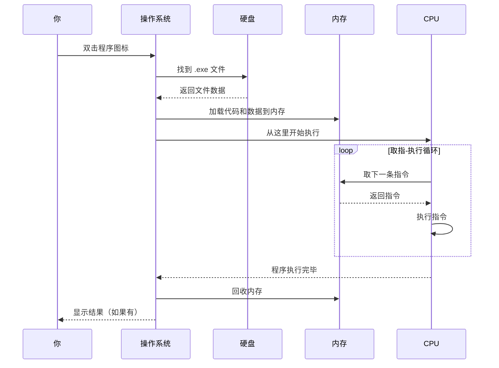

# 第 01 课：计算机是怎么工作的

## 为什么先讲这个

你可能急着想写代码，但这一课不能跳过。就像你不知道发动机怎么转也能开车，但如果你连油门和刹车都分不清，上路一定出事故。计算机也是这个道理——你不用懂晶体管，但你得知道它"听"什么话、怎么"记"东西、程序是个什么玩意。这四节课是"小白启蒙"，把底子打好，后面 38 课才不会觉得空中楼阁。

## 计算机的本质：一台听话的机器

把计算机看作一个听话的工人，它能做三件事：

1. **读取指令**：你告诉它干什么
2. **处理数据**：它按要求计算、比较、搬运数据
3. **输出结果**：把算完的东西给你看

1960 年代的计算机和你桌上的电脑，底层逻辑完全一样。变的只是速度——当年的机器一秒钟算几千次，现在一秒钟算几百亿次。但"读取-处理-输出"这个循环没变过。

计算机听不懂人话。它只认一种语言：**二进制**——也就是 0 和 1 组成的序列。你敲的每一个字、看的每一张图、听的每一首歌，在计算机肚子里全是 0 和 1。这不是什么神秘的东西：0 就是"没电"，1 就是"有电"。计算机用电路的通断来表示这两种状态，简单可靠。

## CPU：计算机的大脑

CPU（中央处理器）是做计算的地方。它内部有一个叫"指令集"的东西——你可以把它理解成 CPU 的词汇表。这个词汇表很小，大概几十到几百个词，每个词对应一个基础操作：

- 把两个数加起来
- 比较两个数谁大
- 把一个数存到某个位置
- 从某个位置取一个数出来

一个程序就是由成千上万条这种基础指令组成的。CPU 一条一条地执行，速度快到你觉得是"一瞬间"完成的。现在的 CPU 一秒钟可以执行几十亿条指令。

CPU 内部有几个关键的"工作区"：

- **寄存器**：CPU 内部最快的小存储格，一个 CPU 只有几十个寄存器，每个能存一个数
- **算术逻辑单元（ALU）**：真正做加减乘除、比较大小的地方
- **控制单元**：指挥交通的——决定下一条指令从哪里取、结果往哪里存

```mermaid
graph LR
    A[内存(指令和数据)] -->|读取| B[控制单元]
    B -->|解码指令| C[ALU 算术逻辑单元]
    C -->|计算结果| D[寄存器]
    D -->|写回| A
    B -->|下一条指令地址| A
```

这张图讲了 CPU 怎么工作：从内存取指令，解码，计算，存结果，然后取下一指令——这个循环叫"取指-译码-执行-写回"，从第一台电子计算机问世到现在，这个循环没变过。

## 内存：计算机的短期记忆

CPU 算得快，但记不住东西。寄存器太少，装不了几个数。所以计算机需要**内存**（也叫 RAM，随机存取存储器）。

你可以把内存想象成一栋巨大的宿舍楼，每个房间有一个编号（内存地址），每个房间里可以存一个数。CPU 需要某个数的时候，就按编号去找那个房间。

内存有两个特点：

1. **掉电就忘**：一关机，内存里的东西全没。这跟你的短期记忆差不多——睡一觉醒来，昨天背的单词可能就忘了
2. **读和写都很快**：比硬盘快几百到几千倍

所以程序跑起来后，代码和数据都是从硬盘加载到内存里的。CPU 直接从内存读指令，算完的结果也先放内存，需要保存的时候再写回硬盘。

## 硬盘：计算机的长期记忆

硬盘（或 SSD 固态硬盘）是存文件的地方。关电脑再开机，文件还在，因为硬盘不需要通电也能保持数据。

硬盘和内存的速度差距非常大。打个比方：CPU 寄存器相当于你桌上的便签——低头就能看；内存相当于书架上的书——起身走两步拿到；硬盘相当于跑到市图书馆借书——来回半小时。所以程序能让数据在内存里待着就尽量不碰硬盘。

## 程序是怎么跑起来的

讲到这里，可以串起来了。一个程序从你双击图标到它跑起来，经历了这些步骤：

1. 操作系统（Windows）找到程序的 .exe 文件，它在硬盘上
2. 操作系统把 .exe 文件里的代码和数据加载到内存里
3. CPU 从内存里取出第一条指令，开始执行
4. CPU 按"取指-译码-执行-写回"的循环，一条条往下跑
5. 程序跑完了，操作系统回收它占用的内存



## 操作系统扮演什么角色

程序不能直接操作硬件。你写的程序不能自己决定把数据写到硬盘的哪个位置，也不能直接命令 CPU 的寄存器。这些事由**操作系统**（Windows、Linux、macOS）统一管理。

操作系统做两件核心的事：

**第一，管理硬件资源**。哪个程序用多少 CPU 时间、用哪块内存、写哪个文件，都是操作系统说了算。如果没有操作系统这个"管家"，十个程序会抢同一块内存，互相踩踏，系统直接崩溃。

**第二，给程序提供统一接口**。不管你的硬盘是西数的还是三星的，不管你的显卡是 NVIDIA 还是 AMD，程序都用同一套方式读写文件和画界面。这套接口就叫"系统调用"——程序说"我要开个文件"，操作系统去处理底层的硬件细节。

Windows 提供的这套接口是 Win32 API。TubaTools（你们后面要学的项目）跑在 Windows 上，底层用的就是这套东西。但你不是直接调 Win32 API——太原始了，写起来麻烦。你用的是 .NET（后面第 03 课会讲），它在 Win32 API 上包了一层，让你用 C# 写程序时轻松很多。

## 编译器：把人类语言翻译成机器语言

前面说过计算机只认 0 和 1。但没人能用 0 和 1 写程序——别说写一个 TubaTools 这样的工具集合了，写个"Hello World"都能让人疯掉。

所以有了**编译器**。编译器做的事：把你写的"高级语言"代码（比如 C#）翻译成 CPU 能执行的机器指令。

翻译过程大概分三步：

1. **词法分析和语法分析**：检查你的代码有没有语法错误（少个分号、括号没配对等）
2. **生成中间代码**：把代码转成一种中间表示，方便优化
3. **生成机器码**：把中间表示翻译成目标 CPU 的机器指令

C# 的编译有点特殊——它不直接生成机器码，而是生成一种叫"IL"（中间语言）的东西。程序跑起来的时候，.NET 运行时会再把 IL 即时翻译成机器码。这个设计让 C# 程序能在不同 CPU 架构（x86、x64、ARM64）上跑，不用重新编译。后面第 41 课会细讲这个。

## 和 TubaTools 的关系

这一课没讲代码，因为它是在给后面做铺垫。但你可以带着这些问题去看 TubaTools：

- TubaTools 是一个 .exe 文件，存在硬盘上。你双击图标，Windows 把它加载到内存，CPU 开始执行
- TubaTools 里的"硬件检测"功能，是程序通过操作系统去问 CPU 和内存的信息，而不是程序自己伸手去摸硬件
- TubaTools 编译后会生成一个 .exe 和一堆 .dll 文件，这些就是编译器翻译后产生的"能跑的东西"

第 04 课你会亲自把 TubaTools 编译跑起来，到那时候，上面讲的每一步——编译、加载、执行——你都能亲眼看到。现在不急着动手，先让概念落地。

## 小练习

**第 1 题（填空）**：CPU 执行指令的四个步骤依次是 ______ 、______ 、______ 、______。

**第 2 题（选择）**：以下关于内存和硬盘的说法，哪个是正确的？
- A. 内存比硬盘快，关机后数据还在
- B. 硬盘比内存快，关机后数据还在
- C. 内存比硬盘快，关机后数据丢失
- D. 硬盘比内存快，关机后数据丢失

**第 3 题（简答）**：为什么程序不能直接把数据写到硬盘的任意位置，而要经过操作系统？

**第 4 题（实操）**：打开你电脑的任务管理器（Ctrl+Shift+Esc），找到"性能"标签页。观察 CPU、内存、硬盘的使用情况。打开几个程序，关掉几个程序，看看数字怎么变。试着回答：你的电脑 CPU 有几个核心？内存总共多大？

<details>
<summary>练习答案</summary>

**第 1 题**：取指、译码、执行、写回（顺序不能错）

**第 2 题**：C。内存（RAM）掉电即失，硬盘（Disk/SSD）断电保持。

**第 3 题**：操作系统统一管理硬件资源，防止多个程序互相冲突。如果每个程序都能随便写硬盘，文件系统会乱套，程序之间会互相覆盖数据。操作系统提供统一的文件读写接口，由它来分配磁盘空间和管理访问权限。

**第 4 题**：这个没有标准答案。你电脑上的 CPU 核心数、内存大小就是你的真实情况。目的是让你对"硬件资源"有直观感受。

</details>
