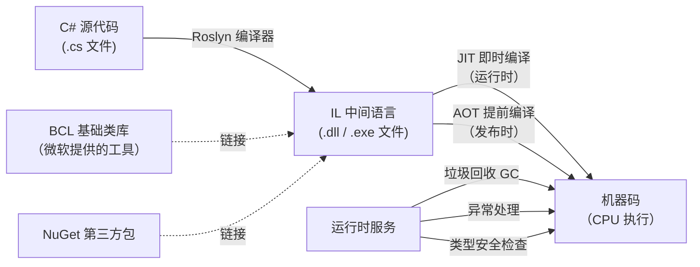

# 第 03 课：什么是 C#，什么是 .NET

你把 C# 和 .NET 这两个词放一起搜，出来的结果经常是"C# .NET 开发"、"ASP.NET Core C#"、"C# .NET 教程"——好像它们天生绑在一起。但它们根本不是同一种东西。

打个比方：C# 是你写信用的语言（中文、英文、法文），.NET 是邮局系统——负责把你的信翻译、投递、确保对方收到。你可以用别的语言给这个邮局写信（F#、VB.NET），也可以用别的邮局寄 C# 写的信（理论上存在，实际基本没人这么干）。但 C# + .NET 这个组合，是微软花了二十多年打磨出来的，用起来最顺手。

本课把这两个概念拆开，让你看清楚各自是什么、怎么配合的。

## 1. C#：一门语言的身世

### 1.1 谁造的，为什么造

2000 年，微软发布 C# 1.0。主导设计的人叫 Anders Hejlsberg——他在加入微软之前，已经造了 Turbo Pascal 和 Delphi，都是那个年代响当当的开发工具。换句话说，设计 C# 的人不是新手，他知道一门语言怎么设计才能让人写得顺手。

当时 Java 正在企业市场攻城略地，微软自己有一个 Java 的变体叫 J++，被 Sun 公司告了。微软索性一拍桌子：不跟你的 Java 玩了，我自己造一门语言。

C# 的名字里那个 # 号，官方的说法是音乐里的"升号"——C# 比 C 高半个音，意思就是"C 语言的升级版"。也有人调侃说是因为 C++++（四个加号叠起来像个 #）。两种说法都不算错。

### 1.2 C# 是什么风格的语言

如果你写过 Java，看 C# 会觉得眼熟。如果你只写过 Python，那 C# 的语法看起来会啰嗦很多——大括号、分号、类型声明，一样不少。

C# 是"静态类型"语言。意思是，你定义一个变量，必须告诉编译器它是什么类型（整数、字符串、还是某个自定义的类）。代码还没跑，编译器就能查出很多错误。Python 是"动态类型"，你写 `x = 5`，Python 在运行的时候才知道 x 是整数。两种风格各有利弊，C# 选了"先严后松"的路子。

C# 还是"面向对象"语言。面向对象这个概念，第 13-17 课会专门讲。现在你只需要知道：C# 里几乎所有的东西都是"类"（class）里面包着的，连程序入口都不例外。

## 2. 第一眼 C# 代码

光说概念容易把人绕晕。直接看一段真实的 C# 代码——来自 TubaTools 项目的 `App.xaml.cs` 文件。这个文件是程序的启动入口，程序从这儿开始跑。

```csharp
using System.Diagnostics;
using System.Security.Principal;
using Microsoft.UI.Xaml;
using TubaWinUi3.Pages;
using TubaWinUi3.Services;

namespace TubaWinUi3;

public partial class App : Application
{
    private Window? _window;

    public App()
    {
        InitializeComponent();
        BuiltinToolRegistry.RegisterDefaults();
    }

    private static bool IsRunningAsAdmin()
    {
        using var identity = WindowsIdentity.GetCurrent();
        var principal = new WindowsPrincipal(identity);
        return principal.IsInRole(WindowsBuiltInRole.Administrator);
    }
}
```

别急着逐行理解，先看骨架。每一行具体干什么后面课程会讲，现在只需要感受结构：

**`using` 行**——告诉编译器"我要用别处定义好的工具"。就像你去厨房做饭前先把锅碗瓢盆拿出来。`System.Diagnostics` 是微软提供的标准工具包，`TubaWinUi3.Pages` 是 TubaTools 项目自己写的工具包。

**`namespace TubaWinUi3;`**——命名空间。把代码分门别类放好，防止名字冲突。你的项目叫 TubaWinUi3，微软的项目叫 System，各放各的抽屉，互不干扰。第 18 课细讲。

**`public partial class App : Application`**——定义一个类，名字叫 App，它"继承"自 Application。继承的意思是：Application 已有的功能，App 直接用，不用重写。`public` 是"谁都能用"，`partial` 是"这个类的代码分散在多个文件里"。

**大括号 `{ }`**——C# 用大括号框定代码范围。左括号开始，右括号结束。不像 Python 靠缩进，C# 靠括号，缩进只是给人看的。

**`private Window? _window;`**——定义一个变量，类型是 Window，名字叫 `_window`。`private` 是"只有我自己能用"。问号表示这个变量可以是 null（空值）。

**`public App()`**——这叫"构造函数"，当程序创建 App 这个对象的时候自动执行。里面两行代码：初始化界面组件、注册内置工具。

**`private static bool IsRunningAsAdmin()`**——定义了一个方法（函数），名叫 IsRunningAsAdmin，返回 bool 类型（true 或 false）。方法体里三行代码检查当前用户是不是管理员。

## 3. .NET：不只是"框架"

### 3.1 如果 C# 是语言，.NET 是什么

你写的 C# 代码不能直接在电脑上跑。CPU 不认识 `using` 和 `namespace`，它只认识机器码——一串串的二进制指令。

.NET 就是帮你解决"从 C# 代码到机器码"这一整套问题的系统。它包括：

- **编译器（Roslyn）**：把 C# 代码变成 IL（Intermediate Language，中间语言）。IL 是一种"半成品"，人类读起来比机器码友好，但 CPU 还是不认识。
- **运行时（CLR，Common Language Runtime）**：负责把 IL 在需要的时候变成机器码，然后执行。这个过程叫 JIT 编译（Just-In-Time，即时编译）。
- **基础类库（BCL，Base Class Library）**：微软写好的一大堆工具代码，你直接用。读写文件、网络请求、加密解密、日期处理——这些功能 BCL 里都有，不用自己从零写。

打个比方：你写了一封 C# 的信，Roslyn 编译器把信翻译成 IL 这种"内部标准格式"，CLR 运行时拿着 IL，一边翻译成 CPU 认识的机器码一边执行。BCL 就是一套通用工具箱，写信用到的笔、纸、信封全包了。

### 3.2 .NET 的三个时代

.NET 的历史有点乱，你搜资料的时候会被绕晕。这里只说关键的三个阶段：

**第一代：.NET Framework（2002-2019）**

微软最早的 .NET，只跑在 Windows 上。你如果看到一个项目引用的是 `System.Windows.Forms` 或者 `System.Web`，大概率是老 .NET Framework 项目。它跟 Windows 绑定太死了，微软想跑 Linux 服务器市场，这玩意儿拖后腿。

**第二代：.NET Core（2016-2020）**

微软把 .NET 重写了一遍，砍掉 Windows 专用的包袱，让它能在 Linux 和 macOS 上跑。名字里带"Core"，表示这是精简重构过的核心版本。.NET Core 1.0 到 3.1 都属于这个阶段。

**第三代：统一 .NET（.NET 5 / 6 / 7 / 8 / 9 / 10，2020-现在）**

从 .NET 5 开始，微软把命名里的"Core"和"Framework"都去掉了，就叫".NET"。意思是：以后没有两条线了，就这一个。每年 11 月发一个大版本，偶数版本（6、8、10）是长期支持版（LTS），微软保证修 bug 三年以上。

TubaTools 项目用的是 **.NET 10**，你可以在它的项目配置文件 `TubaWinUi3.csproj` 里看到这一行：

```xml
<TargetFramework>net10.0-windows10.0.26100.0</TargetFramework>
```

`net10.0` 是 .NET 版本号，`windows10.0.26100.0` 表示这个项目目标平台是 Windows。为什么 .NET 号称跨平台，这里却绑定了 Windows？因为 TubaTools 用的是 WinUI 3——微软为 Windows 量身定制的 UI 框架。不是 .NET 不能跨平台，是这个项目选了 Windows 专属的 UI 方案。

### 3.3 IL、JIT、AOT：代码怎么变成程序

这是理解 C# 和 .NET 关系的核心。来看一张流程图：



这条流水线分四步走：

**第一步：你写 C# 代码**。所有的 `.cs` 文件就是你写的源文件。TubaTools 项目里有几十个这样的文件——`App.xaml.cs`、`Services/ToolCatalog.cs`、`Models/ToolItem.cs` 等等。

**第二步：Roslyn 编译器把 C# 变成 IL**。IL 不是给 CPU 读的，是给 .NET 运行时读的。这一步在你点"生成"（Build）的时候发生。编译出来的结果是一个 `.dll` 或者 `.exe` 文件，里面装的都是 IL 指令。

**第三步（JIT 路径）：CLR 在程序运行时把 IL 转成机器码**。程序跑起来后，CLR 发现某个方法第一次被调用，当场把它的 IL 翻译成机器码，然后执行。翻译完的代码会缓存，下次调用直接执行。这就是"即时编译"（Just-In-Time）。

**第三步（AOT 路径）：发布时就把 IL 全转成机器码**。JIT 的好处是灵活（可以根据当前机器的 CPU 特性做优化），坏处是第一次运行有编译开销。AOT（Ahead-Of-Time，提前编译）在发布的时候就全编译好，启动快，但生成的程序体积大。.NET 7 之后 AOT 支持越来越好。

**第四步：运行时服务持续工作**。垃圾回收（GC）自动释放不再使用的内存；异常处理机制捕获程序出错的情况；类型安全检查确保你不会把字符串当数字用。

## 4. C# 不是唯一的选择

.NET 平台上可以跑多种语言写的代码，只要它们能编译成 IL。微软官方支持三种：

- **C#**：主力，用的人最多，资料最全
- **F#**：函数式语言，写数学计算和数据处理很强
- **VB.NET**：Visual Basic 的 .NET 版本，老项目里比较多，新项目很少用

这三种语言编译出来都是 IL，可以在同一个项目里混用——比如你用 C# 写主程序，调了别人用 F# 写的数据分析库，CLR 不关心原始语言是什么，反正都是 IL。

除了微软自家的，还有第三方语言也跑在 .NET 上：IronPython（Python 的 .NET 实现）、ClojureCLR（Clojure 的 .NET 版本）等等。但实际项目中，99% 的情况你只需要 C#。

## 5. TubaTools 项目文件速览

回到 TubaTools 的 `App.xaml.cs`，现在重新看这段代码，你应该能认出一些东西了：

```csharp
namespace TubaWinUi3;

public partial class App : Application
{
    private Window? _window;
    public static Window? MainWindow => ((App)Current)?._window;

    public App()
    {
        Environment.SetEnvironmentVariable(
            "MICROSOFT_WINDOWSAPPRUNTIME_BASE_DIRECTORY", 
            AppContext.BaseDirectory);
        InitializeComponent();
        BuiltinToolRegistry.RegisterDefaults();
    }

    protected override void OnLaunched(LaunchActivatedEventArgs args)
    {
        // 检查管理员权限，没有就提权重启
        if (!RuntimeHelper.IsMsixPackaged && !IsRunningAsAdmin())
        {
            ElevateAndRestart();
            Exit();
            return;
        }

        _window = new MainWindow();
        _window.Activate();
    }
}
```

这段代码干了什么：

1. 声明了命名空间 `TubaWinUi3`——这个项目所有代码都放在这个空间里。
2. `App` 类继承了 `Application`——Application 是 WinUI 3 框架提供的基类，App 是它的具体实现。
3. `App()` 构造函数在程序启动时执行，做了三件事：设置环境变量、初始化界面组件、注册内置工具。
4. `OnLaunched` 方法在应用启动时被框架调用。它先检查用户是不是管理员，不是的话提权重启，是的话创建主窗口并显示。

你不需要现在就理解每一行。本课的目标只是让你看到：C# 代码由 using、namespace、class、方法、大括号、分号这些基本元素构成。后面 9 课会把这些元素一个一个讲透。

## 6. 为什么选 C# + .NET

我不用"C# 是最好的语言"这种话说服你。每种语言都有它适合的地方。只说事实：

**适合的场景**：
- Windows 桌面应用——这是 C# 的传统强项。WinUI 3、WPF、Windows Forms 都是 C# 的地盘。
- 企业级 Web 后端——ASP.NET Core 性能好，写起来比 Java 简洁。
- 游戏开发——Unity 引擎用 C# 做脚本，大部分手游和独立游戏都在用。
- 工具软件——像 TubaTools 这样的系统工具，需要调 Windows API、读硬件信息、管理进程，C# 直接就能做，不需要绕弯。

**不适合的场景**：
- 机器学习、数据科学——Python 生态在这个领域优势太大。虽然 .NET 有 ML.NET，但跟 Python 的 PyTorch/TensorFlow 生态比起来还是差得远。
- 前端 Web 页面——浏览器只认 HTML/CSS/JavaScript。虽然 Blazor（一种 C# 写前端的方案）可以做，但用的人还是少。
- 极致的系统底层——操作系统内核、驱动程序，还是 C/C++ 的天下。

**一句话总结 C# + .NET 的定位**：它不是专攻某一个领域的第一名，但它是综合能力最强的几个选手之一。你想写桌面应用，能写；想写后端，能写；想写游戏，也能写。一门语言和一套工具吃遍大部分场景，不用学五套不同的技术栈。

## 7. 小练习

### 练习 1：填空

C# 编译器叫 ____，它把 C# 代码编译成 ____（英文缩写）。.NET 的运行时叫 ____（英文缩写），它负责把 IL 转成机器码并执行。把 IL 在运行时当场翻译的机制叫 ____ 编译，在发布时就提前翻译完的机制叫 ____ 编译。

### 练习 2：选择

关于 .NET Framework 和 .NET Core 的区别，以下哪个说法是正确的？

A. .NET Framework 是旧版本，只能跑 Windows；.NET Core 是新版本，能跨平台  
B. .NET Framework 比 .NET Core 更新  
C. .NET Core 只能跑 Linux，不能跑 Windows  
D. 从 .NET 5 开始，.NET Framework 被改名叫 .NET Core  

### 练习 3：简答

在 TubaTools 的 `App.xaml.cs` 文件中，`public partial class App : Application` 这一行里的 `partial` 关键字是什么意思？`Application` 又是谁？（不需要翻书，用你自己的话说。）

### 练习 4：动手

打开 TubaTools 项目的 `TubaWinUi3.csproj` 文件（路径在源码目录下）。找到 `<TargetFramework>` 这一行，把它抄下来。然后打开 `App.xaml.cs`，找到文件开头的几行 `using` 语句，任选两个你感兴趣的，猜一下它们是干什么用的（不用查资料，猜就行）。

### 练习 5：画图

用 Mermaid 或者手绘的方式，画一张流程图：描述一段 C# 代码从你写出来到最终在 CPU 上跑起来的完整路径。提示：路径上至少包含 Roslyn 编译器、IL、CLR、JIT/AOT、机器码这几个节点。

---

**练习答案**（写完后再看）：

练习 1：Roslyn（或"Roslyn 编译器"）、IL、CLR、JIT（即时）、AOT（提前）

练习 2：A。.NET Framework 是 Windows-only 的旧技术栈，.NET Core 是跨平台的重写版本。从 .NET 5 开始统一叫 .NET。

练习 3：`partial` 表示这个类的代码分布在多个文件里（App.xaml.cs 写一部分，框架自动生成的代码写另一部分，编译时合并）。`Application` 是 WinUI 3 框架提供的基类，App 类继承它，获得了应用管理的基础能力（启动、关闭、异常处理等）。

练习 4：`<TargetFramework>net10.0-windows10.0.26100.0</TargetFramework>`。using 示例：`System.Diagnostics` 提供调试和进程管理功能（比如打日志），`System.Security.Principal` 提供用户身份和权限检查功能。
