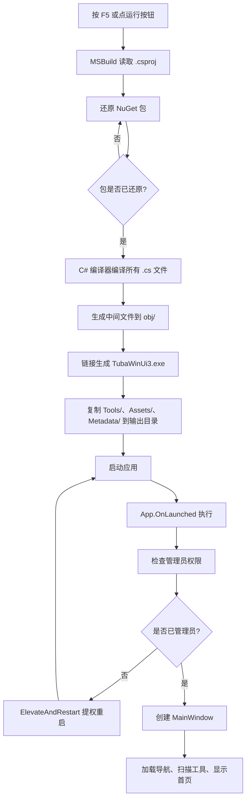
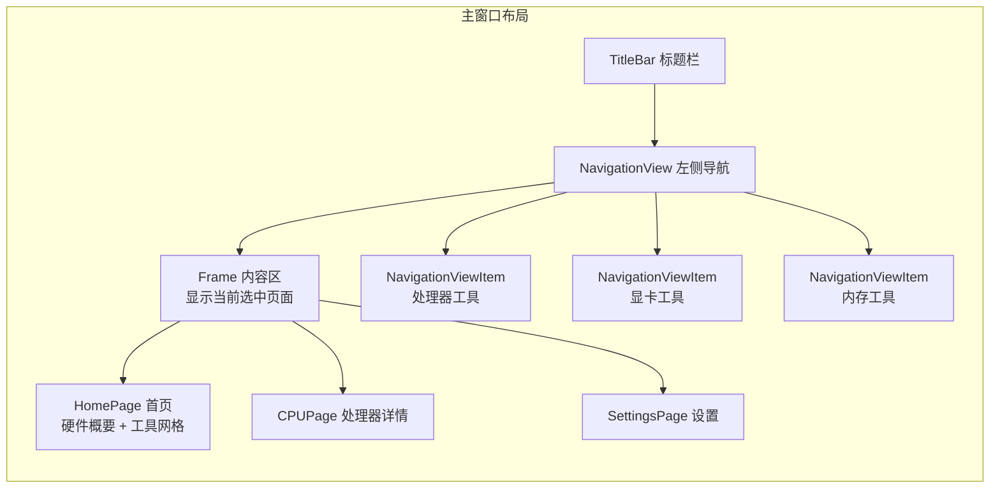

# 第 04 课：装好开发环境跑起 TubaTools

前三课讲了计算机原理、编程语言概念、C# 和 .NET 是什么。这些知识像一本说明书，但只有翻开机器盖子动手转两圈，你才能真的理解。这一课就把机器盖子掀开：装开发工具、拿到 TubaTools 源码、编译、运行。整个过程大概需要 30-60 分钟，取决于你的网速和电脑性能。

## 前置条件：你的电脑需要什么

TubaTools 是一个 WinUI 3 桌面应用，基于 .NET 10 和 Windows App SDK 1.8。它不是网页，不是手机 App，只能在 Windows 上开发，也只能在 Windows 上运行。具体要求：

- **操作系统**：Windows 10 版本 1809（Build 17763）或更高。Win11 全系列支持。
- **架构**：x64（64 位 Intel/AMD）或 ARM64（骁龙 X 系列等）。x86 也能跑，但性能不理想。
- **硬盘空间**：开发工具约占用 10-15 GB，项目源码只有几十 MB。
- **内存**：8 GB 起步，16 GB 更舒服。

如果你用的是 Mac 或 Linux，本课内容无法直接执行。可以在虚拟机里装 Windows 继续，但那属于额外一章，这里不展开。

## 第一步：安装开发工具

TubaTools 用 C# 写，开发工具选 Visual Studio 2022（以下简称 VS2022）。微软提供了一个免费的 Community 版，功能完整，个人开发者和小团队用没问题。

### 下载和安装 VS2022

去 https://visualstudio.microsoft.com/zh-hans/downloads/ 下载 Visual Studio 2022 Community 版安装器。安装器本身很小（约 3 MB），它会引导你选择需要的工作负载再下载真正的大文件。

运行安装器后，勾选以下工作负载：

1. **".NET 桌面开发"（.NET desktop development）** — 这个选项包含 C# 编译器、.NET SDK、Windows Forms 和 WPF 模板。WinUI 3 开发需要它作基础。
2. **"通用 Windows 平台开发"（Universal Windows Platform development）** — 这个选项包含 Windows App SDK 和相关工具链。虽然是 "UWP" 的名字，但 WinUI 3 依赖同样的底层运行时组件。

两个工作负载加起来约 8-12 GB。确保安装位置有足够空间。安装完成后，启动 VS2022，让它做一次初始配置（主题颜色、登录微软账号等），然后就可以关闭。

### 只用命令行能不能开发？

能，但我不建议初学者这么做。命令行方式需要单独安装 .NET 10 SDK 和 Windows App SDK 扩展，还要处理证书、manifest 等一堆配置问题。VS2022 把这些全部屏蔽了，你点了 "运行" 按钮它就自动处理。等学完 42 课你自然有能力脱离 IDE，但现在先走顺畅的路。

## 第二步：拿到 TubaTools 源码

TubaTools（中文名 "图吧工具箱"）是一个开源项目，源代码托管在 GitHub。拿到代码有两种方式。

### 方式一：Git 克隆（推荐）

安装 Git for Windows（https://git-scm.com/download/win），安装过程一路默认就行。装好后打开命令行（Win+R 输入 cmd 回车），执行：

```
git clone https://github.com/你的仓库地址/tubatools-master.git
cd tubatools-master
```

替换 `你的仓库地址` 为实际的 Git 仓库 URL。克隆完成后，文件夹结构大概是这样的：

```
tubatools-master/
  TubaWinUi3.csproj        ← 项目文件，VS2022 靠它知道怎么编译
  TubaWinUi3.sln           ← 解决方案文件，一个 .sln 可以包含多个项目
  App.xaml                 ← 应用入口的 XAML
  App.xaml.cs              ← 应用入口的 C# 代码（第 03 课看过一段）
  MainWindow.xaml          ← 主窗口界面
  MainWindow.xaml.cs       ← 主窗口逻辑
  Pages/                   ← 各个页面的 XAML + C#
  Services/                ← 业务逻辑（工具扫描、硬件信息、设置等）
  Models/                  ← 数据模型定义
  Metadata/                ← 工具元数据配置
  Tools/                   ← 需要分发的第三方诊断工具
  Assets/                  ← 图标、图片等资源
```

### 方式二：下载 ZIP

如果不想装 Git，在 GitHub 项目页面点 "Code" 按钮，选 "Download ZIP"，解压到任意文件夹即可。ZIP 不包含 `.git` 文件夹，没办法做版本管理，但编译运行完全没问题。

## 第三步：打开项目并准备编译

启动 VS2022，点 "打开项目或解决方案"，选择 `TubaWinUi3.sln` 文件。

VS2022 加载项目后会做几件事：

1. 解析 `.csproj` 文件，识别所有依赖项
2. 自动还原 NuGet 包（从互联网下载第三方库）
3. 索引所有 C# 文件，为智能提示做准备

第一次打开可能要等几分钟。NuGet 包还原如果失败（网络问题），在 "解决方案资源管理器" 里右键项目名 `TubaWinUi3`，选 "还原 NuGet 包" 手动触发。

### .csproj 文件里写了什么

打开 `TubaWinUi3.csproj` 看看，几行关键配置：

```xml
<OutputType>WinExe</OutputType>
<TargetFramework>net10.0-windows10.0.26100.0</TargetFramework>
<Platforms>x86;x64;ARM64</Platforms>
<UseWinUI>true</UseWinUI>
<WindowsAppSDKSelfContained>true</WindowsAppSDKSelfContained>
```

逐行解释：

- `WinExe`：编译出来是 Windows 可执行文件，不是命令行程序，也不是 DLL 库。
- `net10.0-windows10.0.26100.0`：目标框架是 .NET 10，绑定 Windows 10 SDK 版本 26100。这个版本号后半段 26100 对应 Windows 11 24H2 的 SDK。TubaTools 最低兼容 10.0.17763（Windows 10 1809），所以旧系统也能跑，只是编译时用最新 SDK 的 API。
- `Platforms`：支持 x86、x64、ARM64 三种 CPU 架构。
- `UseWinUI`：告诉 MSBuild 这个项目使用 WinUI 3 框架。
- `WindowsAppSDKSelfContained`：把 Windows App SDK 运行时打包进输出目录。这样用户不需要单独装运行时分发包，解压就能运行。

再看依赖的 NuGet 包：

```xml
<PackageReference Include="LibreHardwareMonitorLib" Version="0.9.6" />
<PackageReference Include="Microsoft.WindowsAppSDK" Version="1.8.260317003" />
<PackageReference Include="System.Management" Version="10.0.8" />
```

三个包的用途：

- **Microsoft.WindowsAppSDK**：WinUI 3 的 "发动机"。所有 XAML 控件、窗口管理、资源字典都靠它。
- **LibreHardwareMonitorLib**：开源的硬件监控库，用来读取 CPU 温度、风扇转速、主板传感器数据。TubaTools 的硬件检测页面就靠它。
- **System.Management**：这是 .NET 自带 WMI（Windows Management Instrumentation）查询的官方包。WMI 能查到几乎所有硬件信息——CPU 型号、内存条规格、显卡名称、磁盘型号等。TubaTools 里 `HardwareInfoService.cs` 大量使用它。

## 第四步：编译运行

确定 VS2022 的配置下拉框选了 "Debug" 和 "x64"（或 Auto/ARM64），然后按 F5 或者点工具栏上的绿色播放按钮。

编译过程会发生什么？用一个流程图来说明：



关键步骤解释：

1. **MSBuild** 是微软的构建引擎，读 `.csproj` 确定怎么编译。
2. **NuGet 还原** 从互联网下载所有 `PackageReference` 声明的第三方包，缓存到本地。
3. **C# 编译器（Roslyn）** 把所有 `.cs` 文件编译成中间语言 IL，生成 `.dll` 或 `.exe`。
4. **复制资源文件**：`.csproj` 里声明了 `Tools\**\*`、`Assets\**`、`Metadata\**\*` 都要复制到输出目录，且 `CopyToOutputDirectory=PreserveNewest`（只在源文件更新时才重新复制，节省编译时间）。
5. **启动**：`App.OnLaunched` 是程序的真正起点，C# 里叫 "入口方法"。注意第 03 课提到 `Main` 方法，WinUI 3 的 `Main` 是由框架自动生成的，你直接看到的入口是 `App.OnLaunched`。

### 如果编译失败

初学者最常见的几个错误：

**错误 1："未找到 Windows App SDK"**

VS2022 安装时没勾选 "通用 Windows 平台开发" 工作负载。重新运行 VS Installer 勾上它。

**错误 2："NETSDK1045：当前 .NET SDK 不支持将 .NET 10.0 设置为目标"**

你的 .NET SDK 版本太低。去 https://dotnet.microsoft.com/zh-hans/download/dotnet/10.0 下载 .NET 10 SDK 安装。

**错误 3："xxx.cs 找不到类型或命名空间名称"**

NuGet 包没还原成功。右键项目 → 还原 NuGet 包，或者关闭 VS2022 删掉 `obj` 和 `bin` 文件夹后重新打开。

**错误 4："无法启动程序，找不到 xxx.dll"**

可能是杀毒软件拦截了编译输出。把项目文件夹加入白名单。

## 第五步：看看它跑起来的样子

TubaTools 启动后有几个关键行为，都写在 `App.xaml.cs` 里。我们来读一段真实代码：

```csharp
protected override void OnLaunched(LaunchActivatedEventArgs args)
{
    if (!RuntimeHelper.IsMsixPackaged && !IsRunningAsAdmin())
    {
        ElevateAndRestart();
        Exit();
        return;
    }

    _window = new MainWindow();
    _window.Activate();
    ThemeService.ApplySavedTheme();
    ToolIconService.CleanExpiredCache();
    HardwareInfoService.Preload();

    _ = RunStartupSequenceAsync();
}
```

这段代码做的事：

1. **检查管理员权限**：如果当前不是管理员运行（`!IsRunningAsAdmin()`），就调用 `ElevateAndRestart()` 重新以管理员身份启动，然后退出当前进程。TubaTools 需要管理员权限因为它的硬件检测库（LibreHardwareMonitor）要加载内核驱动才能读到传感器数据。
2. **创建主窗口**：`new MainWindow()` 构造主窗口对象，调用 `Activate()` 显示它。
3. **恢复主题**：`ThemeService.ApplySavedTheme()` 读取用户上次保存的浅色/深色主题设置并应用。
4. **清理图标缓存**：`ToolIconService.CleanExpiredCache()` 清除过期的工具图标缓存文件。
5. **预加载硬件信息**：`HardwareInfoService.Preload()` 在后台线程上启动 WMI 查询，不等结果返回就直接继续，这是 `async/await` 的用法（第 19 课会深入讲）。
6. **启动引导序列**：`RunStartupSequenceAsync()` 检查是否首次运行（没有 `SetupCompleted` 设置项），如果是就弹出设置向导对话框。

你第一次运行 TubaTools 后，会看到：

- 一个设置向导弹窗，引导你选择数据存储位置（AppData 还是程序目录），以及是否加入诊断改善计划。
- 主界面是一个带侧边导航栏的窗口。左侧按类别列出所有诊断工具——"处理器工具"、"显卡工具"、"内存工具"、"硬盘工具"等。这些都是从 `Tools/` 文件夹自动扫描出来的。
- 顶部有搜索框，可以模糊搜索工具名、类别、设置项。
- 右侧主区域默认显示首页，包含硬件概要信息和常用工具的快捷入口。



这个导航结构在 `MainWindow.xaml.cs` 里实现，后面第 28 课和第 33 课会详细解剖。

## 真的理解编译了吗？做个对比

很多人把 "编译" 和 "运行" 混为一谈。用一个日常类比：

- **源代码**（.cs 文件）是菜谱。
- **编译器** 是厨师。
- **编译产物**（.exe）是做好的一盘菜。
- **运行**（双击 .exe）是吃掉这盘菜。

你写 C# 代码（攥写菜谱），编译器把它翻译成机器能执行的指令（厨师照着做菜），生成 .exe。双击 .exe 时，操作系统把指令加载到内存，CPU 一条条执行（吃菜）。中间任何一步出错，你都吃不到菜。

日常开发中你按 F5 时，VS2022 帮你自动完成了从菜谱到上桌的全部步骤。但理解了每一步在干什么，出问题时才知道去哪里找原因。

## 小结

你完成了四件值得记住的事：

1. 安装了 VS2022 和必需的开发工作负载
2. 拿到了 TubaTools 的完整源码
3. 理解了 `.csproj` 项目文件的结构和 NuGet 包依赖
4. 编译运行了 TubaTools，了解了启动流程和主界面布局

这四件事的本质是架起一道桥：从 "脑子里知道 C# 长什么样" 跨到 "手指能在键盘上让它跑起来"。后面的课程全部建立在这道桥上。

下一课起，我们进入阶段一 "C# 编程基础"。你会从最传统的控制台 Hello World 开始，一步步写出能用的逻辑。

---

## 小练习

**练习 1（填空）**：TubaTools 的项目文件全名是 `__________`，它的 `<OutputType>` 设置为 `__________`，表示编译出来的是 Windows 可执行文件。

**练习 2（选择）**：编译时 MSBuild 从互联网下载第三方库的步骤叫什么？

A. 链接
B. NuGet 包还原
C. JIT 编译
D. 资源复制

**练习 3（简答）**：为什么 TubaTools 启动时要检查管理员权限？如果当前没有管理员权限，它会怎么做？

**练习 4（实操）**：在 VS2022 中打开 TubaTools 项目，找到 `App.xaml.cs` 文件，定位 `OnLaunched` 方法。把这句代码注释掉然后运行：

```csharp
HardwareInfoService.Preload();
```

运行后观察：硬件信息页面还正常显示吗？把注释去掉重新运行，对比两次的结果。把你观察到的现象记下来。

---

<details>
<summary>练习答案（点击展开）</summary>

**练习 1**：TubaWinUi3.csproj，WinExe

**练习 2**：B — NuGet 包还原。下载的包缓存在 `%USERPROFILE%\.nuget\packages\` 目录下。

**练习 3**：因为 TubaTools 的硬件监控功能（LibreHardwareMonitor）需要加载内核驱动 WinRing0/PawnIO 才能读取传感器数据（温度、风扇转速等），加载内核驱动需要管理员权限。如果没有管理员权限，`OnLaunched` 会调用 `ElevateAndRestart()` 方法，用 `runas` 动词重启自身进程，新进程会弹出 UAC 提权对话框。

**练习 4**：注释掉 `HardwareInfoService.Preload()` 后，硬件信息页面不会在应用启动时预加载数据，首次打开硬件详情页时会触发按需查询，可能看到短暂的加载提示或空白状态。恢复后预加载在后台默默完成，打开页面时数据已经准备好，体验更流畅。这展示了 "预加载" 这种性能优化手段的作用：在用户可能需要的瞬间之前就把数据准备好。
</details>
