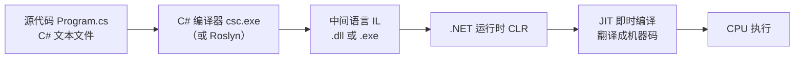
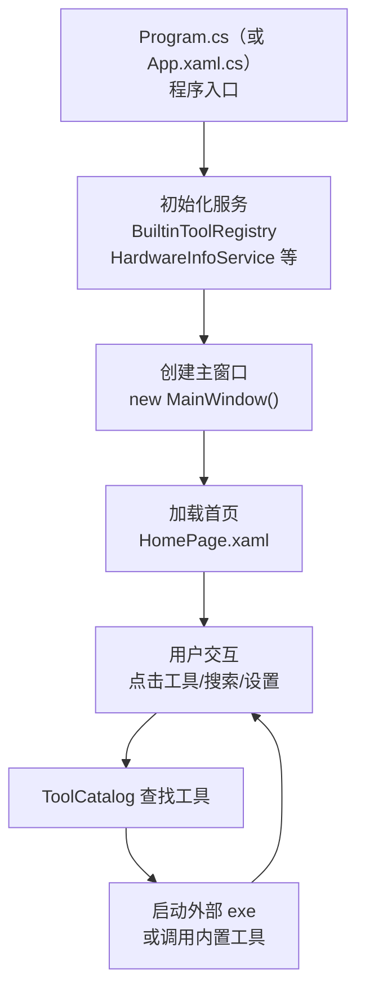

# 第 05 课：第一个 C# 程序

前四课我们讲了计算机的基本工作原理、编程语言的概念、C# 和 .NET 的关系，并且把 TubaTools 跑起来了。这一课，动手写第一行 C# 代码。

## 为什么从控制台开始

WinUI 3 窗口程序很酷，但不适合拿来学第一行代码——几百行 XAML、十几个服务初始化、异步回调层层嵌套，对新手来说跟天书一样。控制台程序相反，一个黑底白字的窗口，输出一行字就完事，没有任何干扰。

TubaTools 的 App.xaml.cs 有 228 行，启动时要做权限检查、UI 初始化、工具包下载、更新检测等一堆事情。别急，这些复杂的东西我们后面拆开讲。现在，先把第一个控制台程序跑通。

我写这课的时候决定拿 TubaTools 的 App.xaml.cs 和最简单的控制台 Hello World 做对比——一个简单到只有 5 行，一个是一个真实桌面应用的入口。看完你就知道，复杂的东西也是从简单的结构堆起来的。

## 控制台 Hello World

打开 Visual Studio 2022，新建项目，选"控制台应用（C#）"，.NET 10.0，创建。你会看到一个文件叫 `Program.cs`，里面可能是这样：

```csharp
// 最简写法（C# 10 顶级语句）
Console.WriteLine("Hello, World!");
```

没错，就一行。点"启动"（或者按 F5），弹出一个黑窗口，显示 `Hello, World!`，然后消失。

看起来什么都没有发生——但你的电脑在这不到一秒的时间里做了很多事：操作系统加载 .NET 运行时，运行时找到你的代码，把它翻译成 CPU 能懂的指令，CPU 执行指令，把字符串 "Hello, World!" 塞进标准输出流，控制台窗口接收到这串字符，渲染在屏幕上。你按下 F5 到看到结果，背后有几十个系统组件在协作。

说回代码。C# 10 引入了"顶级语句"（top-level statements），让你省掉写 `class` 和 `Main` 方法的模板。对新手友好，但不利于理解程序结构。我把完整的传统写法列出来，这才是你应该记住的形式：

```csharp
using System;

class Program
{
    static void Main(string[] args)
    {
        Console.WriteLine("Hello, World!");
    }
}
```

每一行拆开看：

**`using System;`** —— 告诉编译器，"我等下要用 System 这个命名空间里的东西"。`Console` 这个类就在 `System` 命名空间里。如果不写这行，就得写成 `System.Console.WriteLine(...)`，烦。命名空间第 18 课会细讲，现在先记住：`using` 是用来引用别人写好的代码的。

**`class Program`** —— 定义一个类叫 `Program`。在 C# 里，所有代码都必须放在类里面（顶级语句是编译器的障眼法，编译器会在背后自动生成一个类来包住你的代码）。类是对象的蓝图，第 14 课讲。

**`static void Main(string[] args)`** —— 这是程序的入口方法。"方法"在第 10 课展开，现在理解成：程序启动时，运行时自动调用这个方法，从这里开始执行。`static` 表示这个方法属于类本身，不需要先创建对象。`void` 表示不返回任何值。`string[] args` 是命令行参数，比如 `myapp.exe --verbose`，`args[0]` 就是 `"--verbose"`。

**`Console.WriteLine("Hello, World!");`** —— 调用 `Console` 类的 `WriteLine` 方法，把括号里的字符串输出到控制台，末尾自动加换行。`WriteLine` 是写一行（Write Line），还有个 `Write` 是不换行的版本。

分号（`;`）不能省。C# 用分号表示一条语句结束，跟 Python 用换行不一样，跟 JavaScript 可以省略分号也不一样。漏分号是新手最常犯的第一个错误。

## 编译和运行是怎么一回事

你写了代码，点了"启动"，中间发生了什么？



写的是人类能读的 C# 代码（源代码）。编译器把源代码翻译成中间语言（IL，Intermediate Language），存在 `.dll` 或 `.exe` 文件里。IL 不是 CPU 能直接执行的机器码。运行时，.NET 的 CLR（公共语言运行时）用 JIT（即时编译）把 IL 逐段翻译成机器码，然后 CPU 执行。

这个过程的好处：同一份 IL 可以在 x64、ARM64 等不同 CPU 架构上跑，JIT 会根据实际硬件生成最优机器码。写一次，到处跑——至少同一操作系统下没问题。

这个流程图也解释了为什么 TubaTools 的 .csproj 里有 `<Platforms>x86;x64;ARM64</Platforms>`——编译时可以指定目标架构，也可以像现在这样让 JIT 在运行时自动适配。

## 从 5 行到 228 行：TubaTools 的入口点

上面那个 5 行的控制台程序和 TubaTools 的 App.xaml.cs（228 行），本质上是同一个东西——都是 C# 程序的入口点。只是形态不同。控制台程序的入口是 `static void Main`，WinUI 3 桌面应用的入口是 `App` 类 + `OnLaunched` 方法。

来看 TubaTools 的 App.xaml.cs 核心部分（完整文件 228 行，下面只摘关键段）：

```csharp
// 文件：E:\Git\AClaudeDC\tubatools-master\App.xaml.cs
using Microsoft.UI.Xaml;
using TubaWinUi3.Pages;
using TubaWinUi3.Services;

namespace TubaWinUi3;

public partial class App : Application
{
    private Window? _window;

    public App()
    {
        Environment.SetEnvironmentVariable(
            "MICROSOFT_WINDOWSAPPRUNTIME_BASE_DIRECTORY",
            AppContext.BaseDirectory);
        InitializeComponent();
        BuiltinToolRegistry.RegisterDefaults();

        // 注册全局异常处理
        AppDomain.CurrentDomain.UnhandledException += OnUnhandledException;
        TaskScheduler.UnobservedTaskException += OnUnobservedTaskException;
        UnhandledException += OnWinUIUnhandledException;
    }

    protected override void OnLaunched(LaunchActivatedEventArgs args)
    {
        // 如果没有管理员权限，尝试提权重启
        if (!RuntimeHelper.IsMsixPackaged && !IsRunningAsAdmin())
        {
            ElevateAndRestart();
            Exit();
            return;
        }

        _window = new MainWindow();
        _window.Activate();
        ThemeService.ApplySavedTheme();
        HardwareInfoService.Preload();

        _ = RunStartupSequenceAsync();
    }
}
```

对比一下和 Hello World 的结构：

| 元素 | 控制台 Hello World | TubaTools App.xaml.cs |
|------|-------------------|----------------------|
| 入口 | `static void Main` | `App()` 构造函数 + `OnLaunched` |
| 核心动作 | `Console.WriteLine(...)` | `new MainWindow().Activate()` |
| using | `using System;` | `using Microsoft.UI.Xaml;` 等 |
| 命名空间 | 不写默认全局 | `namespace TubaWinUi3;` |
| 类 | `class Program` | `partial class App : Application` |

控制台程序的全部工作就是在黑窗口打印一行字然后结束。桌面应用的全部工作是创建一个窗口（`new MainWindow()`）、把它显示出来（`_window.Activate()`）、然后进入消息循环等用户操作。程序结构都是 `using -> namespace -> class -> 方法`，核心差别在于：一个直接干活干完退出，一个建好 UI 框架后在那等着。

看不懂 `partial`、`Application`、`override`、`async` 这些词？正常。它们的含义分布在后面的课程里逐个讲。现在你只需要认出这个结构：**这是一个 C# 文件，顶部是 using，然后是命名空间，里面有一个类，类里面有方法，方法里面有代码。** 所有 C# 文件都遵循这套路。

## 为什么是 partial class？

注意 `App` 类前面有个 `partial` 关键字。`partial` 表示一个类的定义可以拆分到多个文件。`App.xaml.cs` 里写了 C# 逻辑部分，而 XAML 界面部分（`App.xaml`）编译后会自动生成另一个 `App` 的部分类，包含界面控件的声明。两个文件在编译时合在一起。

你不需要现在就理解 XAML——第 22 课才讲。但你可以记住：当你看到一个类前面有 `partial`，说明这个类的代码被拆到了至少两个文件里。

## 程序不是从 Main 开始的吗？

你可能注意到 App.xaml.cs 里没有 `Main` 方法。那程序从哪开始的？

WinUI 3 项目用了一种叫"标记入口点"的技术。App.xaml 文件和 App.xaml.cs 文件通过一个叫 XamlRoot 的机制关联起来，生成一个隐藏的 `Main` 函数来启动 Application 对象。你不需要写它，TubaTools 项目编译时自动生成。

这跟后面第 32 课拆 App.xaml.cs 时会详细说。目前记住：控制台程序显式有 `Main`，桌面程序隐藏了 `Main`，但两者都是先跑 `Main` 再进入你写的代码。

## 另一个角度看：ToolItem.cs

不是所有 .cs 文件都是程序入口。大部分是普通类，被别的类调用。看一个例子——TubaTools 的 `ToolItem.cs`（这个文件后面几课还会反复用到）：

```csharp
// 文件：E:\Git\AClaudeDC\tubatools-master\Models\ToolItem.cs
namespace TubaWinUi3.Models;

public sealed class ToolItem : INotifyPropertyChanged
{
    public required string Name { get; init; }
    public required string Category { get; init; }
    public required string Path { get; init; }

    public string Folder => System.IO.Path.GetDirectoryName(RelativePath) ?? Category;
}
```

这个文件没有程序入口，它只是定义了一个叫 `ToolItem` 的类，用来描述 TubaTools 里的一个工具条目——名字叫什么、属于哪个分类、文件路径在哪。

每个 .cs 文件都可以独立编译。编译器扫一遍项目里所有 .cs 文件，把它们都翻译成 IL，链接成一个 .exe 或 .dll。你的 `Main` 方法（无论显式还是隐藏）是起点，从那里开始调用其他类。

## 在 TubaTools 项目里加一个控制台输出

你可以在 TubaTools 项目里加一行 `Console.WriteLine` 试试。打开 `App.xaml.cs`，在 `OnLaunched` 方法的第一行加：

```csharp
System.Diagnostics.Debug.WriteLine("TubaTools 启动了!");
```

然后运行项目。你不会在黑窗口看到这行字——因为 WinUI 应用的标准输出默认不显示控制台。但你可以打开 Visual Studio 的"输出"窗口（调试 -> 窗口 -> 输出），选"调试"，就能看到这句话。

`Debug.WriteLine` 只在调试模式下输出，发布版本里这行代码会自动被删掉。如果你写 `Console.WriteLine`，发布版本也会执行，但 WinUI 应用没有控制台窗口，输出就丢了。这是一个小区别，后面讲调试时会再提。

## 小结

一个 C# 程序的最小结构是：

```
using ...      // 引用外部代码
namespace ...  // 组织自己的代码
{
    class ...  // 定义一个类
    {
        方法...  // 类里的功能
    }
}
```

控制台程序从这个结构里的 `Main` 方法开始跑。桌面程序隐藏了 `Main`，替换成 Application 框架的 `OnLaunched`。结构没变，入口换了形式。

TubaTools 就是一个巨大的这种结构的集合——几十个 .cs 文件，每个文件里一个或几个类，类之间有调用关系。你接下来要学的，就是怎么用这些零件搭出一个完整的软件。



这个流程图概括了 TubaTools 的一次完整启动和交互流程。你现在的水平可能只看懂 "入口 -> 初始化 -> 创建窗口" 这一段。别急，当你学到第 36 课，回来看这个图，每一框的源码你都能看懂在哪个文件、用的什么技术。

## 小练习

**练习 1：填空**

下面是一段 C# Hello World 程序的骨架。把缺失的部分填上。

```csharp
_____ System;

class Program
{
    _____ void Main(string[] args)
    {
        Console._____("你好，世界！");
    }
}
```

**练习 2：判断**

以下说法正确的是（多选）：

A. C# 代码可以不写分号，编译器会自动补全。
B. `using` 关键字的作用是引用命名空间，让代码更简洁。
C. TubaTools 的 App.xaml.cs 里没有 Main 方法，所以它不是 C# 程序。
D. 编译 C# 程序，源代码先被翻译成 IL，运行时再由 JIT 翻译成机器码。

**练习 3：实操**

在 Visual Studio 2022 里新建一个控制台应用项目。把 `Program.cs` 改成传统的完整写法（带 `using System;`、`class Program`、`static void Main`）。然后修改输出文本，让程序打印你的名字和今天的日期。运行，截图黑窗口的输出。

提示：`DateTime.Now` 可以拿到当前时间。

**练习 4：阅读代码**

打开 TubaTools 源码中的 `App.xaml.cs` 文件（路径见上文），数一下这个文件有多少行代码。找出 `using` 开头的行——一共有几个？其中哪些是你认识的，哪些是陌生的？

---

<details>
<summary>练习答案</summary>

**练习 1**
```
using System;

class Program
{
    static void Main(string[] args)
    {
        Console.WriteLine("你好，世界！");
    }
}
```

**练习 2**
正确答案：B、D

A 错：C# 严格要求每条语句以分号结尾。编译器报错，不会自动补全。
B 对：`using System;` 之后写 `Console.WriteLine` 而不是 `System.Console.WriteLine`。
C 错：没有显式的 `Main`，但编译器会自动生成入口点。App.xaml.cs 定义的 `App` 类仍然是 C# 代码。
D 对：这是 .NET 的标准编译和运行流程。

**练习 3**
参考代码：
```csharp
using System;

class Program
{
    static void Main(string[] args)
    {
        string name = "张三";
        string date = DateTime.Now.ToString("yyyy-MM-dd");
        Console.WriteLine("我叫" + name + "，今天是" + date);
    }
}
```

**练习 4**
App.xaml.cs 共 228 行。using 开头行共 6 个：
- `using System.Diagnostics;`
- `using System.Security.Principal;`
- `using Microsoft.UI.Xaml;`
- `using Microsoft.UI.Xaml.Controls;`
- `using TubaWinUi3.Pages;`
- `using TubaWinUi3.Services;`

`System` 开头的来自 .NET 基础库，`Microsoft` 开头的来自 WinUI 框架，`TubaWinUi3` 开头的是 TubaTools 项目自己的代码。

</details>
