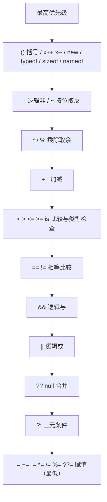
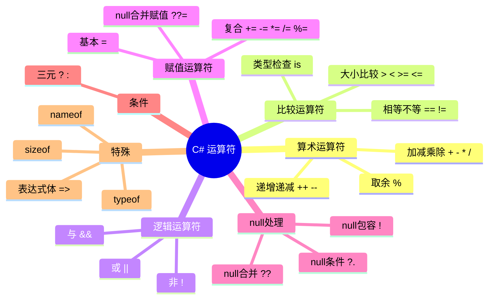

# 第 07 课：运算符与表达式

## 为什么这课很重要

变量存了数据，方法封装了逻辑。但是程序真正干活的时刻是什么？是计算。计算离不开运算符。

第 06 课你学会了声明变量、存数据。这一课要解决的是：数据之间怎么发生关系。加法、比较、判断真假、赋值、空值处理——这些全归运算符管。

我见过不少人写代码时写出 `a = b ?? c` 却说不清 `??` 干了什么，或者把 `=` 和 `==` 弄混导致 bug 找一下午。运算符是骨架，表达式是肌肉。这一课讲透。

## 表达式：程序里最小的计算单元

表达式是能算出一个值的代码片段。最简单的：

```csharp
int sum = 3 + 5;   // "3 + 5" 是表达式，算出 8
```

这里的 `3 + 5` 就是一个表达式，它由两个操作数（3 和 5）和一个运算符（+）组成。程序执行到这里时，会先算 `3 + 5`，得到结果 8，然后赋给变量 `sum`。

复杂一点的：

```csharp
bool result = (a > b) && (c != 0);
```

`(a > b) && (c != 0)` 整个是一个表达式，里面嵌套了三个子表达式。程序从内往外算，先算 `a > b`，再算 `c != 0`，最后把两个布尔值做 `&&` 运算。

表达式不只是数学计算。一个方法调用是表达式：

```csharp
string name = GetUserName();   // GetUserName() 是表达式，返回值
```

一个对象的创建是表达式：

```csharp
var list = new List<int>();    // new List<int>() 是表达式，返回对象引用
```

你在 C# 里写的几乎每一行代码里都有表达式。

## 算术运算符：四则运算的代码版

C# 提供标准的数学运算符。跟小学数学基本一样，但有两个你可能不熟的。

| 运算符 | 含义 | 例子 | 结果 |
|--------|------|------|------|
| `+` | 加法 | `7 + 3` | 10 |
| `-` | 减法 | `7 - 3` | 4 |
| `*` | 乘法 | `7 * 3` | 21 |
| `/` | 除法 | `7 / 3` | 2（注意！） |
| `%` | 取余 | `7 % 3` | 1 |

两个容易被坑的点。

第一个：整数除法会截断。`7 / 3` 在数学上是 2.333...，但如果你用两个 `int` 做除法，C# 直接扔掉小数部分，得 2。想要 2.333 的话，至少有一个操作数是 `double`：

```csharp
double result = 7.0 / 3;   // 2.333...
double result2 = (double)7 / 3;   // 2.333... 强制转换也行
```

第二个：取余（`%`）很多人以为没啥用，其实相当常用。判断一个数是奇数还是偶数：

```csharp
bool isEven = number % 2 == 0;   // 余数为 0 就是偶数
```

轮询一个数组时也能用取余做循环索引：

```csharp
int index = currentStep % itemCount;
```

## 比较运算符：用来做判断的

比较运算符的结果永远是 `bool` 类型——要么 `true`，要么 `false`。

| 运算符 | 含义 | 例子 |
|--------|------|------|
| `==` | 等于 | `a == b` |
| `!=` | 不等于 | `a != b` |
| `>` | 大于 | `a > b` |
| `<` | 小于 | `a < b` |
| `>=` | 大于等于 | `a >= b` |
| `<=` | 小于等于 | `a <= b` |

新手最容易犯的错：把 `=`（赋值）和 `==`（比较）搞混。

```csharp
// 这是赋值，不是比较！
if (x = 5)   // 编译报错，C# 救了你
```

C# 编译器比较聪明，大多数情况下 `if (x = 5)` 直接报错，因为赋值表达式在需要 `bool` 的位置上类型不对。但是如果你写成 `if (flag = true)`，可能就默默通过了——`flag = true` 的结果就是 `true`，编译器觉得没问题。这种 bug 找起来能让你怀疑人生。我的建议：写条件判断时，把常量放左边：

```csharp
if (true == flag)   // 如果写成 true = flag 立刻报错，不会漏过去
```

这个写法看起来有点怪，但是防呆。

## 逻辑运算符：组合多个条件

逻辑运算符把多个 `bool` 值组合在一起。

| 运算符 | 含义 | 例子 |
|--------|------|------|
| `&&` | 逻辑与（两边都为 true 才为 true） | `a && b` |
| `\|\|` | 逻辑或（一边为 true 就为 true） | `a \|\| b` |
| `!` | 逻辑非（取反） | `!a` |

`&&` 和 `||` 都是短路运算。什么叫短路？左边的结果已经能决定整个表达式的值时，右边根本不执行。举个例子：

```csharp
if (obj != null && obj.Value > 10)
{
    // 安全
}
```

如果 `obj` 是 `null`，`obj != null` 就是 `false`。`&&` 要求两边都为 `true` 结果才为 `true`，既然左边已经是 `false` 了，右边根本不用看。程序直接跳过 `obj.Value > 10`，不会去取 `obj.Value`，避免了空引用崩溃。

如果用的是 `&`（单个）而不是 `&&`，那就没有短路——两边都执行。`||` 和 `|` 同理。绝大多数情况你用 `&&` 和 `||`，只有极少数需要强制两边都执行的场景才用单符号版。

`!` 是逻辑非，就是反过来。`!true` 是 `false`，`!false` 是 `true`。

```csharp
bool isReady = false;
if (!isReady)
{
    Console.WriteLine("还没准备好");
}
```

## 赋值运算符：不只是 `=`

基础的 `=` 你见过了。C# 还支持复合赋值运算符，让代码更简洁：

| 运算符 | 等价写法 | 含义 |
|--------|----------|------|
| `+=` | `x = x + 5` | 加后赋值 |
| `-=` | `x = x - 5` | 减后赋值 |
| `*=` | `x = x * 5` | 乘后赋值 |
| `/=` | `x = x / 5` | 除后赋值 |
| `%=` | `x = x % 5` | 取余后赋值 |

```csharp
int count = 0;
count += 3;    // count 现在是 3
count *= 2;    // count 现在是 6
```

字符串也能用 `+=` 来拼接：

```csharp
string message = "Hello";
message += " World";    // "Hello World"
```

不过字符串拼接用 `+=` 在循环里性能很差（每次创建新字符串），后面讲字符串处理时会详细说。

## 三元条件运算符：一句话搞定 if-else

当你只需要"条件成立给值 A，不成立给值 B"的时候，三元运算符比写三四行 if-else 清爽得多：

```csharp
// 不用三元
string status;
if (score >= 60)
    status = "及格";
else
    status = "不及格";

// 用三元，一行
string status = score >= 60 ? "及格" : "不及格";
```

语法：`条件 ? 值1 : 值2`。条件为 `true` 取 `值1`，为 `false` 取 `值2`。

三元可以嵌套但是别超过一层。下面这种代码最好拆成 if-else 或者抽成方法：

```csharp
// 不要这样写
int result = a > b ? (c > d ? 1 : 2) : (e > f ? 3 : 4);
```

读这种代码的眼睛疼，三个月后的你自己也读不懂。

## C# 特有的几个运算符

这几个在别的语言里不一定有，C# 里相当常用。

### null 条件运算符 `?.` 和 `?[]`

访问一个可能为 `null` 的对象的成员时，用 `?.`。如果对象是 `null`，整个表达式直接返回 `null` 而不抛异常：

```csharp
string name = person?.Name;    // person 为 null 时 name 也为 null，不崩溃

int? first = list?.First();    // list 为 null 时 first 为 null
```

对于数组或索引器，用 `?[]`：

```csharp
string item = array?[0];    // array 为 null 时 item 为 null
```

这个通常和 null 合并运算符 `??` 搭配：

```csharp
string display = person?.Name ?? "匿名用户";
```

逻辑：如果 `person` 不为 null 就取 `Name`，如果 `person` 是 null 或者 `Name` 是 null，就用 "匿名用户"。

### null 合并运算符 `??`

当左边的值是 `null` 时，取右边的值：

```csharp
string name = input ?? "默认值";
```

`input` 不是 null 就用 `input`，是 null 就用 "默认值"。

### null 合并赋值运算符 `??=`

C# 8.0 加的。如果左边是 `null`，把右边的值赋给它：

```csharp
name ??= "未命名";
// 等价于
if (name is null) name = "未命名";
```

### `is` 类型检查

检查一个对象是不是某种类型：

```csharp
if (obj is string)
{
    Console.WriteLine("obj 是字符串");
}
```

`is` 还能配合模式匹配把检查和转换一步做完：

```csharp
if (obj is string str)
{
    Console.WriteLine(str.Length);    // str 已经是 string 类型，可以直接用
}
```

### `nameof` 运算符

取变量、类型或成员的名称作为字符串。重构友好的写法：

```csharp
string paramName = nameof(filePath);   // "filePath"
```

如果你写死了 `"filePath"` 这个字符串，后面重命名变量时你容易忘改这个字符串。用 `nameof` 的话，重命名变量时 IDE 会帮你一块儿改。

### `sizeof` 运算符

取一个值类型在内存中占多少字节。不常用，但做性能优化时会碰到：

```csharp
int size = sizeof(int);    // 4
```

### `typeof` 运算符

取一个类型的 `System.Type` 元数据对象。反射编程时常出现：

```csharp
Type t = typeof(string);
Console.WriteLine(t.Name);    // "String"
```

## 运算符优先级：先算谁后算谁

运算符不是按你写的顺序从左往右算的，有自己的优先级。比如：

```csharp
int result = 3 + 4 * 5;    // 23，不是 35
```

`*` 的优先级比 `+` 高，所以先算 `4 * 5 = 20`，再加 3，得 23。

下面这张图展示了从高到低的优先级。同级运算符从左往右算（注意：赋值运算符是从右往左）。



其实你不用死记。两条规则够用了：

1. 不确定优先级的时候，加括号。括号里的先算。
2. 写给别人看的代码里，即使你知道优先级，能加括号还是加括号。`(a && b) || (c && d)` 比 `a && b || c && d` 可读性好太多。

## TubaTools 源码里的真实运算符用法

打开 TubaTools 项目的 `Services/AppSettings.cs`（一个管理应用设置的静态类），能找到本课讲的几乎所有运算符的实际应用。下面逐一拆解。

### `??` null 合并运算符

```csharp
// 从文件读取 JSON 并反序列化，如果文件为空或反序列化失败返回 null，
// ?? 保证 _cache 不会是 null，至少是个空字典
_cache = JsonSerializer.Deserialize<Dictionary<string, string>>(json) ?? [];
```

`JsonSerializer.Deserialize` 如果遇到空 JSON 可能返回 `null`。后面代码要调用 `_cache` 的方法，如果是 `null` 就炸了。`?? []` 的意思是：左边不是 null 就用左边的值，是 null 就用右边的空数组 `[]`。一行搞定，没有额外的 if 判断。

### `is` 类型模式

```csharp
if (_cache is not null) return _cache;
```

`is not null` 是 C# 9.0 的模式匹配语法，等价于 `_cache != null`，但语义更强——它告诉编译器"我知道你在做 null 检查"，后续代码里编译器不会报"可能为 null"的警告。

### `&&` 短路与

```csharp
// 两个条件都满足才保存：有脏数据，且缓存存在
if (!_dirty || _cache is null) return;
```

注意这里用了 `!` 取反加 `||`。逻辑是：如果没有脏数据（`!_dirty` 为 true），或者缓存不存在，直接返回不保存。

再看 GetBool 方法：

```csharp
public static bool GetBool(string key, bool defaultValue = false)
{
    var v = Get(key);
    return v is not null && bool.TryParse(v, out var b) ? b : defaultValue;
}
```

`v is not null && bool.TryParse(v, out var b)`——先用 `is not null` 确保字符串不是空，再用 `&&` 短路调用 `TryParse`。如果 `v` 是 null，短路后 `TryParse` 根本不会执行，避免了传 null 进去。

### 三元条件运算符 `? :`

同样在 GetBool 里：

```csharp
return v is not null && bool.TryParse(v, out var b) ? b : defaultValue;
```

拆开理解：
- 条件：`v is not null && bool.TryParse(v, out var b)`
- 条件为 true（字符串非空且能解析成 bool）：取 `b`（解析出的 bool 值）
- 条件为 false（字符串是 null 或者解析失败）：取 `defaultValue`

一句话完成了"安全解析，解析不了用默认值"的逻辑。如果没有三元运算符，得写：

```csharp
if (v is not null && bool.TryParse(v, out var b))
    return b;
else
    return defaultValue;
```

五行变一行，而且可读性没有降低。

### 表达式体方法 `=>`

```csharp
public static void Set(string key, bool value) => Set(key, value.ToString().ToLowerInvariant());
public static void Set(string key, int value) => Set(key, value.ToString());
public static void Set(string key, double value) => Set(key, value.ToString("F2"));
```

`=>` 在这里不是 Lambda，是"表达式体方法"的语法。方法体只有一条语句时，可以用 `=>` 代替 `{ }`。本质上是方法重载的简写——把 `bool`、`int`、`double` 都转成字符串然后调统一入口。`double` 版本用了 `"F2"` 格式化保留两位小数。

### `?.` null 条件运算符

```csharp
SettingChanged?.Invoke(key);
```

`SettingChanged` 是一个事件。如果没有任何代码订阅这个事件，它的值就是 `null`。直接 `SettingChanged.Invoke(key)` 会抛异常。`?.Invoke(key)` 表示：如果 `SettingChanged` 不为 null，就调用 `Invoke`；如果是 null，整个表达式返回 null，什么都不做。

这行代码出现在 `Set` 和 `Remove` 方法的末尾，作用是在设置值变化后通知所有订阅者。

### `!` null 包容运算符

```csharp
var dir = Path.GetDirectoryName(SettingsPath)!;
```

`Path.GetDirectoryName` 的返回类型是 `string?`（可空字符串）。但是在这个场景下，`SettingsPath` 是一个完整的文件路径，`GetDirectoryName` 几乎不可能返回 null。加 `!` 告诉编译器："我知道这可能为 null，但我确定它不会，别给我报警告。"这是一种你和编译器之间的约定。前提是你真的确定。

### `??` 和你刚才学的 `is` 在同一个方法里碰头

```csharp
public static string? Get(string key)
{
    var s = Load();
    return s.TryGetValue(key, out var v) ? v : null;
}
```

`s.TryGetValue(key, out var v)` 返回 `bool`：找到了返回 `true` 并把值放入 `v`，没找到返回 `false`。三元运算符判断这个 bool，找到了返回 `v`，没找到返回 `null`。

## 一张图总结运算符的分类



## 容易踩的坑

1. **整数除法截断**。前面讲了，`5 / 2` 得 2，不是 2.5。需要小数结果时确保至少一个操作数是浮点类型。

2. **`=` 和 `==` 搞混**。`if (x = 5)` 在 C# 里一般会报错，但 `if (flag = true)` 不会，所以习惯把常量写左边。

3. **`&&` 和 `&` 的区别**。`&&` 短路，`&` 不短路。绝大多数情况用 `&&`。除非你需要右边的副作用（比如右边是个方法调用，你希望它一定执行）。

4. **字符串拼接用的 `+` 在循环里慢**。每次 `+=` 都创建新字符串对象。大量拼接用 `StringBuilder`。

5. **`??` 只判断 null**。空字符串 `""` 不是 null，`"abc" ?? "默认"` 返回 `"abc"`，`"" ?? "默认"` 也返回 `""`。如果你需要空字符串也算无效值，要用 `string.IsNullOrEmpty` 配合三元运算符。

6. **`?.` 返回可空类型**。`person?.Name` 的类型是 `string?` 而不是 `string`。你不能直接把它赋给 `string` 类型的变量，除非你确信它不会为 null（用 `!`）或提供默认值（用 `??`）。

## 运算符和方法的关系

有些运算符背后其实是一个方法调用。比如 `+` 对字符串而言，C# 编译器把它翻译成 `String.Concat` 的调用。自定义类型可以重载运算符，让你能像用内置类型一样用自定义类型做加减。比如 C# 的 `DateTime` 类型：

```csharp
DateTime tomorrow = DateTime.Now + TimeSpan.FromDays(1);
```

`+` 号用在 `DateTime` 和 `TimeSpan` 之间，实际调用了 `DateTime` 类型的运算符重载方法。TubaTools 项目里没有自定义运算符重载（对业务代码来说很少需要），这是进阶话题，后面讲到自定义类型的时候可以细说。

## 小练习

### 练习 1：写结果

以下代码的 `result` 最终值是多少？（手算，不要上机跑）

```csharp
int result = 10 + 5 * 2 - 8 / 4;
```

### 练习 2：改 bug

下面的代码有什么问题？怎么修？

```csharp
int a = 5;
int b = 2;
double avg = (a + b) / 2;
Console.WriteLine(avg);   // 期望输出 3.5
```

### 练习 3：读 TubaTools 源码

回到 `AppSettings.cs` 的 `GetInt` 方法：

```csharp
public static int GetInt(string key, int defaultValue = 0)
{
    var v = Get(key);
    return v is not null && int.TryParse(v, out var i) ? i : defaultValue;
}
```

问题：如果 `Get(key)` 返回字符串 `"abc"`，`GetInt` 会返回什么？为什么？用到了哪几个运算符？

### 练习 4：写代码

写一个方法 `GetDisplayName(string firstName, string lastName)`：
- 如果 `firstName` 和 `lastName` 都不为 null，返回 `"lastName, firstName"`（注意英文逗号后空格）
- 如果只有 `firstName` 不为 null，返回 `firstName`
- 如果只有 `lastName` 不为 null，返回 `lastName`
- 如果都为 null，返回 `"无名氏"`

要求用 `?.` 和 `??` 运算符。不超过 5 行。

---

*提示：练习答案不放在正文里。你可以在 IDE 里建一个控制台项目跑跑看，或者在脑子里过一遍运算顺序。上机跑一遍的印象最深。*
