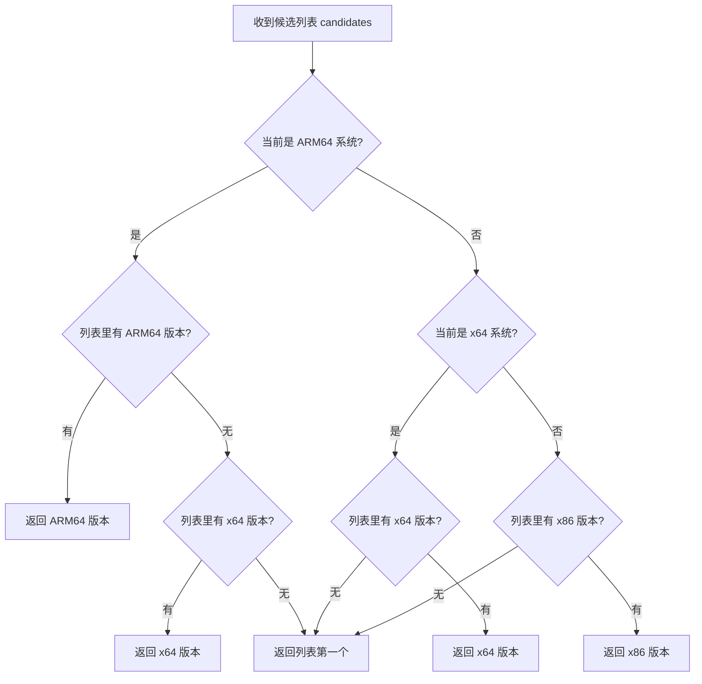

# 第 08 课：条件判断

## 程序不是一条路走到黑

你打开一个软件，点击"保存"，程序真的就把文件存了吗？不一定。如果磁盘满了呢？如果文件被别的程序占用了呢？如果文件名包含非法字符呢？程序在每一个步骤都要问自己："现在是什么情况？我该走哪条路？"

这种"看情况办事"的能力，在编程里就叫**条件判断**。

没有条件判断的程序，说白了就是一个只会背台词的话剧演员——台下观众走了、舞台着火了，它还在一字不差地念。你写出来的东西不能被这样嘲。条件判断让程序有了"眼睛"：它能看清当前状态，然后选一条合适的路走。

这节课我们会从最基础的 if 讲起，一直讲到 switch 模式匹配。所有代码例子都来自 TubaTools 的真实源码，你会看到这些语法不是在教科书里摆样子的——它们每天都在干活。

---

## if 语句：门槛最低的分支

### 基本形式

```csharp
if (条件)
{
    // 条件为 true 时执行
}
```

条件是啥？就是一个能算出 `true` 或 `false` 的表达式。比如 `age >= 18`、`name == "admin"`、`file.Exists(path)`。这个括号里的东西只能是 `bool` 类型——C# 不允许拿整数当条件用，`if (1)` 在 C# 里直接报错。这和 C/C++ 不一样，如果你是转过来的，记住这点。

TubaTools 里到处都是这种情况。`ToolCatalog.cs` 第 81 行：

```csharp
if (string.IsNullOrWhiteSpace(category) || !Directory.Exists(ToolsRoot))
{
    return [];
}
```

翻译成人话：如果分类名是空的，或者工具根目录不存在——别往下走了，直接返回空列表。这叫**卫语句**（guard clause），把非法情况在函数开头全部挡掉，后面的逻辑就不用操心这些烂情况了。

### if-else：两条路选一条

```csharp
if (条件)
{
    // 走这条路
}
else
{
    // 否则走这条路
}
```

`GetTools` 方法里有一个很典型的 if-else（第 120-140 行，简化后）：

```csharp
if (toolOrder is not null && toolOrder.Count > 0)
{
    // 用户自定义了工具排序——按自定义顺序排
    var orderedSet = new HashSet<string>(toolOrder, ...);
    var ordered = toolOrder
        .Where(name => items.Any(it => it.Name.Equals(name, ...)))
        .Select(name => items.First(it => it.Name.Equals(name, ...)))
        .ToList();
    // 把没出现在自定义列表里的工具追加到末尾
    foreach (var item in items.OrderBy(it => it.Name, ...))
    {
        if (!orderedSet.Contains(item.Name))
            ordered.Add(item);
    }
    result = ordered;
}
else
{
    // 没有自定义排序——按默认字母顺序排
    result = items
        .OrderBy(item => item.Name, ...)
        .ThenBy(item => item.RelativePath, ...)
        .ToList();
}
```

这个逻辑很清晰：**如果有自定义排序就用自定义的，没有就按字母排。** 真实项目里大部分 if-else 都是这个模式——优先用一种策略，不行就降级到兜底策略。

### if-else if-else：多条路

当情况不止两种时，链式判断上场：

```csharp
if (IsArm64OS)
{
    // ARM 架构的处理...
}
else if (IsX64OS)
{
    // x64 架构的处理...
}
else
{
    // 32 位的处理...
}
```

这段来自 `ToolCatalog.cs` 的 `PickPreferredArch` 方法（第 583-625 行），完整版是这样的：

```csharp
private static string PickPreferredArch(List<string> candidates)
{
    if (IsArm64OS)
    {
        var arm64 = candidates.FirstOrDefault(f =>
        {
            var name = Path.GetFileNameWithoutExtension(f);
            return ArchArm64Patterns.Any(p => name.EndsWith(p, ...));
        });
        if (arm64 is not null)
            return arm64;

        var x64 = candidates.FirstOrDefault(f =>
        {
            var name = Path.GetFileNameWithoutExtension(f);
            return ArchX64Patterns.Any(p => name.EndsWith(p, ...));
        });
        if (x64 is not null)
            return x64;
    }
    else if (IsX64OS)
    {
        var x64 = candidates.FirstOrDefault(f =>
        {
            var name = Path.GetFileNameWithoutExtension(f);
            return ArchX64Patterns.Any(p => name.EndsWith(p, ...));
        });
        if (x64 is not null)
            return x64;
    }
    else
    {
        var x86 = candidates.FirstOrDefault(f =>
        {
            var name = Path.GetFileNameWithoutExtension(f);
            return Arch32Patterns.Any(p => name.EndsWith(p, ...));
        });
        if (x86 is not null)
            return x86;
    }

    return candidates[0];
}
```

这个方法在做一件什么事？TubaTools 是一款工具启动器，很多工具有 x64 和 x86 两个版本。当你双击一个工具时，程序得决定启动哪个版本——原则是"优先选原生架构的"。ARM64 机器上优先跑 ARM64 版本，找不到再找 x64 的；x64 机器上优先 x64；32 位机器上优先 x86。实在找不到匹配的，就拿列表里第一个。

注意这个结构：外层是 `if` / `else if` / `else`，里层又嵌套了更细的 `if` 判断。实际代码里，嵌套三层是很常见的，只要别套到让人看不懂就行。一旦你发现自己在写第六层嵌套，就该拆方法了。

---

## 比较运算符和逻辑运算符

条件判断的"弹药"就是这些运算符：

| 运算符 | 含义 | 示例 |
|--------|------|------|
| `==` | 等于 | `name == "admin"` |
| `!=` | 不等于 | `count != 0` |
| `>` | 大于 | `age > 18` |
| `<` | 小于 | `score < 60` |
| `>=` | 大于等于 | `level >= 5` |
| `<=` | 小于等于 | `price <= 100` |
| `&&` | 逻辑与（两边都为 true 才为 true） | `a > 0 && b > 0` |
| `\|\|` | 逻辑或（一边为 true 就是 true） | `a == 0 \|\| b == 0` |
| `!` | 逻辑非（取反） | `!isDone` |
| `is` | 类型/模式匹配 | `obj is string` |
| `is not` | 否定模式匹配 | `obj is not null` |

两个容易踩的坑：

**坑一：`==` 和 `=` 搞混。** `=` 是赋值，`==` 是比较。C# 编译器大多数时候能帮你拦住这个错误，但某些场景下（比如 `if (x = true)`）它会变成一个赋值表达式然后隐式转成 bool——好在 C# 不允许隐式从 bool 以外的类型转，所以 `if (x = 5)` 会报错。但用 `bool` 变量时注意：写 `if (flag = true)` 是赋值然后判断赋完的值，不是你想要的比较。

**坑二：字符串比较别用 `==`？** 其实 C# 里 `==` 比较字符串是比较**值**，不是比较引用（和 Java 不一样）。所以 `name == "admin"` 没问题。但如果你想忽略大小写，应该用 `name.Equals("admin", StringComparison.OrdinalIgnoreCase)`。TubaTools 源码里到处都是这种写法，比如：

```csharp
if (name.EndsWith(p, StringComparison.OrdinalIgnoreCase))
    return "x64";
```

**短路求值**值得单独说一下。`&&` 和 `||` 都是短路的：如果左边已经能决定结果，右边根本不会执行。比如：

```csharp
if (obj is not null && obj.Name == "target")
```

如果 `obj` 是 null，`obj.Name` 根本不会被访问——所以不会崩。这是真实代码里写得最多的模式之一。你可以依赖这个特性，但别滥用：不要在一行里塞五个 `&&`，读你代码的人会想打你。

---

## switch：多分支的另一种写法

当你需要根据一个值的不同情况做不同处理，`switch` 比一串 `if-else if` 更清晰。

### 传统 switch 语句

```csharp
switch (变量)
{
    case 值1:
        // 处理值1
        break;
    case 值2:
        // 处理值2
        break;
    default:
        // 以上都不匹配时的兜底
        break;
}
```

每个 `case` 必须以 `break`（或 `return`、`throw`）结尾——C# 不允许像 C 那样"贯穿"到下一个 case，除非这个 case 本身是空的。

### Switch 表达式（C# 8.0+）

这是更现代、更紧凑的写法。TubaTools 的 `FormatArchDisplay` 方法（第 467-476 行）用的就是它：

```csharp
private static string FormatArchDisplay(string? arch)
{
    return arch switch
    {
        "ARM64" => "ARM64",
        "x64" or "Win64" => "x64",
        "x86" or "Win32" => "x86",
        _ => arch ?? ""
    };
}
```

一行行解释：

- `arch switch { ... }` —— 对 `arch` 进行模式匹配
- `"ARM64" => "ARM64"` —— 如果值是 "ARM64"，返回 "ARM64"
- `"x64" or "Win64" => "x64"` —— 如果值是 "x64" **或者** "Win64"，统一返回 "x64"
- `_ => arch ?? ""` —— 下划线 `_` 是"弃元"，匹配所有没被前面 case 覆盖的情况。如果 `arch` 是 null，返回空字符串

这个写法的好处：一眼就能看清"输入什么，输出什么"，不需要像传统 switch 那样追踪 break 和 fall-through。而且编译器会检查你是否覆盖了所有可能的情况（穷举检查）——如果你的 `arch` 是枚举类型，漏掉某个值会直接报编译错。可惜这里 `arch` 是 `string?`，编译器没法穷举，所以必须有 `_` 兜底。

传统 switch 语句 vs switch 表达式的选择：
- 每个分支逻辑简单（一行就能写完返回值）→ 用 switch 表达式
- 每个分支要做好几件事（赋值、调方法、写日志）→ 用传统 switch 语句
- 分支之间有复杂的前后依赖 → 老老实实用 if-else

---

## 三元运算符：条件判断的简写

```csharp
变量 = 条件 ? 真值 : 假值;
```

当 if-else 只做一件事——给同一个变量赋不同的值——三元运算符更紧凑：

```csharp
// 长的写法
string status;
if (isDone)
    status = "完成";
else
    status = "进行中";

// 三元运算符
string status = isDone ? "完成" : "进行中";
```

TubaTools 里三元运算符随处可见。`CreateToolItemWithVariants` 方法（第 359-381 行）：

```csharp
var item = new ToolItem
{
    Name = cleanName,
    Extension = isPlaceholder ? "待下载" : extension.TrimStart('.').ToUpperInvariant(),
    IconGlyph = isPlaceholder ? null : ToolIconService.GetIconGlyph(path),
    IsFavorite = isPlaceholder ? false : FavoritesService.IsFavorite(path),
    PrimaryArch = archDisplay.Length > 0 ? archDisplay : null,
    // ...
};
```

对象初始化器里不能写 if-else 语句块，但可以写三元运算符。所以这种"根据某个条件决定属性值"的场景，三元就是唯一选择。

别嵌套三元。`a ? b ? c : d : e` 这种东西写出来就是对自己和同事的双重犯罪。如果判断逻辑复杂，提成一个独立方法。

---

## Mermaid 流程图：PickPreferredArch 的决策树



这个流程图就是 `PickPreferredArch` 方法的结构化表达。先判断系统架构（外层分支），再在候选列表里找对应架构的可执行文件（内层分支）。两级决策，每级都是 if-else。

---

## 来自 TubaTools 源码的更多例子

### 早期返回模式（Early Return）

```csharp
public static IReadOnlyList<ToolItem> GetAllToolsCached()
{
    if (_cachedAllTools is not null)
        return _cachedAllTools;       // 有缓存，直接返回

    if (!Directory.Exists(ToolsRoot))
        return _cachedAllTools = [];  // 根目录都不在，返回空

    _cachedAllTools = GetCategories()
        .SelectMany(GetTools)
        .ToList();
    return _cachedAllTools;
}
```

这个模式的中心思想：**把"简单情况"在最前面处理掉**。有缓存？直接返回。目录不存在？直接返回空。只有"正主逻辑"——第一次加载——才走到函数后半截。你读代码的时候，大脑只需要在开头一次性处理完这些边缘情况，之后就可以专心看核心逻辑。

### 条件嵌套与锁

```csharp
public static IReadOnlyList<ToolItem> GetTools(string? category)
{
    if (string.IsNullOrWhiteSpace(category) || !Directory.Exists(ToolsRoot))
        return [];

    lock (_cacheLock)
    {
        if (_toolsCache.TryGetValue(category, out var cached))
            return cached;
    }

    // ...加载逻辑...

    lock (_cacheLock) { _toolsCache[category] = result; }
    return result;
}
```

这段展示了条件判断和线程安全一起出现时的典型写法。`lock` 本身不是条件判断，但锁内部往往有一个检查——"缓存里已经有了吗？" 这是双重检查锁定的变体：先不加锁快速检查一次，没有就加锁后再查一次，两次都确认没有才开始真正的加载工作。

---

## 小练习

### 练习 1：读代码说结果

下面这段代码执行后，`result` 的值是多少？

```csharp
int score = 75;
string result;

if (score >= 90)
    result = "优秀";
else if (score >= 80)
    result = "良好";
else if (score >= 60)
    result = "及格";
else
    result = "不及格";
```

### 练习 2：改写成 switch 表达式

把下面的 if-else 链改写成 switch 表达式：

```csharp
string dayName;
if (day == 1)
    dayName = "周一";
else if (day == 2)
    dayName = "周二";
else if (day == 3)
    dayName = "周三";
else
    dayName = "未知";
```

### 练习 3：找 bug

下面这段代码有问题，找出并修复：

```csharp
string name = null;
if (name.Length > 0 && name != null)
{
    Console.WriteLine("名字不为空");
}
```

### 练习 4：代码补全

TubaTools 的 `Search` 方法里有这样一段逻辑（简化版）：搜索功能需要同时支持按关键词和按标签过滤。如果用户没输入关键词也没选标签，返回空结果。请补全代码：

```csharp
public static List<ToolItem> Search(string? query, string? tag)
{
    if (______)
        return [];

    var allTools = GetAllToolsCached();

    return allTools
        .Where(item =>
        {
            var matchesQuery = string.IsNullOrEmpty(query) ||
                item.Name.Contains(query, ...);
            var matchesTag = ______ ||
                (item.Tags?.Any(t => t.Equals(tag, ...)) ?? false);
            return matchesQuery && matchesTag;
        })
        .ToList();
}
```

---

<details>
<summary>练习答案（点开查看）</summary>

### 练习 1 答案
`result` 的值是 `"及格"`。

score = 75。第一个判断 `score >= 90` 不成立，第二个 `score >= 80` 也不成立，第三个 `score >= 60` 成立（75 >= 60 是 true），执行 `result = "及格"`，然后跳过 else。

### 练习 2 答案

```csharp
string dayName = day switch
{
    1 => "周一",
    2 => "周二",
    3 => "周三",
    _ => "未知"
};
```

### 练习 3 答案

两个问题：

1. **顺序错误**：应该先判空再访问属性。`name.Length` 会在 `name` 为 null 时抛出 `NullReferenceException`。
2. **条件顺序反了**：`&&` 的左边应该放 null 检查。

修复后：

```csharp
string name = null;
if (name != null && name.Length > 0)
{
    Console.WriteLine("名字不为空");
}
```

这就是短路求值的典型应用：`name != null` 为 false 时，`name.Length` 根本不会执行，所以不会崩。

### 练习 4 答案

```csharp
public static List<ToolItem> Search(string? query, string? tag)
{
    if (string.IsNullOrWhiteSpace(query) && string.IsNullOrEmpty(tag))
        return [];

    var allTools = GetAllToolsCached();

    return allTools
        .Where(item =>
        {
            var matchesQuery = string.IsNullOrEmpty(query) ||
                item.Name.Contains(query, StringComparison.CurrentCultureIgnoreCase);
            var matchesTag = string.IsNullOrEmpty(tag) ||
                (item.Tags?.Any(t => t.Equals(tag, StringComparison.CurrentCultureIgnoreCase)) ?? false);
            return matchesQuery && matchesTag;
        })
        .ToList();
}
```

注意第一行的 `&&`：两个都为空才返回空列表。只要有一个不为空，就值得搜一下。

</details>

---

下一课我们讲循环——`for`、`while`、`foreach`。条件判断让程序"看情况办事"，循环让程序"反复干活不嫌累"。它们合在一起，程序才开始有真正的力量。
