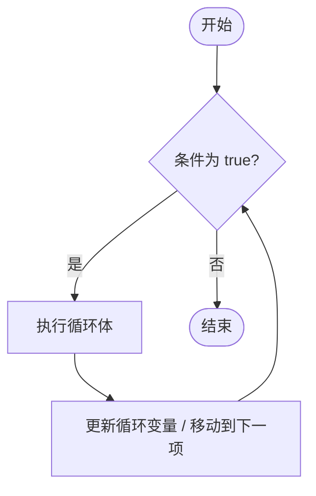
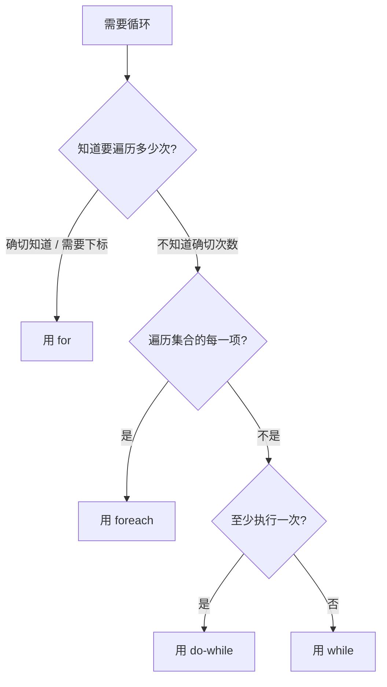

# 第 09 课：循环

## 重复劳动这件事

你打开 TubaTools，点进"系统工具"分类。页面上整齐地排列着十几个工具卡片：任务管理器、注册表编辑器、磁盘管理、设备管理器……每一个卡片长得差不多——有名字、有图标、有描述、有标签。程序是怎么把它们一个一个画出来的？

如果让你手写代码，你可能会这样干：

```csharp
画卡片(工具1);
画卡片(工具2);
画卡片(工具3);
画卡片(工具4);
// ...写到工具50的时候你大概已经把键盘砸了
```

更麻烦的是，工具数量是变的。你这次装了 12 个工具，下次用户新增了 3 个外部工具，你的代码就少画了 3 张卡片。你不可能每次都改代码重新编译。

计算机最强的能力不是算得快，是**不抱怨地做重复劳动**。循环就是让你把这个能力用起来的语法。你告诉计算机"把这个列表里的每一项都处理一遍"，它就去做了，不管列表里有 3 项还是 3000 项。

这节课覆盖 C# 中四种循环——`for`、`foreach`、`while`、`do-while`，以及 `break` 和 `continue` 两个控制关键字。所有代码例子来自 TubaTools 项目里每天都在跑的 `ToolCatalog.cs`（697 行，里面塞满了循环）。

---

## 循环的通用结构

不管哪种循环，本质上都在重复三个步骤：

1. **检查**：现在还要不要继续？
2. **执行**：干这一轮该干的活。
3. **推进**：让状态往"该停了"的方向挪一步。

用流程图表示就是这样：



这四样东西，不同循环写法不一样，但逻辑一个模子。理解了这张图，四种循环的区别就是"谁来帮你管这三步"的问题。

---

## for 循环：你自己管家

`for` 把三项（初始化、条件、推进）全写在一行里：

```csharp
for (初始化; 条件; 推进)
{
    // 循环体
}
```

例子：打印 1 到 5。

```csharp
for (int i = 1; i <= 5; i++)
{
    Console.WriteLine(i);
}
```

- `int i = 1`：初始化，循环开始前跑一次。
- `i <= 5`：每轮开始前检查。true 就进循环体，false 就结束。
- `i++`：每轮结束后跑，把 i 加 1。

第 1 轮：i=1，1<=5 成立，打印 1，i 变 2。
第 2 轮：i=2，2<=5 成立，打印 2，i 变 3。
...
第 5 轮：i=5，5<=5 成立，打印 5，i 变 6。
第 6 轮：i=6，6<=5 **不成立**，循环结束。

现在来看 TubaTools 里真实的 `for`。`ToolCatalog.cs` 里有个方法叫 `MergeArchDirectories`，它的任务是合并同一个工具的不同架构版本目录。比如 "CPU-Z" 这个工具，源码目录里可能同时存在 "CPU-Z" 和 "CPU-Z_x64" 两个文件夹——它们是同一个工具的不同版本，在界面上应该合并显示成一个。

```csharp
// ToolCatalog.cs 第 146-174 行（简化后保留核心逻辑）
private static List<string> MergeArchDirectories(List<string> toolDirs)
{
    var dirNames = toolDirs.Select(d => Path.GetFileName(d)!).ToList();
    var consumed = new HashSet<int>();
    var result = new List<string>();

    for (var i = 0; i < toolDirs.Count; i++)
    {
        if (consumed.Contains(i))
            continue;

        result.Add(toolDirs[i]);

        for (var j = i + 1; j < toolDirs.Count; j++)
        {
            if (consumed.Contains(j))
                continue;

            var strippedI = StripArchSuffix(dirNames[i]);
            var strippedJ = StripArchSuffix(dirNames[j]);
            if (strippedI.Equals(strippedJ, StringComparison.OrdinalIgnoreCase))
            {
                consumed.Add(j);  // j 是 i 的变体，标记为"已合并"
            }
        }
    }

    return result;
}
```

这里出现了 `for` 的两个经典用法：

**外层 for**：`for (var i = 0; i < toolDirs.Count; i++)`——从下标 0 遍历到列表最后一个。这是 `for` 最常见的形态：你需要下标来做判断（判断 i 是否已被 consume），光靠 `foreach` 拿不到下标。

**内层 for**：`for (var j = i + 1; j < toolDirs.Count; j++)`——从 i 后面一个位置开始扫。因为你只需要检查"后面的目录是不是当前目录的变体"，前面已经扫过的不用再看。这是 `for` 的另一个强项：你可以精确控制起始位置。

这套双层循环加 `HashSet` 去重的组合，说白了就是程序员的基本功。不花哨，但好用。

---

## foreach 循环：让 C# 帮你管家

`foreach` 是 C# 里最常用的循环——大概率你写 10 个循环，8 个是 `foreach`。它帮你管了下标、帮你管了边界检查、帮你管了推进。你只需要说"这个集合里的每个东西，挨个处理"。

```csharp
foreach (元素类型 变量名 in 集合)
{
    // 用变量名来访问当前元素
}
```

例子：遍历一个字符串列表。

```csharp
var colors = new List<string> { "红", "绿", "蓝" };
foreach (var color in colors)
{
    Console.WriteLine($"当前颜色：{color}");
}
```

`foreach` 不需要你声明一个 `int i`，不需要你写 `i++`，不需要你做 `i < list.Count` 的边界检查。C# 编译器帮你把这些全包了。代价是：你拿不到下标。如果你需要在循环里知道"现在是第几个"，要么回到 `for`，要么自己维护一个计数器。

TubaTools 的 `ToolCatalog.cs` 里 `foreach` 到处都是。看几个典型场景。

**场景一：遍历目录下的文件。** `FindAllArchVariants` 方法（第 478-516 行）扫描一个工具目录，找出所有不同架构的可执行文件：

```csharp
// ToolCatalog.cs 第 488-513 行
foreach (var filePath in allLaunchables)
{
    if (filePath.Equals(primaryPath, StringComparison.OrdinalIgnoreCase))
        continue;

    if (primaryExt is not null 
        && !Path.GetExtension(filePath).Equals(primaryExt, StringComparison.OrdinalIgnoreCase))
        continue;

    var fileName = Path.GetFileNameWithoutExtension(filePath);
    var arch = DetectArch(fileName);
    if (arch is null)
        continue;

    var stripped = StripArchSuffix(fileName);
    var dirStripped = StripArchSuffix(dirName);
    if (!stripped.Equals(dirStripped, StringComparison.OrdinalIgnoreCase) &&
        !stripped.Equals(dirName, StringComparison.OrdinalIgnoreCase))
        continue;

    variants.Add(new ArchVariant
    {
        Name = CleanupName(StripArchSuffix(fileName)),
        Path = filePath,
        Arch = FormatArchDisplay(arch)
    });
}
```

看这段代码里的 `continue`——它出现了 4 次。`continue` 的意思是"跳过本轮剩下的代码，直接进入下一轮"。这里每一步都在做筛除：不是可启动文件？跳过。扩展名不匹配？跳过。没检测到架构标识？跳过。名称不匹配？跳过。层层过滤之后，剩下来的才真正加入变体列表。

这种"先过滤再处理"的模式在真实代码里非常常见。不用 `continue` 你就得写嵌套的 `if`，代码像滚雪球一样往右缩进。

**场景二：遍历字符串数组做模式匹配。** `DetectArch` 方法（第 447-465 行）：

```csharp
// ToolCatalog.cs 第 449-465 行
private static string? DetectArch(string name)
{
    foreach (var p in ArchArm64Patterns)
    {
        if (name.EndsWith(p, StringComparison.OrdinalIgnoreCase))
            return "ARM64";
    }
    foreach (var p in ArchX64Patterns)
    {
        if (name.EndsWith(p, StringComparison.OrdinalIgnoreCase))
            return "x64";
    }
    foreach (var p in Arch32Patterns)
    {
        if (name.EndsWith(p, StringComparison.OrdinalIgnoreCase))
            return "x86";
    }
    return null;
}
```

三个 `foreach` 依次检查三个模式数组。注意这里用了 `return` 直接退出整个方法——一旦匹配到 ARM64 模式，后面两个 `foreach` 根本不会执行。这是 `return` 在循环里的常见用法：找到目标，立即收工。

**场景三：遍历 JSON 反序列化后的变体列表。** `CreateToolItemWithVariants` 方法（第 315-353 行）：

```csharp
foreach (var jv in jsonVariants)
{
    string? variantPath = null;

    if (!string.IsNullOrWhiteSpace(jv.File))
    {
        var candidate = System.IO.Path.Combine(toolDir, jv.File);
        if (File.Exists(candidate))
            variantPath = candidate;
    }

    if (variantPath is null && !string.IsNullOrWhiteSpace(jv.Dir))
    {
        var altDir = System.IO.Path.Combine(categoryRootDir, jv.Dir);
        if (Directory.Exists(altDir))
        {
            var altLaunchable = FindPrimaryLaunchable(altDir);
            if (altLaunchable is not null)
                variantPath = altLaunchable;
        }
    }

    if (variantPath is null)
        continue;

    if (variantPath.Equals(path, StringComparison.OrdinalIgnoreCase))
        continue;

    if (alternates.Any(a => a.Path.Equals(variantPath, StringComparison.OrdinalIgnoreCase)))
        continue;

    var vName = System.IO.Path.GetFileNameWithoutExtension(variantPath);
    alternates.Add(new ArchVariant
    {
        Name = CleanupName(StripArchSuffix(vName)),
        Path = variantPath,
        Arch = jv.Arch ?? FormatArchDisplay(DetectArch(vName)) ?? "x86"
    });
}
```

这一段展示了 `foreach` + `continue` 组合在复杂业务逻辑中的典型写法。每个变体都要经过好几道检查：有没有文件路径？文件存不存在？有没有备选目录？路径是否和主程序重复？是否已经在列表里了？只有全部检查通过的，才真的加入到变体列表中。

---

## while 循环：条件驱动的前置检查

`while` 的结构最简单：只要条件为 true，就一直转。

```csharp
while (条件)
{
    // 循环体
}
```

它不像 `for` 那样把初始化、条件、推进绑在一起，也不像 `foreach` 那样依赖一个集合。`while` 只认一个条件。推进的事你自己在循环体里做——忘了做就是死循环。

例子：

```csharp
int count = 0;
while (count < 3)
{
    Console.WriteLine($"第 {count + 1} 次");
    count++;
}
```

TubaTools 的 `ToolCatalog.cs` 里有一个很典型的 `while` 用法——`FindToolsRoot` 方法（第 668-696 行）：

```csharp
private static string FindToolsRoot()
{
    if (RuntimeHelper.IsMsixPackaged)
    {
        return Path.Combine(
            Environment.GetFolderPath(Environment.SpecialFolder.LocalApplicationData),
            "TubaWinUi3", "Tools");
    }

    var outputTools = Path.Combine(AppDirectory, "Tools");
    if (Directory.Exists(outputTools))
    {
        return outputTools;
    }

    var directory = new DirectoryInfo(AppDirectory);
    while (directory is not null)
    {
        var candidate = Path.Combine(directory.FullName, "Tools");
        if (Directory.Exists(candidate))
        {
            return candidate;
        }

        directory = directory.Parent;
    }

    return outputTools;
}
```

这里的 `while (directory is not null)` 做的事情是从当前目录开始，一层一层往父目录爬，直到找到一个叫 "Tools" 的文件夹。如果一直爬到根目录都没找到，`directory.Parent` 最终会变成 `null`，循环自动结束。

这个场景用 `for` 或 `foreach` 都不合适——因为你事先不知道要爬多少层。`while` 专门对付这种"不知道要转几圈，只知道什么条件下该停"的情况。

---

## do-while 循环：先斩后奏

`do-while` 和 `while` 的唯一区别是：**条件检查放在循环体后面**。

```csharp
do
{
    // 循环体
} while (条件);
```

这意味着循环体**至少执行一次**，不管条件一开始是不是 false。

```csharp
int number;
do
{
    Console.Write("输入一个正数：");
    number = int.Parse(Console.ReadLine());
} while (number <= 0);

Console.WriteLine($"你输入了 {number}");
```

用户至少被问一次。如果第一次就输入了正数，循环结束。如果输入的是 0 或负数，继续问。

TubaTools 的 ToolCatalog.cs 里没有明显的 `do-while`，这不是因为它没用，而是因为它的业务场景不需要"先执行一次再判断"。但在有用户交互（比如反复让用户输入直到合法）或者需要"至少做一次初始化再检查结果"的场景里，`do-while` 是正确选择。

---

## break 与 continue：循环里的方向控制

这两个关键字给你精细控制每一个迭代轮次的能力。

| 关键字 | 作用 |
|--------|------|
| `break` | 立即结束整个循环，跳到循环外面的下一行 |
| `continue` | 立即结束本轮迭代，跳到下一轮的开头 |

### break 的例子

`DetectArch` 方法里实际上用的是 `return` 而不是 `break`，因为 `return` 直接结束整个方法，比 `break` 更干脆。但如果我们改成用 `break` 配合一个结果变量的写法：

```csharp
string? result = null;
foreach (var p in ArchArm64Patterns)
{
    if (name.EndsWith(p, StringComparison.OrdinalIgnoreCase))
    {
        result = "ARM64";
        break;  // 找到了，后面的 ARM64 模式不用再检查
    }
}
if (result is not null) 
    return result;
```

`break` 在这里告诉循环："我要的东西已经到手了，别再浪费时间扫剩下的了"。

### continue 的例子

前面 `FindAllArchVariants` 里已经出现了好几次 `continue`。再看一个更直接的——`MergeArchDirectories` 的第 154-155 行：

```csharp
for (var i = 0; i < toolDirs.Count; i++)
{
    if (consumed.Contains(i))
        continue;  // 这个 i 已经被合并到别人名下了，跳过
    // ...
}
```

`continue` 在这里的意思是"这轮不算，直接下一轮"。没有它你就得把后面所有逻辑包在一个 `if (!consumed.Contains(i))` 里，代码向右缩进一大截。

### break 和 continue 的嵌套陷阱

如果循环里面套循环（双层 for），`break` 只终止**最内层**的那个循环，外层继续转。

```csharp
for (int i = 0; i < 3; i++)
{
    for (int j = 0; j < 3; j++)
    {
        if (j == 1) break;  // 只跳出内层 j 循环，i 循环继续
        Console.WriteLine($"i={i}, j={j}");
    }
}
```

输出：

```
i=0, j=0
i=1, j=0
i=2, j=0
```

每次内层 j 到 1 就 `break`，但外层 i 还是从 0 转到了 2。

---

## 循环类型选择指南

下面这张图帮你根据实际情况选循环类型：



简单的记忆方式：

- 数数、要下标：`for`
- 遍历集合：`foreach`
- 条件驱动、不知道转几圈：`while`
- 至少做一次再说：`do-while`

TubaTools 的 ToolCatalog.cs 完美体现了这个分工：用 `for` 做下标相关的合并去重，用 `foreach` 做集合遍历和模式匹配，用 `while` 做向上搜索目录树。

---

## 常见错误

### 错误一：foreach 里修改集合

```csharp
var list = new List<int> { 1, 2, 3 };
foreach (var item in list)
{
    if (item == 2)
        list.Remove(item);  // 运行时抛异常：InvalidOperationException
}
```

`foreach` 遍历期间，你不能增删集合元素。C# 的枚举器会在每次迭代时检查集合是否被修改过，一旦发现直接扔异常。这是 C# 的一种保护机制——防止你在遍历时把脚下的地毯抽走。

需要边遍历边删除？用 `for` 倒着走，或者用 `RemoveAll`：

```csharp
// 方法一：for 倒序
for (int i = list.Count - 1; i >= 0; i--)
{
    if (list[i] == 2)
        list.RemoveAt(i);
}

// 方法二：RemoveAll（更简洁）
list.RemoveAll(item => item == 2);
```

### 错误二：while 忘了推进

```csharp
int x = 0;
while (x < 10)
{
    Console.WriteLine(x);
    // 忘了 x++ ——死循环
}
```

程序会永远打印 0，直到你强制终止它。`while` 和 `do-while` 的条件变量必须在循环体里被修改，否则条件永远为 true。

### 错误三：for 的分号顺序搞反

```csharp
for (int i = 10; i > 0; i++)  // i++ 应该是 i--
{
    // i 越来越大，i > 0 永远为 true
}
```

条件要往 false 的方向走。如果条件是 `i > 0`，推进就应该是 `i--` 或者类似的递减操作，不是 `i++`。

---

## 真实场景：ToolCatalog 里的"循环协作"

拿 `GetTools` 方法为例（第 79-143 行），它从读取目录到返回工具列表，调用了大量的 LINQ 链式操作（`Select`、`Where`、`ToList`），而这些 LINQ 方法底层全都是循环。把整条链路展开，实际上是：

1. `Directory.GetDirectories` 遍历文件系统，返回目录列表（内部是循环）
2. `MergeArchDirectories` 用双层 `for` 合并架构变体
3. `Select` + `Where` + `ToList` 对每个目录做筛选和转换（等效于 `foreach` 加条件判断）
4. 最后的 `foreach` 把未排序的条目追加到有序列表末尾

整个方法的骨架上长满了循环。这就是真实项目的常态——循环不是某个独立的知识点，它是代码的血肉。你几乎找不到一个超过 50 行的方法里没有循环。

---

## 小练习

### 练习 1：读代码说结果

下面这段代码输出什么？

```csharp
int sum = 0;
for (int i = 0; i < 10; i++)
{
    if (i % 2 == 0)
        continue;
    if (i > 7)
        break;
    sum += i;
}
Console.WriteLine(sum);
```

1. A) 45
2. B) 16
3. C) 25
4. D) 9

### 练习 2：补全代码

下面的代码想计算列表中所有大于 0 的数字的总和。但有两处留白，请补全。

```csharp
var numbers = new List<int> { -3, 5, 0, 8, -1, 2 };
int total = 0;
foreach (var n in numbers)
{
    if (n ___ 0)  // 第一处：填比较运算符
        ___;      // 第二处：填关键字
    total += n;
}
// 期望 total 为 15
```

### 练习 3：找 bug

下面这段代码想打印出 "CPU-Z_x64" 的架构是 "x64"，但实际跑起来什么都没输出。找出至少两个问题。

```csharp
string name = "CPU-Z_x64";
string[] suffixes = { "64", "x64", "x86", "ARM64" };
foreach (var s in suffixes)
{
    if (!name.EndsWith(s))
    {
        break;
    }
    Console.WriteLine($"架构：{s}");
}
```

### 练习 4：手写循环

写一个方法 `CountToolsInCategory(string category)`，参数是分类名（比如 "系统工具"）。该方法接收一个 `List<ToolItem>` 作为工具的集合（假设已经拿到），用 `foreach` 遍历它，统计 `Category` 属性等于传入 `category` 的工具数量，并返回该数量。

```csharp
// 假设 ToolItem 类的定义如下：
public class ToolItem
{
    public string Name { get; set; }
    public string Category { get; set; }
}

// 请补全这个方法：
public static int CountToolsInCategory(List<ToolItem> tools, string category)
{
    // 在这里写你的代码
}
```

### 练习 5（挑战题）

`ToolCatalog.cs` 的 `FindToolsRoot` 方法用一个 `while` 循环向上爬目录树。假设 `AppDirectory` = `C:\Tools\TubaWinUi3\bin\Debug\net9.0-windows10.0.19041.0\`，而 "Tools" 文件夹实际在 `C:\Tools\` 下。请用纸笔推演这个 `while` 循环的执行过程：每轮迭代 `directory.FullName` 的值是什么？`candidate` 的值是什么？循环在什么时候结束？

---

## 练习答案

<details>
<summary>点击展开答案</summary>

### 练习 1
**答案：B) 16**

推演过程：
- i=0: 0%2==0，continue（跳过）
- i=1: 1%2!=0，1<=7，sum=1
- i=2: continue
- i=3: sum=4
- i=4: continue
- i=5: sum=9
- i=6: continue
- i=7: sum=16
- i=8: 8>7，break（循环终止）

### 练习 2
第一处：`<=`，第二处：`continue`

完整代码：
```csharp
if (n <= 0)
    continue;
```

逻辑：遇到负数或 0 就跳过，只把正数累加到 total。5 + 8 + 2 = 15。

### 练习 3
两个问题：

1. **逻辑反了**：`if (!name.EndsWith(s))` 的意思是"如果不以 s 结尾就 break"。第一个后缀 "64" 不匹配（"CPU-Z_x64" 不 ends with "64"），所以第一轮就直接 break 退出循环，什么都没输出。应该去掉 `!`。

2. **后缀顺序有问题**："64" 排在 "x64" 前面。如果修正了第一个问题，"64" 会先匹配成功，输出"架构：64"而不是"架构：x64"。要么调换顺序，要么用更精确的匹配。

修正后的代码：
```csharp
string name = "CPU-Z_x64";
string[] suffixes = { "x64", "ARM64", "x86", "64" };
foreach (var s in suffixes)
{
    if (name.EndsWith(s))
    {
        Console.WriteLine($"架构：{s}");
        break;  // 匹配到就停
    }
}
```

### 练习 4
```csharp
public static int CountToolsInCategory(List<ToolItem> tools, string category)
{
    int count = 0;
    foreach (var tool in tools)
    {
        if (tool.Category == category)
        {
            count++;
        }
    }
    return count;
}
```

当然也可以用 LINQ 一行搞定：`return tools.Count(t => t.Category == category);`——但 LINQ 背后也是循环。

### 练习 5
推演过程：

初始：`directory` = `C:\Tools\TubaWinUi3\bin\Debug\net9.0-windows10.0.19041.0`

第 1 轮：`candidate` = `C:\Tools\TubaWinUi3\bin\Debug\net9.0-windows10.0.19041.0\Tools`，不存在。directory 变成上一级：`C:\Tools\TubaWinUi3\bin\Debug\`
第 2 轮：candidate = `C:\Tools\TubaWinUi3\bin\Debug\Tools`，不存在。上一级：`C:\Tools\TubaWinUi3\bin\`
第 3 轮：candidate = `C:\Tools\TubaWinUi3\bin\Tools`，不存在。上一级：`C:\Tools\TubaWinUi3\`
第 4 轮：candidate = `C:\Tools\TubaWinUi3\Tools`，不存在。上一级：`C:\Tools\`
第 5 轮：candidate = `C:\Tools\Tools`，不存在。上一级：`C:\`
第 6 轮：candidate = `C:\Tools`，存在！`return candidate;` 循环结束。

</details>
