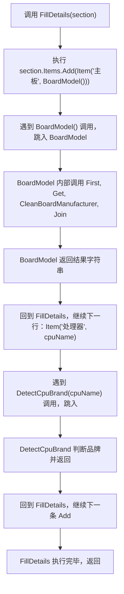
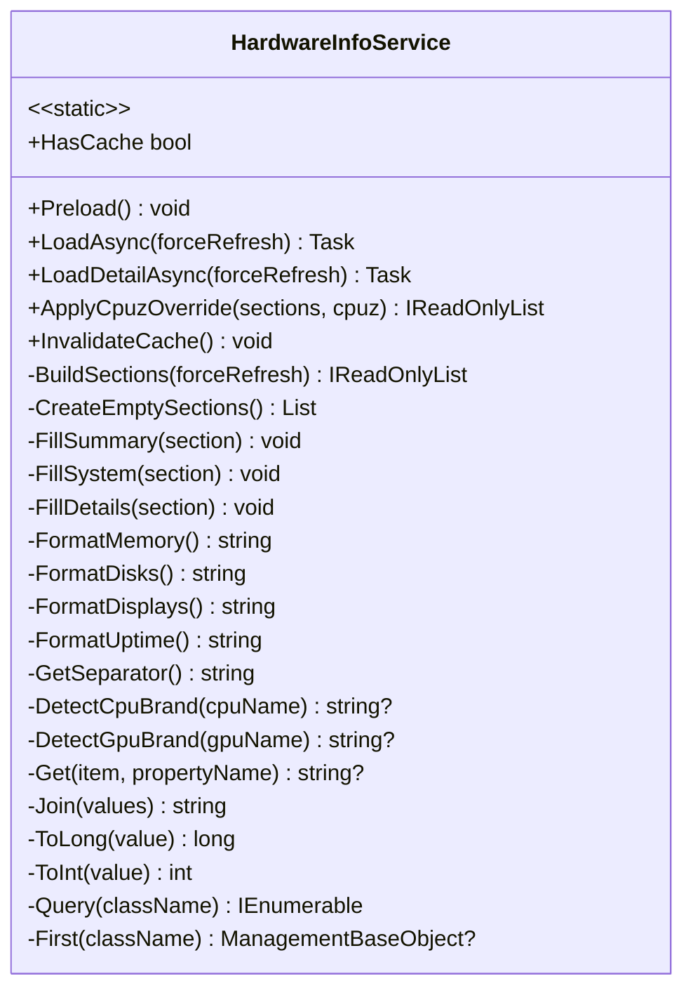

# 第 10 课：方法

## 这一课要解决什么问题

前几课我们学会了变量、运算符、条件判断和循环。你已经能写一些零散的小逻辑了——判断一个数是不是偶数，循环打印九九乘法表。但如果你现在打开一个真实项目，看到的不会是这些零散代码，而是成百上千个"方法"。

这一课就讲方法。学完之后，你能把自己写的代码组织成可复用的"积木块"，看懂 TubaTools 这种真实项目里的代码结构。

## 从一段真实代码说起

先来看 TubaTools 里 `HardwareInfoService.cs` 中的一个方法：

```csharp
private static string GetSeparator()
{
    return AppSettings.GetBool("HardwareMultiDeviceNewLine", false) ? Environment.NewLine : " / ";
}
```

这个方法只有 4 行，但已经包含了方法的全部要素。它名叫 `GetSeparator`，做的事很简单：从设置里读一个布尔值，如果是 true 就返回换行符，否则返回斜杠分隔符。

这四行代码如果散落在文件各处，你需要反复写同样的判断。把它收进一个方法里，别的地方只需要写一行 `GetSeparator()` 就搞定了。

## 方法到底是什么

方法就是一段有名字的代码，你给它一个名字，需要的时候喊它干活。

日常类比：你不需要每次都口头说"打开冰箱门、拿出鸡蛋、敲开鸡蛋、倒进碗里"，你只需要说"打个鸡蛋"。这就是方法。

在 C# 里，方法的"通用模板"长这样：

```
返回类型 方法名(参数列表)
{
    方法体——具体干什么活
}
```

拆开来看四个部分：

- **返回类型**：这个方法干完活之后，要还给你什么东西。比如 `string` 表示还你一个字符串，`int` 表示还你一个整数，`void` 表示啥也不还。
- **方法名**：你给这段代码起的名字，比如 `GetSeparator`、`FormatMemory`。C# 约定用 PascalCase（每个单词首字母大写）。
- **参数列表**：干活需要的外部材料。写在括号里，可以没有参数，也可以有多个。
- **方法体**：花括号 `{}` 里面是实际执行的代码。

## 先看最简单的方法：无参数，有返回值

`GetSeparator` 就是一个典型：没有参数，干活不需要外部材料；返回一个 `string`。

再看 TubaTools 里另一个同样模式的方法：

```csharp
private static string FormatUptime()
{
    var uptime = TimeSpan.FromMilliseconds(Environment.TickCount64);
    return $"{uptime.Days}天{uptime.Hours}小时{uptime.Minutes}分钟{uptime.Seconds}秒";
}
```

这个方法也是零参数，返回 `string`。它从系统获取开机时长，拼成"X天X小时X分钟X秒"的中文格式。

两个方法都没有参数——它用到的数据（`AppSettings`、`Environment.TickCount64`）是直接从别的地方拿的，不需要调用者提供。

## void 方法：干了活但不还东西

有些方法不需要还东西给你。比如 TubaTools 里的 `InvalidateCache`：

```csharp
public static void InvalidateCache()
{
    lock (_lock)
    {
        _cache = null;
    }
}
```

返回类型是 `void`——这就是在说"我干活，但不还你任何东西"。这个方法做的事就是清空缓存，内部状态变了，但不需要给调用者返回值。

再看一个稍微复杂点的 void 方法：

```csharp
private static void FillSummary(HardwareInfoSection section)
{
    var computer = First("Win32_ComputerSystem");
    var board = First("Win32_BaseBoard");
    var bios = First("Win32_BIOS");

    section.Items.Add(Item("设备型号", Join(Get(computer, "Manufacturer"), Get(computer, "Model"))));
    section.Items.Add(Item("主板", Join(Get(board, "Manufacturer"), Get(board, "Product"))));
    section.Items.Add(Item("BIOS", Join(Get(bios, "Manufacturer"), Get(bios, "SMBIOSBIOSVersion"))));
}
```

这个方法接受一个 `HardwareInfoSection` 类型的参数 `section`，往里面填三项数据：设备型号、主板、BIOS。它没有 `return` 语句，因为它是通过修改参数引用的对象来"交差"的。调用者传进去的那个 `section` 对象在方法执行完以后，数据就填好了。

## 有参数的方法

大部分方法都需要参数。参数就是干活要用的"原材料"。

TubaTools 里全是这类方法。看一个极简的例子：

```csharp
private static string? Get(ManagementBaseObject? item, string propertyName)
{
    try
    {
        return item?[propertyName]?.ToString()?.Trim();
    }
    catch
    {
        return null;
    }
}
```

这个方法有两个参数：`item`（一个 WMI 对象，可能为 null）和 `propertyName`（属性名字符串）。它从 item 里取出指定属性的值，转成字符串并去掉首尾空格。如果过程中出了任何问题（比如 item 是 null，或者属性不存在），就返回 null。

再看一个参数更多一点的：

```csharp
private static string Join(params string?[] values)
{
    return string.Join(" ", values.Where(value => !string.IsNullOrWhiteSpace(value)));
}
```

`params` 关键字让调用者可以传任意多个字符串参数，不用先装进数组。比如：

```csharp
Join("Hello", "World", null, "Foo")
// 结果："Hello World Foo"（空值和 null 被过滤掉了）
```

## 方法调用方法

方法不是孤立的。一个方法里面调用另一个方法，层层组合，是真实项目的基本形态。

看这一段：

```csharp
private static string BoardModel()
{
    var board = First("Win32_BaseBoard");
    var mfr = CleanBoardManufacturer(Get(board, "Manufacturer"));
    var product = Get(board, "Product");
    return Join(mfr, product);
}
```

`BoardModel` 方法本身只有 5 行，但它调用了 4 个其他方法：`First`、`Get`、`CleanBoardManufacturer`、`Join`。每一个被调用的方法各司其职：

- `First("Win32_BaseBoard")` 从 WMI 查出主板信息对象
- `Get(board, "Manufacturer")` 从该对象提取制造商名字
- `CleanBoardManufacturer(...)` 把原始名（如 "ASUSTEK COMPUTER INC."）转成干净的"华硕(ASUS)"
- `Join(mfr, product)` 把制造商和产品名拼成一个字符串

这就是方法的核心价值：把复杂逻辑拆成小步骤，每个步骤是一个独立、可复用的小方法。

再看一个更明显的例子——`FormatMemory` 方法内部调用了 `Query`、`ToInt`、`ToLong`、`Get`、`CleanMemManufacturer`、`GetMemoryTypeLabel`、`GetMemoryDataRateMts` 等近十个方法。如果把这些代码全部平铺在一个大函数里，会有几百行，改一个细节就要从头读到尾。

## 方法调用时的执行流程

当一个方法被调用时，程序会暂停当前代码，跳到方法体去执行，执行完再跳回来。这看起来简单，但新手容易在这上面犯晕。

用 TubaTools 里的 `FillDetails` 方法来画流程：



一个方法调另一个，再调另一个，最深可以嵌套很多层。但每一层返回后都精确回到调用点，继续往下执行。调用栈这个概念在后面的调试课中会详细展开。

## 可选参数（默认参数）

有些方法的参数可以带默认值，调用时可以不传这个参数：

```csharp
public static Task<IReadOnlyList<HardwareInfoSection>> LoadAsync(bool forceRefresh = false)
{
    return Task.Run(() => BuildSections(forceRefresh));
}
```

`forceRefresh` 参数后面有个 `= false`，意思是"如果调用者没给这个参数，默认用 false"。

于是这个方法有两种调用方式：

```csharp
// 不传参数，forceRefresh 默认为 false（使用缓存）
var data = await HardwareInfoService.LoadAsync();

// 强制刷新，传 true
var data = await HardwareInfoService.LoadAsync(forceRefresh: true);
```

还支持"命名参数"——写 `forceRefresh: true` 比只写 `true` 更清晰。当方法有多个可选参数时，命名参数让代码可读性高很多。

## 返回值：方法的"产出"

每个有返回值的方法必须有一条 `return` 语句，把结果扔回给调用者。`return` 执行后，方法立刻结束，后面的代码不执行。

看一些不同返回类型的例子（都来自 TubaTools 同一文件）：

```csharp
// 返回 bool——"是或否"的判断结果
private static bool ContainsAny(string? value, params string[] needles)
{
    return !string.IsNullOrWhiteSpace(value) &&
           needles.Any(needle => value.Contains(needle, StringComparison.OrdinalIgnoreCase));
}

// 返回 long——解析数字，解析失败返回 0
private static long ToLong(string? value)
{
    return long.TryParse(value, out var number) ? number : 0;
}

// 返回 string?——可能返回 null 的字符串
private static string? DetectCpuBrand(string? cpuName)
{
    if (string.IsNullOrWhiteSpace(cpuName)) return null;
    var name = cpuName.ToUpperInvariant();
    if (name.Contains("INTEL")) return "intel";
    if (name.Contains("AMD")) return "amd";
    return null;
}
```

注意 `DetectCpuBrand` 返回类型是 `string?`。末尾那个 `?` 说明这个方法可能返回 null——没识别出品牌就返回 null。调用者拿到这个返回值之后得检查一下是不是 null 再用。

类型后面加 `?` 是 C# 8.0 引入的可空引用类型（nullable reference types）。它本质上是一个编译期提示，告诉编译器和读代码的人："这个值可能为空，处理它的时候小心点。"

## static 方法 vs 实例方法

你可能已经注意到了，前面所有方法前面都有 `static` 关键字。`HardwareInfoService` 本身也是 `static class`。

`static` 方法属于"类"本身，不要求你先创建对象。调用方式是 `类名.方法名()`：

```csharp
HardwareInfoService.LoadAsync();
HardwareInfoService.InvalidateCache();
```

TubaTools 里绝大多数方法都是 static 的——因为 `HardwareInfoService` 本身就是一个静态类，它不需要实例化。

那非 static（实例）方法是什么样？看 `HardwareInfoItem.cs`（Model）：

```csharp
public class HardwareInfoItem
{
    public string Label { get; set; } = "";
    public string Value { get; set; } = "";
    public string? BrandKey { get; set; }
    public bool IsVerified { get; set; }
}
```

这个类没有显式的方法，但它有属性（Properties），属性的 getter/setter 在底层其实就是方法。创建实例后才能访问：

```csharp
var item = new HardwareInfoItem { Label = "CPU", Value = "i7-13700K" };
Console.WriteLine(item.Label); // 内部调用了 get_Label() 方法
```

Property 本质上是方法的语法糖。`public string Label { get; set; }` 编译后变成 `get_Label()` 和 `set_Label(string value)` 两个方法。

## 一个小型方法的设计全过程

假设你要写一个方法：给它一个内存类型编号，返回对应的名称字符串。比如 26 对应 "DDR4"，34 对应 "DDR5"。

TubaTools 里实际就是这么做的：

```csharp
private static string GetMemoryTypeLabel(int smbiosMemoryType)
{
    return smbiosMemoryType switch
    {
        18 => "DDR",
        19 => "DDR2",
        20 => "DDR2 FB-DIMM",
        24 => "DDR3",
        25 => "DDR3L",
        26 => "DDR4",
        27 => "LPDDR",
        28 => "LPDDR2",
        29 => "LPDDR3",
        30 => "LPDDR4",
        34 => "DDR5",
        35 => "LPDDR5",
        36 => "HBM3",
        _ => ""
    };
}
```

拆解设计决策：

1. **方法名**：`GetMemoryTypeLabel`。动词开头（Get），后面说清楚拿什么（MemoryTypeLabel）。
2. **参数**：一个 `int`，因为 SMBIOS 类型编号就是整数。参数名 `smbiosMemoryType` 自解释。
3. **返回类型**：`string`。没匹配到就返回空字符串，而不是 null——调用者拿到空字符串直接显示就行，不用判空。
4. **方法体**：用 `switch` 表达式，比写 15 个 `if-else` 清晰得多。
5. **访问修饰符**：`private static`。这个方法只在本类内部使用，外部不需要知道它的存在。

这种"输入一个编号，输出一个名称"的模式，在真实项目中反复出现。你也可以写一个类似的方法——比如把 HTTP 状态码转成对应的文字描述。

## 方法太多的项目怎么读

`HardwareInfoService.cs` 有 1810 行，包含几十个方法。新手面对这种文件会懵。其实读法很简单：

1. **先找入口方法**。这个文件的入口是 `LoadAsync` 和 `LoadDetailAsync`——它们是 public 的，外部调用从这里开始。
2. **顺着调用链往下追**。`LoadAsync` 调 `BuildSections` → `BuildSections` 调 `FillSummary` / `FillSystem` / `FillDetails` → 这些方法又调更小的 helper。
3. **helper 方法可以暂时跳过**。像 `Get`、`Join`、`ToInt` 这种一看名字就知道干什么的，不用细看实现。

这种方法分层是刻意设计的——上层方法负责"做什么"（获取系统摘要），底层方法负责"怎么做"（查 WMI、拼字符串）。读代码时按这个分层来，不会迷失。

## 类图：HardwareInfoService 的方法结构

下面这张类图概括了 `HardwareInfoService` 的核心方法组织方式：



标记规则：`+` 是 public 方法（外部能调用），`-` 是 private 方法（只有类内部能用）。公共的只有 6 个，私有的有几十个。这说明类的设计者把复杂逻辑封装在内部，对外只暴露简单的接口。

## 方法签名里的问号是什么意思

你注意到了有些方法参数或返回值后面带 `?`：

```csharp
private static string? Get(ManagementBaseObject? item, string propertyName)
```

`string?` 表示"这个字符串可能为 null"；`ManagementBaseObject?` 同理。这是 C# 的可空引用类型。它不会改变运行时行为——代码该怎么执行还怎么执行。但是编译器和 IDE 会基于这些标注给你警告："这里可能为 null，你最好检查一下再使用。"

在 TubaTools 项目里，所有 WMI 查询相关的方法都大量使用 `?`，因为 WMI 查询的结果确实可能为 null：硬件没插、驱动没装、权限不够，都可能拿不到数据。

## 练习

### 练习 1：填空

阅读下面的方法，在横线上填上正确的值或类型：

```csharp
private static ___ GetGreeting(___ hour)
{
    if (hour < 12)
        ___ "早上好";
    else if (hour < 18)
        ___ "下午好";
    else
        ___ "晚上好";
}
```

（1）返回类型应该是什么？
（2）参数 hour 的类型应该是什么？
（3）三个横线上应该填什么关键字？

### 练习 2：读代码，写输出

以下代码执行后，`result` 的值是什么？

```csharp
private static int Add(int a, int b)
{
    return a + b;
}

private static int Multiply(int a, int b)
{
    return a * b;
}

private static int Calculate(int x, int y)
{
    return Add(x, y) + Multiply(x, y);
}

// 调用：
var result = Calculate(3, 4);
```

### 练习 3：判断对错

阅读 TubaTools 中的这个方法：

```csharp
private static bool ContainsAny(string? value, params string[] needles)
{
    return !string.IsNullOrWhiteSpace(value) &&
           needles.Any(needle => value.Contains(needle, StringComparison.OrdinalIgnoreCase));
}
```

判断以下说法是否正确（对/错）：

（1）如果 `value` 是 null，方法会直接返回 false，不会检查 needles。
（2）如果 `needles` 是空数组，方法会返回 true。
（3）这个方法可以这样调用：`ContainsAny("NVIDIA GeForce RTX 4090", "Intel", "AMD")`。
（4）比较时区分大小写。

### 练习 4：写一个方法

仿照 TubaTools 中 `DetectCpuBrand` 的写法，自己写一个 `GetGradeLevel` 方法：

- 参数：一个 `int score`（0-100 的分数）
- 返回：`string`
- 规则：90-100 返回 "A"，80-89 返回 "B"，70-79 返回 "C"，60-69 返回 "D"，0-59 返回 "F"
- 如果分数超出 0-100 范围，返回 "无效分数"

用你喜欢的控制流（if-else 或 switch）都可以。

---

## 练习参考答案

### 练习 1
（1）返回类型是 `string`
（2）参数类型是 `int`
（3）三个横线都填 `return`

### 练习 2
- `Add(3, 4)` 返回 7
- `Multiply(3, 4)` 返回 12
- `Calculate` 返回 7 + 12 = **19**

### 练习 3
（1）对。短路求值：`value` 为 null 时，`!string.IsNullOrWhiteSpace(value)` 为 false，`&&` 短路，右边不执行。
（2）错。`needles.Any(...)` 在空数组上返回 false，所以整体返回 false。
（3）对。`params string[]` 允许直接传多个字符串参数。
（4）错。`StringComparison.OrdinalIgnoreCase` 就是忽略大小写。

### 练习 4
参考写法：

```csharp
private static string GetGradeLevel(int score)
{
    if (score < 0 || score > 100)
        return "无效分数";
    
    return score switch
    {
        >= 90 => "A",
        >= 80 => "B",
        >= 70 => "C",
        >= 60 => "D",
        _ => "F"
    };
}
```

用 switch 表达式比嵌套 if-else 更紧凑。`>= 90` 这种模式匹配是 C# 9.0 引入的特性，后面会专门讲。
