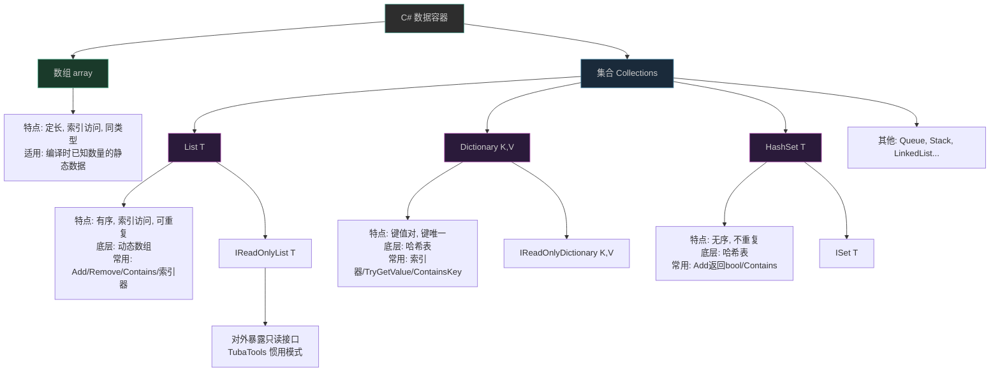

# 第 11 课：数组与集合

## 这一课要解决什么问题

到现在你已经会了变量、运算符、条件判断、循环和方法。用这些知识，你可以写一个程序：从文件里读十个名字，排序，打印出来。但你很快会撞到一堵墙——十个名字你声明十个变量吗？一百个呢？一百万个呢？

程序处理的从来不是"一个"东西，而是"一堆"东西。TubaTools 里有数百个工具，每个工具是一个 `ToolItem` 对象，不可能是几百个独立变量。这一课就讲怎么在 C# 里管理"一堆"数据——数组和集合。

读完这一课，你能看懂 TubaTools 里 `ToolCatalog.cs` 那成片出现的 `List<T>`、`Dictionary<K,V>`、`HashSet<T>` 到底在干什么，也能在自己的代码里选择合适的数据结构。

## 数组：最原始的"一堆"

### 数组长什么样

数组就是把同类型的多个数据捆在一起，放在连续的内存位置。声明方式：

```csharp
int[] scores = new int[5];      // 能装 5 个 int 的数组，初始全是 0
string[] names = new string[3]; // 能装 3 个 string，初始全是 null
```

也可以在声明的同时给值：

```csharp
string[] colors = new string[] { "红", "绿", "蓝" };
// 或者更短的写法
string[] colors = { "红", "绿", "蓝" };
```

C# 12 之后还多了集合表达式 `[ ]`，看起来更清爽：

```csharp
string[] colors = ["红", "绿", "蓝"];
```

### 数组的核心特征

数组有四个特征你得先记住，后面讲为什么有时不用它：

**第一，大小固定。** 创建的时候说多大就多大，之后不能改。`new int[5]` 永远是 5 个位置，装第 6 个就报错。

**第二，元素通过索引访问。** 从 0 开始数：`scores[0]` 是第一个，`scores[4]` 是第五个。`scores[5]` 不存在，会抛 `IndexOutOfRangeException`。

**第三，同类型。** 一个 `int[]` 只能装 int，不能突然塞一个 string 进去。

**第四，有 `Length` 属性。** 想知道数组有多长，用 `scores.Length`。

### 遍历数组

遍历就是"挨个看一眼"。两种写法：

```csharp
// 方式一：for 循环，需要自己控制索引
for (int i = 0; i < colors.Length; i++)
{
    Console.WriteLine(colors[i]);
}

// 方式二：foreach 循环，不用管索引，更简洁
foreach (string color in colors)
{
    Console.WriteLine(color);
}
```

`foreach` 是 C# 中最常用的遍历方式。后面你会看到 TubaTools 里到处是它。

### TubaTools 里的数组

打开 `ToolCatalog.cs`，前几行就是数组：

```csharp
private static readonly string[] LaunchableExtensions =
[
    ".exe",
    ".bat",
    ".cmd",
    ".lnk",
    ".msc",
    ".ps1",
    ".vbs"
];
```

这个数组存了所有"可启动"文件的扩展名。它的大小是固定的——程序生命周期内不会变。后面 `IsLaunchable` 方法用它来判断一个文件能不能启动：

```csharp
private static bool IsLaunchable(string path)
{
    var extension = Path.GetExtension(path);
    return LaunchableExtensions.Contains(extension, StringComparer.OrdinalIgnoreCase);
}
```

同样，`ToolCatalog.cs` 里还有几个架构后缀数组：

```csharp
private static readonly string[] ArchSuffixes =
[
    "64", "32", "x64", "x86", "_x64", "_x86", "_64", "_32",
    "w64", "w32", "_Win64", "_Win32", "ARM64", "_ARM64"
];
```

这些值在写代码的时候就确定了，运行时不会变——这正是数组的最佳使用场景：**数量固定、内容已知的静态数据**。

## List：能伸缩的数组

### 为什么需要 List

数组的问题是大小锁死。你在写代码的时候经常不知道有多少条数据——用户有几个工具？搜索结果有几条？配置文件里写了几个分类？这些在运行前都不可知。

这时候用 `List<T>`。它底层还是数组，但在需要扩容的时候会自动创建一个更大的数组把数据拷过去。你用的时候不用操心大小，只管 `Add`、`Remove`、`Insert`。

### List 的基本操作

```csharp
// 创建
List<string> tools = new List<string>();  // 空列表
List<int> numbers = [1, 2, 3];           // C# 12 集合表达式

// 添加元素
tools.Add("CPU-Z");
tools.Add("GPU-Z");
tools.Add("HWiNFO");

// 访问元素（和数组一样用索引）
string first = tools[0];  // "CPU-Z"

// 获取数量
int count = tools.Count;  // 3

// 删除元素
tools.Remove("GPU-Z");     // 按值删除
tools.RemoveAt(0);         // 按索引删除

// 检查是否存在
bool hasCPUZ = tools.Contains("CPU-Z");

// 遍历
foreach (string tool in tools)
{
    Console.WriteLine(tool);
}
```

### TubaTools 里的 List

`ToolCatalog.cs` 里 List 满天飞。最典型的是 `GetCategories` 方法：

```csharp
public static IReadOnlyList<string> GetCategories()
{
    if (!Directory.Exists(ToolsRoot))
    {
        return [];
    }

    var dirs = Directory.GetDirectories(ToolsRoot)
        .Select(Path.GetFileName)
        .Where(name => !string.IsNullOrWhiteSpace(name))
        .Cast<string>()
        .ToList();          // ← 这里把目录名转换成一个 List<string>
    // ...
    return dirs.OrderBy(name => name, StringComparer.CurrentCultureIgnoreCase).ToList();
}
```

注意这个方法的返回类型是 `IReadOnlyList<string>`，实际返回了一个 `List<string>`。这是 C# 里的惯用写法：**对外承诺"你只能读"，内部用自己的实现**。`List<T>` 实现了 `IReadOnlyList<T>` 接口，所以可以这样返回。

再看看 `MergeArchDirectories` 方法——它把 x86 和 x64 版本的工具目录合并：

```csharp
private static List<string> MergeArchDirectories(List<string> toolDirs)
{
    var dirNames = toolDirs.Select(d => Path.GetFileName(d)!).ToList();
    var consumed = new HashSet<int>();
    var result = new List<string>();   // ← 动态增长的列表

    for (var i = 0; i < toolDirs.Count; i++)
    {
        if (consumed.Contains(i))
            continue;

        var strippedI = StripArchSuffix(dirNames[i]);
        result.Add(toolDirs[i]);       // ← 边处理边往里加

        for (var j = i + 1; j < toolDirs.Count; j++)
        {
            if (consumed.Contains(j))
                continue;

            var strippedJ = StripArchSuffix(dirNames[j]);
            if (strippedI.Equals(strippedJ, StringComparison.OrdinalIgnoreCase))
            {
                consumed.Add(j);
            }
        }
    }

    return result;
}
```

这里 `result` 不知道最终会有多少条，所以不能用数组。用 `List<string>`，每找到一个符合条件的就 `Add` 进去。

### List vs 数组：什么时候用哪个

| 场景 | 用 |
|------|-----|
| 数据量在编译时就确定，不会变 | 数组 `T[]` |
| 数据量运行时才知道，需要增减 | `List<T>` |
| 需要频繁在中途插入/删除 | `List<T>` |
| 只是遍历一遍，查查东西 | 两者都行，数组稍微快一点 |

简单记忆法：**编译时能数清楚用数组，运行时才知道用 List**。

## Dictionary：从键到值的映射

### Dictionary 解决什么问题

数组和 List 都是按数字索引找东西：`data[0]`、`data[5]`。但很多时候你不想记数字位置——你想按"名字"找。

比如 TubaTools 里要根据工具分类名（"硬件检测"、"系统清理"）快速找到该分类下的所有工具。如果用 List，你得遍历整份列表一条条比对。用 `Dictionary`，一步到位。

`Dictionary<TKey, TValue>` 就是一个键到值的映射表。给定一个键，立刻拿到对应的值。它的底层是哈希表，查找速度是 O(1)——不管里面有一百条还是一百万条，拿到值的速度差不多。

### Dictionary 的基本操作

```csharp
// 创建
Dictionary<string, int> scores = new Dictionary<string, int>();

// 添加键值对
scores["张三"] = 95;
scores["李四"] = 87;
scores.Add("王五", 92);  // 另一种写法

// 通过键取值
int zhangsScore = scores["张三"];  // 95

// 安全取值（键可能不存在时）
if (scores.TryGetValue("赵六", out int score))
{
    Console.WriteLine($"赵六的成绩: {score}");
}
else
{
    Console.WriteLine("找不到赵六");
}

// 检查键是否存在
bool hasZhangs = scores.ContainsKey("张三");

// 遍历
foreach (var kvp in scores)
{
    Console.WriteLine($"{kvp.Key}: {kvp.Value}");
}
```

### TubaTools 里的 Dictionary

`ToolCatalog.cs` 里有一个关键的 Dictionary：

```csharp
private static readonly Dictionary<string, IReadOnlyList<ToolItem>> _toolsCache = 
    new(StringComparer.OrdinalIgnoreCase);
```

这行代码解析：

- `Dictionary<string, IReadOnlyList<ToolItem>>`——键是分类名（string），值是该分类下的工具列表。
- `new(StringComparer.OrdinalIgnoreCase)`——创建时传入比较器，让键的比较忽略大小写。这样 `"硬件检测"` 和 `"硬件检测"` 被视为同一个键。

用它做什么呢？看 `GetTools` 方法：

```csharp
public static IReadOnlyList<ToolItem> GetTools(string? category)
{
    // ...
    lock (_cacheLock)
    {
        if (_toolsCache.TryGetValue(category, out var cached))
            return cached;    // ← 缓存命中，直接返回
    }
    
    // 缓存未命中，扫描目录构建工具列表
    // ... 构建 items 列表 ...
    
    lock (_cacheLock) { _toolsCache[category] = result; }  // ← 存入缓存
    return result;
}
```

这里的逻辑很实用：第一次查某个分类时，扫描文件夹构建工具列表，存进 Dictionary。以后再查同一个分类，直接从 Dictionary 拿出来，不用重复扫描。这就是缓存模式。

另一个 Dictionary 式的用法在 `GetCategories` 里——虽然不是 Dictionary 类型，但用 `HashSet` 达到了同样的"快速查重"效果：

```csharp
var orderedSet = new HashSet<string>(ordered, StringComparer.CurrentCultureIgnoreCase);
```

这里把用户自定义的分类顺序列表丢进一个 `HashSet`，目的不是存值，而是利用 HashSet 的 O(1) 查找来判断"某个分类名是不是已经在结果里了"。

### Dictionary 的"键冲突"问题

如果你往 Dictionary 里添加一个已经存在的键，会抛异常：

```csharp
var dict = new Dictionary<string, int>();
dict["a"] = 1;
dict["a"] = 2;  // 赋值语法会覆盖，没问题
dict.Add("a", 3); // 抛 ArgumentException，因为键 "a" 已存在
```

用索引器 `dict["a"] = 2` 是覆盖，用 `dict.Add("a", 3)` 是添加——添加已存在的键会报错。

## HashSet：不重复的集合

### HashSet 干什么

HashSet 就是一个"不允许重复元素"的集合。和 List 的区别：List 可以有重复元素，按顺序存；HashSet 保证每个元素只出现一次，不保证顺序（其实内部有顺序，但不该依赖它）。

```csharp
HashSet<int> numbers = new HashSet<int>();
numbers.Add(1);   // true（添加成功）
numbers.Add(2);   // true
numbers.Add(1);   // false（重复了，加不进去）

Console.WriteLine(numbers.Count); // 2，不是 3
```

`Add` 方法返回 `bool`：true 表示添加成功，false 表示元素已存在。

### HashSet 的常用场景

**去重。** 你拿到一堆数据，只想保留不重复的部分：

```csharp
List<string> tags = ["CPU", "内存", "CPU", "显卡", "内存"];
HashSet<string> uniqueTags = new HashSet<string>(tags);
// uniqueTags 里只有 "CPU", "内存", "显卡"
```

**快速查存在。** 判断某样东西在不在集合里，HashSet 的 `Contains` 是 O(1)，List 的 `Contains` 是 O(n)。如果一个集合只用来做"在不在"的检查，用 HashSet。

### TubaTools 里的 HashSet

在 `MergeArchDirectories` 方法中：

```csharp
var consumed = new HashSet<int>();
```

这里 `consumed` 记录"哪些索引已经被合并过了"。当发现 j 位置的目录和 i 位置的目录是同一工具的不同架构版本时，标记 j 为"已消费"：

```csharp
consumed.Add(j);
```

后面再遍历到 j 时，`consumed.Contains(j)` 返回 true，直接 `continue` 跳过。

这里为什么用 HashSet 而不是 List？因为只有"在不在"这一个需求。HashSet 的 `Contains` 比 List 快得多。工具目录可能有上百个，两次循环的复杂度是 O(n²)，每个内层循环都要查 `consumed.Contains(j)`，这时候 HashSet 的 O(1) 和 List 的 O(n) 差距就很可观了。

## LINQ：操作集合的瑞士军刀

讲集合不能不讲 LINQ。你已经在上面例子里看到了 `.Select()`、`.Where()`、`.ToList()`——这些不是 List 自带的方法，而是 LINQ 提供的扩展方法。

LINQ 是一套操作集合的函数式工具集。核心特点：不改变原始集合，返回一个新的集合或结果。

### 最常用的几个

```csharp
List<int> numbers = [5, 12, 3, 8, 1, 9];

// Where：过滤
var big = numbers.Where(n => n > 5);        // [12, 8, 9]

// Select：转换（映射）
var doubled = numbers.Select(n => n * 2);    // [10, 24, 6, 16, 2, 18]

// OrderBy：排序
var sorted = numbers.OrderBy(n => n);        // [1, 3, 5, 8, 9, 12]

// SelectMany：把嵌套的集合"拍平"
List<List<int>> nested = [[1, 2], [3, 4], [5, 6]];
var flat = nested.SelectMany(x => x);        // [1, 2, 3, 4, 5, 6]

// Any / All：判断条件
bool hasBig = numbers.Any(n => n > 10);      // true（有一个大于10的）
bool allBig = numbers.All(n => n > 10);      // false（不是全大于10）

// First / FirstOrDefault：取第一个
int first = numbers.First(n => n > 5);       // 12（第一个大于5的）
int none = numbers.FirstOrDefault(n => n > 100); // 0（int 的默认值，因为没找到）

// Skip / Take：分页
var page2 = numbers.Skip(3).Take(2);          // [8, 1]（跳过前3个，取2个）

// DistinctBy：按条件去重
// DistinctBy 需要 .NET 6+
```

### TubaTools 里的 LINQ 实战

`GetAllToolsLazy` 方法短短几行用了四个 LINQ 操作：

```csharp
public static IReadOnlyList<ToolItem> GetAllToolsLazy(int skip, int take)
{
    if (!Directory.Exists(ToolsRoot))
        return [];

    return GetCategories()          // 拿到所有分类名
        .SelectMany(GetTools)       // 把每个分类的工具列表"拍平"成一个总列表
        .Skip(skip)                 // 跳过前 N 个
        .Take(take)                 // 取 M 个
        .ToList();                  // 转成 List
}
```

`SelectMany(GetTools)` 这一行特别值得多说。`GetCategories()` 返回 `["硬件检测", "系统清理", "网络工具"]`。`SelectMany(GetTools)` 相当于对每个分类调用 `GetTools`，拿到三个 `List<ToolItem>`，然后把它们"接"成一个大列表。不写 `SelectMany` 的话，你得写两层循环来拼。

`Search` 方法里 LINQ 也很密集：

```csharp
return allTools
    .Where(item =>
    {
        var matchesQuery = normalizedQuery.Length == 0 ||
            item.Name.Contains(normalizedQuery, StringComparison.CurrentCultureIgnoreCase) ||
            item.RelativePath.Contains(normalizedQuery, StringComparison.CurrentCultureIgnoreCase) ||
            (item.Tags?.Any(t => t.Contains(normalizedQuery, 
                StringComparison.CurrentCultureIgnoreCase)) ?? false);

        var matchesTag = string.IsNullOrEmpty(tag) ||
            (item.Tags?.Any(t => t.Equals(tag, 
                StringComparison.CurrentCultureIgnoreCase)) ?? false);

        return matchesQuery && matchesTag;
    })
    .ToList();
```

这里 `.Where()` 的谓词函数体里又套了 `item.Tags?.Any(...)`——LINQ 可以嵌套使用。

## 集合类型关系图



## 选型决策指南

没有万能的数据结构，只有合适的场景。以下是简明决策表：

| 你要做什么 | 用 |
|-----------|-----|
| 固定数量、不会变、用整数索引找 | `T[]` 数组 |
| 数量不固定、经常增减、需要整数索引 | `List<T>` |
| 通过一个唯一标识（名字、ID）快速找值 | `Dictionary<TKey, TValue>` |
| 只关心"在不在"、不能重复 | `HashSet<T>` |
| 先进先出（排队） | `Queue<T>` |
| 后进先出（撤销操作） | `Stack<T>` |
| 对外暴露"只读" | `IReadOnlyList<T>` / `IReadOnlyDictionary<K,V>` |

一个常见错误：用 `List<T>` 做去重——遍历 List，每次 `Contains` 检查然后 `Add`。数据少没问题，数据上万条就慢了。直接 `new HashSet<T>(list)` 一行搞定。

另一个常见错误：用 `Dictionary` 存顺序数据。Dictionary 不保证遍历顺序和插入顺序一致。如果你既需要键值查找又需要保持插入顺序，用 .NET 里的 `OrderedDictionary`（不常用）或者自己维护一个 `List` 存顺序配合 `Dictionary` 存映射——但先想清楚是不是真的两个都需要。

## TubaTools 缓存失效：一次看完数组、List、Dictionary 的协同

`InvalidateTagsCache` 方法用了几行把缓存清掉：

```csharp
public static void InvalidateTagsCache()
{
    _cachedTags = null;           // List 的缓存引用置空
    _cachedAllTools = null;       // List 的缓存引用置空
    lock (_cacheLock) { _toolsCache.Clear(); }  // Dictionary 清空
    Interlocked.Increment(ref _cacheVersion);    // int 原子递增
}
```

这里能看到数组中不出现但值得提的一点：`_cachedTags` 和 `_cachedAllTools` 都是 `IReadOnlyList` 类型的静态字段。缓存的思路就是：第一次用时计算并存起来，后续直接返回；需要刷新时置为 null，下次访问时触发重新计算。这种"懒加载缓存"模式在桌面应用里很常见。

字段声明回顾：

```csharp
private static IReadOnlyList<string>? _cachedTags;
private static IReadOnlyList<ToolItem>? _cachedAllTools;
private static readonly Dictionary<string, IReadOnlyList<ToolItem>> _toolsCache = 
    new(StringComparer.OrdinalIgnoreCase);
private static readonly object _cacheLock = new();
```

类型后面的 `?` 表示这个引用可以为 null。`_cachedTags` 初始没赋值，所以是 null，在 `GetAllTags()` 里首次调用时才构建。`_toolsCache` 用 `readonly` 修饰——引用本身不能变（不能重新赋值给另一个 Dictionary 对象），但 Dictionary 里面的内容可以变（`Clear()`、`Add` 都可以）。

## 本课小结

数组是数据容器的起点。List 在你需要动态大小时接手。Dictionary 在你需要按名字找东西时登场。HashSet 在你需要去重或快速查存在时出现。LINQ 让你用统一的方式操作它们全部。

TubaTools 的 `ToolCatalog.cs`（697 行）是对这一课最好的检验场：打开它，你应该能认出每一个集合类型在干什么——哪些数组存的是静态配置，哪些 List 是运行时构建的动态结果，哪个 Dictionary 在做分类缓存，哪个 HashSet 在标记"已处理"。

别指望一次性记住所有方法的签名——不现实。先把"什么场景用什么容器"这个判断练熟。API 随时可以查。

---

## 小练习

### 练习 1：填空

读以下声明，填出空缺的类型名：

```csharp
// 一个可以动态增减的工具名称列表
(1)________ tools = new (1)________();

// 一个从工具名到启动次数的映射
(2)________ launchCount = new (2)________();

// 一个不会重复的已处理工具集合
(3)________ processedTools = new (3)________();
```

### 练习 2：判断对错

以下说法对吗？（写"对"或"错"）

（1）数组创建后大小可以改变，容量不够时会自动扩容。  
（2）`Dictionary` 的键必须是唯一的，值可以重复。  
（3）`HashSet.Add(5)` 第一次返回 `true`，第二次再 `Add(5)` 返回 `false`。  
（4）`List.Contains(item)` 和 `HashSet.Contains(item)` 查找速度差不多。  
（5）`IReadOnlyList<T>` 类型的变量可以接收一个 `List<T>` 的赋值。

### 练习 3：代码分析

看这段来自 TubaTools 的代码，回答后续问题：

```csharp
var orderedSet = new HashSet<string>(ordered, StringComparer.CurrentCultureIgnoreCase);
var result = ordered.Where(name => dirs.Contains(name!)).ToList();
foreach (var d in dirs.OrderBy(d => d, StringComparer.CurrentCultureIgnoreCase))
{
    if (!orderedSet.Contains(d))
        result.Add(d);
}
return result;
```

（1）`orderedSet` 在这里的主要用途是什么？  
（2）为什么第二行用了 `Where` 而不是直接遍历 `ordered`？  
（3）如果 `ordered` 里有一个分类名叫 `"硬件检测"`，但 `dirs` 里没有这个目录，这个分类名会出现在最终 `result` 里吗？  
（4）`foreach` 循环里用 `!orderedSet.Contains(d)` 检查，可以用 `List.Contains` 替代吗？会有什么影响？

### 练习 4：写代码

写一个 `CountByCategory` 方法，输入一个 `List<ToolItem>`，返回一个 `Dictionary<string, int>`，键是分类名，值是该分类下的工具数量。

方法签名：

```csharp
public static Dictionary<string, int> CountByCategory(List<ToolItem> tools)
```

提示：可以用 `foreach` 遍历 `tools`，用 `TryGetValue` 检查键是否存在，不存在则设为 1，存在则 +1。也可以尝试用 LINQ 的 `GroupBy`。

---

## 练习参考答案

### 练习 1

（1）`List<string>`  
（2）`Dictionary<string, int>`  
（3）`HashSet<string>`

### 练习 2

（1）错。数组大小固定，不会自动扩容。需要动态大小的用 `List<T>`。  
（2）对。键必须唯一，值没有这个限制。  
（3）对。`Add` 返回 `bool`，表示是否真正新增了元素。  
（4）错。`HashSet.Contains` 是 O(1)，`List.Contains` 是 O(n)。数据量越大差距越明显。  
（5）对。`List<T>` 实现了 `IReadOnlyList<T>` 接口，可以直接赋值。

### 练习 3

（1）快速查重——判断某个分类名是否已经在 `result` 里出现过。  
（2）`Where` 能一次性过滤出在 `dirs` 中存在的分类名，代码比 `foreach + if` 更简洁。而且 `Where` 的惰性求值配合 `ToList` 只会遍历一次。  
（3）不会。`Where(name => dirs.Contains(name!))` 把不在 `dirs` 里的都过滤掉了。  
（4）能，但 `List.Contains` 是 O(n)，`HashSet.Contains` 是 O(1)。分类名可能有几十上百个，用 `List.Contains` 会让循环整体变 O(n²)，数据多了性能差距很大。

### 练习 4

方案一（传统 foreach）：

```csharp
public static Dictionary<string, int> CountByCategory(List<ToolItem> tools)
{
    var result = new Dictionary<string, int>();
    foreach (var tool in tools)
    {
        if (result.TryGetValue(tool.Category, out int count))
            result[tool.Category] = count + 1;
        else
            result[tool.Category] = 1;
    }
    return result;
}
```

方案二（LINQ GroupBy）：

```csharp
public static Dictionary<string, int> CountByCategory(List<ToolItem> tools)
{
    return tools
        .GroupBy(t => t.Category)
        .ToDictionary(g => g.Key, g => g.Count());
}
```
