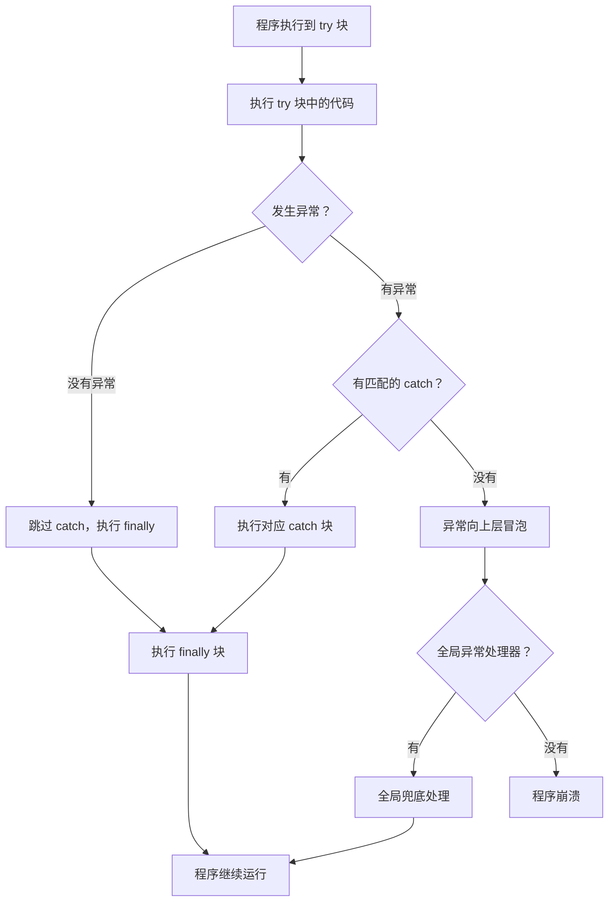

# 第 12 课：异常处理

## 为什么要学这个

你写了个程序，点运行，弹个错误框，程序闪退。然后你盯着屏幕上的报错信息发呆——"未将对象引用设置到对象的实例"，这八个字你都认识，但是合在一起就看不懂。

这种事每个写代码的人都经历过。程序不是神仙，它也会遇到意料之外的情况：文件不存在、网络断了、用户输入了一串乱码、内存不够了。这些问题不处理，程序就会直接崩溃。

异常处理就是给程序装一套"安全气囊"。撞上了不会直接报废，而是按照你预先写好的逻辑兜底——记录日志、提醒用户、或者静默跳过，总之程序还能继续跑。

说白了，你不是在写永远不会出错的代码——那不可能。你是在写"出错了也知道该怎么办"的代码。

## 什么是异常

异常（Exception）是程序运行时发生的错误。它不是编译错误——编译错误在你点"生成"的时候就会报，代码根本没跑起来。异常是代码跑起来了，跑到某一行，突然出问题了。

几个典型的场景：

- 读取一个不存在的文件，抛出 `FileNotFoundException`
- 访问数组下标越界，抛出 `IndexOutOfRangeException`
- 把 null 当成对象用，抛出 `NullReferenceException`
- 网络请求超时，抛出 `TimeoutException`

每种异常在 C# 里都是一个类，继承自 `System.Exception`。异常被"抛出"（throw）之后，会沿着调用栈一层层往上冒，直到被某个 `catch` 块兜住，或者一直冒到最顶层——程序崩溃。

## try-catch：最基本的兜底

C# 用 `try-catch` 结构处理异常。语法不复杂：

```csharp
try
{
    // 可能会出错的代码
}
catch
{
    // 出错后执行的代码
}
```

`try` 块里的代码一旦抛出异常，执行会立刻跳转到 `catch` 块，`try` 里剩下的代码不会再跑了。

举个实际例子。TubaTools 在启动时会尝试提权——因为有些硬件检测需要管理员权限。提权操作本身可能失败，但是不能因为提权失败就让整个程序崩溃。来看 `App.xaml.cs` 里的这段真实代码：

```csharp
private static void ElevateAndRestart()
{
    var exePath = Process.GetCurrentProcess().MainModule?.FileName;
    if (string.IsNullOrEmpty(exePath)) return;

    try
    {
        Process.Start(new ProcessStartInfo(exePath)
        {
            Verb = "runas",
            UseShellExecute = true
        });
    }
    catch
    {
        // 提权失败，静默忽略
    }
}
```

`Process.Start` 尝试以管理员身份重启自己。如果系统拒绝了（比如用户点了"否"）、或者进程信息获取失败，就会抛出异常。`catch` 块是空的——什么都不做。这不是偷懒，是故意的。提权是锦上添花，失败了程序继续跑就行，没必要弹错误框吓用户。

## 捕获特定异常

上面那个 `catch` 什么都没写，它兜住所有类型的异常。实际开发中，不同异常应该有不同的处理方式。比如：

- 文件不存在：提示用户，或者创建默认文件
- 网络超时：重试
- 空引用：这是代码 bug，应该记录日志然后优雅崩溃

C# 允许在 `catch` 后面指定异常类型：

```csharp
try
{
    string content = File.ReadAllText(@"C:\config.txt");
}
catch (FileNotFoundException)
{
    // 配置文件不存在，用默认配置
    Console.WriteLine("配置文件没找到，使用默认设置");
}
catch (UnauthorizedAccessException)
{
    // 没权限读文件
    Console.WriteLine("没有权限读取配置文件");
}
catch (Exception ex)
{
    // 其他没想到的错误，记录详细信息
    Console.WriteLine($"未知错误：{ex.Message}");
}
```

匹配规则是从上到下的。如果把 `catch (Exception ex)` 放在最前面，后面的 `catch` 永远不会执行——因为所有异常都继承自 `Exception`，第一个就全兜了。所以**把最具体的异常放前面，`Exception` 放最后兜底**。

## 异常对象的属性

`catch` 后面可以写 `(Exception ex)`，`ex` 就是被捕获的异常对象。它有这些常用属性：

| 属性 | 含义 |
|------|------|
| `Message` | 错误的文字描述 |
| `StackTrace` | 调用栈，显示错误发生的代码路径 |
| `InnerException` | 内部异常，一层套一层时用 |
| `Source` | 引发异常的应用程序或对象名称 |

开发阶段多打 `StackTrace`，生产环境打 `Message` 就够了——`StackTrace` 暴露内部代码结构，有安全风险。

## finally 块：无论如何都要执行

有些代码不管出不出错都必须跑。比如打开了一个文件流，最后要关掉；连接了数据库，最后要断开。写在 `finally` 里：

```csharp
FileStream stream = null;
try
{
    stream = File.OpenRead(@"C:\data.bin");
    // 处理文件...
}
catch (IOException ex)
{
    Console.WriteLine($"读文件失败：{ex.Message}");
}
finally
{
    stream?.Dispose();  // 不管是否异常，都要关闭文件流
}
```

`finally` 的规矩就一条：**不管 try 是否抛异常，不管 catch 是否捕获，finally 一定会执行**。就算你在 try 或 catch 里写了 `return`，`finally` 也会在 `return` 之前跑完。

来看 TubaTools 里一个用了 `finally` 的真实场景——首次启动向导：

```csharp
private static async Task RunStartupSequenceAsync()
{
    try
    {
        if (AppSettings.Get("SetupCompleted") == null)
        {
            await Task.Delay(500);

            if (MainWindow?.Content is FrameworkElement root)
            {
                var wizard = new SetupWizardDialog
                {
                    XamlRoot = root.XamlRoot,
                    RequestedTheme = ThemeService.CurrentElementTheme
                };
                await wizard.ShowAsync();
            }
        }
    }
    catch (Exception ex)
    {
        System.Diagnostics.Debug.WriteLine($"[Setup] Wizard failed: {ex.Message}");
    }
    finally
    {
        if (AppSettings.Get("SetupCompleted") == null)
            AppSettings.Set("SetupCompleted", true);
    }
    // ... 后续启动逻辑
}
```

这个逻辑有意思：弹一个首次设置向导。如果向导正常走完了，它会自己设 `SetupCompleted = true`。但如果向导崩了（catch），或者中间用户强行关了窗口，`finally` 保证 `SetupCompleted` 一定会被设为 `true`——挨过这一次，下次启动就不再弹了。这是一个很好的兜底思路：不能让一个异常导致用户每次启动都被卡住。

## 异常处理的两个极端

新手写异常处理容易走两个极端。

**极端一：完全不写 try-catch。**

代码崩了就崩了，反正我开发的时候能跑。等到了用户手上，文件路径不一样、权限不一样、系统环境不一样，到处崩。这是把调试的责任推给了用户。

**极端二：所有地方都套 try-catch。**

```csharp
// 这样写是灾难
try
{
    int a = 1;
    int b = 2;
    int c = a + b;
}
catch (Exception ex)
{
    Console.WriteLine(ex.Message);
}
```

上面这段代码不会抛异常，套 `try-catch` 完全是浪费。更糟的是，空的 `catch` 块把真正的 bug 也吞了，你永远不知道哪里出了问题。

一个好的经验法则：**只在"外部因素可能导致失败"的地方写 try-catch**。比如文件操作、网络请求、数据库连接、调用第三方库、用户输入解析。你自己写的纯计算逻辑（加减乘除、字符串拼接）不需要 try-catch——如果它们崩了，那说明代码有 bug，应该让它崩出来，然后修 bug。

## throw：重新抛出

有时候你捕获了异常，记录了日志，但是你觉得这个问题当前层级处理不了，需要让上层调用者知道。这时候用 `throw` 重新抛出去：

```csharp
try
{
    LoadSettingsFromFile();
}
catch (IOException ex)
{
    Logger.Log($"加载设置失败：{ex.Message}");
    throw;  // 重新抛出同一个异常
}
```

注意 `throw;` 和 `throw ex;` 的区别：

- `throw;` 保留原来的调用栈，上层看到的是原始错误位置
- `throw ex;` 重置调用栈，上层看到的是这一行抛出的——原始位置丢了

绝大多数情况用 `throw;`。除非你故意要用一个新异常包裹老异常（`throw new MyAppException("加载失败", ex)`），这时候老异常变成 `InnerException`，调用栈不会丢。

## 全局异常兜底

局部 `try-catch` 管的是某几行代码。但是如果异常从所有局部 `try-catch` 漏过去了——或者根本没人写 `try-catch`——它会一直冒到程序的最外层。这时候如果不处理，Windows 会弹一个"程序已停止工作"的框，然后进程死掉。

TubaTools 在 `App` 构造函数里注册了三个全局异常处理器，确保没有任何异常能"裸奔"到系统层面：

```csharp
public App()
{
    Environment.SetEnvironmentVariable("MICROSOFT_WINDOWSAPPRUNTIME_BASE_DIRECTORY",
        AppContext.BaseDirectory);
    InitializeComponent();
    BuiltinToolRegistry.RegisterDefaults();

    AppDomain.CurrentDomain.UnhandledException += OnUnhandledException;
    TaskScheduler.UnobservedTaskException += OnUnobservedTaskException;
    UnhandledException += OnWinUIUnhandledException;
}
```

三层防线，各管一摊：

- `AppDomain.CurrentDomain.UnhandledException` —— 兜住主线程和非 Task 的异步异常
- `TaskScheduler.UnobservedTaskException` —— 兜住被遗忘的 Task（fire-and-forget 那种，没人 await 也没人 catch）
- `UnhandledException`（WinUI 层面的）—— 兜住 XAML 渲染、数据绑定等 UI 线程异常

三个处理器的逻辑一样的：把异常存下来，然后导航到一个错误页面，告诉用户"出了点问题"，而不是直接闪退。

```csharp
private static Exception? _pendingException;

private void OnUnhandledException(object sender,
    System.UnhandledExceptionEventArgs e)
{
    _pendingException = e.ExceptionObject as Exception
        ?? new Exception(e.ExceptionObject?.ToString() ?? "未知错误");
    NavigateToErrorPage();
}

private void OnUnobservedTaskException(object? sender,
    UnobservedTaskExceptionEventArgs e)
{
    _pendingException = e.Exception;
    NavigateToErrorPage();
    e.SetObserved();  // 标记为"已处理"，避免进程被终止
}

private void OnWinUIUnhandledException(object sender,
    Microsoft.UI.Xaml.UnhandledExceptionEventArgs e)
{
    _pendingException = e.Exception ?? new Exception(e.Message);
    NavigateToErrorPage();
    e.Handled = true;  // 告诉框架：这个异常我处理了，别崩
}
```

注意 `e.SetObserved()` 和 `e.Handled = true` 这两行。如果不写，.NET 运行时会认为这个异常"没人管"，在某些情况下会强制终止进程。这两行相当于对运行时喊了一嗓子："知道了，我来兜底。"

错误页面怎么拿到异常信息？`ConsumePendingException` 方法——取走异常的同时清空字段，防止重复读取：

```csharp
public static Exception? ConsumePendingException()
{
    var ex = _pendingException;
    _pendingException = null;
    return ex;
}
```

这个全局兜底的设计思路值得记住：**永远不要假设局部 try-catch 已经覆盖了所有情况。在最外层再加一道防线，哪怕只是记录日志然后重启，也比悄无声息地崩溃强。**

## TubaTools 里的异常处理模式

梳理一下 `App.xaml.cs` 里其他几处异常处理的用法，能看到几种不同的策略。

### 策略一：静默吞掉

```csharp
// 静默更新检查失败——不打扰用户
private static async Task CheckForUpdateSilentAsync()
{
    try
    {
        var update = await UpdateService.CheckForUpdateAsync();
        if (update is null) return;
        // ... 弹更新提示
    }
    catch (Exception ex)
    {
        System.Diagnostics.Debug.WriteLine($"[Update] Silent check failed: {ex.Message}");
    }
}
```

检查更新是后台任务，失败了不应该弹错误框。用户正在正常工作，突然蹦一个"检查更新失败"的提示，体验很差。正确的做法是写一条调试日志，仅此而已。

### 策略二：吞掉但有日志

```csharp
// 工具包下载对话框失败
private static async Task ShowToolsBundleDownloadDialogAsync()
{
    try
    {
        if (MainWindow?.Content is FrameworkElement root)
        {
            var dialog = new ToolsBundleDownloadDialog
            {
                XamlRoot = root.XamlRoot,
                RequestedTheme = ThemeService.CurrentElementTheme
            };
            await dialog.ShowDownloadAsync();
        }
    }
    catch (Exception ex)
    {
        System.Diagnostics.Debug.WriteLine(
            $"[ToolsBundle] Download dialog failed: {ex.Message}");
    }
}
```

同样是静默处理，但留了日志。`Debug.WriteLine` 只在 Debug 模式下输出，Release 版本里这行代码会被编译器删掉。这是典型的"开发时我自己看，用户不需要知道"。

### 策略三：写日志然后放行

```csharp
try
{
    if (!ToolsBundleService.IsToolsBundleReady()) return;
    var currentVersion = ToolsBundleService.GetCurrentVersion();
    if (currentVersion is null) return;
    var info = await ToolsBundleService.CheckForToolsUpdateAsync();
    if (info is null || !info.HasUpdate) return;
    // ... 弹更新提示
}
catch (Exception ex)
{
    System.Diagnostics.Debug.WriteLine(
        $"[ToolsBundle] Update check failed: {ex.Message}");
}
```

这和策略二一样，但是 `try` 块里多处 `return` 提前退出。这些 `return` 不是异常，是正常的"条件不满足就走人"。真正的异常只有网络请求失败之类的，才进 `catch`。

## 异常处理的流程图



这个流程里最关键的一点是 `finally` 的位置：不管走哪条路径——正常执行、被 catch 捕获、还是向上冒泡——`finally` 一定会在离开 `try` 结构之前执行。唯一的例外是程序被 `Environment.FailFast` 直接杀掉，或者是进程被操作系统强杀，那种情况谁都救不了。

## 什么时候该抛异常，什么时候不该抛

你写的代码有时候是"被调用方"——你给别人提供方法，数据不对的时候你要不要抛异常？

一个简单的判断标准：**如果方法无法完成它名字里承诺的事，就抛异常。**

比如一个方法叫 `ReadConfigFile`。它承诺的是"读取配置文件"。如果文件不存在，它可以返回一个默认配置——这算是完成了承诺。但如果传入的文件路径是 null，它根本不知道读哪个文件，这就没办法完成承诺了，应该抛 `ArgumentNullException`。

反过来，不要用异常来控制正常业务流程。比如：

```csharp
// 错误示范——用异常做流程控制
try
{
    int value = int.Parse(input);
    Console.WriteLine(value * 2);
}
catch (FormatException)
{
    Console.WriteLine("请输入数字");
}
```

用户输入非数字是**可以预见的情况**，不应该走异常。应该用 `int.TryParse`：

```csharp
// 正确写法
if (int.TryParse(input, out int value))
{
    Console.WriteLine(value * 2);
}
else
{
    Console.WriteLine("请输入数字");
}
```

抛异常有性能开销——.NET 要收集调用栈、创建异常对象。把异常当 if-else 用，程序会变慢。

## using 语句：try-finally 的简写

前面提到文件流要手动关闭，代码是：

```csharp
FileStream stream = null;
try
{
    stream = File.OpenRead(@"C:\data.bin");
    // ...
}
finally
{
    stream?.Dispose();
}
```

这种模式太常见了。C# 提供了 `using` 语句作为语法糖：

```csharp
using (FileStream stream = File.OpenRead(@"C:\data.bin"))
{
    // 处理文件...
}
// 出了这个花括号，stream.Dispose() 自动被调用
```

`using` 就是 `try-finally` 加 `Dispose` 的缩写。任何实现了 `IDisposable` 接口的对象都能用 `using`。文件流、数据库连接、网络套接字都在这个范畴里。

新一点的 C# 版本还支持不用花括号的写法：

```csharp
using FileStream stream = File.OpenRead(@"C:\data.bin");
// 当前作用域结束时自动 Dispose
```

两种写法效果一样，选你喜欢的方式。但是要注意：如果用第二种（不带花括号），`Dispose` 是在变量所在作用域结束时调用，不是在那行代码之后立刻调用。如果作用域很大（比如整个方法），文件会一直开着，该用第一种。

## 小结

异常处理不是什么高深的技术。它就是程序员对自己代码的一种诚实态度——承认程序会遇到意料之外的情况，并且提前想好对策。

记住几个要点：

- 局部 try-catch 处理能预料到的失败（文件、网络、权限）
- `finally` 保证清理代码一定执行
- 全局异常处理器兜住漏网之鱼
- 不要用异常做正常流程控制
- 抛异常意味着"这件事我干不了"

TubaTools 的 `App.xaml.cs` 把这几条都用上了：局部 try-catch 保护启动流程，`finally` 确保设置标记一定写入，三个全局处理器覆盖不同异常来源。去读一遍源码，这些模式都在那里，清晰、克制。

---

## 小练习

### 第一题：填空

下面这段代码中，`finally` 块里的 `Console.WriteLine("结束")` 会不会被执行？

```csharp
try
{
    int x = 0;
    int y = 10 / x;
    Console.WriteLine("计算完成");
}
catch (DivideByZeroException)
{
    Console.WriteLine("除零错误");
    return;
}
finally
{
    Console.WriteLine("结束");
}
```

A. 会执行，因为 finally 始终执行  
B. 不会执行，因为 catch 里有 return  
C. 会执行，但只在 x 不为 0 时  
D. 编译错误

### 第二题：选择

以下哪种情况**不应该**使用异常处理？

A. 读取用户指定的文件路径，文件可能不存在  
B. 向远程服务器发送 HTTP 请求，网络可能断开  
C. 判断用户输入的字符串是否为空，为空则提示  
D. 解析 JSON 数据，数据格式可能错误

### 第三题：读代码

TubaTools 的 `App.xaml.cs` 里，`ElevateAndRestart` 方法的 `catch` 块是空的。这样写有什么风险？如果你是开发者，你会加至少一行什么代码来降低这个风险？

### 第四题：写代码

写一个方法 `SafeReadFile(string path)`，要求：

- 如果文件存在且可读，返回文件全部内容
- 如果文件不存在，返回字符串 `"文件不存在"`
- 如果文件存在但没权限读，返回字符串 `"没有读取权限"`
- 如果发生其他错误，返回 `"未知错误：{错误信息}"`
- 不管走哪条路径，在控制台输出一行 `"读取操作结束"`

---

## 练习答案

<details>
<summary>点击展开答案</summary>

### 第一题答案

A。`finally` 块始终执行，即使 `catch` 里有 `return`。在 `return` 真正退出方法之前，`finally` 会先跑完。运行结果：

```
除零错误
结束
```

### 第二题答案

C。判断字符串是否为空是正常的业务逻辑，应该用 `if (string.IsNullOrEmpty(input))` 处理，不应该走 try-catch 流程。A、B、D 都是外部因素导致的、无法在代码中完全控制的失败场景，用异常处理是合适的。

### 第三题答案

空 `catch` 的风险是：如果提权失败的原因是一个真正需要关注的错误（不只是用户点了"否"），这个错误会被完全吞掉，开发者永远不知道发生了什么。

至少加一行日志：

```csharp
catch (Exception ex)
{
    System.Diagnostics.Debug.WriteLine($"[Elevate] 提权失败: {ex.Message}");
}
```

这样在调试时能看到输出，而 Release 版本不会影响性能。

### 第四题答案

```csharp
static string SafeReadFile(string path)
{
    try
    {
        return File.ReadAllText(path);
    }
    catch (FileNotFoundException)
    {
        return "文件不存在";
    }
    catch (UnauthorizedAccessException)
    {
        return "没有读取权限";
    }
    catch (Exception ex)
    {
        return $"未知错误：{ex.Message}";
    }
    finally
    {
        Console.WriteLine("读取操作结束");
    }
}
```

</details>
