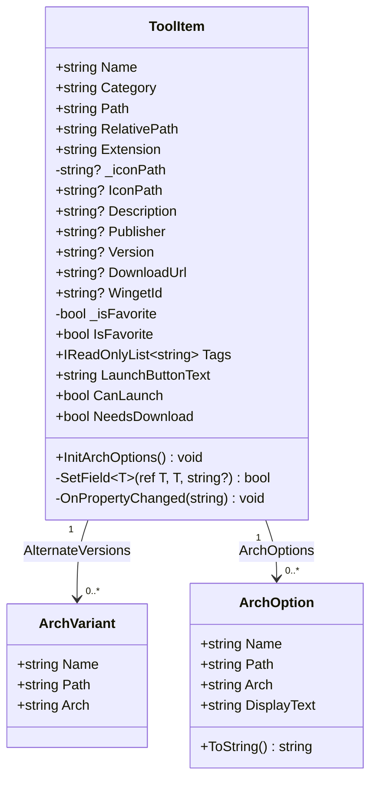

# 第 13 课：面向对象是什么

## 为什么要学这个

前 12 课你写了变量、写了循环、写了方法，但是你写的代码都堆在一个文件里，像一本没有目录的书。程序小的时候还行，程序大到几千行的时候，你改一个变量名要翻几十页。

我来给你看一组数字。TubaTools 这个项目里有一个文件叫 `ToolCatalog.cs`，697 行。还有一个 `HardwareInfoService.cs`，1810 行。如果把这些代码全部塞进一个 Program.cs，只会更糟——你要在一万行代码里找"收藏功能的逻辑写在哪"，改一个判断条件可能要同时在十几个地方修改相同的东西。

说白了，面向对象是一种"整理代码"的方式。它不神秘，不是什么高深理论。你用 Windows 的时候天天在跟"对象"打交道——桌面上的图标是对象，任务栏是对象，你双击打开的那个窗口也是对象。面向对象编程就是让你用同样的思路去组织代码：把数据和操作数据的方法捆在一起，变成一个一个的"东西"。

TubaTools 里有几百种工具，每种工具要有名字、路径、图标、标签，还要能运行、能收藏。如果不面向对象，你得用几十个数组来存这些信息，然后祈祷自己别把索引搞混。`ToolItem` 这个类就是把一个工具的所有信息和行为打包成一个整体——你创建一个 `ToolItem`，它自己就知道自己叫什么、在哪个文件夹、怎么启动。

## 现实世界里的"对象"

先别想代码。想一下你桌上的水杯。

这个水杯有**属性**：颜色（白色）、材质（陶瓷）、容量（350ml）、当前水量（半杯）。它也有**行为**：你可以倒水进去，可以喝水，可以把它摔碎。

在程序里，你也可以造一个"水杯对象"——给它起名叫 `cup`，设置它的 `Color = "白色"`，`Material = "陶瓷"`，然后调用 `cup.Drink()` 表示喝一口。

再换一个例子：你的手机。它有属性（品牌、型号、电量、存储空间），也有行为（打电话、发短信、拍照）。这比水杯更适合类比程序——手机的功能就是方法，手机里的数据就是属性。你按"拍照"按钮，手机内部要做一连串操作：打开相机、对焦、曝光、压缩、存文件。但是你不需要知道这些细节，你只需要按一个按钮。这就是面向对象的核心直觉：**把现实世界的事物映射到程序里，每个事物有自己的数据和行为，外部只需要知道它能做什么，不需要知道它怎么做。**

## 类（Class）和对象（Object）——蓝图和实物

"类"和"对象"是两个被说烂了的词，但是它们的区别其实一句话就能讲清楚：

**类是图纸，对象是按图纸造出来的实物。**

你有一张椅子的设计图——图纸上画了椅子的结构、尺寸、材料。这个图纸就是"类"。但是你没法坐在图纸上。你得找木匠按照图纸做一把椅子出来，这把能坐的椅子才是"对象"。一把椅子是一个对象，两把椅子是两个对象——它们都按同一张图纸造，但是是独立的两把椅子，你坐塌了一把不影响另一把。

程序员管"造对象"叫**实例化**（instantiation）。`new` 这个关键字就是"按图纸造一个"的意思：

```csharp
ToolItem cpuZ = new ToolItem
{
    Name = "CPU-Z",
    Category = "硬件检测",
    Path = @"C:\Tools\cpuz.exe",
    RelativePath = @"Tools\cpuz.exe",
    Extension = ".exe"
};
```

`ToolItem` 是图纸（类），`cpuZ` 是按图纸造出来的实物（对象）。你可以用同一张图纸造无数个对象：

```csharp
ToolItem hwinfo = new ToolItem { Name = "HWiNFO", Category = "硬件检测", Path = @"C:\Tools\hwinfo.exe", RelativePath = @"Tools\hwinfo.exe", Extension = ".exe" };
ToolItem gpuz   = new ToolItem { Name = "GPU-Z",   Category = "显卡工具",   Path = @"C:\Tools\gpuz.exe",   RelativePath = @"Tools\gpuz.exe",   Extension = ".exe" };
```

三个变量（`cpuZ`、`hwinfo`、`gpuz`）共用同一张图纸，但是每个变量指向的都是独立的实物，互不影响。你把 `cpuZ` 的 `IsFavorite` 设为 `true`，`gpuz` 的 `IsFavorite` 仍然是 `false`——它们是两个不同的东西。

## 属性——对象知道什么

对象的"数据"在 C# 里叫**属性**（Property）。属性回答了"这个对象是什么样子的"。

看 TubaTools 里 `ToolItem` 的属性定义——这是真实的源码，一字未改：

```csharp
public sealed class ToolItem : INotifyPropertyChanged
{
    public required string Name { get; init; }
    public required string Category { get; init; }
    public required string Path { get; init; }
    public required string RelativePath { get; init; }
    public required string Extension { get; init; }

    private string? _iconPath;
    public string? IconPath
    {
        get => _iconPath;
        set => SetField(ref _iconPath, value);
    }

    public string? Description { get; init; }
    public string? Publisher { get; init; }
    public string? Version { get; init; }
    public string? DownloadUrl { get; init; }
    public string? WingetId { get; init; }
    public IReadOnlyList<string> Tags { get; init; } = [];

    private bool _isFavorite;
    public bool IsFavorite
    {
        get => _isFavorite;
        set => SetField(ref _isFavorite, value);
    }
    // ... 还有更多
}
```

这里塞了好几个知识点，一个一个拆开讲。

**`public`** 表示这个属性可以从外部访问。你可以在别的代码里写 `cpuZ.Name` 来读它的名字。如果一个属性是 `private`，那只有这个类自己能用——外面碰不到。这种控制访问权限的机制是封装的基础。

**`required`** 表示创建对象时必须给这个属性赋值，不赋值编译器就报错。这是 C# 11 引入的特性。上面代码里 `Name`、`Category`、`Path`、`RelativePath`、`Extension` 五个属性都标了 `required`——意思是"你要创建一个工具对象，这五个信息必须填"。这样一来，你永远不用担心自己忘了设置这些关键字段，编译器会帮你盯着。

**`{ get; init; }`** 里的 `get` 是"读取"的意思，`init` 是"只能在创建对象时设置一次"的意思。一旦 `ToolItem` 创建好了，`Name` 就不能再改了——这很合理，一个工具的名字不该中途变化。相比之下，`IsFavorite`（是否收藏）用了 `get` 和 `set`，因为用户随时可能收藏或取消收藏。

**`string?`** 中的问号表示这个属性可以是 `null`（空值）。`Description` 可以为空——不是每个工具都有描述。但是 `Name` 没有问号，说明名字绝不能为空。`Tags` 没有问号，但它的默认值是 `[]`（空列表），所以即使你没填标签，它也不会是 null，只是一个空集合。

**`private string? _iconPath;`** ——这里出现了一个**字段**（field）。字段和属性有什么区别？简单说，字段是私有的存储空间，属性是公共的访问入口。外部代码通过 `IconPath` 属性来读写图标路径，但是实际数据存在 `_iconPath` 字段里。为什么要多此一层？因为属性可以在读写时执行额外逻辑——比如 `IconPath` 的 `set` 里调了 `SetField`，这个方法会通知 UI "图标变了，你刷新一下"。直接暴露字段做不到这点。

## 方法——对象能做什么

属性存数据，方法做事情。

`ToolItem` 里有一个 `InitArchOptions` 方法，做的事情颇为实用：

```csharp
public void InitArchOptions()
{
    ArchOptions.Clear();

    // 把主版本加入选项列表
    var primary = new ArchOption { Name = Name, Path = Path, Arch = PrimaryArch ?? "" };
    ArchOptions.Add(primary);

    // 把备选架构（x86/x64/ARM64）也加入
    foreach (var v in AlternateVersions)
    {
        ArchOptions.Add(new ArchOption { Name = v.Name, Path = v.Path, Arch = v.Arch });
    }

    // 根据当前 CPU 架构自动选最优版本
    var isArm64 = RuntimeInformation.ProcessArchitecture == Architecture.Arm64;
    var isX64 = Environment.Is64BitOperatingSystem && !isArm64;
    var preferred = ArchOptions.FirstOrDefault(a =>
        a.Arch.Equals("ARM64", StringComparison.OrdinalIgnoreCase) && isArm64)
        ?? ArchOptions.FirstOrDefault(a =>
            a.Arch.Equals("x64", StringComparison.OrdinalIgnoreCase) && isX64)
        ?? ArchOptions.FirstOrDefault(a =>
            a.Arch.Equals("x86", StringComparison.OrdinalIgnoreCase) && !Environment.Is64BitOperatingSystem)
        ?? primary;
    SelectedArch = preferred;
}
```

有些工具同时提供了 x86、x64、ARM64 三个版本的可执行文件。`InitArchOptions` 负责收集所有可用架构，然后根据你当前电脑的 CPU 类型自动选出最合适的那个。ARM64 的电脑优先选 ARM64 版本，x64 的电脑优先选 x64 版本，都没有就回退到默认。

这个方法有一个值得注意的特点——它不接收参数，也不返回值（`void`），它直接修改对象自己的属性（`ArchOptions`、`SelectedArch`）。这就是面向对象的方法风格：**方法操作的是"自己"的数据，一个对象自己管好自己的事。**

还有一种特殊的"方法"——计算属性。`ToolItem` 里的 `LaunchButtonText` 看上去像属性，实际上它内部跑了一段逻辑：

```csharp
public string LaunchButtonText
{
    get
    {
        if (!string.IsNullOrWhiteSpace(DownloadUrl))
            return "下载";
        if (!string.IsNullOrWhiteSpace(WingetId))
        {
            if (IsWingetInstalling) return "安装中...";
            return IsWingetInstalled ? "打开" : "下载";
        }
        if (!string.IsNullOrWhiteSpace(RemoteUrl) && !File.Exists(EffectivePath))
            return "下载";
        return "打开";
    }
}
```

`LaunchButtonText` 自己没有存任何数据——它读的是 `DownloadUrl`、`WingetId`、`IsWingetInstalled` 等其他属性，然后算出按钮上应该显示什么字。外面用 `cpuZ.LaunchButtonText` 跟用普通属性完全一样，不需要知道里面跑了多少行 if 判断。这种"看起来像属性，实际上在计算"的设计叫**计算属性**（computed property）。

## 封装——把门关上

面向对象有三条总被提起的原则：封装、继承、多态。这门课只讲封装——继承和多态留在后面的课里慢慢展开。

封装的意思是：**把数据和操作数据的方法绑在一起，同时限制外部对这些数据的直接访问。**

打个比方：你的手机里有电池、主板、摄像头、存储芯片，但是你不会直接伸手进去拨弄电路——你通过屏幕和按键来操作它。手机的外壳就是"封装"——它把复杂的内部实现遮住了，只给你几个安全的入口（触摸屏、按钮、充电口）。

`ToolItem` 的封装至少体现在三个地方：

**第一，属性的访问限制。** `Name` 有 `init` 而没有 `set`，意味着它只能在创建时设置一次。这防止了代码在运行过程中意外改掉工具名字。`Description` 和 `Publisher` 同样只有 `init`。哪些能改、哪些不能改，在类定义时就写得清清楚楚。

**第二，私有字段加公共属性。** `_iconPath` 是 `private` 的字段，外部代码不能直接碰它。你想改图标路径，必须走 `IconPath` 属性。而属性内部会调用 `SetField`——它不仅更新数据，还通知 UI 刷新。如果直接暴露 `_iconPath` 字段，别的地方改了它 UI 完全不知道，界面就跟数据对不上了。

**第三，`SetField` 方法本身是私有的。** 来看这个方法：

```csharp
private bool SetField<T>(ref T field, T value, [CallerMemberName] string? propertyName = null)
{
    if (EqualityComparer<T>.Default.Equals(field, value)) return false;
    field = value;
    PropertyChanged?.Invoke(this, new PropertyChangedEventArgs(propertyName));
    return true;
}
```

这个方法的意思是：如果新值和旧值一样，什么都不做（返回 `false`），避免不必要的 UI 刷新。如果不一样，更新字段，然后触发 `PropertyChanged` 事件通知 UI："这个属性的值变了，你该刷新了。" 使用方只需要写 `IsFavorite = true`，背后的相等性判断和事件触发全在 `SetField` 里自动完成。

如果将来有一天你需要改通知逻辑——比如加入日志记录——你只需要改 `SetField` 这一个方法。所有属性都通过它来设值，改一处，全类受益。这就是封装的实际价值：把变化关在一个小格子里。

## 类图——用图来看结构

下面这张 Mermaid 类图展示了 `ToolItem` 以及它关联的两个小类的结构。类图是面向对象设计里的通用语言，每个矩形分三格：第一格类名，第二格属性，第三格方法。`+` 表示 public，`-` 表示 private。



这里出现了三个类，而不是只有 `ToolItem` 一个。为什么要把"备选架构"和"架构选项"拆成独立的类？因为 `ArchVariant` 和 `ArchOption` 各自有独立的属性集合，把它们拆出去能让每个类的职责清晰。`ArchVariant` 只管"这个工具的 x64 版本存哪里"，`ArchOption` 在它的基础上增加了 `DisplayText` 属性用于 UI 显示。这种"一个大的对象包含多个小的对象"的结构，在面向对象里叫**组合**（composition）。

## TubaTools 里的面向对象全景

`ToolItem` 只是冰山一角。打开 TubaTools 源码你会发现满地都是类的影子：

- `App` 类：代表整个应用程序，继承自 `Application`，管启动流程
- `MainWindow` 类：代表主窗口，管导航和搜索
- `HardwareInfoService` 类：负责采集 CPU、内存、显卡、主板等硬件信息
- `ToolCatalog` 类：负责扫描 `Tools` 文件夹，把几百个工具的信息加载到内存
- `ThemeColors` 类：统一管理界面的所有颜色值
- `AppSettings` 类：负责读写配置文件，把用户的偏好设置持久化到磁盘
- `IBuiltinTool` 接口：定义内置工具的统一规范——每一个内置工具都要实现这个接口

每个类只管自己的一摊事。`ToolItem` 不需要知道窗口怎么导航，`MainWindow` 不需要知道硬件怎么检测，`AppSettings` 不需要知道工具有哪些字段。这种"各自管好自己"的分工方式，就是面向对象最大的实用价值。

如果不这样做——把几百种工具的信息、界面布局、硬件检测、配置读写全部塞进一个文件——这个文件会膨胀到上万行。改一个按钮的颜色可能会不小心改坏硬件检测的逻辑。面向对象通过"拆类"把这种耦合切断。代码不是靠注释来组织的，是靠类来组织的。

## 到目前为止你其实已经在用了

回顾第 5 课到第 12 课你写过的代码——`string` 是一个类，`List<T>` 是一个类，`Dictionary<K,V>` 是一个类。你调用 `list.Add()`、`dict.ContainsKey()`，这些都是对象的方法。你每次写 `new List<int>()` 就是在实例化一个对象。你早就在用面向对象了，只是你还不知道自己写的那种类长什么样。

从下一课开始，我们自己动手写类。第 13 课只是一个概念地图——让你知道自己在面向对象的哪条路上，前方有哪些路标。

---

## 小练习

### 1. 填空题

下面这段代码创建了一个 `ToolItem` 对象。请在空白处填上合适的词：

```csharp
ToolItem diskGenius = ____ ToolItem
{
    ____ = "DiskGenius",
    Category = "磁盘工具",
    Path = @"C:\Tools\DiskGenius.exe",
    RelativePath = @"Tools\DiskGenius.exe",
    Extension = ".exe"
};
```

### 2. 选择题

关于"类"和"对象"，以下哪句话是错的？

A. 类是图纸，对象是按图纸造出的实物  
B. 一个类只能创建一个对象  
C. 用 `new` 关键字可以创建对象  
D. 同一个类的不同对象之间互不影响

### 3. 简答题

`ToolItem` 中 `Name` 属性声明为：

```csharp
public required string Name { get; init; }
```

分别解释 `public`、`required` 和 `{ get; init; }` 的含义。如果你把 `init` 改成 `set`，会有什么不同？

### 4. 代码补全题

下面定义了一个"水杯"类的开头，请补全属性和一个方法：

```csharp
public class Cup
{
    // 补全：颜色属性（字符串，可读写）

    // 补全：容量属性（整数，只能在创建对象时设置）

    // 补全：Drink 方法（无参数，无返回值，功能是打印 "喝了一口水"）
}
```

### 5. 概念辨析题

下面哪段描述更符合封装的理念？为什么？

A. 把所有属性的访问权限都设为 `public`，方便外部直接读写  
B. 把字段设为 `private`，通过方法或属性来控制外部对数据的访问

---

## 练习答案

<details>
<summary>点击展开答案</summary>

**第 1 题：**

```csharp
ToolItem diskGenius = new ToolItem
{
    Name = "DiskGenius",
    Category = "磁盘工具",
    Path = @"C:\Tools\DiskGenius.exe",
    RelativePath = @"Tools\DiskGenius.exe",
    Extension = ".exe"
};
```

第一个空填 `new`（实例化关键字），第二个空填 `Name`（required 属性必须在对象初始化时赋值）。

**第 2 题：** B。一个类可以创建无数个对象，就像一张图纸可以造无数把椅子。

**第 3 题：**

- `public`：外部代码可以访问这个属性，不受限制。
- `required`：创建 `ToolItem` 对象时必须给 `Name` 赋值，不赋值编译器会报错。
- `{ get; init; }`：`get` 表示可以读取，`init` 表示只能在对象初始化时设置一次（通过构造器或对象初始化器），之后不可修改。

如果把 `init` 改成 `set`，那么 `Name` 在对象创建之后仍然可以随时修改。对于工具名称这种不应中途变化的数据，用 `init` 更安全。

**第 4 题：**

```csharp
public class Cup
{
    public string Color { get; set; }         // 可读写
    public int Capacity { get; init; }        // 只能在创建时设置

    public void Drink()
    {
        Console.WriteLine("喝了一口水");
    }
}
```

**第 5 题：** B。

封装的核心是把数据藏起来（`private`），对外只暴露受控的访问入口。A 方案把所有数据直接暴露给外部，任何代码都能随意修改，一旦数据出问题很难排查是谁改的。B 方案让外部通过方法或属性来访问数据，类内部可以在访问入口处加入验证逻辑、日志记录、或者额外的副作用控制（比如 `SetField` 里的 UI 通知）。
</details>
