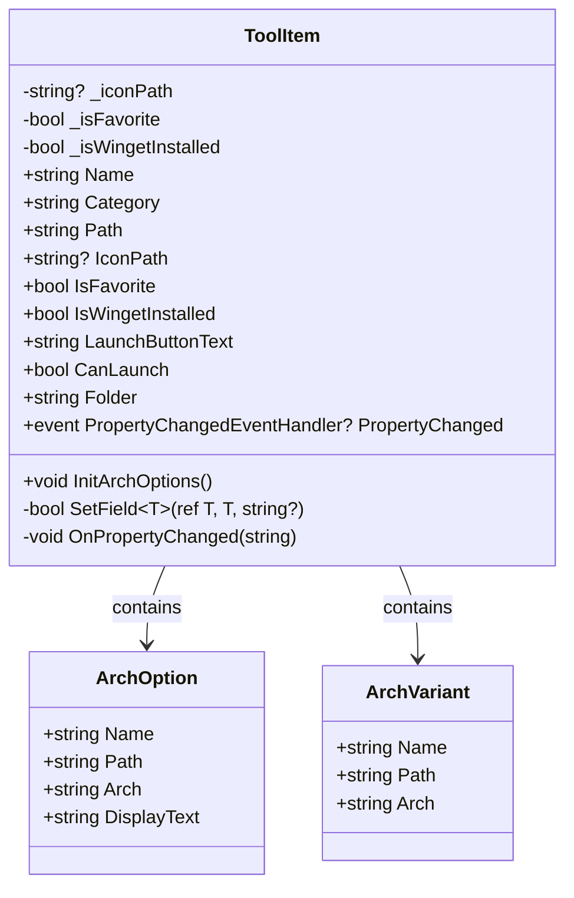

# 第 14 课：类与对象

## 为什么要学这个

上节课说了，类是图纸，对象是按图纸造出来的实物。这个比喻说完了，现在要回答一个更实际的问题：图纸上到底画了什么？你打开 `ToolItem.cs` 这个文件，里面 213 行代码，每行都在干什么？

我见过不少初学者卡在这里——他们理解了"万物皆对象"的哲学，但是看到真实的类文件就懵了：`get`、`set`、`=>`、`private`、`sealed`、`INotifyPropertyChanged`……一连串这辈子没见过的符号堆在一起，想硬读又读不进去。

这一课就把这个类拆开，一行一行讲清楚。你读完就知道一个 C# 类到底由哪些零件组成，每个零件是干什么用的。

## 类的基本结构

先说个整体印象。打开任何一个 `.cs` 源文件，一个类长这样：

```csharp
namespace 某个命名空间;

public class 类名
{
    // 字段 — 内部存储的数据
    // 属性 — 对外暴露的数据
    // 构造函数 — 创建对象时自动执行
    // 方法 — 对象能做的事
    // 事件 — 对象发出的通知
}
```

这五个零件不是每种类都全有。简单的类可能只有字段和属性。复杂的类（比如 `ToolItem`）五个零件都用上了。下面一个一个讲。

## 字段：对象肚子里的数据

字段就是变量，只不过它长在类的身体里，不属于任何一个方法。你可以理解为"对象的内部存储柜"——外面的人不能直接翻，只能通过规定的途径访问。

```csharp
public class ToolItem
{
    private string? _iconPath;      // 字段：存图标路径
    private bool _isFavorite;       // 字段：存收藏状态
    private bool _isWingetInstalled; // 字段：存 Winget 安装状态
}
```

这里面有三件事要注意。

第一，`private` 的意思是"这是私房钱，类外面的人不准碰"。你写 `toolItem._iconPath` 会直接报编译错误。这不是 C# 在刁难你，而是在保护你——如果外面谁都能改 `_isWingetInstalled`，哪天这个值被改了，界面上按钮文字不会跟着变，你排查 Bug 要查一下午。

第二，变量名前面有下划线 `_`。这不是语法要求，是 C# 程序员之间约定俗成的规矩：`_` 开头的变量是私有字段，跟属性、局部变量区分开。你对着别人的代码 `_totalCount` 不用翻定义，一眼就知道这是个私有字段。

第三，`string?` 后面的问号表示"这个字段可以是 null"。C# 有个叫 Nullable 的特性，编译器会帮你检查你忘了判空的地方。`_iconPath` 可以是 `null` 因为你可能根本没给工具设置图标路径。

字段平时不怎么干活，就是负责"记住"一个值。真正干活的是属性。

## 属性：字段的"门禁系统"

字段是存数据的柜子，属性是柜子上的门。你开门的时候可以验身份（get），关门的时候可以记日志（set）。

```csharp
private string? _iconPath;
public string? IconPath
{
    get => _iconPath;           // 别人读 IconPath 时，把 _iconPath 的值给出去
    set => SetField(ref _iconPath, value); // 别人写 IconPath 时，调用 SetField
}
```

`get` 和 `set` 叫"访问器"（accessor）。没有它们，你只能写又臭又长的 `GetSomething()` 和 `SetSomething()` 方法。有了属性，外面用起来跟普通变量一样自然：

```csharp
toolItem.IconPath = "/Assets/cpuz.ico";  // 看起来像赋值，实际上调了 set 访问器
string icon = toolItem.IconPath;          // 看起来像读变量，实际上调了 get 访问器
```

但是事情没那么简单。注意上面 `set => SetField(ref _iconPath, value);` 这一行——它没有直接写 `_iconPath = value`，而是绕了个弯调了 `SetField`。为什么？

因为 `ToolItem` 实现了 `INotifyPropertyChanged` 接口。这个接口要求：当属性的值发生变化时，类必须通知外界"我变了"。怎么通知？在 `SetField` 方法里触发一个事件：

```csharp
private bool SetField<T>(ref T field, T value, [CallerMemberName] string? propertyName = null)
{
    if (EqualityComparer<T>.Default.Equals(field, value)) return false;  // 值没变，不通知
    field = value;
    PropertyChanged?.Invoke(this, new PropertyChangedEventArgs(propertyName)); // 通知UI
    return true;
}
```

这段逻辑很简单：新值跟旧值一样就什么都不做，不一样就更新字段并通知所有人。WinUI 3 的界面绑定就是靠这个机制——你改了 `IsFavorite`，属性通知飞到 UI 层，按钮自动变色。

你不需要现在就完全理解 `INotifyPropertyChanged`。先记住一件事：**属性不是简单的 get/set，它可以在读写时执行任意逻辑**。这就是属性比字段更强大的地方。

## 属性的几种写法

`ToolItem` 里有三种属性写法，值得对比一下。

**写法一：自动属性（最简）**

```csharp
public required string Name { get; init; }
```

连背後的字段都不用写，编译器帮你生成。`required` 表示创建对象时必须赋值。`init` 表示只能在对象初始化时设置，之后只读。这样做是为了保证 `Name` 一旦设好就不会被意外修改——一个工具的名字不应该半路被人改掉。

**写法二：计算属性（只有 get，没有 set）**

```csharp
public string LaunchButtonText
{
    get
    {
        if (!string.IsNullOrWhiteSpace(DownloadUrl))
            return "下载";
        if (!string.IsNullOrWhiteSpace(WingetId))
        {
            if (IsWingetInstalling) return "安装中...";
            return IsWingetInstalled ? "打开" : "下载";
        }
        if (!string.IsNullOrWhiteSpace(RemoteUrl) && !File.Exists(EffectivePath))
            return "下载";
        return "打开";
    }
}
```

这个属性没有背后的字段，它的值是"算"出来的。而且它依赖别的属性的值（`IsWingetInstalling`、`IsWingetInstalled`、`DownloadUrl` 等）。计算属性的好处是：你永远不用手动同步值。只要那些依赖的属性变了，下次读 `LaunchButtonText` 时它自己会重新算。

**写法三：表达式体属性（单行属性）**

```csharp
public string Folder => System.IO.Path.GetDirectoryName(RelativePath) ?? Category;
public bool CanLaunch => !IsWingetInstalling;
```

`=>` 是 C# 的一个语法糖，等价于 `{ get { return ...; } }`。它只适用于 getter 是单行表达式的情况。`ToolItem` 里大量使用这种写法因为很多属性就是这样简单——读一个属性，等于返回另一个属性经过简单运算的结果。

三种写法没有优劣之分，什么时候用哪种取决于你需要什么。不需要 set 就用计算属性，set 很简单就自动属性，set 要复杂逻辑才用完整属性。

## 方法：对象的行为

属性是"这个对象有什么"，方法是"这个对象能干什么"。`ToolItem` 只有一个方法（除了基础设施的 `SetField` 和 `OnPropertyChanged`）：

```csharp
public void InitArchOptions()
{
    ArchOptions.Clear();
    var primary = new ArchOption { Name = Name, Path = Path, Arch = PrimaryArch ?? "" };
    ArchOptions.Add(primary);
    foreach (var v in AlternateVersions)
    {
        ArchOptions.Add(new ArchOption { Name = v.Name, Path = v.Path, Arch = v.Arch });
    }
    // 根据当前系统架构自动选最合适的版本
    var isArm64 = RuntimeInformation.ProcessArchitecture == Architecture.Arm64;
    var isX64 = Environment.Is64BitOperatingSystem && !isArm64;
    var preferred = ArchOptions.FirstOrDefault(a =>
        a.Arch.Equals("ARM64", StringComparison.OrdinalIgnoreCase) && isArm64)
        ?? ArchOptions.FirstOrDefault(a =>
            a.Arch.Equals("x64", StringComparison.OrdinalIgnoreCase) && isX64)
        ?? ArchOptions.FirstOrDefault(a =>
            a.Arch.Equals("x86", StringComparison.OrdinalIgnoreCase) && !Environment.Is64BitOperatingSystem)
        ?? primary;
    SelectedArch = preferred;
}
```

这个方法大概做件事：有些工具有多个架构版本（比如 ARM64 版和 x64 版），`InitArchOptions` 负责检测当前系统是什么架构，然后自动挑最合适的版本。你可能会问：为什么不在构造函数里自动做这件事？

因为 `AlternateVersions` 这个属性是对象创建之后才填充的，构造函数执行的时候它还是空的。所以只能放一个 `InitArchOptions()` 方法，等数据准备好了再由外面的代码手动调用。这是很常见的模式——不是所有初始化逻辑都能塞进构造函数。

## 构造函数哪去了？

你可能会注意到 `ToolItem` 里没有写构造函数。因为 C# 自动给没有构造函数的类生成一个无参构造函数。加上 C# 的 `required` 关键字和对象初始化器语法，你不需要自己写构造函数：

```csharp
var tool = new ToolItem
{
    Name = "CPU-Z",
    Category = "硬件检测",
    Path = @"C:\Tools\cpuz.exe",
    RelativePath = @"Tools\cpuz.exe",
    Extension = ".exe"
};
```

这种写法叫"对象初始化器"（object initializer）。大括号里不是方法调用，而是直接给属性赋值。编译器在底层会先调用无参构造函数，再按你的大括号内容逐个给属性赋值。

但是，这句话不能说死：有 `required` 属性就必须用对象初始化器赋值才给过，不加 `required` 的话你可以分多次赋值。`ToolItem` 选择 `required` 的设计意图很明确——Name、Category、Path 这些属性没有默认值，必须在创建对象的时候就给清楚，否则对象处于半残状态。

## Mermaid：ToolItem 的类图

下面这张图把 `ToolItem` 的结构画了出来。你可以看到哪些是字段（私有存储）、哪些是属性（公开接口）、哪些是只读的计算属性。



`-` 表示私有（private），`+` 表示公开（public）。你可以看到 `ToolItem` 的私有部分很少（只有几个字段和两个辅助方法），大部分都是公开属性。这个比例是刻意设计的——类越封装得好，对外暴露的东西越少，内部实现越自由。

## 小类也是类：ArchOption 和 ArchVariant

`ToolItem.cs` 文件底部还定义了两个小类：

```csharp
public sealed class ArchVariant
{
    public required string Name { get; init; }
    public required string Path { get; init; }
    public required string Arch { get; init; }
}

public sealed class ArchOption
{
    public required string Name { get; init; }
    public required string Path { get; init; }
    public required string Arch { get; init; }

    public string DisplayText => string.IsNullOrEmpty(Arch) ? "默认" : Arch;

    public override string ToString() => DisplayText;
}
```

这两个类就是纯数据容器。所有属性都是 `required` + `init`，意味着它们是"创建时赋值、之后只读"。这种类在 C# 里有个专门的叫法：不可变类型（immutable type）。好处是线程安全、不容易出 Bug、方便在集合里比较。

`ArchOption` 比 `ArchVariant` 多了一个计算属性 `DisplayText` 和重写的 `ToString()`。一个架构选项在界面上要显示给用户看，`DisplayText` 就是这个用途。`ToString()` 的重写让它在 ComboBox 之类的控件里能正确显示文本。

## 一个类 = 数据 + 行为 + 通知

回到最初的问题：`ToolItem` 这个类到底在干什么？

用一句话说：它把一个工具的**所有数据**（名字、路径、图标、标签）、**所有状态**（是否收藏、是否安装中）、**所有行为**（初始化架构选项）、和**所有通知**（属性变了通知 UI）打包成了一个整体。

这就是面向对象的核心价值——不是让你写更少的代码，而是让你把相关的代码放在一起，把不相关的代码隔开。你修改收藏功能只需要看 `IsFavorite` 这一个属性和它背后的 `SetField` 机制，不需要在几千行代码里大海捞针。

## 小练习

**练习 1：读属性**

看下面这段代码，写出每个属性的值是走 `get` 算出来的还是直接从字段读的：

```csharp
public class Student
{
    private int _score;
    public int Score
    {
        get => _score;
        set => _score = value;
    }
    public string Grade => _score >= 60 ? "及格" : "不及格";
    public bool HasPassed => _score >= 60;
}
```

（提示：哪个属性有背后的字段？哪个属性是纯计算？）

**练习 2：补全类**

下面是一个不完整的 `Book` 类。补全缺失的部分，要求：
- `Title` 和 `Author` 必须在创建时赋值，之后不能改
- `Price` 可以随时修改
- `IsExpensive` 是一个只读的计算属性，价格大于 100 为 true

```csharp
public class Book
{
    // 在这里补全属性
}
```

**练习 3：分析 ToolItem 的属性通知链**

在 `ToolItem` 中，`IsWingetInstalled` 属性的 setter 里调用了 `OnPropertyChanged(nameof(LaunchButtonText))`。请问：为什么修改 `IsWingetInstalled` 要通知 `LaunchButtonText` 变了？如果去掉这一行，运行时会发生什么？

**练习 4：手写一个类**

用本课学到的内容，写一个 `Battery` 类，要求包含：
- 一个字段 `_level`（int，范围 0-100）
- 一个属性 `Level`，读写都要走访问器
- 一个计算属性 `Status`：Level >= 20 返回 "正常"，否则返回 "低电量"
- 一个方法 `Charge(int amount)`，每次增加 amount 电量（不超 100）

---

## 练习答案

**练习 1**

- `Score` 的 get 从 `_score` 字段读，set 写 `_score` 字段
- `Grade` 是纯计算属性，每次读都根据 `_score` 重新算
- `HasPassed` 也是纯计算属性

**练习 2**

```csharp
public class Book
{
    public required string Title { get; init; }
    public required string Author { get; init; }
    public decimal Price { get; set; }
    public bool IsExpensive => Price > 100m;
}
```

**练习 3**

因为 `LaunchButtonText` 依赖 `IsWingetInstalled` 的值（它的 getter 里写了一个 if 判断 `IsWingetInstalled`）。如果不手动通知 `LaunchButtonText` 变了，绑定到界面的按钮文字不会自动更新——UI 层不知道 `LaunchButtonText` 应该重新计算。这是 `INotifyPropertyChanged` 机制中的一个常见坑点：计算属性不会自动感知依赖属性的变化，必须由依赖属性的 setter 主动通知。

**练习 4**

```csharp
public class Battery
{
    private int _level;

    public int Level
    {
        get => _level;
        set
        {
            if (value < 0)
                _level = 0;
            else if (value > 100)
                _level = 100;
            else
                _level = value;
        }
    }

    public string Status => _level >= 20 ? "正常" : "低电量";

    public void Charge(int amount)
    {
        Level += amount;
    }
}
```
