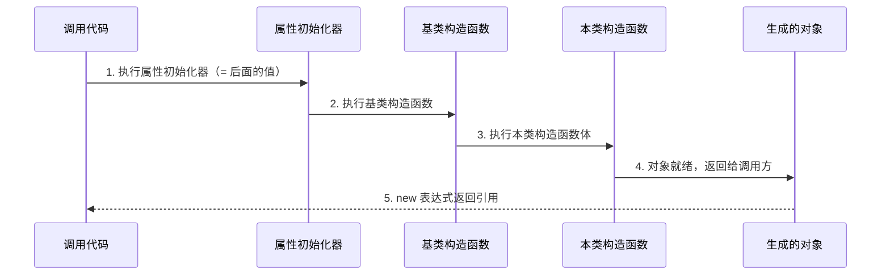

# 第15课：构造函数与初始化

上一课我们讲了类和对象。类是一个模板，对象是按模板造出来的实例。但你有没有想过：对象刚"出生"的时候是什么样的？它的属性是空的还是默认值？谁来给它做"出厂设置"？

这就是本课要讲的：构造函数和初始化。

---

## 1. 什么是构造函数

构造函数（Constructor）是一个特殊方法。它没有返回值类型声明，名字和类名完全一样。当你写 `new ClassName()` 的时候，C# 运行时会自动调用它。

一个最简单的构造函数长这样：

```csharp
public class Person
{
    public string Name;

    // 这就是构造函数
    public Person()
    {
        Name = "匿名";
    }
}
```

当你 `new Person()` 时，`Name` 自动被设为 `"匿名"`。

构造函数的几个规矩：

- 名字必须和类名一模一样（大小写也一模一样）
- 没有返回值类型，连 `void` 都不能写
- 可以带参数，也可以不带
- 一个类可以有多个构造函数（这叫"重载"）
- 如果不写任何构造函数，C# 编译器会悄悄给你加一个空的（无参数、什么都不做的）

最后一条很重要。很多初学者奇怪"我没写构造函数，为什么还能 `new`？"——因为编译器给你补了一个。但一旦你手写了任意一个构造函数，编译器就不再帮你补了。

---

## 2. 构造函数有什么用

三个核心用途：

### 2.1 给属性设默认值

对象创建出来，总不能属性全是 null 或 0。构造函数给它们一个合理的起点。

### 2.2 接收参数，定制对象

比如你可以写 `new Person("张三", 25)`，在创建的时候就给定名字和年龄，而不是创建完再一行一行赋值。

### 2.3 执行必要的初始化逻辑

比如打开文件、建立网络连接、注册事件监听器。这些东西不放在构造函数里，放到一个普通的 `Init()` 方法里也行，但构造函数的好处是：调用方不会忘记。构造函数是强制执行的——你 `new` 了就一定会跑。

---

## 3. 参数化构造函数

带参数的构造函数是最常见的模式。拿 TubaTools 源码中的一个真实例子来看：

```csharp
// 来自 Pages/HardwareDetailPage.xaml.cs
private sealed class DetailSection
{
    public string Title { get; }
    public List<HardwareInfoItem> Items { get; }
    public int Weight { get; }

    public DetailSection(string title, List<HardwareInfoItem> items, int weight)
    {
        Title = title;
        Items = items;
        Weight = weight;
    }
}
```

这个 `DetailSection` 类有三个只读属性。注意属性只有 `get;` 没有 `set;`——这意味着对象创建完之后，这些属性就不能再改了。要赋值只能通过构造函数。

这种模式叫"不可变对象"，好处是安全。你拿到一个 `DetailSection` 对象就知道它里面的数据绝对不会中途被人改掉。很多优秀的 C# 代码都倾向用这种方式。

再看一个例子，TubaTools 的 Compatible 版本中：

```csharp
// 来自 TubaWinUi3.Compatible/Models/ToolItem.cs
public ToolItem()
{
    Name = "";
    Category = "";
    Path = "";
    RelativePath = "";
    Extension = "";
}
```

这个无参构造函数把五个字符串属性都初始化为空字符串。为什么不用 `null`？因为后续代码会直接对这些字符串调用方法（比如 `.Length`、`.Contains()`），如果留着 null，调用时就会抛出 `NullReferenceException`。提前设成空字符串，省去了到处写 `?.` 的麻烦。

---

## 4. 构造函数重载

一个类可以有多个构造函数，参数列表不同就行。这种技术叫"重载"（Overloading）。

```csharp
public class Product
{
    public string Name;
    public decimal Price;
    public string Category;

    // 无参构造：全给默认值
    public Product()
    {
        Name = "未命名";
        Price = 0;
        Category = "未分类";
    }

    // 只给名字
    public Product(string name)
    {
        Name = name;
        Price = 0;
        Category = "未分类";
    }

    // 全给
    public Product(string name, decimal price, string category)
    {
        Name = name;
        Price = price;
        Category = category;
    }
}
```

三个构造函数，参数个数不同。`new Product()`、`new Product("鼠标")`、`new Product("鼠标", 99.9m, "外设")` 三种写法都合法。C# 根据你传的参数数量和类型，自动选对的那个。

重载有一个痛点：代码重复。上面三个构造函数里，赋默认值的逻辑写了三遍。C# 提供了一个解决方式——构造函数链式调用。

### 4.1 用 this 调用另一个构造函数

```csharp
public class Product
{
    public string Name;
    public decimal Price;
    public string Category;

    // 全参构造是"最底层"的，真正干活
    public Product(string name, decimal price, string category)
    {
        Name = name;
        Price = price;
        Category = category;
    }

    // 调用上面的
    public Product(string name) : this(name, 0, "未分类")
    {
    }

    // 再调用上面的
    public Product() : this("未命名")
    {
    }
}
```

`: this(...)` 的意思是："先调用参数匹配的那个构造函数，执行完了再回到我这里"。

链式调用让初始化逻辑只有一份，改起来不用到处改。

---

## 5. 无参构造函数 vs 属性初始化器

在 C# 里，给属性设默认值有两种常见写法。TubaTools 的源码两种都用到了。

### 写法一：属性初始化器

```csharp
// 来自 Models/ToolItem.cs
public IReadOnlyList<string> Tags { get; init; } = [];
public IReadOnlyList<ArchVariant> AlternateVersions { get; init; } = [];
public ObservableCollection<ArchOption> ArchOptions { get; } = [];
```

`= []` 就是属性初始化器。它在构造函数执行之前运行——准确地说，是编译成构造函数的最开头。

### 写法二：构造函数内赋值

```csharp
public ToolItem()
{
    Name = "";
    Category = "";
    Path = "";
    RelativePath = "";
    Extension = "";
}
```

哪种好？没有绝对答案。我个人喜欢简单的默认值用属性初始化器，因为眼睛扫一眼就知道默认值是什么，不用跳到构造函数去找。如果初始化有逻辑——比如要根据某种条件判断给什么值——那放构造函数里更合适。

---

## 6. 现代 C# 的 required 与 init

看 TubaTools 主线版本的 `ToolItem.cs`：

```csharp
public sealed class ToolItem : INotifyPropertyChanged
{
    public required string Name { get; init; }
    public required string Category { get; init; }
    public required string Path { get; init; }
    public required string RelativePath { get; init; }
    public required string Extension { get; init; }
    // ...
}
```

注意几个东西：

- `required`：强制要求创建对象时给这个属性赋值。不赋值编译器直接报错。
- `init`：属性只能在对象初始化时赋值一次，之后只读。
- 这个类没有写任何构造函数。

那怎么创建对象？用对象初始化器：

```csharp
var tool = new ToolItem
{
    Name = "GPU-Z",
    Category = "显卡工具",
    Path = @"C:\Tools\GPU-Z.exe",
    RelativePath = @"显卡工具\GPU-Z.exe",
    Extension = ".exe"
};
```

`required` + `init` 的组合是 C# 9.0 以后推崇的模式。它避免了写一堆构造函数的麻烦，同时保证了必填属性不被遗漏。

再看 `HardwareInfoItem.cs`：

```csharp
public sealed class HardwareInfoItem
{
    public required string Label { get; init; }
    public required string Value { get; set; }
    public string? BrandKey { get; set; }
    public bool IsVerified { get; set; }
}
```

`Label` 是 `required` + `init`，创建时必须给值且之后只读。`Value` 是 `required` + `set`，创建时必须给但之后可以改。`BrandKey` 和 `IsVerified` 是可选的，不给就默认 null 和 false。

这种设计精确地表达了意图：每个硬件信息项必须有标签和值，但品牌信息和验证状态是后来可能补充的。

---

## 7. Mermaid 图表：构造函数的执行顺序



这个顺序很多人搞反。他们以为构造函数体先执行，然后才跑属性初始化器。实际上属性初始化器最先运行。这意味着：

```csharp
public class Demo
{
    public int Value { get; set; } = 10;  // 先执行

    public Demo()
    {
        Value = 20;  // 后执行，覆盖上面的 10
    }
}
```

`new Demo().Value` 的结果是 20，不是 10。

---

## 8. 真实场景：App.xaml.cs 的构造函数

TubaTools 真正的启动入口，构造函数里做了大量初始化：

```csharp
// 来自 App.xaml.cs
public App()
{
    Environment.SetEnvironmentVariable(
        "MICROSOFT_WINDOWSAPPRUNTIME_BASE_DIRECTORY",
        AppContext.BaseDirectory);
    InitializeComponent();
    BuiltinToolRegistry.RegisterDefaults();

    AppDomain.CurrentDomain.UnhandledException += OnUnhandledException;
    TaskScheduler.UnobservedTaskException += OnUnobservedTaskException;
    UnhandledException += OnWinUIUnhandledException;
}
```

逐行看：

1. 设置环境变量——告诉 WinUI 运行时它的基础目录在哪
2. `InitializeComponent()`——加载 XAML 定义的界面。这个方法不是手写的，是编译时从 `App.xaml` 自动生成的
3. `BuiltinToolRegistry.RegisterDefaults()`——把内置工具注册到系统中
4. 三行 `+=`——注册全局异常处理。任何地方出现未捕获的异常，都会跑到这里定义的方法去

这个构造函数做的事情有设定运行时环境、加载界面、注册业务组件、绑定异常处理。全是"准备工作"——当 `App` 对象创建完成时，整个应用的基础设施已经就绪。

有两点值得注意：

- 这里没有任何 `await`。构造函数不能是 async 的。所以异步初始化被放到了后面 `OnLaunched` 方法里（你会在第 19 课学到 async/await）
- 异常处理用 `+=` 而不是 `=`，是追加而非替换——防止覆盖已有的处理器

---

## 9. 构造函数不能做什么

初学者容易踩的坑：

### 9.1 不能是 async

构造函数没有 `async` 版本。如果你需要在对象创建时做异步操作（比如从网络加载数据），只能用一个折中方案：

```csharp
// 常见模式：静态工厂方法
public static async Task<MyClass> CreateAsync()
{
    var obj = new MyClass();
    await obj.LoadDataAsync();
    return obj;
}
```

### 9.2 不能返回 null 或表示失败

构造函数只能返回它所属类型的对象，或者抛出异常。你不能在构造函数里 `return null`。如果初始化可能失败，你有两个选择：

- 抛异常（适合"这种情况绝对不该发生"的场景）
- 不用构造函数，改用工厂方法或 Try 模式

### 9.3 尽量不要做太多事

如果构造函数里写了 100 行代码，包括读文件、发网络请求、解析 JSON，那你每次写单元测试时都会头疼——光是 `new` 一个对象就得准备一堆东西。构造函数应该轻量，只做把对象推到"可用状态"的最小工作。

---

## 10. 小结

构造函数就是对象的"出生程序"。你定义它怎么诞生，C# 保证每次 `new` 的时候都按你说的来。

本课讲了：

- 构造函数是什么、怎么写
- 参数化构造函数——在创建对象时就把数据传进去
- 重载——一个类可以有多个构造函数
- 构造函数链式调用 `: this(...)`——减少重复代码
- 属性初始化器 `= 值`——比构造函数更早执行的默认值
- `required` + `init`——现代 C# 的"必填属性"模式
- TubaTools 真实代码中的三种初始化方式：参数化构造（DetailSection）、无参构造（Compatible ToolItem）、required+init（主线 ToolItem、HardwareInfoItem）

下一课我们讲接口与继承——类不只可以定义对象长什么样，还能定义"契约"，让不同的类遵守同样的规矩。

---

## 小练习

### 练习 1：填空题

```csharp
public class Book
{
    public string Title;
    public int Pages;

    // 补全构造函数，使 Title 默认 "未知"，Pages 默认 0
    public Book()
    {
        Title = "未知";
        Pages = ____;
    }

    // 补全这个：只接收书名，页数默认 0
    public Book(string title) : ________(title, 0)
    {
    }

    // 全参构造函数
    public Book(string title, int pages)
    {
        Title = title;
        Pages = pages;
    }
}
```

### 练习 2：选择题

分析下面代码，`t1.Name`、`t2.Name`、`t3.Name` 分别是什么？

```csharp
public class Test
{
    public string Name { get; set; } = "A";

    public Test() { Name = "B"; }

    public Test(string name) : this()
    {
        Name = name;
    }
}

var t1 = new Test();
var t2 = new Test("C");
var t3 = new Test { Name = "D" };
```

A. B, C, D
B. B, B, D
C. B, C, B
D. A, C, D

### 练习 3：阅读代码

TubaTools 中 `HardwareInfoItem` 的定义如下：

```csharp
public sealed class HardwareInfoItem
{
    public required string Label { get; init; }
    public required string Value { get; set; }
    public string? BrandKey { get; set; }
    public bool IsVerified { get; set; }
}
```

问题：下面哪种写法能成功创建对象？如果有不行的，说说什么原因。

```csharp
// A
var a = new HardwareInfoItem();

// B
var b = new HardwareInfoItem { Label = "CPU" };

// C
var c = new HardwareInfoItem
{
    Label = "CPU",
    Value = "Intel i7-13700K"
};

// D
var d = new HardwareInfoItem
{
    Label = "CPU",
    Value = "Intel i7-13700K",
    BrandKey = "intel",
    IsVerified = true
};
```

### 练习 4：实操题

写一个 `Student` 类，要求：

1. `Name`（姓名）和 `Id`（学号）在创建时必须提供，且创建后不能修改
2. `Score`（成绩）默认 0，创建后可以修改
3. 提供一个无参构造函数，把 Name 设为"未登记"，Id 设为"000"
4. 用 `required` + `init` 的方式实现（现代 C# 风格）

---

<details>
<summary>练习答案（做完再看）</summary>

### 练习 1 答案

```csharp
public Book()
{
    Title = "未知";
    Pages = 0;      // 填空 1
}

public Book(string title) : this(title, 0)  // 填空 2
{
}
```

### 练习 2 答案

正确答案：**A. B, C, D**

分析：
- `t1`：`new Test()` → 属性初始化器先跑 `Name = "A"`，然后无参构造 `Name = "B"`，结果为 B
- `t2`：`new Test("C")` → 先 `: this()` 调用无参构造（Name 变成 B），然后 `Name = name`（Name 变成 C），结果为 C
- `t3`：`new Test { Name = "D" }` → 无参构造跑完 Name = B，然后对象初始化器 `Name = "D"` 覆盖，结果为 D

### 练习 3 答案

- A：不行。`Label` 和 `Value` 都是 `required`，必须提供，A 写法编译器报错。
- B：不行。缺少 `Value`（required），编译器报错。
- C：可以。两个 required 属性都给了值。
- D：可以。required 属性都有，可选的也给了，没问题。

### 练习 4 参考

```csharp
public class Student
{
    public required string Name { get; init; }
    public required string Id { get; init; }
    public int Score { get; set; } = 0;

    public Student()
    {
        Name = "未登记";
        Id = "000";
    }
}
```

注意：这个无参构造函数和 `required` 关键字有些矛盾——有 `required` 时通常不写无参构造。实际项目中二选一即可，这里是为了练习两种写法。

</details>
