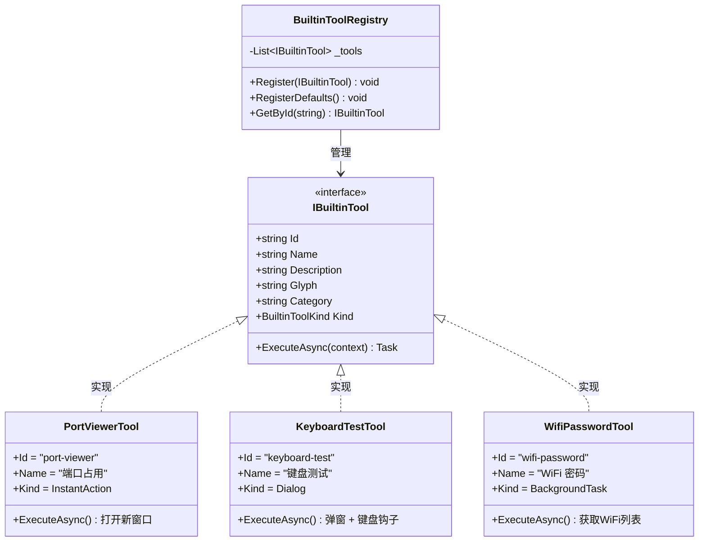

# 第16课：接口与继承

前面三课你学了类、对象、构造函数。把类当成一个模具，对象是用模具造出来的零件。现在有一个很实际的问题：在 TubaTools 里，有二十多种工具——键盘测试、端口查看、WiFi 密码、垃圾清理、电池分析……每种工具做的事情完全不同。但程序需要一个统一的方式来管理它们。你不能写二十多遍"如果是键盘测试，就调这个方法；如果是端口查看，就调那个方法"——那代码会烂成一锅粥。

解决这个问题的办法有两个：接口（Interface）和继承（Inheritance）。它们让你可以写"我不关心你具体是什么工具，只要你符合这个约定，我就能调用你"这样的代码。

---

## 1. 接口是什么——先看一个生活里的类比

想象你去一家餐厅。菜单上写了"本店支持扫码点餐"。但具体怎么扫码——是扫桌上的二维码，还是关注公众号，还是用支付宝小程序——你根本不关心。你只需要知道：这家店实现了"扫码点餐"这个能力。

接口就是这样一个"能力标签"。

在 C# 里，接口用 `interface` 关键字定义。它只声明"能做什么"，不写"怎么做"。来看 TubaTools 里最核心的一个接口：

```csharp
// 来自 Services/IBuiltinTool.cs
public interface IBuiltinTool
{
    string Id { get; }
    string Name { get; }
    string Description { get; }
    string Glyph { get; }
    string Category { get; }
    BuiltinToolKind Kind { get; }

    Task ExecuteAsync(BuiltinToolContext context);
}
```

这个接口说了：任何一个内置工具，必须具备 6 个属性（Id、Name、Description、Glyph、Category、Kind）和 1 个方法（ExecuteAsync）。但每个属性到底是什么值、方法里到底干什么——接口一个字不提。

你可能会想：这不就是个清单吗？没错，它就是一份清单。但这份清单给程序带来了一个巨大的好处：任何地方只要看到 `IBuiltinTool`，就知道能调用这 7 个成员，不用关心背后是哪个具体类。这种能力叫**多态**（Polymorphism）。

---

## 2. 继承——类怎么"实现"接口

接口定义了规矩，类来遵守规矩。这种遵守叫"实现接口"，C# 语法是 `class 类名 : 接口名`。

看 TubaTools 里最简单的实现：PortViewerTool。

```csharp
// 来自 Services/BuiltinTools/PortViewerTool.cs
public sealed class PortViewerTool : IBuiltinTool
{
    public string Id => "port-viewer";
    public string Name => "端口占用";
    public string Description => "查看系统所有 TCP/UDP 端口占用情况，定位占用进程。";
    public string Glyph => "\uE774";
    public string Category => "网络工具";
    public BuiltinToolKind Kind => BuiltinToolKind.InstantAction;

    public Task ExecuteAsync(BuiltinToolContext context)
    {
        context.OnProgress?.Invoke("正在打开端口占用...");

        App.MainWindow?.DispatcherQueue.TryEnqueue(() =>
        {
            var window = new TubaWinUi3.Pages.PortViewerWindow();
            window.Activate();
        });

        return Task.CompletedTask;
    }
}
```

`:` 后面的 `IBuiltinTool` 意思是"PortViewerTool 实现了 IBuiltinTool 接口"。

注意这 7 个成员：6 个属性用了表达式体（`=>` 的写法），也就是只有 get 没有 set——接口要求如此。ExecuteAsync 方法在做什么呢？通知一下进度条，然后打开一个新窗口。整个类才 24 行——因为它的逻辑真的很简单：弹一个窗口就完事了。

再看一个复杂得多的实现：KeyboardTestTool。

```csharp
// 来自 Services/BuiltinTools/KeyboardTestTool.cs（节选）
public sealed class KeyboardTestTool : IBuiltinTool
{
    public string Id => "keyboard-test";
    public string Name => "键盘测试";
    public string Description => "检测键盘按键是否正常，按键后高亮显示。";
    public string Glyph => "\uE92E";
    public string Category => "外设工具";
    public BuiltinToolKind Kind => BuiltinToolKind.Dialog;

    public async Task ExecuteAsync(BuiltinToolContext context)
    {
        var dialog = context.CreateDialog("键盘测试");
        dialog.Content = BuildDialogContent();
        _currentDialog = dialog;

        dialog.Opened += (_, _) =>
        {
            _keyGrid?.Focus(FocusState.Programmatic);
            InstallHook();
        };

        dialog.Closing += (_, e) =>
        {
            RemoveHook();
            _currentDialog = null;
        };

        await dialog.ShowAsync();
    }

    // 后面还有 400 多行：键盘布局绘制、按键高亮、
    // Windows 底层钩子、键名映射……
}
```

PortViewerTool 和 KeyboardTestTool 是两个完全不同的类。一个 24 行，一个 480 行。一个打开新窗口就完事，一个画了整个虚拟键盘、还挂接了 Windows 键盘钩子。但它们都满足了接口的 7 个要求，所以它们都可以被当作 `IBuiltinTool` 来使用。

这就是接口的力量：程序不用知道内部细节，只知道外面那层"合同"就够了。

---

## 3. 接口 vs 继承（类继承）

C# 里有两种"继承"：

| 类型 | 语法 | 含义 |
|------|------|------|
| 实现接口 | `class A : IXxx` | A 承诺提供 IXxx 定义的成员 |
| 继承类 | `class A : B` | A 从 B 继承所有字段和方法，可以重写 |

C# 不允许一个类同时继承多个父类（不像 C++）。但一个类可以实现多个接口。这很合理——你可以同时是"能扫码点餐"和"支持开发票"，但你只有一个亲爹。

在 TubaTools 里，所有内置工具都只用接口，没有类继承。为什么？因为这些工具之间没有"是一个…"的关系。KeyboardTestTool 不是 JunkCleanerTool 的升级版，它们没有公共逻辑可以抽取到父类。它们只是碰巧都满足同一个接口合同而已。

什么时候用接口，什么时候用类继承？一个简单的判断法：

- 如果问"B 是一个 A 吗？"答案是"是"，用类继承。比如"猫 是一个 动物"。
- 如果问"B 能做 X 吗？"答案是"能"，用接口。比如"猫 能 被领养"。

接口代表**能力**，继承代表**身份**。

---

## 4. BuiltinToolRegistry：接口如何驱动整个系统

定义接口写实现只是第一步。真正让接口产生价值的地方，是用接口类型来存东西、传参数、做遍历。

看 TubaTools 的工具注册中心：

```csharp
// 来自 Services/BuiltinToolRegistry.cs
public static class BuiltinToolRegistry
{
    private static readonly List<IBuiltinTool> _tools = [];

    public static IReadOnlyList<IBuiltinTool> Tools => _tools;

    public static void Register(IBuiltinTool tool)
    {
        if (_tools.Any(t => t.Id == tool.Id))
        {
            throw new InvalidOperationException($"内置工具 '{tool.Id}' 已注册。");
        }
        _tools.Add(tool);
    }

    public static void RegisterDefaults()
    {
        Register(new CertBlockTool());
        Register(new PortViewerTool());
        Register(new HostsEditorTool());
        Register(new KeyboardTestTool());
        Register(new JunkCleanerTool());
        Register(new BsodAnalysisTool());
        Register(new WingetInstallerTool());
        Register(new BatteryAnalyzerTool());
        Register(new SpeedTestTool());
        Register(new WifiPasswordTool());
        Register(new DiskSpaceAnalyzerTool());
        Register(new LiteMonitorTool());
        Register(new WindowsActivationTool());
        Register(new DefenderTool());
        Register(new CpuRankingTool());
        Register(new GpuRankingTool());
        Register(new ContextMenuMgrTool());
        Register(new HardwareSpooferTool());
    }

    public static IBuiltinTool? GetById(string id)
    {
        return _tools.FirstOrDefault(t => t.Id == id);
    }
}
```

注意这三个关键点：

**第一，`List<IBuiltinTool>`。** 这个列表里可以放 PortViewerTool，也可以放 KeyboardTestTool，还可以放 WifiPasswordTool——因为它们都实现了 `IBuiltinTool`。你不需要一个类一个列表。一份列表装下所有。

**第二，`Register(IBuiltinTool tool)`。** 参数类型是接口，不是具体类。这意味着将来你可以写一个全新的工具类，只要实现 IBuiltinTool，就能被注册进来。Registry 的代码一行都不用改。这叫"对扩展开放，对修改关闭"——软件设计里几乎是铁律的一条原则。

**第三，`RegisterDefaults()`。** 这个方法里 `new` 了 18 个不同的类，但 `Register` 方法只看到一个类型：`IBuiltinTool`。这就是多态在真实项目中的样子。

---

## 5. 接口方法的多态调用

假设程序里某个地方拿到了一个 `IBuiltinTool`，要执行它：

```csharp
IBuiltinTool tool = registry.GetById("keyboard-test");
if (tool != null)
{
    await tool.ExecuteAsync(context);
}
```

这段代码不知道 `tool` 到底是 KeyboardTestTool 还是 PortViewerTool。它只知道：这个对象实现了 `ExecuteAsync`。运行时（Runtime）会自动找到实际类型的方法去执行。

这个机制叫**动态派发（Dynamic Dispatch）**。你写代码的时候面对的是接口，运行的时候实际跑的是具体类的代码。这听起来像魔术，但它就是面向对象编程的核心。

---

## 6. 接口里的枚举关联：BuiltinToolKind

回到 IBuiltinTool 的定义，有个属性叫 `Kind`，类型是 `BuiltinToolKind`：

```csharp
// 来自 Services/IBuiltinTool.cs
public enum BuiltinToolKind
{
    Dialog,
    BackgroundTask,
    ProgressTask,
    InstantAction
}
```

这个枚举告诉系统这个工具的"运行方式"：

- `Dialog`：弹出一个对话框（比如键盘测试、WiFi 密码查看）
- `BackgroundTask`：后台静默运行，不弹窗（比如垃圾清理扫描）
- `ProgressTask`：显示进度条（比如磁盘空间分析）
- `InstantAction`：立即执行，打开独立窗口（比如端口查看）

接口的每一个属性都有实际意义。`Kind` 不是摆设——主页面的工具网格会读到这个值，决定点击工具时用哪种方式启动。如果 Kind 是 Dialog，就弹 ContentDialog；如果是 InstantAction，就直接开新窗口。

这种"用属性描述行为模式"的设计很常见。比单独写四个不同的执行方法要干净得多。

---

## 7. 接口不能做什么

接口说了这么多好处，也得说清楚它的限制。不然容易误用。

**接口不能有字段。** 你不能在接口里写 `int _count;`。接口只定义"对外暴露什么"，不定义"内部存什么"。

**接口不能有实现代码。** C# 8.0 以后允许接口写默认实现（default implementation），但那是特殊情况。常规用法里，接口里的方法只写签名，不写方法体。

**接口不能有构造函数。** 接口不能被 `new`。你只能 `new` 一个实现了接口的类。

**接口的成员默认是 public。** 你不能在接口里写 `private string Id`。接口的所有成员都自动公开——因为它们存在的目的就是被外部调用。

---

## 8. 什么时候该用接口

这个问题没有标准答案，但有一条很实用的经验：当你发现自己在写"如果类型是 A 就做 X，如果是 B 就做 Y"的时候，就该考虑抽一个接口了。

比如说，如果 TubaTools 没有 IBuiltinTool，注册工具的代码可能会变成这样：

```csharp
// 糟糕的做法——千万别这么写
public static void ExecuteTool(object tool, BuiltinToolContext context)
{
    if (tool is KeyboardTestTool kt)
        await kt.ExecuteAsync(context);
    else if (tool is PortViewerTool pv)
        await pv.ExecuteAsync(context);
    else if (tool is WifiPasswordTool wp)
        await wp.ExecuteAsync(context);
    // 每加一个新工具就多一个 else if……
}
```

有了接口，这段代码变成一行：`await tool.ExecuteAsync(context)`。这就是接口消灭 if/else 分支的力量。

---

## 9. Mermaid 类图：TubaTools 的接口体系

下面这张图展示了 IBuiltinTool 接口以及它和三个实现类、注册中心的关系：



虚线三角箭头（`<|..`）在 UML 里表示"实现接口"。实线三角箭头（`<|--`）表示"类继承"。BuiltinToolRegistry 通过 `List<IBuiltinTool>` 持有对所有工具的引用，但它不关心具体类型。

---

## 10. 接口的多重实现

前面说了，一个类可以实现多个接口。这在 TubaTools 里暂时没有出现，但它是接口的一个重要能力。举个例子：

```csharp
public interface ICanExport
{
    string ExportToJson();
}

public interface ICanLog
{
    void Log(string message);
}

// 一个类同时实现两个接口
public class AdvancedTool : IBuiltinTool, ICanExport, ICanLog
{
    // 实现 IBuiltinTool 的 7 个成员……
    // 实现 ICanExport……
    // 实现 ICanLog……
}
```

这个 AdvancedTool 同时是"内置工具"、"能导出"、"能记录日志"。程序的不同部分可以各取所需：

```csharp
IBuiltinTool tool = new AdvancedTool();
tool.ExecuteAsync(context);  // 当成工具用

ICanExport exporter = (ICanExport)tool;
string json = exporter.ExportToJson();  // 当成导出器用
```

这比把所有功能塞进一个接口要干净得多。接口应该小而精，每个接口只代表一种明确的职责。这个原则叫"接口隔离原则"（Interface Segregation Principle），名字很唬人，意思就是：别把八竿子打不着的方法塞进同一个接口。

---

## 11. 小结

接口在 C# 里用 `interface` 定义，用 `class X : IY` 实现。它只声明"能做什么"，不写"怎么做"。实现类负责填上具体逻辑。

接口的好处不在定义那里，在使用那里。当 `BuiltinToolRegistry` 用 `List<IBuiltinTool>` 存所有工具时，当 `Register()` 方法接收 `IBuiltinTool` 参数时，接口的价值就体现出来了——你可以在不修改任何现有代码的情况下，加一个新工具，只要它实现了接口就行。

TubaTools 里目前有 18 个内置工具，每一个都独立实现了 `IBuiltinTool`。它们之间没有类继承关系，全凭接口来统一。这是一个很典型的"组合优于继承"（Composition over Inheritance）的实践。

下一课，我们讲静态类和静态方法——怎么在不需要创建对象的情况下使用类的功能。

---

## 小练习

**1. 填空题**

下面代码中，`____` 处应该填什么？

```csharp
public ____ IAnimal
{
    string Name { get; }
    void Speak();
}

public class Dog : ____
{
    public string Name => "旺财";
    public void Speak() => Console.WriteLine("汪汪");
}
```

**2. 选择题**

以下关于接口的说法，哪一个是正确的？

- A. 接口可以包含字段
- B. 一个类只能实现一个接口
- C. 接口里的方法不能写具体实现（常规情况下）
- D. 接口可以被 `new` 创建实例

**3. 代码题**

TubaTools 当前没有"屏幕截图工具"。请你仿照 PortViewerTool 的模式，写出一个 `ScreenshotTool` 类的框架——实现 `IBuiltinTool` 接口，Id 为 `"screenshot"`，Name 为 `"截图工具"`，Category 为 `"系统工具"`，Kind 为 `InstantAction`，ExecuteAsync 里写一条注释表示"这里打开截图界面"即可。不要求编译，写出类结构就行。

---

<details>
<summary>练习答案（点击展开）</summary>

**1. 填空题答案**

第一个空：`interface`，第二个空：`IAnimal`

**2. 选择题答案**

C。接口的方法在常规情况下只写签名不写实现。A 错——接口不能有字段。B 错——一个类可以实现多个接口。D 错——接口不能 `new`。

**3. 代码题参考**

```csharp
public sealed class ScreenshotTool : IBuiltinTool
{
    public string Id => "screenshot";
    public string Name => "截图工具";
    public string Description => "截取屏幕区域并保存。";
    public string Glyph => "\uE722";
    public string Category => "系统工具";
    public BuiltinToolKind Kind => BuiltinToolKind.InstantAction;

    public Task ExecuteAsync(BuiltinToolContext context)
    {
        // 这里打开截图界面
        App.MainWindow?.DispatcherQueue.TryEnqueue(() =>
        {
            var window = new ScreenshotWindow();
            window.Activate();
        });

        return Task.CompletedTask;
    }
}
```

（Glyph 的 Unicode 值 `\uE722` 是 Segoe Fluent Icons 里的相机图标，和截图语义匹配。）

</details>
