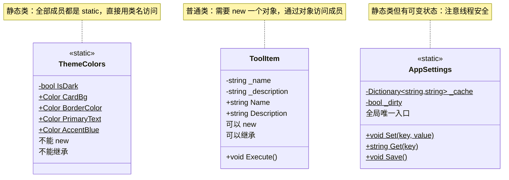

# 第17课：静态类与静态方法

## 为什么学这个

写代码到一定程度，你会发现有些东西跟"对象"好像没什么关系。比如一个计算圆面积的公式，它不需要记住你上次算了什么，也不需要知道"自己"是谁——给它半径，它返回面积，完事。又比如整个程序都需要用的配置数据，你不想在每个地方都 new 一个对象来读，最好有个全局入口，直接拿。

这类需求指向一个概念：**静态（static）**。

static 在 C# 里出现频率很高。你打开 TubaTools 源码看看，Services 文件夹下面好几个类都是 `static class`，比如 `AppSettings`、`ThemeColors`，还有一个随处可见的 `Console.WriteLine()` 也是静态方法。不理解 static，你面对这些代码只能猜，没法改。

---

## 什么是 static

### 从"属于谁"的角度理解

普通的字段和方法，属于**对象**。你得先 `new` 一个对象出来，才能用：

```csharp
ToolItem tool = new ToolItem();
tool.Name = "记事本";   // 通过对象 tool 访问
```

静态的字段和方法，属于**类本身**。不用 new，直接用类名访问：

```csharp
Console.WriteLine("Hello");   // WriteLine 是 Console 类的静态方法
```

Console 是一个静态类，你永远不会写 `new Console()`——事实上 C# 根本不允许你这么做。静态类存在的目的就是提供一个"工具箱"：一堆功能集中在一起，随时取用，不产生任何对象。

### 一个接地气的比喻

把"普通类"想象成一家包子铺。你想吃包子，得先开一家分店（new 一个对象），然后从这家分店买（调用实例方法）。每家分店有自己的库存、自己的营业额。

静态类不是分店。它是一个包子配方手册，贴在墙上谁都能看。你不需要"开一家配方手册"，直接翻到第3页照着做就行。配方手册只有一份，上面的内容对所有人一样。

---

## 静态字段：共享的数据

在普通类里，每个对象有自己的字段副本。比如：

```csharp
class Student
{
    public string Name;  // 每个学生有自己的名字
}
```

但如果你想让所有 Student 对象共享一个数据，比如"班级人数上限"，就该用静态字段：

```csharp
class Student
{
    public string Name;              // 实例字段——每人一份
    public static int MaxCount = 50; // 静态字段——全班只有一份
}
```

`MaxCount` 不属于任何一个具体的 Student 对象。它存在类本身上，所有对象看到的都是同一个值。改一次，全体生效。

---

## 静态方法：不需要对象就能调用的方法

静态方法的特点就是调用时不依赖对象。看 Math 类最经典的例子：

```csharp
double result = Math.Sqrt(16);  // 返回 4.0，不需要 new Math()
```

`Sqrt` 的逻辑跟任何对象都没关系——给它一个数，它还你平方根。写成实例方法反而别扭：你总不能说"请一个 Math 对象帮我算平方根吧"。

那什么时候该写成静态方法？一个简单判断：**如果方法体里从来不碰 `this`，就可以考虑 static**。`this` 指向当前对象，不用 `this` 说明这个方法跟对象状态无关，那它天然适合做静态方法。

---

## 静态属性：带计算的静态数据

属性本质上是对字段的包装，可以加 get/set 逻辑。静态属性同理，只不过挂在类上。TubaTools 里 ThemeColors 类就是一个典型：

```csharp
internal static class ThemeColors
{
    private static bool IsDark
    {
        get
        {
            var appTheme = ThemeService.CurrentTheme;
            if (appTheme == AppTheme.Dark) return true;
            if (appTheme == AppTheme.Light) return false;
            return Application.Current.RequestedTheme == ApplicationTheme.Dark;
        }
    }

    public static Color CardBg => IsDark
        ? Color.FromArgb(255, 45, 45, 45)
        : Color.FromArgb(255, 249, 249, 249);
}
```

注意几个细节：

第一，`IsDark` 是 `private static` 的——外面的代码看不到它，它只在这个类内部判断当前是暗色还是亮色主题。这种"内部辅助"做法很常见。

第二，`CardBg` 用了表达式体语法 `=>`。写法简洁，但本质还是静态属性。每次访问 `ThemeColors.CardBg` 时，都会重新执行 `IsDark` 的判断逻辑，然后返回对应的颜色。

第三，整个类声明为 `static class`，意味着它不产生任何对象，纯提供数据。WinUI 里颜色用 `Color.FromArgb(alpha, r, g, b)` 表示，卡片的背景色在暗色模式下是深灰 RGB(45,45,45)，在亮色模式下是浅灰 RGB(249,249,249)。

---

## 静态类：禁止 new 的类

把 `static` 加到类名前面，就得到一个静态类：

```csharp
public static class AppSettings
{
    private static Dictionary<string, string>? _cache;
    private static bool _dirty;

    public static void Set(string key, string value)
    {
        var s = Load();
        s[key] = value;
        _dirty = true;
        Save();
        SettingChanged?.Invoke(key);
    }
}
```

静态类有三个硬约束：

1. **不能 new**——编译器直接报错。它的所有成员必须也是静态的。
2. **不能继承**——静态类隐式 sealed，不能被其他类派生。
3. **不能实现接口**——接口要求实例成员，静态类没有实例。

这三条约束其实是在帮你不犯错。如果一个类从头到尾都不需要对象，那就用 static class 把它锁死。省得以后有人（包括几个月后的你自己）试图 new 它，然后搞出一堆 bug。

`AppSettings` 就是个好例子。它的职责是全局配置读写——整个程序只需要一套配置数据。用静态类正好：`AppSettings.Set("Language", "zh-CN")` 在任何地方都能直接调用，不用操心"哪个 AppSettings 对象才是当前生效的"。

---

## 静态构造：初始化只做一次

静态字段在什么时候初始化？答案是**第一次访问这个类之前**，由 CLR（公共语言运行时）自动完成。你也可以显式写一个静态构造函数来控制初始化过程：

```csharp
public static class Config
{
    public static readonly string AppPath;

    static Config()   // 静态构造函数——无参数，无访问修饰符
    {
        AppPath = Path.Combine(
            Environment.GetFolderPath(Environment.SpecialFolder.LocalApplicationData),
            "TubaTools"
        );
    }
}
```

静态构造函数在整个程序生命周期里只执行一次，而且你控制不了它什么时候执行——CLR 会在用到这个类之前的某个时刻调用它。所以不要在静态构造里做可能失败的事情（比如网络请求），失败了程序直接挂，没什么兜底方案。

---

## static readonly vs const

ThemeColors 里有一组颜色是这么写的：

```csharp
public static readonly Color AccentBlue  = Color.FromArgb(255, 96, 165, 250);
public static readonly Color AccentGreen = Color.FromArgb(255, 74, 222, 128);
public static readonly Color AccentRed   = Color.FromArgb(255, 248, 113, 113);
```

为什么用 `static readonly` 而不是 `const`？

`const` 的值必须在**编译时**就能确定。像数字 42、字符串 "hello" 这种，编译器直接把它嵌到你的代码里。但 `Color.FromArgb(255, 96, 165, 250)` 是一个方法调用，它的结果在运行时才知道，编译器没法提前算。所以只能用 `static readonly`——声明时赋值，之后不能改。

说人话：`const` 是"写死"的常量，`static readonly` 是"只读一次"的变量。

---

## 静态的代价：什么时候不该用

静态成员写起来方便，但滥用会出问题。

**第一个问题：全局状态难以追踪。** AppSettings 的 `_cache` 和 `_dirty` 是全局可变的静态字段。任何地方的代码都可以改它，时间一长，你很难搞清楚"这个值是谁在什么时候改的"。找 bug 的时候，静态可变状态是最让人头疼的东西之一。

**第二个问题：单元测试不友好。** 测试里如果你调用了 `AppSettings.Set(...)`，这行代码真实地改了全局状态。下一个测试运行时，上次测试留下的脏数据还在。除非你每个测试前后手动清理，否则测试之间会互相干扰。这就是为什么很多项目用依赖注入（DI）取代全局静态类。

**第三个问题：多线程安全。** 如果两个线程同时调 `AppSettings.Set("key1", "a")` 和 `AppSettings.Set("key2", "b")`，它们同时操作 `_cache` 和 `_dirty`，可能导致数据错乱。解决它需要加锁，增加了复杂度。

所以简单的判断标准是：**只读的、无状态的、纯粹计算的东西，放心用 static；有可变状态的、需要 mock 的、涉及外部资源的，慎重考虑。**

TypeColors 基本是纯粹的——所有属性都只读（没有 set），没有可变状态。AppSettings 就有可变状态了（`_cache`、`_dirty`、`Save()` 写文件），不过在当前项目规模下还能接受。

---

## Mermaid 类图：静态类与普通类的对比



图中 `$` 后缀表示静态成员。可以看到：`ThemeColors` 和 `AppSettings` 的所有方法、属性、字段都标了 `$`，而 `ToolItem` 的成员没有——那都是实例成员，属于通过 `new` 创建出来的每个具体工具对象。

---

## TubaTools 源码拆解：AppSettings 怎么做到全局读写

把 AppSettings 的完整逻辑串起来看：

```csharp
public static class AppSettings
{
    // 静态事件：任何代码可以订阅，设置改变时收到通知
    public static event Action<string>? SettingChanged;

    // 静态字典缓存在内存里，避免每次都读文件
    private static Dictionary<string, string>? _cache;
    private static bool _dirty;  // 标记有没有未保存的修改

    public static Dictionary<string, string> Load()
    {
        if (_cache is not null) return _cache;  // 有缓存直接用
        try
        {
            if (File.Exists(SettingsPath))
            {
                var json = File.ReadAllText(SettingsPath);
                _cache = JsonSerializer.Deserialize<Dictionary<string, string>>(json) ?? [];
            }
            else
            {
                _cache = [];  // 文件不存在就返回空字典
            }
        }
        catch
        {
            _cache = [];  // 读取失败也返回空字典，保证程序不崩
        }
        return _cache;
    }

    public static void Set(string key, string value)
    {
        var s = Load();       // 先加载缓存
        s[key] = value;       // 改字典
        _dirty = true;        // 标记有改动
        Save();               // 立即写回文件
        SettingChanged?.Invoke(key);  // 通知订阅者
    }

    public static string? Get(string key)
    {
        var s = Load();
        return s.TryGetValue(key, out var v) ? v : null;
    }
}
```

这个设计里几个值得说的点：

- **缓存策略**：`_cache` 是静态字段，整个程序生命周期只加载一次。`Set` 后立即写文件，所以缓存和文件内容保持同步。
- **容错设计**：`Load()` 里 catch 了所有异常，读写失败就返回空字典，保证程序不因为设置文件损坏而崩溃。这是个务实的做法——设置丢了可以重新配，程序崩了用户的工作就没了。
- **事件通知**：`SettingChanged` 是静态事件，UI 层可以订阅它，当某个设置被修改时自动刷新界面。这比让 UI 层定时轮询要高效得多。
- **方法重载**：`Set(string, bool)`、`Set(string, int)`、`Set(string, double)` 都是对 `Set(string, string)` 的包装，最终全转成字符串存储。这是静态方法重载的典型应用——同一个操作，接受不同参数类型。

---

## 再看 ThemeColors：为什么全部用静态属性

```csharp
internal static class ThemeColors
{
    public static Color CardBg => IsDark
        ? Color.FromArgb(255, 45, 45, 45)
        : Color.FromArgb(255, 249, 249, 249);

    public static Color BorderColor => IsDark
        ? Color.FromArgb(255, 60, 60, 60)
        : Color.FromArgb(255, 229, 229, 229);
    // ... 还有十几个颜色属性
}
```

注意到 `internal static class`——`internal` 表示这个类只在当前程序集（TubaTools 项目本身）内可见，外部项目引用不到它。主题颜色是内部实现细节，不需要对外暴露。

这些属性全部是只读的（只有 get，没有 set），不存在可变状态的问题。每次访问自动根据当前主题返回对应颜色。XAML 里绑定数据时可以直接写 `{x:Bind ...}` 引用 ThemeColors 的静态属性，主题切换后颜色自动变化。

---

## 小练习

### 第1题（填空）

`static` 关键字修饰的成员属于_____，而普通成员属于_____。调用静态方法时使用_____名，调用实例方法时必须先通过_____创建对象。

### 第2题（选择）

以下关于静态类的说法，哪个是正确的？

A. 静态类可以被继承
B. 静态类可以用 `new` 创建对象
C. 静态类的所有成员也必须是静态的
D. 静态类可以实现接口

### 第3题（简答）

AppSettings 把所有数据存在一个静态 `Dictionary<string, string>` 里，每次 `Set` 后立即 `Save` 写回文件。假如有 1000 个设置项，每次改一个都要把整个字典序列化成 JSON 写磁盘。这个策略有什么潜在问题？如果让你优化，你会怎么做？

### 第4题（实操）

写一个静态类 `Counter`，包含：
- 一个私有的静态 int 字段 `_count`，初始值为 0
- 一个公开的静态方法 `Increment()`，每次调用让 `_count` 加 1 并返回新值
- 一个公开的静态方法 `Reset()`，把 `_count` 归零

然后在一个控制台程序的 `Main` 方法里连续调用 3 次 `Increment()`，打印每次的返回值。观察结果是 1、2、3 而不是 1、1、1，说明静态字段在所有调用之间是共享的。

### 第5题（思考）

ThemeColors 里的 `IsDark` 属性是 `private static` 的，但被 14 个公开静态属性依赖。如果主题切换非常频繁（用户反复点切换按钮），每次访问 `ThemeColors.CardBg` 都会重新执行 `IsDark` 的 getter，判断主题状态。这个开销大吗？什么情况下需要改成缓存 `IsDark` 的结果而不是每次实时计算？

---

## 练习答案

<details>
<summary>点击展开答案</summary>

**第1题：**
`static` 关键字修饰的成员属于**类本身**，而普通成员属于**对象（实例）**。调用静态方法时使用**类**名，调用实例方法时必须先通过 **new** 创建对象。

**第2题：** C。静态类不能 new、不能继承、不能实现接口，其所有成员必须是静态的。

**第3题（要点）：**
- 潜在问题：1000 个键值对序列化后的 JSON 不算小，频繁全量写磁盘会造成 I/O 开销，磁盘磨损（SSD 也有写入寿命），而且存在并发写入的线程安全问题。
- 优化方向：可以缓存脏标记，等到程序退出时批量写入一次；或者用延迟写入（debounce），收集一段时间内的修改集中写一次；也可以用轻量的键值数据库而不是 JSON 全量序列化。

**第4题（参考代码）：**

```csharp
public static class Counter
{
    private static int _count = 0;

    public static int Increment()
    {
        _count++;
        return _count;
    }

    public static void Reset()
    {
        _count = 0;
    }
}

// Main 中调用
Console.WriteLine(Counter.Increment()); // 输出 1
Console.WriteLine(Counter.Increment()); // 输出 2
Console.WriteLine(Counter.Increment()); // 输出 3
```

**第5题（要点）：**
- 开销很小。`IsDark` 的判断逻辑只是读几个静态属性然后做条件判断，不涉及 I/O、网络、循环或复杂计算。
- 但如果未来 `IsDark` 的判断变复杂了（比如需要查注册表、读配置文件），或者 ThemeColors 被几百个 UI 元素同时绑定、每一帧渲染都触发 14 个属性的 getter，那就值得缓存。最简单的缓存方式：在静态构造函数里计算一次存到 `bool` 字段里，需要监听主题切换事件来更新缓存。

</details>
