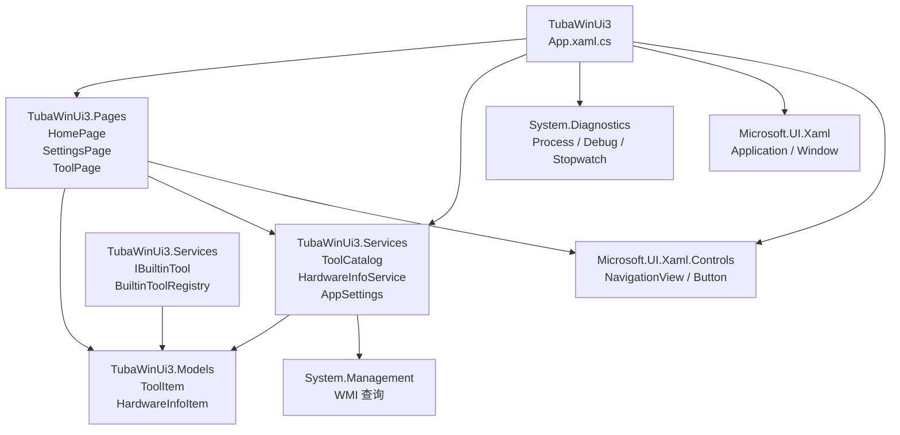

# 命名空间与 using

你已经写了十几课 C# 代码了。每新建一个 .cs 文件，IDE 就会自动在文件顶部塞上一堆 `using` 语句，然后代码本身又套在一个 `namespace` 的大括号（或者分号）里面。你可能从来没认真想过这两个东西到底在干什么——IDE 帮你写了，程序跑起来了，好像就够了。

这一课把这些事彻底讲清楚。命名空间和 using 不是 C# 的装饰品，它们是 .NET 组织代码的核心机制。如果你以后要写超过三个文件的项目，理解这个机制就意味着你能找到任意一个类，知道它从哪来，以及你自己的代码如何被别人找到。

---

## 1. 类比：图书馆的书架编号

先不看代码。想象一个图书馆，馆藏 100 万本书。如果所有书按到馆先后堆在同一个仓库里，找《C# 编程入门》的唯一办法就是从第一本开始翻——这显然不行。

图书馆的做法是：给每本书一个分类号，再按分类上架。哲学在 B 区，计算机在 TP 区，C# 在 TP312C。你要找某本书，先在系统中查它的编号，然后直奔对应书架。

命名空间在 .NET 里做的事跟这个一模一样。.NET 框架自带了成千上万个类——`List`、`Dictionary`、`File`、`HttpClient`、`Task`……如果这些全挤在一个全局空间，名字冲突是必然的（你以为只有你会叫 `Helper`？微软自己也写过无数个 `Helper`）。

命名空间把类分门别类地放进各自的"书架"。`System.Collections.Generic.List<T>` 的意思是：在 System 大区 -> Collections 排 -> Generic 架 -> 找到 `List<T>` 这本书。

---

## 2. namespace 的两种写法

TubaTools 项目里，打开任何一个 .cs 文件，你都会在顶部附近看到一行 `namespace` 声明。它有两种写法：

**旧式（块级命名空间）**：用大括号把整个文件的内容包起来。

```csharp
namespace TubaWinUi3.Services
{
    public static class ToolCatalog
    {
        // 文件全部内容都在这个大括号里
    }
}
```

**新式（文件范围命名空间）**：一行分号结尾，整个文件自动归属这个命名空间。C# 10 开始支持。

```csharp
namespace TubaWinUi3.Services;

public static class ToolCatalog
{
    // 不需要额外的大括号包裹
}
```

TubaTools 全部使用了新式写法。打开 `Services/ToolCatalog.cs`，第一行代码（不算 using）就是：

```csharp
namespace TubaWinUi3.Services;
```

这意味着这个文件里定义的所有类——`ToolCatalog`，以及可能会在这个文件里定义的任何其他类、枚举、结构体——它们的完整名称都是 `TubaWinUi3.Services.ToolCatalog`。

再看 `App.xaml.cs`：

```csharp
namespace TubaWinUi3;
```

根命名空间。`App` 类的全名就是 `TubaWinUi3.App`。

`Models/ToolItem.cs`：

```csharp
namespace TubaWinUi3.Models;
```

`ToolItem` 的全名是 `TubaWinUi3.Models.ToolItem`。

你看出来了吧：命名空间就是一个**前缀**。它不改变类的功能，不改变编译结果，只改变你在代码里引用这个类时使用的名字。

---

## 3. 完整限定名 vs using 简写

假设你没有用 `using`，每次用到 `ToolItem` 都要写全名：

```csharp
// 又臭又长，没人会这么写
TubaWinUi3.Models.ToolItem tool = new TubaWinUi3.Models.ToolItem
{
    Name = "磁盘管理",
    Category = "系统工具"
};
```

`using` 指令的作用：告诉编译器"当我在这个文件里写 `ToolItem` 时，请自动在前面补上 `TubaWinUi3.Models.`"。

```csharp
using TubaWinUi3.Models;  // 这句话让下面所有代码省掉前缀

ToolItem tool = new ToolItem  // 简洁
{
    Name = "磁盘管理",
    Category = "系统工具"
};
```

`using` 只在你当前这个 .cs 文件里生效。你写了 `using TubaWinUi3.Models;`，同一个项目的其他 .cs 文件并不会自动获得这个便利——它们需要各自写自己的 `using`。

---

## 4. 拆解 TubaTools 的真实 using 语句

拿 `App.xaml.cs` 的头部来逐条分析：

```csharp
using System.Diagnostics;           // (1)
using System.Security.Principal;    // (2)
using Microsoft.UI.Xaml;            // (3)
using Microsoft.UI.Xaml.Controls;   // (4)
using TubaWinUi3.Pages;             // (5)
using TubaWinUi3.Services;          // (6)
```

逐条解释：

**(1) `using System.Diagnostics;`**  
`System.Diagnostics` 是 .NET 提供的命名空间，里面有 `Process` 类（启动和管理外部进程）、`Debug` 类（调试输出）、`Stopwatch`（计时）。`App.xaml.cs` 里需要启动外部工具进程，所以引用了它。

**(2) `using System.Security.Principal;`**  
这个命名空间里有 `WindowsIdentity` 和 `WindowsPrincipal` 类，用来检测当前用户是否是管理员。TubaTools 某些操作需要管理员权限，启动时要检查。

**(3) `using Microsoft.UI.Xaml;`**  
WinUI 3 的核心命名空间。`Application` 类、`Window` 类都在这里。没有这一行，`App` 类继承 `Application` 会编译失败。

**(4) `using Microsoft.UI.Xaml.Controls;`**  
WinUI 3 的控件库。`NavigationView`、`Button`、`TextBox` 等都在这个命名空间下。

**(5) `using TubaWinUi3.Pages;`**  
这是 TubaTools 自己的命名空间。所有页面类（`HomePage`、`SettingsPage` 等）都在 `Pages` 文件夹下，归属 `TubaWinUi3.Pages` 命名空间。`App.xaml.cs` 需要创建这些页面的实例，所以引用它。

**(6) `using TubaWinUi3.Services;`**  
同理，服务类的命名空间。`ToolCatalog`、`HardwareInfoService` 都在这里。

再看 `Models/ToolItem.cs` 的头部：

```csharp
using System.Collections.ObjectModel;      // ObservableCollection<T>
using System.ComponentModel;               // INotifyPropertyChanged
using System.Runtime.CompilerServices;     // CallerMemberName
using System.Runtime.InteropServices;      // 平台调用相关
using TubaWinUi3.Services;                 // 引用服务层的类
```

`ToolItem` 类实现了 `INotifyPropertyChanged` 接口，这个接口定义在 `System.ComponentModel` 命名空间中——所以必须 using。`ObservableCollection<T>` 定义在 `System.Collections.ObjectModel` 中，也需要 using。

注意最后一行：`using TubaWinUi3.Services;`。`ToolItem` 在 Models 命名空间下，但它需要用到 Services 命名空间里的类——比如某个枚举类型或者工具方法。跨命名空间引用是常态，不是特例。

---

## 5. 命名空间与文件夹的关系

有一个常见的误解：命名空间必须和文件夹路径对应。

**事实是：没有强制关系。** 命名空间和文件夹是两套独立的东西。

但在实践中，99% 的项目会让它们保持一致——因为 Visual Studio 和 dotnet CLI 默认就会这样做。在 TubaTools 里：

| 文件路径 | 命名空间 |
|---------|---------|
| `Models/ToolItem.cs` | `TubaWinUi3.Models` |
| `Services/ToolCatalog.cs` | `TubaWinUi3.Services` |
| `Pages/HomePage.xaml.cs` | `TubaWinUi3.Pages` |
| `App.xaml.cs` | `TubaWinUi3`（根） |

你完全可以写一个 `Services/ToolCatalog.cs` 但把它的命名空间声明为 `MyCompany.Xyz`——编译器不会报错。但是，如果你这么干，半年后的你自己回来维护代码时，会诅咒今天的自己。

保持命名空间和文件夹一致，是最低成本的代码组织方式。不费任何脑力，`Ctrl+点击` 就能在文件树中定位到类。

---

## 6. using 的其他用法

除了给命名空间起简称，`using` 还有两个常用场景：

**（1）using 别名**

当两个命名空间里有同名的类，你可以给其中一个起别名：

```csharp
using MyTimer = System.Timers.Timer;       // 系统定时器
using ThreadingTimer = System.Threading.Timer;  // 线程定时器

// 现在可以同时使用两个 Timer 而不会冲突
MyTimer timer1 = new MyTimer();
ThreadingTimer timer2 = new ThreadingTimer(...);
```

TubaTools 里目前没用到别名，但你以后写大项目时几乎一定会遇到。

**（2）using 语句块（资源释放）**

这个跟命名空间无关，但 `using` 关键字还承担了另一个角色——自动释放实现了 `IDisposable` 的对象：

```csharp
// App.xaml.cs 里的真实代码
using var identity = WindowsIdentity.GetCurrent();
// identity 对象会在这个作用域结束时自动调用 Dispose()
```

注意区别：`using System.Diagnostics;`（顶部声明）和 `using var x = ...;`（代码块内）是完全不同的两件事，只是碰巧用了同一个关键字。前者的 "using" 管的是名字空间，后者的 "using" 管的是对象生命周期。

---

## 7. Mermaid 图：TubaTools 的命名空间结构

下面这张图展示了 TubaTools 项目中各个命名空间之间的引用关系。箭头方向表示"A 的代码中用到了 B 中的类"。



图中下半部分的四个灰色节点是外部命名空间——来自 .NET 框架和 WinUI 3 SDK。上半部分是 TubaTools 自己的命名空间。从 Root 出发的箭头最多，因为 `App.xaml.cs` 是整个应用的起点，它要创建页面、初始化服务、配置窗口，所以需要引用最多的命名空间。

---

## 8. 真实代码 walk-through：跨命名空间的协作

看一个具体的例子。`ToolCatalog.cs`（位于 `TubaWinUi3.Services` 命名空间）需要创建 `ToolItem` 对象。`ToolItem` 这个类定义在 `TubaWinUi3.Models` 命名空间里——另外的文件夹，另外的命名空间。

所以 `ToolCatalog.cs` 顶部必须写：

```csharp
using TubaWinUi3.Models;
```

然后它才能直接写：

```csharp
// 摘自 Services/ToolCatalog.cs（简化）
var tool = new ToolItem
{
    Name = itemName,          // 来自 JSON 配置
    Category = "硬件检测",
    Path = fullPath,          // 来自系统扫描
    Extension = ".exe"
};
```

如果不写那个 using，编译器会报错：`CS0246: 未能找到类型或命名空间名称 "ToolItem"`。

反过来，`ToolItem.cs` 里用到了 `AppSettings` 类——这个类在 `TubaWinUi3.Services` 命名空间下。所以 `ToolItem.cs` 顶部必须写：

```csharp
using TubaWinUi3.Services;
```

这就是命名空间系统工作的方式：每个文件声明自己要用到哪些"外部"命名空间，然后编译器按图索骥去查找类定义。没有全局的名字池，没有隐式的跨文件可见性。一切显式、透明。

---

## 9. 常见错误和坑

**坑 1：复制粘贴代码后 using 不对**

从 StackOverflow 复制了一段代码，贴进项目，IDE 提示 "找不到类型"。不是代码错了，是那段代码引用了一个你的项目没 using 的命名空间。把光标放到红色波浪线上，按 `Ctrl+.`，Visual Studio 会自动补上 `using`——或者手动去看原代码顶部有哪些 using，照抄过来。

**坑 2：命名空间和类名相同**

你写了一个类叫 `Services`，又写了一个 using `TubaWinUi3.Services`。编译器会困惑：当代码里出现 `Services.XXX` 时，你指的是那个类还是那个命名空间？避免这种情况——不要让类名和它所在的命名空间层级中的任何一段同名。

**坑 3：using 写多了**

IDE 自动补全有时候会给你加上一堆你根本没用到的 using。比如你删掉了某个功能，但对应的 using 语句还留在文件顶部。这些多余的 using 不会导致编译错误（默认只是 warning），但会让代码看起来乱。在 Visual Studio 里右键 -> "删除未使用的 Using" 一键清理。

---

## 10. 小练习

**练习 1（填空）**  
阅读下面的代码片段，在空白处填上需要的 `using` 语句：

```csharp
// 需要在空白处补充 using
__________

namespace MyApp.Tools;

public static class FileHelper
{
    public static List<string> ReadAllLines(string path)
    {
        // File 类在 System.IO 中
        // List<T> 在 System.Collections.Generic 中
        return new List<string>(File.ReadAllLines(path));
    }
}
```

**练习 2（选择）**  
以下关于命名空间的说法，哪个是正确的？

A. 命名空间必须和文件夹路径完全一致，否则编译失败  
B. 一个 .cs 文件只能属于一个命名空间  
C. `using` 指令的作用范围是整个项目  
D. 文件范围命名空间（`namespace Xxx;`）是 C# 的新写法，不需要额外的大括号  

**练习 3（实操）**  
打开 TubaTools 项目的 `Services/AppSettings.cs` 文件，查看它的 `namespace` 声明和所有 `using` 语句。然后回答：

- 这个文件的完整限定类名是什么？
- 它引用了哪些外部命名空间？其中哪些是 TubaTools 自己的，哪些是 .NET 框架的？
- 如果 `HomePage.xaml.cs` 想使用 `AppSettings` 类，需要在文件顶部加哪一行 using？

**练习 4（简答）**  
TubaTools 的 `HardwareInfoService.cs` 顶部写了 `using System.Management;`。这是一个 .NET 框架提供的命名空间，但不是所有 .NET 项目都默认引用的。解释一下：为什么 `HardwareInfoService` 需要这个命名空间？（提示：看这个服务做了什么。）

---

<details>
<summary>练习答案（做完再看）</summary>

**练习 1**  
```csharp
using System.Collections.Generic;
using System.IO;
```

**练习 2**  
正确答案是 **D**。  
A 错：命名空间和文件夹路径没有强制关系。B 错：一个文件只有一个命名空间声明，但可以定义分部类（partial class）跨多个文件放在不同命名空间——不过常规情况下的确一个文件属于一个命名空间。C 错：using 只作用于当前文件。

**练习 3**  
- 完整限定类名：`TubaWinUi3.Services.AppSettings`
- 外部命名空间：取决于实际代码，典型的有 `System.IO`（文件操作）、`System.Text.Json`（JSON 序列化）等 .NET 框架命名空间，以及可能的 `TubaWinUi3.Models`（TubaTools 自己的）
- 需要在 `HomePage.xaml.cs` 加：`using TubaWinUi3.Services;`

**练习 4**  
`System.Management` 命名空间提供了 WMI（Windows Management Instrumentation）查询的能力。`HardwareInfoService` 需要通过 WMI 查询 CPU、内存、显卡、主板等硬件信息，WMI 相关的类（如 `ManagementObjectSearcher`、`ManagementObject`）全都定义在 `System.Management` 中。不引用这个命名空间，编译器就找不到这些类。

</details>
