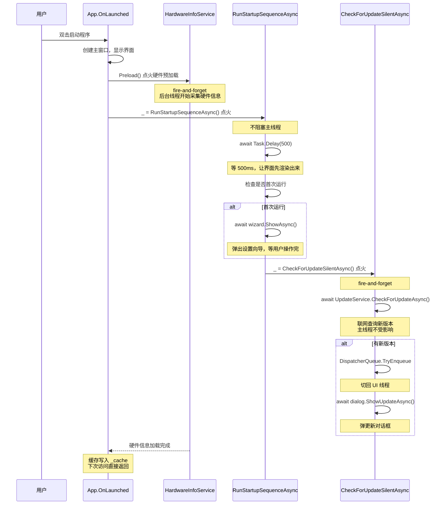

# 第 19 课：async/await 异步编程

## 引入：为什么写着写着界面就卡死了

你写了一个按钮，点下去之后要干三件事：读一个文件、联网查一个更新、往界面上显示结果。你老老实实地一行一行写：

```csharp
var text = File.ReadAllText("data.json");       // 卡 0.3 秒
var update = CheckUpdate();                      // 卡 2 秒
ResultTextBlock.Text = update;                   // 终于更新了
```

点按钮的那一瞬间，整个窗口冻结了。鼠标拖不动，其他按钮点不了，任务管理器里显示"无响应"。这就是同步操作的问题：主线程被一个耗时任务占着，没法抽身去处理鼠标点击、窗口重绘这些界面消息。

本课要讲的 async/await，就是专门解决这个问题的。它让你在等磁盘、等网络的时候，把线程"让出来"去处理别的事情，等结果回来了再继续往下执行。界面不卡，用户不骂。

## 同步和异步的根本差别

同步的意思是你打电话给外卖店点餐，电话那头说"稍等，我查一下菜单"，你就举着电话干等，啥也干不了，直到对方查完告诉你有没有这道菜。异步是你用 App 下单，下完之后关掉手机继续看电视，App 在后台帮你查库存，查到了弹个通知告诉你。

在 C# 里，同步方法长这样：

```csharp
string ReadFile(string path)
{
    return File.ReadAllText(path);  // 调用线程卡在这里，直到读完
}
```

异步方法长这样：

```csharp
async Task<string> ReadFileAsync(string path)
{
    return await File.ReadAllTextAsync(path);  // 卡到 await 的时候，线程被释放
}
```

区别在哪？同步方法调用 `ReadAllText` 时，当前线程被操作系统挂起，磁盘在转的时候线程啥也干不了。异步方法调用 `ReadAllTextAsync` 时，`await` 这一行会把线程还给线程池，操作系统在后台读磁盘，读完之后通知 .NET 运行时"数据就绪"，运行时从线程池里抽一个线程回来接着执行 `return`。

说白了，同步是"我等你，你不出结果我不走"，异步是"我先忙别的，你好了叫我"。

## Task：一个承诺

`Task` 是 C# 异步编程的核心类型。把它理解成一个"未来会给你结果的承诺"就行了。

```csharp
Task<string> futureText = ReadFileAsync("data.json");
// futureText 此刻并不包含结果，它只是一个"承诺"：我会给你一个 string
```

`Task` 的完整写法是 `Task<T>`，其中 `T` 是将来会返回的值的类型。如果不返回任何值，就用不带 `<T>` 的 `Task`：

```csharp
Task SaveAsync();           // 没有返回值
Task<int> CalculateAsync(); // 会返回一个 int
```

你不能直接从一个 `Task<int>` 里把 int 抠出来。你必须用 `await` 才能"兑现"这个承诺：

```csharp
int result = await CalculateAsync();  // 等待承诺兑现，拿到 int
```

## async 和 await 怎么配对

一条规则：只有标记了 `async` 的方法里，才能用 `await`。

```csharp
async Task DoSomethingAsync()
{
    var x = await Step1Async();   // 合法：方法标了 async
    var y = await Step2Async(x);  // 合法
}
```

如果方法没标 `async`，写 `await` 编译器直接报错。

但这个规则有个容易搞混的地方：`async` 本身不创造异步能力。它只是告诉编译器"这个方法里用到了 await，帮我生成状态机代码"。真正决定一个方法是不是异步的，是它内部有没有调用异步的底层操作（比如网络请求、文件 IO），以及它的返回类型是不是 `Task` 或 `Task<T>`。

## await 展开：编译器在背后做了什么

写这一行：

```csharp
var data = await client.GetStringAsync(url);
```

编译器实际生成的代码如果用伪代码表示，大概是这样：

```csharp
var task = client.GetStringAsync(url);
// 检查是否已经完成（比如结果被缓存了）
if (task.IsCompleted)
{
    return task.Result;  // 直接拿结果，不切换线程
}
// 没完成：注册一个回调，释放当前线程
task.ContinueWith(t => {
    // 等网络请求完成后，在合适的上下文里接着跑后面的代码
    var data = t.Result;
    // ... 后续代码
});
```

这个"状态机"还负责处理异常：如果 `GetStringAsync` 出错了，`await` 会把异常重新抛出来，跟同步的 try-catch 用法完全一致。

## 回到 UI 线程：SynchronizationContext

前面说 await 之后"释放线程"，那回来的时候是哪个线程？这取决于调用上下文。

在 WinUI 3 / WPF / WinForms 这类 UI 框架里，主线程上有一个叫做 `SynchronizationContext` 的东西。默认情况下，`await` 在释放线程之前会捕获当前的 `SynchronizationContext`，等异步操作完成后，它会尝试回到原来的上下文继续执行。

这意味着你在 UI 线程（主线程）上写：

```csharp
private async void OnButtonClick(object sender, RoutedEventArgs e)
{
    StatusText.Text = "正在查询...";         // UI 线程
    var result = await QueryDatabaseAsync();  // 耗时操作在后台线程
    StatusText.Text = result;                 // 回到 UI 线程，可以安全更新界面
}
```

中间的 `QueryDatabaseAsync` 在实际干活的时候占用的不是 UI 线程，所以界面不卡。而 `await` 之后的 `StatusText.Text = result` 自动回到了 UI 线程，你不需要自己写 `Dispatcher.Invoke` 之类的代码。这个"自动回来"的特性是 async/await 在 UI 开发里最大的价值。

## ConfigureAwait(false)：我不需要回到 UI 线程

库代码（不是 UI 层）通常不需要回到 UI 上下文。这时候加上 `ConfigureAwait(false)` 可以避免不必要的上下文切换，略微提升性能：

```csharp
var data = await client.GetStringAsync(url).ConfigureAwait(false);
// 这个 await 之后，不保证在哪个线程上继续执行
// 对于纯数据处理来说完全没问题
```

在 WinUI 3 项目里，Service 层的代码（比如 `HardwareInfoService`、`UpdateService`）用 `ConfigureAwait(false)` 是好习惯；但 Page 层的代码（比如点击事件处理）不能加，否则 `await` 之后可能不在 UI 线程上，更新界面会崩。

## 并发：同时干多件事

async/await 只管"不阻塞"，不管"并行"。如果你要同时发起多个异步操作，应该先把 Task 都创建出来，然后一起 await：

```csharp
// 错误做法：一个一个等，总共耗时 = A + B + C
var a = await FetchAAsync();
var b = await FetchBAsync();
var c = await FetchCAsync();

// 正确做法：同时发起，总共耗时 = max(A, B, C)
Task<Data> taskA = FetchAAsync();
Task<Data> taskB = FetchBAsync();
Task<Data> taskC = FetchCAsync();
var results = await Task.WhenAll(taskA, taskB, taskC);
```

`Task.WhenAll` 等所有任务都完成，`Task.WhenAny` 等任意一个任务完成。

## 异常：async 方法里的 try-catch

async 方法抛异常，行为和同步方法一样。`await` 会重新抛出 Task 内部包装的异常：

```csharp
async Task LoadDataAsync()
{
    try
    {
        var json = await File.ReadAllTextAsync("config.json");
        var config = JsonSerializer.Deserialize<Config>(json);
    }
    catch (FileNotFoundException)
    {
        // 文件不存在，用默认配置
    }
    catch (JsonException)
    {
        // 文件格式坏了
    }
}
```

但如果 Task 没被 await（比如 fire-and-forget），异常会被静默吞掉。这就是为什么 fire-and-forget 要谨慎。

## fire-and-forget：不管结果，只管点火

有时候你不需要等结果。比如应用启动时预加载硬件信息：先显示空界面，后台慢慢加载，加载完了再更新界面。

```csharp
_ = LoadAsync();  // 点火，不等结果
```

`_` 是一个 discard（丢弃符），它明确告诉编译器和读代码的人："我知道这是个 Task，我不打算 await 它"。比什么都不写更清晰。TubaTools 里大量用了这种模式。

如果 fire-and-forget 的任务内部崩了，异常不会冒泡到调用方。必须在任务内部自己 catch 处理，或者订阅 `TaskScheduler.UnobservedTaskException` 事件做全局兜底。

## Mermaid 图解：TubaTools 启动时的异步流程



这张图解释了一个关键设计：应用启动时不等人。窗口先出来，硬件信息后台加载，启动向导异步弹出，更新检查默默运行。每一步都不阻塞用户看到界面的速度。

## TubaTools 真实代码

### 示例一：异步启动序列（App.xaml.cs 第 69-109 行）

```csharp
private static async Task RunStartupSequenceAsync()
{
    try
    {
        if (AppSettings.Get("SetupCompleted") == null)
        {
            await Task.Delay(500);  // 等半秒让主窗口完成渲染

            if (MainWindow?.Content is FrameworkElement root)
            {
                var wizard = new SetupWizardDialog
                {
                    XamlRoot = root.XamlRoot,
                    RequestedTheme = ThemeService.CurrentElementTheme
                };
                await wizard.ShowAsync();  // 异步弹窗，不卡主线程
            }
        }
    }
    catch (Exception ex)
    {
        System.Diagnostics.Debug.WriteLine($"[Setup] Wizard failed: {ex.Message}");
    }
    finally
    {
        // 无论向导有没有异常，都标记设置已完成
        if (AppSettings.Get("SetupCompleted") == null)
            AppSettings.Set("SetupCompleted", true);
    }

    if (RuntimeHelper.IsMsixPackaged)
    {
        if (!ToolsBundleService.IsToolsBundleReady())
        {
            await ShowToolsBundleDownloadDialogAsync();  // 等下载对话框走完
        }
        _ = CheckForToolsUpdateSilentAsync();  // 点火更新检查，不等
    }
    else
    {
        _ = CheckForUpdateSilentAsync();  // 点火程序更新检查，不等
    }
}
```

这个方法的每一处设计都是精心权衡过的：

`await Task.Delay(500)` — 半秒的延迟让 WinUI 先把窗口画出来。如果直接弹设置向导，可能窗口还没渲染完，`XamlRoot` 为空导致崩溃。

`await wizard.ShowAsync()` — 设置向导必须等用户点完。这是真的需要 await 的场景：后续步骤依赖向导的结果。

`_ = CheckForToolsUpdateSilentAsync()` — 更新检查完全不需要等。查不查得到新版本，都不影响用户开始用程序。用 `_` 显式丢弃任务。

`try/catch/finally` — async 方法的异常处理跟同步方法写法一样。finally 块保证 "SetupCompleted" 标记一定会被写入，即使向导崩了。

### 示例二：ThreadPool 加 DispatcherQueue（App.xaml.cs 第 164-189 行）

```csharp
private static async Task CheckForUpdateSilentAsync()
{
    try
    {
        var update = await UpdateService.CheckForUpdateAsync();  // 后台线程联网
        if (update is null) return;

        var skipped = UpdateService.GetSkippedVersion();
        if (skipped == update.Version) return;

        if (MainWindow?.DispatcherQueue is null) return;

        MainWindow.DispatcherQueue.TryEnqueue(async () =>
        {
            var dialog = new UpdateDialog();
            await dialog.ShowUpdateAsync(update);

            if (dialog.SkipThisVersion)
                UpdateService.SetSkippedVersion(update.Version);
        });
    }
    catch (Exception ex)
    {
        System.Diagnostics.Debug.WriteLine($"[Update] Silent check failed: {ex.Message}");
    }
}
```

这段代码展示了一个常见的坑：`await UpdateService.CheckForUpdateAsync()` 跑在后台线程上，而创建 UI 对话框必须在 UI 线程上。怎么从后台线程回到 UI 线程？`DispatcherQueue.TryEnqueue`。

`TryEnqueue` 把一个委托（这里是 async lambda）塞进 UI 线程的消息队列里排队执行。lambda 里的 `await dialog.ShowUpdateAsync()` 运行在 UI 线程上，可以安全地操作 XAML 控件。

注意 `DispatcherQueue` 和 `Dispatcher` 的区别：在 WinUI 3 里用的是 `DispatcherQueue`，它是 Windows App SDK 的线程调度机制，和老的 WPF `Dispatcher` 不是同一个东西。

### 示例三：Task.Run 把 CPU 密集型工作丢到后台（HardwareInfoService.cs 第 88-91 行）

```csharp
public static Task<IReadOnlyList<HardwareInfoSection>> LoadAsync(bool forceRefresh = false)
{
    return Task.Run(() => BuildSections(forceRefresh));
}
```

`HardwareInfoService` 的 `BuildSections` 方法里用了大量 Windows WMI 查询来获取 CPU、主板、内存、显卡信息。这些查询虽然本身是同步的（`ManagementObjectSearcher` 的 `Get()` 方法），但查询过程中会阻塞调用线程几百毫秒。

解决方式简单直接：用 `Task.Run` 把整个 `BuildSections` 丢到线程池的一个线程上。调用方拿到的是一个 `Task<IReadOnlyList<HardwareInfoSection>>`，可以用 `await` 等待结果。如果调用方不想等（比如 `Preload`），就直接 fire-and-forget。

注意 `LoadAsync` 本身没有标 `async`。这是因为它的实现里没有 `await`，只是把 `Task.Run` 返回的 Task 直接转发出去。省略 `async` 关键字省掉了编译器生成状态机的开销，属于一种微优化，在像 `HardwareInfoService` 这种被频繁调用的工具类里是有意义的。

### 示例四：Preload 点火即忘（HardwareInfoService.cs 第 76-86 行）

```csharp
public static void Preload()
{
    Task.Run(() =>
    {
        try
        {
            _ = LoadAsync();
        }
        catch { }
    });
}
```

这行 `Preload()` 在 `App.OnLaunched` 里被调用（第 64 行）。`LoadAsync` 返回的 Task 被 `_` 丢弃——预加载的结果不重要，重要的是让 `BuildSections` 跑完后把结果存入 `_cache`（见第 107-110 行的 `lock` 块）。下次有代码调用 `LoadAsync()` 时，缓存命中直接返回，无需再查 WMI。

`try { _ = LoadAsync(); } catch { }` 这个空 catch 是故意的：预加载失败无所谓，正式加载时重新查就是了。

## 常见坑与最佳实践

**async void 只能用于事件处理。** 除了 UI 事件处理器（如 `OnButtonClick`），任何地方的 `async void` 都会导致异常无法被捕获，崩溃无迹可寻。库方法必须返回 `Task` 或 `Task<T>`。

**不要在 async 方法里用 `Task.Result` 或 `Task.Wait()`。** 在 UI 线程上调用 `.Result` 会阻塞 UI 线程，导致死锁：UI 线程在等 Task 完成，而 Task 完成后的回调又要回到 UI 线程执行。

**不要忘了 await。** 如果一个 async 方法返回 Task 但你没有 await 它，异常会被静默吞掉。编译器会发一个 CS4014 警告，不要忽略它。要么 await，要么显式写 `_ =` 表示你故意不等。

**`Task.Run` 不是万能药。** `Task.Run` 适合把 CPU 密集或同步阻塞的代码丢到后台。但如果底层操作本身就是异步的（比如 `HttpClient.GetStringAsync`），就不要用 `Task.Run` 包一层，直接 await 原生的异步方法即可。多一层 `Task.Run` 只是白白多占一个线程。

## 小练习

**第 1 题（填空）**

下面这段代码有什么问题？把改好的代码写出来。

```csharp
private void OnLoadDataClick(object sender, RoutedEventArgs e)
{
    var data = LoadDataAsync().Result;
    ResultText.Text = data;
}
```

**第 2 题（选择）**

以下关于 `async` 关键字的说法，哪个是错的？

A. 标了 `async` 的方法里才能用 `await`
B. `async` 关键字让方法自动变成多线程执行
C. `async` 方法可以返回 `void`、`Task` 或 `Task<T>`
D. 如果一个方法只是返回其他方法生成的 Task、自己不 await，可以不标 `async`

**第 3 题（简答）**

阅读 TubaTools `App.xaml.cs` 的 `RunStartupSequenceAsync()` 方法。为什么 `CheckForUpdateSilentAsync` 用 `_ =` 点火，而 `ShowToolsBundleDownloadDialogAsync` 用 `await` 等待？两者的业务逻辑有什么不同？

**第 4 题（实操）**

写一个简单的 WinUI 3 方法 `async Task LoadWeatherAsync()`：

- 用 `HttpClient` 请求一个天气 API（可以写假地址，只要逻辑对）
- 请求前后分别在 UI 的 `StatusText` 上显示"加载中..."和"加载完成"
- 如果网络请求失败，在 `StatusText` 上显示"加载失败"
- 不要在 UI 线程上等待请求结果

---

<details>
<summary>练习答案（写完后对照）</summary>

**第 1 题答案**

问题：`.Result` 在 UI 线程上同步阻塞，可能导致死锁。正确写法：

```csharp
private async void OnLoadDataClick(object sender, RoutedEventArgs e)
{
    var data = await LoadDataAsync();
    ResultText.Text = data;
}
```

**第 2 题答案**

B 是错的。`async` 关键字不创造多线程，它只启用 await 语法并让编译器生成状态机。异步方法默认运行在调用线程上（直到遇到真正的异步底层操作）。

**第 3 题答案**

`ShowToolsBundleDownloadDialogAsync` 需要在启动序列中**阻塞后续步骤**——必须先确保工具包下载完成（因为用户马上要用工具），所以要用 `await` 等它跑完。`CheckForUpdateSilentAsync` 只是**静默检查有没有新版本**，这个结果不影响用户立即使用程序，所以用 `_ =` 点火即忘，不阻塞启动流程。

**第 4 题答案（参考）**

```csharp
private async Task LoadWeatherAsync()
{
    StatusText.Text = "加载中...";
    try
    {
        using var client = new HttpClient();
        var json = await client.GetStringAsync("https://api.weather.com/v1/current");
        StatusText.Text = "加载完成";
        // 解析 json，更新界面...
    }
    catch
    {
        StatusText.Text = "加载失败";
    }
}
```

`await client.GetStringAsync(...)` 在发出网络请求后释放 UI 线程，等服务器响应回来再切回 UI 线程更新文本。整个过程界面不卡。

</details>
