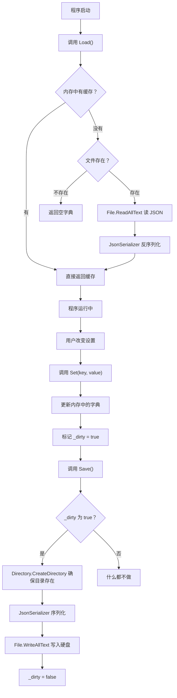

# 第 20 课：文件与路径操作

一个程序如果只能活在内存里，关了就没，那它的用处很有限。你想让软件记住用户的设置，想让它把数据保存到硬盘上，想让它下次启动时还能读到上次的状态——所有这些都离不开文件操作和路径处理。

这一课就讲 C# 和 .NET 里怎么读写文件、怎么操作目录、怎么拼路径。掌握了这些，你就能写出"有记忆"的程序。

## 路径：找到文件的坐标

在操作文件之前，你需要知道文件在哪。Windows 的文件系统是一棵树，根是 C:\、D:\ 这样的盘符，下面有层层嵌套的文件夹，最末端才是文件。一个完整的文件路径长这样：

```
C:\Users\Starry\Documents\笔记.txt
```

在 .NET 里，`System.IO.Path` 这个类提供了处理路径的工具方法。它不管文件存不存在，只管字符串层面的操作。

### 拼接路径：Path.Combine

新手最常犯的错误是手动用 `+` 拼路径字符串，结果忘了加反斜杠，或者多加了一个。

```csharp
// 坏写法——目录后面有没有斜杠你不知道
string path = folder + "\\" + filename;  // 如果 folder 末尾已经带了 \ 呢？

// 好写法——Path.Combine 自动处理斜杠
string path = Path.Combine(folder, filename);
```

`Path.Combine` 的好处是：你不需要操心分隔符，传几个字符串进去，它自动在中间插上合适的 `\`（Linux/Mac 上则是 `/`）。

### 拆解路径

| 方法 | 作用 | 例子（输入 `C:\data\log.txt`） |
|------|------|-----------------------------|
| `Path.GetDirectoryName` | 取出目录部分 | `C:\data` |
| `Path.GetFileName` | 取出文件名 | `log.txt` |
| `Path.GetExtension` | 取出扩展名 | `.txt` |
| `Path.GetFileNameWithoutExtension` | 文件名不带扩展名 | `log` |

这在很多场景下有用。比如你想把 `log.txt` 改成 `log_backup.txt`，用 `GetFileNameWithoutExtension` 拿到 `log`，然后拼上 `_backup.txt` 就行，不用自己写字符串截取逻辑。

### 临时路径和特殊目录

Windows 有一些"有名字"的特殊目录，你不能硬编码路径，因为不同电脑、不同用户，这些目录的位置不一样。.NET 用 `Environment.GetFolderPath` 来获取：

```csharp
// 当前用户的文档文件夹
string docs = Environment.GetFolderPath(Environment.SpecialFolder.MyDocuments);

// 当前用户的 AppData\Local 文件夹——存配置数据的常用位置
string appData = Environment.GetFolderPath(Environment.SpecialFolder.LocalApplicationData);
```

## 文件操作：读、写、查、删

`System.IO.File` 是操作文件的核心类，所有方法都是静态的，直接调就行。

### 读文件

最常用的两种：

```csharp
// 一次性读全部文本
string content = File.ReadAllText(@"C:\data\config.json");

// 一次性读全部行，返回 string[]
string[] lines = File.ReadAllLines(@"C:\data\log.txt");
```

"一次性"意味着它会先把整个文件都加载到内存里。如果文件很大（几百兆以上），这样干会撑爆内存。对于配置文件、JSON 数据这类通常比较小的文件，`ReadAllText` 完全够用。大文件需要流式处理，后面会讲。

### 写文件

```csharp
// 写入文本，覆盖已有内容
File.WriteAllText(@"C:\data\config.json", jsonString);

// 追加内容到文件末尾
File.AppendAllText(@"C:\data\log.txt", logLine + Environment.NewLine);
```

`WriteAllText` 的语义是"把文件设置成这个内容"——如果文件不存在就创建，如果存在就覆盖。`AppendAllText` 则是在末尾追加，不碰原有内容。

### 检查存在性

你在读文件之前，得先确认它确实存在，否则会抛异常。

```csharp
if (File.Exists(path))
{
    string content = File.ReadAllText(path);
}
```

### 复制和删除

```csharp
File.Copy(sourcePath, destPath, overwrite: true);  // 第三个参数：是否覆盖目标
File.Delete(path);
```

### 文件信息：FileInfo

有时候你不光要读文件内容，还想知道文件的大小、创建时间等元数据。这时候用 `FileInfo`：

```csharp
FileInfo info = new FileInfo(@"C:\data\config.json");
long bytes = info.Length;           // 文件大小（字节）
DateTime created = info.CreationTime;
DateTime modified = info.LastWriteTime;
```

`FileInfo` 是一个对象，你得先 `new` 出来再用。它和 `File` 类的区别是：`File` 是静态方法，每次调用都是一次性操作；`FileInfo` 持有一个文件引用，适合多次操作同一个文件。

## 目录操作

文件和目录是不分家的。`System.IO.Directory` 类负责目录层面的事。

```csharp
// 创建目录（如果已存在也不会报错）
Directory.CreateDirectory(@"C:\data\backups");

// 检查目录是否存在
if (Directory.Exists(@"C:\data"))
{
    // 枚举目录下的所有文件（可以指定搜索模式和是否递归子目录）
    string[] files = Directory.GetFiles(@"C:\data", "*.json");
    
    // 枚举目录下的所有子目录
    string[] subdirs = Directory.GetDirectories(@"C:\data");
}

// 删除目录（第二个参数 true 表示递归删除所有子目录和文件——非常危险的操作）
Directory.Delete(@"C:\data\temp", recursive: true);
```

## 一个完整的读写流程

下面是一个典型的"程序启动时加载配置，运行时修改配置并保存"的流程。这套流程在 TubaTools 里真实存在。



这个流程的核心思想很朴素：启动时读，改动时写。用一个 `_dirty` 标记避免没改动时也写硬盘。

## TubaTools 中的真实代码

TubaTools 的 `AppSettings` 类（`Services/AppSettings.cs`）就是一个完整的文件读写案例。它管理 `settings.json` 文件，用键值对的方式存储用户的偏好设置。

### 1. 路径的确定

```csharp
// 来自 Services/ConfigManager.cs
private static readonly string AppDataDir = Path.Combine(
    Environment.GetFolderPath(Environment.SpecialFolder.LocalApplicationData),
    "TubaWinUi3");

public static string GetSettingsPath() => Path.Combine(GetDataDir(), "settings.json");
```

这里做了两件事：先用 `Environment.GetFolderPath` 找到 Windows 分配给当前用户的 `AppData\Local` 目录，再用 `Path.Combine` 往里拼接 `TubaWinUi3\settings.json`。为什么要放 `AppData\Local`？因为这个目录是 Windows 专门给应用程序存放本地数据的，不需要管理员权限，不会在系统更新时被清理。

### 2. 加载配置

```csharp
// 来自 Services/AppSettings.cs
public static Dictionary<string, string> Load()
{
    if (_cache is not null) return _cache;
    try
    {
        if (File.Exists(SettingsPath))
        {
            var json = File.ReadAllText(SettingsPath);
            _cache = JsonSerializer.Deserialize<Dictionary<string, string>>(json) ?? [];
        }
        else
        {
            _cache = [];
        }
    }
    catch
    {
        _cache = [];
    }
    return _cache;
}
```

这里面有几个值得学的点：

- **缓存**：如果有缓存（`_cache is not null`），直接返回，不再读硬盘。因为程序运行期间，设置都在内存里，反复读硬盘是浪费。
- **文件存在检查**：`File.Exists` 放在 `File.ReadAllText` 之前，避免文件不存在时抛异常。
- **JSON 反序列化**：用 `System.Text.Json.JsonSerializer.Deserialize` 把 JSON 字符串转换成 C# 字典。`?? []` 是说如果反序列化结果为 null，就用空字典代替。
- **宽泛的 catch**：如果文件损坏或者格式不对，catch 会兜底，返回空字典，程序至少不会崩溃。

### 3. 保存配置

```csharp
public static void Save()
{
    if (!_dirty || _cache is null) return;
    try
    {
        var dir = Path.GetDirectoryName(SettingsPath)!;
        Directory.CreateDirectory(dir);
        var json = JsonSerializer.Serialize(_cache);
        File.WriteAllText(SettingsPath, json);
        _dirty = false;
    }
    catch { }
}
```

几个细节：

- **`_dirty` 标记**：只有数据确实被改过了才写硬盘。如果 `_dirty` 是 false，直接 return，节省 I/O。
- **`Path.GetDirectoryName`**：从完整路径里摘出目录部分。比如 `C:\Users\...\settings.json` 摘出 `C:\Users\...`。
- **`Directory.CreateDirectory`**：确保目标目录存在。创建已存在的目录不会报错，所以不用先 `Directory.Exists` 检查再创建。
- **JSON 序列化**：把 C# 字典变成 JSON 字符串，然后 `File.WriteAllText` 写进硬盘。

### 4. 设置和获取值

```csharp
public static void Set(string key, string value)
{
    var s = Load();
    s[key] = value;
    _dirty = true;
    Save();
}

public static string? Get(string key)
{
    var s = Load();
    return s.TryGetValue(key, out var v) ? v : null;
}
```

`Set` 方法每次都会调 `Save()`。你可能会想：如果用户连续改了 5 个设置，是不是写了 5 次硬盘？答案是就写 1 次，因为第一次 `Save()` 执行完后 `_dirty` 被设成 false 了，后面四次 `Save()` 进去发现 `_dirty` 是 false 就直接 return 了——除非用户的操作打乱了顺序，但通常不会。

## 更深一点的例子：ConfigManager 的数据迁移

TubaTools 的 `ConfigManager`（`Services/ConfigManager.cs`）还有一个更复杂的文件操作场景——把数据从一个目录迁移到另一个目录。

```csharp
public static bool MigrateData(ConfigLocation targetLocation, bool migrate)
{
    var sourceDir = GetDataDir();
    var targetDir = targetLocation == ConfigLocation.AppRoot ? AppRootDir : AppDataDir;

    if (string.Equals(sourceDir, targetDir, StringComparison.OrdinalIgnoreCase)) return true;

    try
    {
        if (migrate && Directory.Exists(sourceDir))
        {
            Directory.CreateDirectory(targetDir);

            foreach (var file in Directory.EnumerateFiles(sourceDir))
            {
                var name = Path.GetFileName(file);
                var dest = Path.Combine(targetDir, name);
                File.Copy(file, dest, true);
            }

            foreach (var dir in Directory.EnumerateDirectories(sourceDir))
            {
                var name = Path.GetFileName(dir);
                var destDir = Path.Combine(targetDir, name);
                CopyDirectory(dir, destDir);
            }

            try { Directory.Delete(sourceDir, true); } catch { }
        }
        return true;
    }
    catch { return false; }
}
```

这个方法的路径操作几乎涵盖了本课讲的全部知识点：

- `Directory.Exists` 检查源目录在不在
- `Directory.CreateDirectory` 创建目标目录
- `Directory.EnumerateFiles` 遍历源目录下的文件
- `Path.GetFileName` 从完整路径里摘出纯文件名
- `Path.Combine` 拼出目标路径
- `File.Copy` 复制文件过去
- `Directory.EnumerateDirectories` 遍历子目录，递归复制（`CopyDirectory` 是私有辅助方法，里面递归调用自己）
- `Directory.Delete(sourceDir, true)` 把源目录删掉（第二个参数 `true` 表示递归删除）

整个过程就是一个"搬家"操作：先把东西复制到新地方，再把老地方的清掉。

## 常见陷阱

**陷阱一：忘记释放文件锁。** `File.ReadAllText` 和 `File.WriteAllText` 这类"一次性"方法会自动打开和关闭文件，你不需要手动管。但如果你用了 `FileStream`，就需要用 `using` 或 `Dispose` 释放。

**陷阱二：硬编码路径。** 不要写 `C:\Program Files\MyApp\config.json`。不同电脑的 Program Files 可能在 D 盘，用户可能没有 C 盘。应该用 `Environment.GetFolderPath` 或 `Path.Combine` 动态构建路径。

**陷阱三：跨平台的分隔符。** `.NET` 现在支持跨平台，`Path.Combine` 在 Linux 上会自动用 `/`，在 Windows 上自动用 `\`。但如果你手动写死了 `\`，到了 Linux 上就坏了。养成用 `Path.Combine` 的习惯，从这一课开始。

**陷阱四：文件编码问题。** `File.ReadAllText` 默认用 UTF-8 编码，中文文件一般不会有问题。但如果你遇到乱码（比如一些老旧的 ANSI 编码文件），需要显式指定编码：

```csharp
string content = File.ReadAllText(path, Encoding.GetEncoding("GB2312"));
```

## 小练习

1. **填空题**：写出以下操作对应的 C# 方法调用——
   - 检查文件是否存在：`_____________`
   - 读取文件的全部文本：`_____________`
   - 将字符串写入文件（覆盖）：`_____________`
   - 拼接两个路径组件：`_____________`
   - 获取当前用户的文档目录：`_____________`

2. **代码找错**：下面这段代码有至少两个问题，请指出并修正。

   ```csharp
   string path = "C:\\Data" + "\\config.json";
   string content = File.ReadAllText(path);
   Console.WriteLine(content);
   ```

3. **简答题**：TubaTools 的 `AppSettings.Load()` 方法里，为什么先用 `File.Exists` 判断，而不直接 `ReadAllText` 再 catch 异常？这两种写法各有什么适用场景？

4. **实操题**：写一个控制台程序，功能是记录用户每次输入的文本：
   - 用户输入一行文字，按回车后追加到 `C:\Temp\mynotes.txt`（如果目录不存在就创建）
   - 输入空行时退出
   - 退出前在屏幕上打印出历史上所有记录的内容
   - 要求使用本课讲过的 `Directory.CreateDirectory`、`File.AppendAllText`、`File.ReadAllText` 方法

## 练习答案

<details>
<summary>点击展开答案</summary>

**第 1 题：**
- 检查文件是否存在：`File.Exists(path)`
- 读取文件的全部文本：`File.ReadAllText(path)`
- 将字符串写入文件（覆盖）：`File.WriteAllText(path, content)`
- 拼接两个路径组件：`Path.Combine(path1, path2)`
- 获取当前用户的文档目录：`Environment.GetFolderPath(Environment.SpecialFolder.MyDocuments)`

**第 2 题：**
问题一：`"C:\\Data"` 这个字面量在 C# 里没有问题（`\\` 是转义后的 `\`），但可读性不好，建议用 `@"C:\Data"` 逐字字符串。问题二也是主要问题：没有检查 `C:\Data\config.json` 是否存在就直接 `ReadAllText`，如果文件不存在会抛 `FileNotFoundException`。正确做法是先用 `File.Exists` 判断。

修正后：
```csharp
string path = Path.Combine(@"C:\Data", "config.json");
if (File.Exists(path))
{
    string content = File.ReadAllText(path);
    Console.WriteLine(content);
}
else
{
    Console.WriteLine("文件不存在");
}
```

（如果只认识到 `Path.Combine` 更好的问题，也算对两个了。）

**第 3 题：**
`File.Exists` + `ReadAllText` 的方式，你可以区分"文件不存在"和"文件读取出错"两种情况。文件不存在时可以采取默认行为（比如返回空字典），读取出错时也可以记录日志或做不同处理。

直接 `ReadAllText` + catch 的方式更简洁，把一切异常统一处理，适合"我不在乎为什么失败，反正失败了就用默认值"的场景。`AppSettings.Load()` 实际上用了这两种方式的混合：`File.Exists` 区分有无文件，外面的 try/catch 兜底其他异常（比如文件损坏）。

在实际项目中，对于配置文件这种场景，两种写法都可以。但如果文件不存在是一种"正常情况"而不是"异常情况"，用 `File.Exists` 更语义清晰——异常应该留给真正意外的情况。

**第 4 题：**
```csharp
using System;
using System.IO;

class Program
{
    static void Main()
    {
        string dir = @"C:\Temp";
        string file = Path.Combine(dir, "mynotes.txt");

        Directory.CreateDirectory(dir);

        Console.WriteLine("输入内容（空行退出）：");
        while (true)
        {
            string line = Console.ReadLine();
            if (string.IsNullOrEmpty(line)) break;
            File.AppendAllText(file, line + Environment.NewLine);
        }

        Console.WriteLine("\n--- 历史记录 ---");
        if (File.Exists(file))
        {
            Console.WriteLine(File.ReadAllText(file));
        }
        else
        {
            Console.WriteLine("（无记录）");
        }
    }
}
```

</details>
