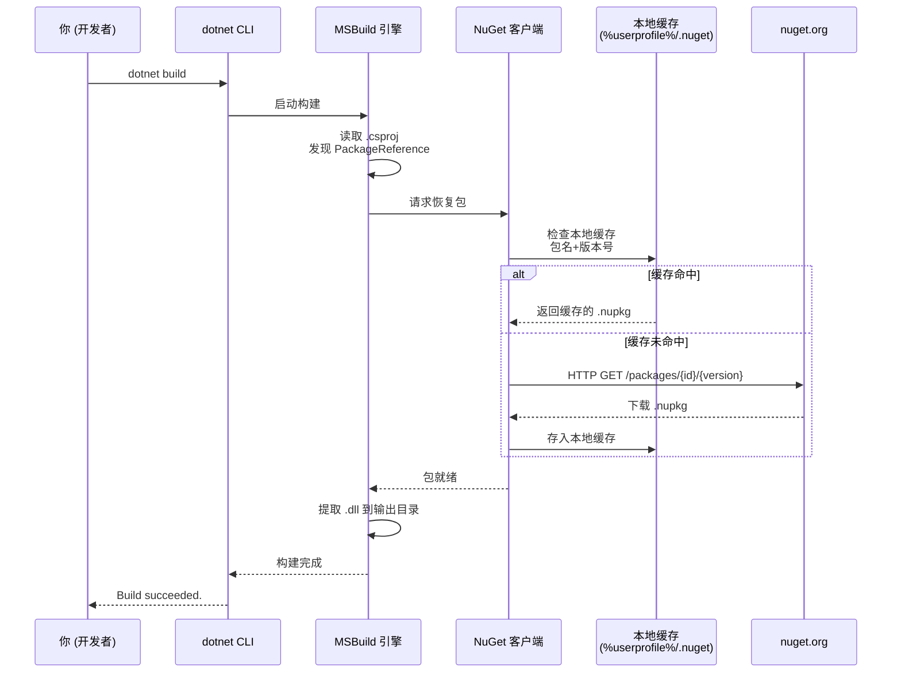

# 第 21 课：NuGet 包管理器

## 引入：别从轮子造起

假设你要写一个程序，功能是解析 JSON 配置文件。你可以花三天时间，自己写一个 JSON 解析器——处理花括号、方括号、转义字符、Unicode 编码，想想就头疼。或者你可以用 10 秒钟，装一个别人已经写好的、经过几万个项目验证过的 JSON 库。

这不是偷懒。这叫"站在巨人的肩膀上"。现实中每个程序员都在这么做。你手机里的 App，代码可能只有 20% 是开发者自己写的，剩下 80% 都来自各种开源库——网络请求、图片加载、数据库、加密、日志，全有现成的。

NuGet 就是 .NET 生态里的"零部件市场"。你打开它，搜索你需要的功能，找到对应的包，装上去，搞定。本课教你 NuGet 怎么用，怎么管理包的版本，怎么理解 .csproj 文件里那些 PackageReference 到底是什么。

## NuGet 是什么

一句话：NuGet 是 .NET 的包管理器。它干了三件事：

**第一，托管包。** nuget.org 是一个巨大的在线仓库，里面有 30 多万个包。每一个包就是一堆编译好的 .dll 文件，加上一些说明文档。包的作者把代码写好、编译好、打包好，上传到 nuget.org。

**第二，分发包。** 你在 Visual Studio 或者命令行里说"我要装 Newtonsoft.Json"，NuGet 就自动从 nuget.org 下载这个包的最新版本，放到你电脑上的全局缓存里。

**第三，管理依赖。** 一个包可能依赖另一个包。比如你装了包 A，包 A 又依赖包 B 和包 C。NuGet 自动帮你把 B 和 C 也装好。这叫"传递依赖解析"。

NuGet 不是个新鲜概念。Python 有 pip，Node.js 有 npm，Java 有 Maven，Rust 有 Cargo。干的事都一样：让你不用自己造轮子。

## 包、元数据、版本号

一个 NuGet 包本质上是一个 .nupkg 文件，里面包含：

- **程序集**（.dll）—— 真正的代码
- **.nuspec 文件** —— 元数据：包名、版本号、作者、描述、依赖关系
- **内容文件** —— 可能包含图片、配置文件、MSBuild 脚本等

每个包有三个关键标识：

**包 ID**，比如 `Newtonsoft.Json`。这是包的名字，全网唯一。nuget.org 不允许两个包叫同一个名字。

**版本号**，比如 `13.0.3`。NuGet 用的语义版本号（Semantic Versioning），格式是 `主版本.次版本.修订号`。规则很简单：
- 主版本号变了 = 不兼容的 API 改动，你升级可能会挂
- 次版本号变了 = 加了新功能，但向后兼容，你升级不会挂
- 修订号变了 = 修了个 bug，没加新功能，随便升级

**目标框架**（TFM），比如 `net10.0`、`netstandard2.0`。同一个包可能为不同的 .NET 版本准备了不同的 .dll。

## PackageReference：.csproj 里的包引用

打开 TubaTools 的主项目文件 `TubaWinUi3.csproj`，你会看到这么一段：

```xml
<ItemGroup>
    <PackageReference Include="LibreHardwareMonitorLib" Version="0.9.6" />
    <PackageReference Include="Microsoft.Diagnostics.Tracing.TraceEvent" Version="3.2.2" />
    <PackageReference Include="Microsoft.Windows.SDK.BuildTools" Version="10.0.26100.7705" />
    <PackageReference Include="Microsoft.WindowsAppSDK" Version="1.8.260317003" />
    <PackageReference Include="System.Diagnostics.EventLog" Version="10.0.2" />
    <PackageReference Include="System.Drawing.Common" Version="10.0.0" />
    <PackageReference Include="System.Management" Version="10.0.8" />
</ItemGroup>
```

每一行 `PackageReference` 就是一句话："我要用这个包，这个版本。"当项目构建时，MSBuild 读这些行，去 NuGet 缓存里找到对应的 .dll，把它们加进编译过程。如果没有，就先去下载。

这里面有几个有意思的包值得说说：

- **LibreHardwareMonitorLib 0.9.6** —— 一个开源硬件监控库，能读取 CPU 温度、风扇转速、主板传感器数据。TubaTools 的"处理器工具"和"显卡工具"全靠它。
- **Microsoft.WindowsAppSDK** —— Windows App SDK，WinUI 3 的核心运行时。没有这个包，你的 WinUI 3 程序根本跑不起来。注意版本号 `1.8.260317003`，它不遵守标准的"三段式"语义版本，这是微软自己的编号体系。
- **System.Management** —— 提供 WMI（Windows Management Instrumentation）能力，可以查询 Windows 系统的底层信息。TubaTools 用它来获取操作系统版本、已安装的补丁、用户账户等信息。
- **Microsoft.Diagnostics.Tracing.TraceEvent** —— 一个性能追踪库。TubaTools 用它做 ETW（Event Tracing for Windows）跟踪，分析系统性能事件。

TubaTools 还有一个兼容版本的项目 `TubaWinUi3.Compatible.csproj`，它面向 .NET Framework 4.5，用的是另一套包：

```xml
<ItemGroup>
    <PackageReference Include="MetroModernUI" Version="1.4.0" />
    <PackageReference Include="Newtonsoft.Json" Version="13.0.3" />
</ItemGroup>
```

`MetroModernUI` 是一个老牌 WinForms UI 主题库，让传统的 WinForms 界面看起来像 Windows 8/10 的风格。`Newtonsoft.Json` 你可能听过——它是 .NET 生态里最出名的 JSON 库，装机量几十亿次。

## 包是怎么来的：nuget.org 和包源

所有的包都托管在 nuget.org 上。这是一个由微软维护的公共仓库，任何人注册之后都可以上传自己的包。企业也可以搭私有 NuGet 服务器，把内部库放在上面，不走公网。

你机器上的 NuGet 配置会维护一个"包源列表"。默认只有 nuget.org。如果你想加一个私有源，可以用命令：

```
dotnet nuget add source https://mycompany.com/nuget/index.json -n MyCompany
```

有时候你需要临时从某个目录装包（比如公司内网共享文件夹），也可以把本地文件夹添加为源。NuGet 会按配置顺序依次搜索。

## 图解：NuGet 恢复流程

下面这张序列图展示了从你执行 `dotnet build` 到所有包就位的完整过程：



整个过程里有一个关键点：NuGet 只看包名和版本号。如果本地缓存已经有一个同版本的包，它直接拿来用，完全不走网络。这就是为什么第一次构建慢（要下载），之后快（缓存命中）。

## 常用 NuGet 命令

你不需要每次都用 Visual Studio 的鼠标点点点来管理包。掌握命令行更快，也更适合自动化和 CI/CD 场景。

### 安装包

```bash
dotnet add package Newtonsoft.Json
```

这条命令直接往当前目录的 .csproj 里插入一行 `<PackageReference Include="Newtonsoft.Json" Version="13.0.3" />`（版本号自动取最新的稳定版）。

如果你想指定版本：

```bash
dotnet add package Newtonsoft.Json --version 13.0.2
```

### 移除包

```bash
dotnet remove package Newtonsoft.Json
```

自动从 .csproj 里删掉对应的 PackageReference 行。

### 列出已安装的包

```bash
dotnet list package
```

输出当前项目引用了哪些包，每个包的版本号，以及是否有更新的版本可用。

### 更新包

```bash
dotnet list package --outdated
```

先看看哪些包过期了。然后：

```bash
dotnet add package LibreHardwareMonitorLib --version 1.0.0
```

NuGet 没有 "dotnet update package" 命令，更新就是加一个新版本号。它会自动替换 .csproj 里的旧版本号。

### 恢复包（restore）

如果你从 Git 上拉了一个项目，它的 .csproj 里有 PackageReference，但是本地还没有下载那些包。这时运行：

```bash
dotnet restore
```

这条命令会读取所有 PackageReference，对比本地缓存，缺啥下载啥。之后你再 `dotnet build` 就不会因为缺包报错了。

注意：`dotnet build` 默认会自动调用 restore，所以你一般不需要手动跑 restore。但有些 CI/CD 脚本会显式先跑 restore，再跑 build，方便分阶段排查问题。

## 版本浮动：`*` 和范围

NuGet 支持版本范围，但你很少需要用到。了解即可：

```xml
<!-- 精确版本 -->
<PackageReference Include="Newtonsoft.Json" Version="13.0.3" />

<!-- 允许任何 13.0.x -->
<PackageReference Include="Newtonsoft.Json" Version="13.0.*" />

<!-- 大于等于 13.0.0，小于 14.0.0 -->
<PackageReference Include="Newtonsoft.Json" Version="[13.0.0, 14.0.0)" />
```

生产项目里基本都用精确版本。版本浮动带来的是"不可重现的构建"——同一个代码仓库，今天编译和明天编译用的包版本可能不一样。这在团队协作里很危险。

## 包锁文件：让构建可重现

为了解决"不可重现"的问题，.NET 支持生成 lock file（锁文件）。在 .csproj 的 PropertyGroup 里加一行：

```xml
<RestorePackagesWithLockFile>true</RestorePackagesWithLockFile>
```

这会在项目目录下生成 `packages.lock.json`。这个文件记录了每个包的确切版本，以及它的所有间接依赖的版本。把它提交到 Git，整个团队就有了"同一个构建结果"的保证。

TubaTools 项目里没有开启这个选项，因为它是个单人维护的开源项目。但企业级项目里基本都会开。

## PackageReference 与旧式 packages.config

如果你是看着老 .NET Framework 教程学的，你可能见过 `packages.config` 文件。它是旧时代的 NuGet 管理方式：

```xml
<?xml version="1.0" encoding="utf-8"?>
<packages>
  <package id="Newtonsoft.Json" version="13.0.3" targetFramework="net48" />
</packages>
```

PackageReference 和 packages.config 不能共存。PackageReference 是 2017 年以后的新标准，所有 .NET Core / .NET 5+ 项目默认用它。它比 packages.config 好在哪里：

- PackageReference 写在 .csproj 里，一个文件管所有
- 支持传递依赖解析更干净
- 支持条件引用（比如 `Condition="'$(Configuration)' == 'Debug'"`）
- 磁盘占用更小（按需引用，不是整个包全部加载）

如果你接手的项目还在用 packages.config，想迁移到 PackageReference，.NET SDK 里有一条命令可以一键搞定，但这是进阶内容，不展开。

## 包的全局缓存与清理

NuGet 下载的所有包都存在全局缓存里。Windows 上的默认路径是：

```
%userprofile%\.nuget\packages
```

也就是 `C:\Users\你的用户名\.nuget\packages`。这个文件夹装着所有你装过的包的所有版本。时间长了，几百个项目的包堆在一起，能占几十 GB。

想清理过期的缓存：

```bash
dotnet nuget locals all --clear
```

这条命令清空所有本地 NuGet 缓存（HTTP 缓存、临时文件、全局包目录）。之后构建项目时，NuGet 会重新下载所有包。一般只在磁盘快满的时候用。

## TubaTools 真实依赖分析

回来看 TubaTools 的包引用，它展示了 NuGet 在实际项目中的使用模式。

主项目 `TubaWinUi3.csproj` 面向 `net10.0-windows10.0.26100.0`，这是 .NET 10 的 Windows 专用变体。它的包大致分三类：

**Windows 平台包：** `Microsoft.WindowsAppSDK` 和 `Microsoft.Windows.SDK.BuildTools`。这两个是 WinUI 3 程序的标配。不用 NuGet 装它们，你就没法调 `Microsoft.UI.Xaml` 里的任何东西。

**系统底层包：** `System.Management`、`System.Diagnostics.EventLog`、`System.Drawing.Common`。注意它们虽然名字像 .NET 自带的，但实际上是独立的 NuGet 包。微软把很多"原 .NET Framework 自带"的功能拆成了单独的 NuGet 包，这样 .NET Core / .NET 5+ 项目就可以按需引入，不用带着整个框架跑。

**第三方包：** `LibreHardwareMonitorLib` 是第三方开源库，用来读硬件传感器。`Microsoft.Diagnostics.Tracing.TraceEvent` 虽然挂着 Microsoft 的名字，但它是独立的可选库，不随 .NET SDK 一起安装。

兼容版项目则更"复古"：面向 .NET Framework 4.5，只用两个包（MetroModernUI 和 Newtonsoft.Json），其余功能（System.Management、System.Drawing）通过 Framework 自带的 Reference 机制引入，不走 NuGet。这是 Framework 时代的典型做法。

## 小练习

**第 1 题（选择）** 下面哪条命令可以把一个 NuGet 包添加到项目中？

A. `dotnet install package Newtonsoft.Json`
B. `dotnet add package Newtonsoft.Json`
C. `dotnet nuget add Newtonsoft.Json`
D. `dotnet package add Newtonsoft.Json`

**第 2 题（填空）** 你的项目引用了 `Newtonsoft.Json 13.0.3`，而 `Newtonsoft.Json` 内部又引用了 `System.Text.Json 8.0.0`。你构建项目时，NuGet 自动把 `System.Text.Json 8.0.0` 也下载回来。这种机制叫 ______。

**第 3 题（简答）** TubaTools 主项目的 .csproj 里引用了 `Microsoft.WindowsAppSDK` 这个包。它具体干什么？如果没有这个包，WinUI 3 程序还能编译运行吗？为什么？

**第 4 题（实操）** 用命令行进入任何一个有 .csproj 文件的项目目录（如果没有，用 `dotnet new console` 新建一个控制台项目），依次执行以下操作：

1. `dotnet add package Newtonsoft.Json --version 13.0.3`
2. 用记事本打开 .csproj 文件，找到新增的 `<PackageReference>` 行，截图或记录
3. `dotnet list package` 查看当前所有包
4. `dotnet remove package Newtonsoft.Json`
5. 再打开 .csproj 确认那一行消失了

## 练习答案

**第 1 题：** B。`dotnet add package` 是 .NET CLI 提供的包安装命令。A 和 D 不存在，C（`dotnet nuget add`）是添加包源，不是安装包。

**第 2 题：** 传递依赖解析（或：传递依赖 / transitive dependency resolution）。

**第 3 题：** `Microsoft.WindowsAppSDK` 是 WinUI 3 的运行时包。它提供了 `Microsoft.UI.Xaml` 命名空间下的所有类型——Window、Button、TextBox、StackPanel、NavigationView 等。没有它，WinUI 3 程序无法编译，因为代码里所有的 UI 类型都找不到来源。这个包本质上是把 Windows 10/11 上原本内置在操作系统里的 WinUI 2.x 控件独立成了可分发版本，使得 WinUI 3 程序不再绑定操作系统版本。
