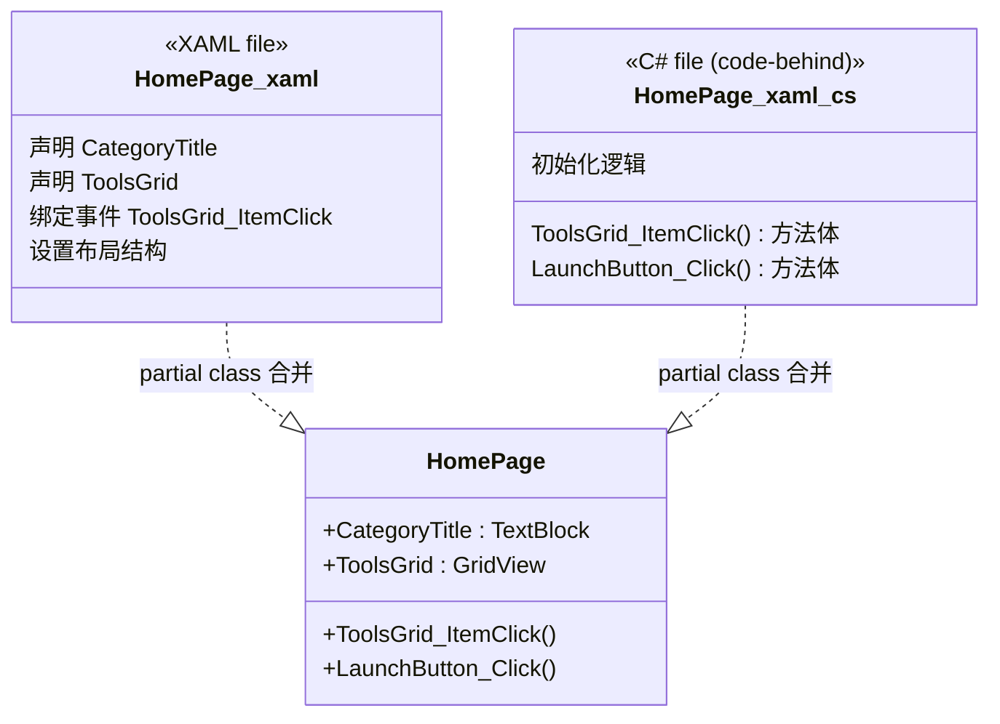
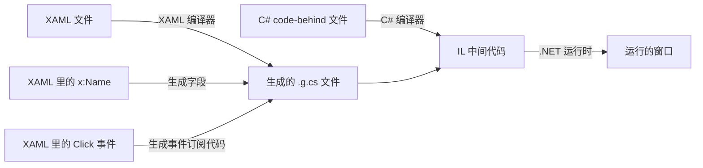

# 第 22 课：XAML 是什么

你前面 21 课写的都是命令行程序。黑底白字，敲命令，看输出。现在我们要做点不一样的——做一个有窗口、有按钮、有图片、能点击能拖动的程序。Windows 上的图形界面程序，在 .NET 技术栈里，界面是用一种叫 XAML 的语言来描述的。

这一课不讲怎么布局、不讲怎么绑定数据、不讲怎么切换页面。那些后面再讲。这一课只解决一个问题：XAML 到底是什么，它长什么样，它解决什么问题。

## 界面代码长什么样

假设你想做一个窗口，窗口里有一个按钮，按钮上写着"点我"，点了之后弹出一个提示。用传统 C# 代码写，大概是这样：

```csharp
var window = new Window();
var button = new Button();
button.Content = "点我";
button.Width = 100;
button.Height = 40;
button.HorizontalAlignment = HorizontalAlignment.Center;
button.VerticalAlignment = VerticalAlignment.Center;
button.Click += (s, e) => MessageBox.Show("你好");
window.Content = button;
window.Activate();
```

能跑。但问题是，当你界面变复杂的时候——假设你有一个三层嵌套的 Grid，里面有十几个控件，每个控件有十几条属性——用 C# 代码把这一层层结构搭起来，代码会变得很长、很乱，读起来完全不像一个"界面"，更像一本流水账。

XAML 换了一种写法。同样的界面，用 XAML 描述：

```xml
<Window>
    <Button Width="100" Height="40"
            HorizontalAlignment="Center"
            VerticalAlignment="Center"
            Click="Button_Click">
        点我
    </Button>
</Window>
```

区别是：XAML 用标签的嵌套关系来表达控件的父子关系。代码的缩进就是界面的层级。你一眼能看出 Button 在 Window 里面，Window 是爸爸，Button 是儿子。等界面嵌套到三四层的时候，这种树状结构比一行行 `window.Content = button` 直观得多。

## XAML 的全称和本质

XAML 全称是 Extensible Application Markup Language。拆开看：

- **Extensible（可扩展）**：你可以定义自己的控件、自己的标记
- **Application（应用程序）**：它是用来写应用程序界面的
- **Markup Language（标记语言）**：它是标记语言，不是编程语言

最后一点最容易被误解。XAML 不是编程语言。它不"运行"。它只是一份**描述文件**——描述了界面长什么样、有什么控件、控件之间什么关系。真正让程序跑起来的，是 C# 代码。XAML 负责"画"，C# 负责"动"。

这句话很重要：**XAML 文件最终会被编译成 C# 代码**。你写的 `<Button Content="点我" />`，编译时 WPF/WinUI 的构建工具链会把它翻译成等价的 `new Button() { Content = "点我" }`。XAML 是 C# 代码的另一种写法，一种对人眼更友好的写法。它不是独立于 C# 的魔法语言。

### XAML 的"兄弟"——HTML

如果你见过 HTML，XAML 看起来会很眼熟：

```html
<!-- HTML -->
<div>
    <button class="btn-primary" onclick="handleClick()">点我</button>
</div>
```

```xml
<!-- XAML -->
<Grid>
    <Button Style="{StaticResource PrimaryButtonStyle}" Click="Button_Click">点我</Button>
</Grid>
```

都是尖括号，都是标签嵌套，都用属性控制外观。但别被外表骗了。它们有本质区别：

- HTML 是给浏览器看的，浏览器负责渲染。HTML 本身不编译成 JavaScript。
- XAML 是给 .NET 编译器看的，编译时会生成对应的 C# partial class。XAML 和 C# 是同一个类的两个"半身"。

## XAML 与 C# 的"暗合作"

每个 XAML 文件背后一定有一个 C# 文件在配合。这叫 **code-behind**。比如 `HomePage.xaml` 和 `HomePage.xaml.cs`，它们是同一个类 `HomePage` 的两个部分。

XAML 文件顶部有一行关键的声明：

```xml
<Page x:Class="TubaWinUi3.Pages.HomePage"
      xmlns="..."
      ...>
```

`x:Class="TubaWinUi3.Pages.HomePage"` 的意思是："这个 XAML 文件描述的界面，属于类 `TubaWinUi3.Pages.HomePage`"。编译时，编译器会根据 XAML 中所有带 `x:Name` 的控件，在对应的 C# 类中自动生成字段。你在 XAML 里写：

```xml
<TextBlock x:Name="CategoryTitle" FontSize="30" FontWeight="SemiBold" />
```

C# 代码里就能直接访问 `this.CategoryTitle.Text = "工具"`——不需要手动 `new TextBlock()`，不需要手动 `FindControl("CategoryTitle")`。

这种合作机制叫 **partial class**。同一个类，定义在两个文件里：`.xaml` 文件定义界面部分，`.xaml.cs` 文件定义逻辑部分。编译器把它们俩拼成完整的一个类。



## TubaTools 里真实的 XAML

看一个真实的例子。TubaTools 首页的文件 `Pages/HomePage.xaml` 开头几行：

```xml
<Page
    x:Class="TubaWinUi3.Pages.HomePage"
    xmlns="http://schemas.microsoft.com/winfx/2006/xaml/presentation"
    xmlns:x="http://schemas.microsoft.com/winfx/2006/xaml"
    xmlns:d="http://schemas.microsoft.com/expression/blend/2008"
    xmlns:local="using:TubaWinUi3.Pages"
    xmlns:mc="http://schemas.openxmlformats.org/markup-compatibility/2006"
    NavigationCacheMode="Enabled"
    mc:Ignorable="d">
```

这里一下子抛出好几个 `xmlns`。逐个解释：

- **`xmlns`**（默认命名空间）：指向微软的 WinUI 命名空间。这里面有 Button、Grid、TextBlock 等所有标准控件。没有这个前缀，直接写 `<Button>` 就表示用的是这个命名空间里的 Button。
- **`xmlns:x`**：`x` 是 XAML 语言自身的命名空间。里面有 `x:Class`、`x:Name`、`x:Key` 这些基础设施。注意 `x` 不是控件名，是 XAML 语言的"元命名空间"。
- **`xmlns:local`**：`local` 是自定义前缀，指向项目的 `TubaWinUi3.Pages` 命名空间。当你需要引用自己写的类（比如自定义的转换器）时，就用 `local:MyConverter`。
- **`xmlns:d`**：设计时命名空间。只在 VS 设计器里生效，运行时忽略。`d:Background="Red"` 让你在设计器里看到红色背景，但程序跑起来不会有。
- **`xmlns:mc`**：标记兼容性命名空间。配合 `mc:Ignorable="d"` 使用，意思就是"d 前缀的东西，运行时可以忽略"。

说白了，`xmlns` 就是在 XAML 里告诉编译器"这个名字在哪儿找"。和 C# 文件顶部的 `using System;` 是一回事——`using` 是给 C# 编译器看的，`xmlns` 是给 XAML 编译器看的。

### 一个完整的控件

接着看 HomePage.xaml 里的一个 TextBlock：

```xml
<TextBlock
    x:Name="CategoryTitle"
    FontSize="30"
    FontWeight="SemiBold" />
```

没多少东西，但包含了 XAML 的三种核心语法：

1. **元素名**：`TextBlock`——控件的类型
2. **x:Name**：`CategoryTitle`——这个控件的变量名，C# 里用它访问
3. **属性**：`FontSize="30"`、`FontWeight="SemiBold"`——设置控件的属性值

注意这行以 `/>` 结尾。这是自闭合标签，表示这个元素没有子元素。等价于 `<TextBlock ...></TextBlock>`。当控件不需要嵌套任何东西的时候，自闭合简洁得多。

### 有子元素的控件

再看一个包含子元素的例子：

```xml
<StackPanel Spacing="4">
    <StackPanel Orientation="Horizontal" Spacing="8">
        <TextBlock x:Name="CategoryTitle" FontSize="30" FontWeight="SemiBold" />
        <TextBlock x:Name="ToolCountText" VerticalAlignment="Bottom"
                   Margin="0,0,0,4" FontSize="14" Opacity="0.6" />
    </StackPanel>
    <TextBlock x:Name="CategorySubtitle" Opacity="0.72" />
</StackPanel>
```

这里外层 `StackPanel` 包含两个子元素：一个内层 `StackPanel` 和一个 `TextBlock`。内层 `StackPanel` 又包含两个 `TextBlock`。代码缩进直接反映了控件的包含关系：

```
StackPanel (外层)
  |-- StackPanel (内层)
  |     |-- TextBlock (CategoryTitle)
  |     |-- TextBlock (ToolCountText)
  |-- TextBlock (CategorySubtitle)
```

你在脑子里想象界面的时候，这个树状结构就是你应该看到的画面。最外层控件在最左边，嵌套越深越往右。XAML 的缩进就是界面的层级。

## 属性的两种写法

上面的代码里，属性全写在标签内：`FontSize="30"`。这种写法叫 **attribute syntax（属性语法）**，简单属性用着方便。

但不是所有属性都能这样写。如果属性值本身是一个复杂对象，或者需要多行描述，就要用 **property element syntax（属性元素语法）**：

```xml
<Button Width="100" Height="40">
    <Button.Background>
        <LinearGradientBrush StartPoint="0,0" EndPoint="1,1">
            <GradientStop Color="Blue" Offset="0" />
            <GradientStop Color="Red" Offset="1" />
        </LinearGradientBrush>
    </Button.Background>
    点这里
</Button>
```

`Button.Background` 这个写法：点号前面是控件类型，点号后面是属性名。标签体内是这个属性的值。整个 `<Button.Background>...</Button.Background>` 替换掉了原来写在 `Background="..."` 引号里的内容。当属性值太复杂塞不进一对引号的时候，就用这个写法。

TubaTools 里大量使用属性元素语法来定义资源和模板。比如 `Page.Resources`：

```xml
<Page.Resources>
    <local:FavGlyphConverter x:Key="FavGlyphConverter" />
    <Style x:Key="TagRadioButtonStyle" TargetType="RadioButton">
        <Setter Property="Background" Value="{ThemeResource ...}" />
        ...
    </Style>
</Page.Resources>
```

`Page.Resources` 里面不是一行简单的字符串，而是好几个 Converter 和 Style 对象。属性元素语法让这些复杂内容有了容身之处。

## 两种特殊属性：附加属性和标记扩展

看完基本属性，还有两个 XAML 特有的东西需要认识。

### 附加属性（Attached Property）

看 HomePage.xaml 里的这行：

```xml
<TextBlock Grid.Row="1" Text="工具描述" />
```

`Grid.Row="1"` 是什么意思？TextBlock 自己并没有一个叫 `Grid.Row` 的属性。`Grid.Row` 是 Grid 类定义的附加属性。它的含义是：把 TextBlock 放在 Grid 的第 1 行（从 0 开始数）。

附加属性的本质是"借用"——控件 A 把一个属性附加到控件 B 身上。Grid 控制了子元素的行列位置，DockPanel 控制了子元素的停靠方式，Canvas 控制了子元素的坐标。这些都不是子元素自己的属性，而是父容器"附加"给它们的。

语法特征：`类型名.属性名`。点和普通属性元素语法一样，但它可以直接写在标签的属性列表里。

### 标记扩展（Markup Extension）

HomePage.xaml 里大量出现花括号：

```xml
<Border Background="{ThemeResource CardBackgroundFillColorDefaultBrush}" />
<TextBlock Text="{Binding Name}" />
<FontIcon Glyph="{Binding IsFavorite, Converter={StaticResource FavGlyphConverter}}" />
```

花括号里面的内容是 XAML 的**标记扩展**。标记扩展是一种动态赋值机制——属性的值不是在 XAML 里写死的，而是在运行时计算出来的。

常见标记扩展：

- **`{Binding}`**：数据绑定。属性值从数据源动态获取。`{Binding Name}` 的意思是"从当前数据上下文里找到 Name 属性，用它做 TextBlock 的 Text"。
- **`{StaticResource}`**：静态资源引用。引用 `.Resources` 里定义好的某个资源。`{StaticResource FavGlyphConverter}` 找到页面上注册的 `FavGlyphConverter` 对象。
- **`{ThemeResource}`**：主题资源引用。类似 StaticResource，但资源会随系统主题（亮色/暗色）自动切换。`{ThemeResource CardBackgroundFillColorDefaultBrush}` 会在亮色主题和暗色主题下给出不同的颜色值。
- **`{TemplateBinding}`**：模板绑定，在控件模板内部使用，把模板内部值绑定到控件暴露的属性上。

标记扩展是 XAML 从"写死"走向"活的界面"的关键一步。没有它，每个颜色值都得硬编码，换个主题就要改代码。

## XAML 文件是怎么变成程序的

理解这个流程有助于消除神秘感。整个过程是这样的：



1. 编译时，XAML 编译器读取 .xaml 文件
2. 为每个带 `x:Name` 的控件生成对应的字段声明
3. 为每个事件处理器（如 `Click="Button_Click"`）生成事件订阅代码
4. 生成一个 `.g.cs` 文件（g 表示 generated），和你的 `.xaml.cs` 一起编译
5. 最终出来的是 IL 中间代码，和其他 C# 项目没有区别

运行时根本不知道 XAML 文件的存在——它面对的就是一堆编译好的 IL 代码。XAML 只是给你一种更符合"界面设计直觉"的写法。你可以把 XAML 理解为 C# 构建 UI 树的宏语言——编译阶段展开，运行阶段无痕。

## 为什么不用 C# 直接写界面

有人会问：既然最终都是 C# 代码，为什么不直接用 C# 写界面？

几个原因：

**可读性**。界面的树状结构用 XML 的嵌套来表达，天然比 C# 的对象初始化器清楚。一个页面有 100 行 XAML 和 100 行等价的 C# 代码，前者你可以对着缩进想象界面布局，后者你有 100 行 `new Grid()`、`Children.Add()`、属性赋值，布局关系被淹没在语法噪音里。

**工具支持**。Visual Studio 和 Blend 可以直接渲染 XAML，让你在设计器里拖控件、改属性、实时预览。如果用 C# 描述界面，设计器无法解析——它得"跑"你的代码才能看到结果。

**分工**。设计人员可以改 XAML 的颜色、间距、字体，不需要懂 C#。开发者可以改 C# 逻辑，不需要管视觉细节。两个人在同一个项目里并行工作，只要 XAML 里的 `x:Name` 和事件名不变，代码就能对上。

**热重载**。WinUI 3 支持 XAML Hot Reload——程序跑着的时候你改 XAML 样式，界面立刻刷新。如果界面是 C# 硬编码的，改界面就得重新编译、重新启动、重新导航到那个页面。

这不是说 XAML 就一定比 C# 好。XAML 有自己的问题：绑定错误在编译期查不出来、语法错误提示不如 C# 清晰、复杂动画用 XAML 写不如 C# 灵活。所以实际情况是：静态界面结构用 XAML 写，动态逻辑用 C# 写，两者分工。

## TubaTools 的 XAML 总览

现在你可以打开 TubaTools 的 Pages 文件夹，看到一系列 XAML 文件：

| 文件 | 用途 |
|------|------|
| App.xaml | 全局资源字典（颜色、样式） |
| MainWindow.xaml | 主窗口框架（导航、标题栏） |
| HomePage.xaml | 首页工具网格 |
| SettingsPage.xaml | 设置页 |
| HardwareInfoPage.xaml | 硬件信息页 |
| ToolDetailPage.xaml | 工具详情页 |

每一个 .xaml 都有一个同名的 .xaml.cs 在旁边。你后面几课会逐一学习它们内部的控件和布局技巧。这一课的目标只是让你看懂 XAML 的基本结构，不至于打开一个 .xaml 文件时两眼一黑。

## 本课要点回顾

- XAML 不是编程语言，是描述界面的标记语言。编译时翻译成 C# 代码。
- 每个 .xaml 文件都有一个 .xaml.cs 文件做 code-behind，它们组成同一个 partial class。
- `x:Class` 声明这个 XAML 属于哪个 C# 类。
- `x:Name` 给控件起名字，C# 里通过这个名字访问控件。
- `xmlns` 声明命名空间，功能等同于 C# 的 `using`。
- 属性可以内联写（简单值），也可以用属性元素语法（复杂值）。
- 附加属性（如 `Grid.Row`）是父容器"借给"子元素用的。
- 标记扩展（`{Binding}`、`{StaticResource}`、`{ThemeResource}`）让属性值在运行时动态确定。
- XAML 适合写静态结构，C# 适合写动态逻辑。两者配合才是完整方案。

---

## 小练习

1. **填空题**：在 XAML 中，`x:Class` 的作用是 ________；`x:Name` 的作用是 ________；`xmlns` 的作用是 ________。

2. **简答题**：下面这段 XAML 中，`Grid.Row` 属于哪类属性？为什么 TextBlock 自己定义不了它？

   ```xml
   <Grid>
       <TextBlock Grid.Row="0" Text="标题" />
       <TextBlock Grid.Row="1" Text="内容" />
   </Grid>
   ```

3. **代码分析题**：下面这个 XAML 控件在编译后会对应几行等价的 C# 代码？试着写出等价 C#（不需要逐字精确，表达出结构即可）。

   ```xml
   <Button
       x:Name="LaunchButton"
       Width="120"
       Height="36"
       Click="LaunchButton_Click">
       启动
   </Button>
   ```

4. **实操题**：打开 TubaTools 源码里的 `Pages/HomePage.xaml`，找到三个不同的标记扩展（`{Binding ...}`、`{StaticResource ...}`、`{ThemeResource ...}`），各抄一行出来，说明每个标记扩展在这一行里完成了什么任务。

---

<details>
<summary>练习答案（点击展开）</summary>

1. **填空题**：
   - `x:Class`：声明 XAML 文件所属的 C# 类（全限定名）
   - `x:Name`：给控件指定一个变量名，C# 代码通过这个名字访问该控件
   - `xmlns`：声明命名空间映射，告诉 XAML 编译器每个前缀对应的 .NET 命名空间

2. **简答题**：`Grid.Row` 是附加属性（Attached Property），由 Grid 类定义。TextBlock 自己不需要也不知道自己处于 Grid 的第几行，这个信息是 Grid 这个父容器需要知道并控制的。附加属性让父容器可以向子元素"附加"布局信息。

3. **代码分析题**，等价 C# 大致为：

   ```csharp
   var LaunchButton = new Button
   {
       Width = 120,
       Height = 36,
       Content = "启动"
   };
   LaunchButton.Click += LaunchButton_Click;
   ```

4. **实操题**（示例答案）：
   - `{Binding Name}`：将 TextBlock 的 Text 属性绑定到数据源的 Name 属性
   - `{StaticResource FavGlyphConverter}`：引用 Page.Resources 中注册的值转换器，用于将收藏状态转换为字体图标
   - `{ThemeResource CardBackgroundFillColorDefaultBrush}`：引用系统主题资源中的卡片背景颜色画刷，随亮色/暗色主题自动切换

</details>
