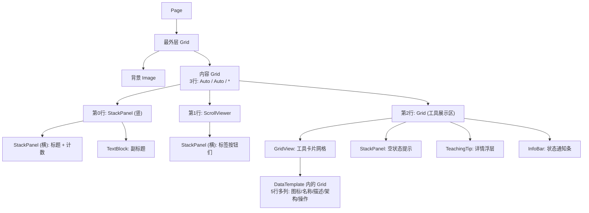

# 第 23 课：布局控件

## 为什么学这个

上节课你知道了 XAML 文件长什么样——一堆尖括号标签，声明式地描述界面。但光有标签不行，你得告诉系统这些标签怎么摆放。谁在上、谁在下，谁占多大地方，窗口拉大时谁跟着变宽、谁保持不动。这些事情都由"布局控件"负责。

XAML 里你写的每个按钮、文本框、图片，其实都是内容。布局控件就是用来装内容的容器。选择合适的布局控件，决定了你的界面在 4K 大屏和 13 寸笔记本上看起来都合理，而不是一团糟。

TubaTools 的首页用了几种核心布局控件搭建出工具网格、标签栏、分类标题区域。这节课就拿它的首页 XAML 当解剖对象，把 Grid、StackPanel、ScrollViewer 这几个家伙搞清楚。

---

## 核心概念：XAML 里怎么"摆"东西

Windows 桌面开发早期（WinForms 时代），界面布局靠拖控件 + 设像素坐标。你把按钮拖到 (120, 84) 这个位置，它就永远在那。窗口拉大？按钮不动。高分屏缩放 150%？按钮可能跑到奇怪的地方。

XAML 换了一种思路：不指定绝对坐标，而是描述"关系"。比如"这个按钮放在输入框右边""那个列表占满剩余空间""标题栏高度自适应内容"。系统在运行时根据窗口大小、DPI 缩放、字体设置，自动算出每个控件的最终位置和尺寸。这套机制叫"布局系统"。

WinUI 3 提供的基础布局控件有这几个：

| 控件 | 一句话概括 |
|------|-----------|
| **Grid** | 按行列切分空间，最灵活 |
| **StackPanel** | 横向或纵向依次堆叠 |
| **Canvas** | 绝对坐标定位（少用） |
| **RelativePanel** | 相对其他控件定位 |
| **ScrollViewer** | 内容超出时显示滚动条 |
| **Border** | 只放一个子元素，加边框/背景 |
| **VariableSizedWrapGrid** | 自动换行的网格 |

日常开发中 90% 的场景用 Grid + StackPanel + ScrollViewer 组合就能搞定。TubaTools 的首页就是靠这三个搭出来的。

---

## Grid：把空间切成格子

Grid 是 XAML 布局的基石。它的思路很朴素：

1. 定义行：`RowDefinitions`，每行一个 `RowDefinition`
2. 定义列：`ColumnDefinitions`，每列一个 `ColumnDefinition`
3. 把控件放在某个格子：用 `Grid.Row="0"` `Grid.Column="1"` 指定

行和列的高度/宽度有三种模式：

```
Height="Auto"      → 高度由内容决定
Height="*"         → 占满剩余空间（星号比例）
Height="120"       → 固定像素
```

"*" 号是最巧妙的设计。假设你有两行，分别设为 `1*` 和 `2*`，它们按 1:2 比例分配剩余空间。窗口拉大时比例不变，各自跟着缩放。如果只有一个 `*`，它就独占所有剩余空间。

看 TubaTools 首页的 Grid：

```xml
<Grid Padding="28,18,28,24" RowSpacing="18">
    <Grid.RowDefinitions>
        <RowDefinition Height="Auto" />
        <RowDefinition Height="Auto" />
        <RowDefinition Height="*" />
    </Grid.RowDefinitions>
    <!-- 第 0 行：标题区域，高度自适应 -->
    <!-- 第 1 行：标签栏，高度自适应 -->
    <!-- 第 2 行：工具网格，占满剩余全部空间 -->
</Grid>
```

三行，前面两行 `Auto`——多高内容就多高，不浪费空间。第三行 `*`——把窗口剩下的所有高度吞掉。窗口拉高，标题和标签栏不动，工具网格区域变大，能看到更多工具卡片。这就是 `*` 的实用之处。

Grid 列也是同样逻辑。工具卡片内部有个 Grid 这样定义列：

```xml
<Grid ColumnSpacing="12">
    <Grid.ColumnDefinitions>
        <ColumnDefinition Width="48" />
        <ColumnDefinition Width="*" />
        <ColumnDefinition Width="Auto" />
    </Grid.ColumnDefinitions>
</Grid>
```

第一列 48 像素固定宽度（放图标），第二列 `*` 吃掉剩余空间（放工具名称和分类名），第三列 `Auto` 按内容宽度（放收藏按钮）。三者配合：图标永远是 48px，收藏按钮刚好包住内容，中间文字区自适应。

Grid 还可以嵌套——这也是最常用的手法。TubaTools 首页最外层是 Page > Grid > Grid（带 RowDefinitions 的那个）> Grid（工具卡片内部那个）。三层 Grid 嵌套，各管各的区域。

---

## StackPanel：一个挨一个排

如果 Grid 是"画格子"，StackPanel 就是"排大队"——子元素一个接一个，要么横着排，要么竖着排。只有两个关键属性：

```
Orientation="Vertical"    → 纵向堆叠（默认）
Orientation="Horizontal"  → 横向排列
Spacing="8"               → 元素之间的间距
```

StackPanel 不提供行列概念，也没有比例分配。它就是把东西顺序排开。简单场景用它比 Grid 方便得多——少写一堆 RowDefinitions。

TubaTools 首页的标题区域用 StackPanel 搭的：

```xml
<StackPanel Spacing="4">
    <StackPanel Orientation="Horizontal" Spacing="8">
        <TextBlock x:Name="CategoryTitle" FontSize="30" FontWeight="SemiBold" />
        <TextBlock x:Name="ToolCountText" VerticalAlignment="Bottom"
                   Margin="0,0,0,4" FontSize="14" Opacity="0.6" />
    </StackPanel>
    <TextBlock x:Name="CategorySubtitle" Opacity="0.72" />
</StackPanel>
```

拆解一下：最外层竖排 StackPanel，装两样东西——内层横排 StackPanel（标题大字 + 工具计数小字并排）和副标题行。Spacing="4" 让标题和副标题之间有空隙，Spacing="8" 让大标题和计数之间有间距。不用 Grid 也能清爽地搭出标题栏。

标签栏也靠 StackPanel：

```xml
<ScrollViewer x:Name="TagBarScrollViewer" Grid.Row="1"
              HorizontalScrollBarVisibility="Hidden"
              HorizontalScrollMode="Enabled"
              VerticalScrollBarVisibility="Disabled"
              VerticalScrollMode="Disabled">
    <StackPanel x:Name="TagBarPanel" Orientation="Horizontal" Spacing="6" />
</ScrollViewer>
```

`Orientation="Horizontal"` + `Spacing="6"` 让标签按钮横着一字排开，间距 6 像素。标签多到超出屏幕宽度时，外层 ScrollViewer 允许横向滚动。

还有空状态提示也是 StackPanel：

```xml
<StackPanel x:Name="EmptyState" HorizontalAlignment="Center"
            VerticalAlignment="Center" Spacing="12" Visibility="Collapsed">
    <FontIcon HorizontalAlignment="Center" FontSize="48"
              Glyph="&#xE721;" Opacity="0.3" />
    <TextBlock HorizontalAlignment="Center" FontSize="18"
               Opacity="0.52" Text="没有找到匹配的工具" />
    <TextBlock x:Name="EmptyStateText" HorizontalAlignment="Center"
               Opacity="0.42" Text="" />
</StackPanel>
```

三个元素竖着排：一个图标（FontIcon）、两行提示文字。`HorizontalAlignment="Center"` 让它们在水平方向居中。`VerticalAlignment="Center"` 让整个 StackPanel 在父容器中垂直居中。这个组合在"搜索无结果"时显示，平时隐藏（Visibility="Collapsed"）。

---

## ScrollViewer：内容太多就滚动

界面空间有限，内容可以是无限的。ScrollViewer 就是一个"视口"，内容在里面可以滚动查看。它的核心能力：

- 只支持**单个子元素**（通常是 Grid 或 StackPanel）
- 可以分别控制横竖滚动条的显示（Hidden / Visible / Auto / Disabled）
- 支持触摸滚动和鼠标滚轮

TubaTools 的标签栏用了横向 ScrollViewer：

```xml
<ScrollViewer HorizontalScrollMode="Enabled"
              HorizontalScrollBarVisibility="Hidden"
              VerticalScrollMode="Disabled"
              VerticalScrollBarVisibility="Disabled">
    <StackPanel Orientation="Horizontal" Spacing="6" />
</ScrollViewer>
```

横向滚动启用，但滚动条隐藏——这样视觉上干净，用户用鼠标滚轮（Shift+滚轮）或触控板滑动来浏览标签。竖向滚动直接禁用，因为标签只有一行高，没必要。

注意 ScrollViewer 只装一个子元素。如果你想把好几个东西都放进滚动区域，外面包一层 StackPanel 或 Grid 就行了。

---

## 嵌套的艺术：三种布局的组合

真实界面从来不是单一布局控件能搞定的。TubaTools 首页的结构用 Mermaid 图画出来是这样的：



核心思路：外层用 Grid 切出大区域（标题、标签栏、工具区），中层用 StackPanel 做简单排列，内层再用 Grid 做精细的行列排布。ScrollViewer 出现的地方都是内容可能溢出的部分。Border 负责局部的背景和圆角——工具卡片的外框就是 Border 套 Grid。

你不需要一开始就规划出完美嵌套。通常的做法是：

1. 先画最外层结构（哪里是顶栏、哪里是主体、哪里是底栏）→ 用 Grid
2. 每个区域内如果只是一串相同元素 → 用 StackPanel
3. 某个区域内部还需要行列对应 → 再套 Grid
4. 内容可能超出区域 → 包 ScrollViewer

---

## 对齐属性：HorizontalAlignment 和 VerticalAlignment

布局控件负责"划分空间"，但子元素在分配给它的空间里具体站在哪，由对齐属性控制：

```
HorizontalAlignment="Left"      → 靠左
HorizontalAlignment="Center"    → 居中
HorizontalAlignment="Right"     → 靠右
HorizontalAlignment="Stretch"   → 撑满（默认）
```

竖向同理：`Top` / `Center` / `Bottom` / `Stretch`。

一个常见的坑：你在 StackPanel 里放一个按钮设了 `HorizontalAlignment="Stretch"`，结果按钮没撑满。原因是 StackPanel 在横排模式下不给子元素横向拉伸——它只给子元素刚好够的宽度。这种情况要换 Grid，或者让按钮放在 Grid 里再塞进 StackPanel。

另一个细节：`Margin` 控制外边距（离邻居多远），`Padding` 控制内边距（内容离边框多远）。TubaTools 首页的 Grid 设了 `Padding="28,18,28,24"`——左上右下四个边距，让内容不紧贴窗口边缘。这属于 UI 基本素养：界面元素不要贴边放，留白是设计的一部分。

---

## 为什么不用 Canvas

WinForms 拿 Canvas（绝对定位）当默认布局，XAML 把 Canvas 晾在一边当备胎。原因很简单：绝对坐标写在 XAML 里，换个屏幕尺寸就废了。除非你真的需要精确像素级定位（比如一个图形编辑器里的画布），否则别碰 Canvas。

还有 RelativePanel，它走"相对定位"路线——"按钮 A 在标题下面""输入框在按钮 A 右侧"。听着灵活，实际上关系复杂时 XAML 代码写得绕，不如 Grid+StackPanel 直观。TubaTools 全程没用 RelativePanel 和 Canvas，足够说明问题。

---

## Margin 和 Padding 的最佳实践

给几条实际开发中得出的经验：

- **Margin 控制间距**：元素之间用 Margin 隔开，比塞空白的占位控件干净
- **Padding 控制内容呼吸感**：容器（Border、Grid）内部用 Padding，让文字不贴边框
- **Spacing 是 StackPanel 的专属福利**：不用在每个子元素上重复写 Margin
- **别用 Margin 做布局**：不要让 Margin 值决定位置（比如 `Margin="200,0,0,0"` 把元素推到右边），用 HorizontalAlignment 或 Column 来定位

TubaTools 的 StackPanel 全用 Spacing 而非子元素 Margin，Grid 用 RowSpacing 和 ColumnSpacing。这是规范的写法。

---

## 实践建议

当你拿到一个界面设计稿，准备搭 XAML 布局时，建议按这个顺序思考：

1. 从外向内：先定最外层结构（Grid 几行几列）
2. 每个区域选最合适的容器：简单排列用 StackPanel，需要行列对应用 Grid
3. 只用 `Auto` 和 `*`，尽量不用固定像素高度（除非是图标这种固定尺寸的元素）
4. 内容多就用 ScrollViewer 包起来
5. 对齐用 Alignment 属性，间距用 Spacing / Padding / Margin

回到 TubaTools 的首页——三行 Grid（Auto/Auto/*），标题用 StackPanel 套 StackPanel，标签栏用 ScrollViewer 套 StackPanel，工具区用 Grid 套 GridView。没有花哨的布局控件，但结构清晰，窗口从 800x600 拉到 4K 都不崩。这就是用好基础布局控件的效果。

---

## 小练习

**练习 1（填空）**：下面这个 Grid 有三行。第一行高度 50 像素，第二行高度由内容决定，第三行占满剩余空间。补全 RowDefinitions。

```xml
<Grid>
    <Grid.RowDefinitions>
        <RowDefinition Height="___" />
        <RowDefinition Height="___" />
        <RowDefinition Height="___" />
    </Grid.RowDefinitions>
</Grid>
```

**练习 2（选择）**：StackPanel 的 Orientation="Horizontal" 时，子元素的 HorizontalAlignment="Stretch" 会怎样？

A. 撑满 StackPanel 的全部宽度  
B. 撑满 StackPanel 的全部高度  
C. 宽度由内容决定，不会撑满  
D. 报错，Stretch 在横排 StackPanel 中不能用

**练习 3（简答）**：TubaTools 首页为什么要把标签栏放在 ScrollViewer 里？如果不用 ScrollViewer 会有什么问题？

**练习 4（实操）**：在 Visual Studio 里打开 HomePage.xaml，找到 EmptyState 那个 StackPanel（约第 397 行），修改它的 Spacing 值从 12 改成 24，编译运行，观察"搜索无结果时"图标和文字之间的间距变化。恢复原值。

---

## 练习答案

**练习 1**：`"50"`、`"Auto"`、`"*"`

**练习 2**：C。横排 StackPanel 不给子元素横向拉伸空间，宽度由内容决定。如果需要撑满，把该元素放到 Grid 里或者改用竖排 StackPanel。

**练习 3**：标签栏里的标签数量不固定——装了很多外部工具后可能有几十个标签。屏幕宽度有限（比如 1366px），标签太多会超出可视范围。ScrollViewer 提供横向滚动能力，用户滑动可以看到隐藏的标签。不用 ScrollViewer 的话，多出来的标签会被截断看不到，或者挤变形。Hidden 的滚动条保持界面干净，Enabled 的滚动模式保证可用性。

**练习 4**：实操题，编译运行后观察即可。间距变大后提示信息显得更松散，说明 Spacing 直接影响 StackPanel 子元素之间的空隙。
