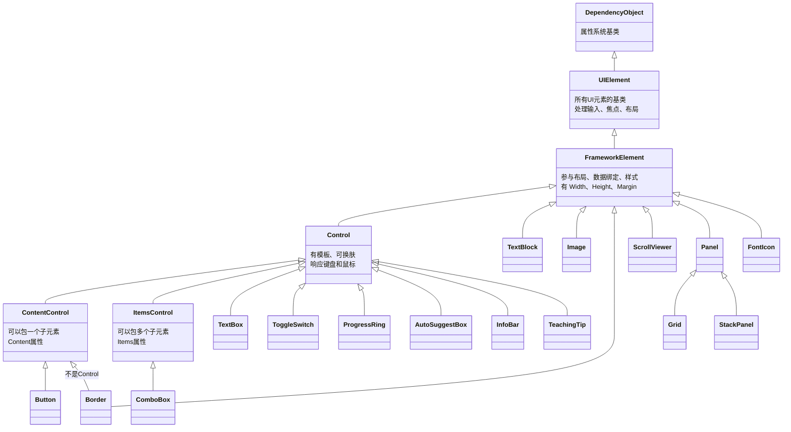

# 第 24 课：常用 UI 控件

## 为什么有这一课

上一课我们摆了 Grid 和 StackPanel，把页面骨架搭出来了。但骨架里是空的——你不能光让用户盯着一堆空白格子发呆。你得往里面放东西：显示文字的、让人点的、让人输入的、显示进度的。

这些东西，在 WinUI 3 里统称"控件"（Control）。微软已经给你做好了一套，你只负责拿来用。这节课就是把这些"拿来就用"的控件给你过一遍，你以后看到任何一个 XAML 页面，能认出每个标签是干什么的。

## 控件到底是个什么

控件的本质很简单：一个封装好的 UI 积木。它有外观（怎么显示）、行为（怎么交互）、属性（怎么配置），三样打包在一个标签里。

比如你写 `<Button Content="点击我" />`，背后有一整套机制在跑：鼠标移上去变色、按下有凹陷动画、松开触发 Click 事件。这些你都不用管，标签写上去就有了。

WinUI 3 自带了几十个控件。本节挑最常用的讲——不是罗列字典，而是告诉你哪种场合该用哪个。全部例子都从 TubaTools 的真实代码里取。

## 第一类：显示文字的控件

### TextBlock

TextBlock 是你写 UI 时用得最多的东西，没有之一。它就干一件事：显示一段不让你编辑的文字。

```xml
<TextBlock
    FontSize="30"
    FontWeight="SemiBold"
    Text="硬件信息" />
```

这是 TubaTools 的 HardwarePage.xaml 里的真实代码（第 231 行）。FontSize 控制字号，FontWeight 控制粗细（SemiBold 是半粗体），Text 是要显示的内容。

TextBlock 还有一个常用属性 Opacity，控制透明度，取值范围 0（完全透明）到 1（完全不透明）。TubaTools 里几乎每个副标题都用了 Opacity：

```xml
<TextBlock
    Opacity="0.72"
    Text="管理应用外观、更新及查看关于信息。" />
```
——来自 SettingsPage.xaml 第 96 行。透明度 0.72，意思是文字稍微淡一点，视觉上和主标题拉开层次。

TextBlock 的 `TextTrimming` 属性也很实用。文字太长时，是截断还是省略号？设成 `CharacterEllipsis` 就会自动加"..."。HomePage.xaml 里工具卡片标题就用了这个：

```xml
<TextBlock
    FontSize="16"
    FontWeight="SemiBold"
    MaxLines="1"
    Text="{Binding Name}"
    TextTrimming="CharacterEllipsis" />
```

MaxLines="1" 限制最多一行，超出部分用"..."代替。

### 什么时候不要用 TextBlock

如果你想让用户编辑文字，用 TextBox。TextBlock 是只读的。

## 第二类：交互控件

### Button

Button 就是按钮。点它，触发 Click 事件。

TubaTools 里按钮用得非常多。看 HardwarePage.xaml 第 267 行：

```xml
<Button
    Padding="16,8"
    Click="RefreshButton_Click">
    <StackPanel Orientation="Horizontal" Spacing="8">
        <FontIcon FontSize="16" Glyph="&#xE72C;" />
        <TextBlock FontSize="16" Text="刷新" />
    </StackPanel>
</Button>
```

注意：Button 的 Content 不一定是纯文字。你可以往里面塞一个 StackPanel，StackPanel 里再塞一个图标和一个文字标签，组成一个带图标的按钮。这是 WinUI 3 的常规操作——Content 可以是任意 UI 元素。

Padding 控制按钮内部的留白。Click 指定点击后执行哪个 C# 方法。

### 关于 Button 的样式

TubaTools 的 ErrorWindow.xaml 里有一个按钮用了系统自带的强调色样式：

```xml
<Button x:Name="ReportButton" Padding="20,10"
        Click="ReportButton_Click" CornerRadius="8"
        Style="{ThemeResource AccentButtonStyle}">
```

`Style="{ThemeResource AccentButtonStyle}"` 让按钮变成系统强调色（通常是蓝色），视觉上更突出。适合"提交"、"确认"这类主要操作。

### ToggleSwitch

ToggleSwitch 是开关。开着是"开"，关了是"关"。SettingsPage.xaml 里大量使用：

```xml
<ToggleSwitch
    x:Name="CompactModeToggle"
    Grid.Column="2"
    VerticalAlignment="Center"
    Toggled="CompactModeToggle_Toggled" />
```
——第 255 行，"简洁列表模式"的开关。

ToggleSwitch 本身不显示文字标签——它只是一个滑块。文字标签（"简洁列表模式"）是放到旁边的 TextBlock 实现的。这是 WinUI 的 UI 拆分哲学：控件只做自己的事，文字描述交给 TextBlock。

Toggled 事件在开关状态改变时触发，你可以在 C# 里处理它。

### ComboBox

ComboBox 是下拉选择框。用户点一下，弹出一个列表，选一个。

HomePage.xaml 第 254 行有一个架构选择的下拉框：

```xml
<ComboBox
    Width="78"
    MinHeight="24"
    Padding="6,1"
    FontSize="12"
    VerticalAlignment="Center"
    ItemsSource="{Binding ArchOptions}"
    SelectedItem="{Binding SelectedArch, Mode=TwoWay}">
    <ComboBox.ItemTemplate>
        <DataTemplate>
            <TextBlock FontSize="12" Text="{Binding DisplayText}"
                       TextTrimming="CharacterEllipsis" />
        </DataTemplate>
    </ComboBox.ItemTemplate>
</ComboBox>
```

这里有几个点值得讲：
- `ItemsSource` 绑定数据源，ArchOptions 是一个列表
- `SelectedItem` 双向绑定当前选中的项
- `ItemTemplate` 定义每一项怎么显示（这里就是简单一行文字）

SettingsPage.xaml 第 226 行也有 ComboBox，用于切换主题：

```xml
<ComboBox
    x:Name="ThemeComboBox"
    Grid.Column="2"
    MinWidth="120"
    SelectionChanged="ThemeComboBox_SelectionChanged" />
```

这个 ComboBox 没绑定 ItemsSource——说明它的选项是在 C# 代码里手动加的（比如"浅色"、"深色"、"跟随系统"）。SelectionChanged 事件在切换选项时触发。

### TextBox

TextBox 是输入框。用户可以在里面打字。

SettingsPage.xaml 第 470 行：

```xml
<TextBox
    x:Name="WatermarkTextBox"
    Grid.Column="2"
    MinWidth="160"
    MaxWidth="240"
    PlaceholderText="图吧工具箱"
    TextChanged="WatermarkTextBox_TextChanged" />
```

PlaceholderText 是输入框为空时显示的提示文字（浅灰色）。用户一开始输入，它就消失。这是那种"不显眼但很好用"的属性。

AcceptsReturn="True" 可以让 TextBox 支持多行输入，比如 ErrorWindow.xaml 第 127 行的复现步骤输入框：

```xml
<TextBox x:Name="ReproStepsBox"
         PlaceholderText="例如：1. 打开硬件信息页..."
         AcceptsReturn="True"
         TextWrapping="Wrap"
         MinHeight="80" MaxHeight="160" />
```

TextWrapping="Wrap" 让文字自动换行，MinHeight 和 MaxHeight 限制高度范围。

## 第三类：容器与装饰控件

### Border

Border 是一个"带框的盒子"。它可以加背景色、边框、圆角、内边距。TubaTools 里几乎每个卡片都用 Border 包裹：

```xml
<Border
    Padding="20"
    Background="{ThemeResource CardBackgroundFillColorDefaultBrush}"
    BorderBrush="{ThemeResource CardStrokeColorDefaultBrush}"
    BorderThickness="1"
    CornerRadius="10">
    <!-- 卡片内容 -->
</Border>
```
——ErrorWindow.xaml 第 41 行。

CornerRadius 控制圆角大小。设成 8 或 10 是常见的"现代化 UI"风格。

Border 本身不参与布局，它只是给里面的东西画个框。所以你经常看到这样的嵌套：Border 里面放 StackPanel，StackPanel 里面再放一堆控件。

### ScrollViewer

ScrollViewer 给内容加滚动条。当内容超出可见区域时，用户能上下或左右滑。

HomePage.xaml 第 110 行的标签栏滚动：

```xml
<ScrollViewer
    x:Name="TagBarScrollViewer"
    Grid.Row="1"
    HorizontalScrollBarVisibility="Hidden"
    HorizontalScrollMode="Enabled"
    VerticalScrollBarVisibility="Disabled"
    VerticalScrollMode="Disabled">
    <StackPanel x:Name="TagBarPanel"
                Orientation="Horizontal" Spacing="6" />
</ScrollViewer>
```

这里只允许水平滚动（隐藏滚动条，手指/触控板滑），垂直方向完全禁用。适合横向标签筛选栏这种场景。

## 第四类：集合控件

### GridView

GridView 是网格列表——把一堆数据项排成多行多列。电脑上的"陈列模式"。

TubaTools 的 HomePage.xaml 用了两个 GridView（ToolsGrid 和 CompactGrid）来显示工具卡片，根据用户的"简洁模式"设置切换显示哪个。

```xml
<GridView
    x:Name="ToolsGrid"
    IsItemClickEnabled="True"
    ItemClick="ToolsGrid_ItemClick"
    DoubleTapped="ToolsGrid_DoubleTapped"
    ItemContainerStyle="{StaticResource ToolCardStyle}"
    SelectionMode="None">
    <GridView.ItemTemplate>
        <DataTemplate>
            <!-- 每个工具的卡片布局 -->
        </DataTemplate>
    </GridView.ItemTemplate>
</GridView>
```
——第 122 行，省略了内部模板细节。

关键属性：
- `IsItemClickEnabled="True"` 让每一项可被点击
- `ItemClick` 事件在点击某项时触发
- `ItemTemplate` 定义每一项长什么样（DataTemplate 里面随便写）
- `SelectionMode="None"` 禁止多选（这里是工具列表，不需要选中态）

GridView 的 ItemTemplate 里可以放任何东西——TubaTools 的工具卡片里有 Image、FontIcon、三个 TextBlock、一个 ComboBox、四个 Button，全塞在一个 DataTemplate 里。

### ItemsRepeater

ItemsRepeater 是更底层的列表控件，比 GridView 更灵活但也更"裸"——它不提供选中态、点击事件、默认动画，只负责循环生成 UI 元素。

HardwarePage.xaml 第 395 行用它来展示硬件详情列表：

```xml
<ItemsRepeater x:Name="DetailsRepeater"
               ElementPrepared="DetailsRepeater_ElementPrepared">
    <ItemsRepeater.ItemTemplate>
        <DataTemplate>
            <Grid Padding="16,9" ColumnSpacing="14"
                  PointerPressed="DetailItem_PointerPressed">
                <!-- 每一项：标签 + 分隔线 + 值 -->
            </Grid>
        </DataTemplate>
    </ItemsRepeater.ItemTemplate>
</ItemsRepeater>
```

ElementPrepared 事件在每一项 UI 元素被创建好时触发，你可以在这里对单个项做额外的配置。

如果你的列表很简单、不需要内置交互功能，ItemsRepeater 比 GridView 轻量，性能更好。

## 第五类：图标与图片

### FontIcon

FontIcon 用一个字体字符来显示图标。WinUI 3 内置了 Segoe Fluent Icons 字体，里面有上千个图标。每个图标有一个对应的 Unicode 码点。

TubaTools 里几乎所有的图标都是 FontIcon：

```xml
<FontIcon FontSize="24" Glyph="&#xE72C;" />
```

`&#xE72C;` 是 Unicode 码点（十六进制），对应"刷新"图标。FontSize 控制大小。

不同的 Glyph 值对应不同图标：&#xE80F; 是主页，&#xE735; 是收藏，&#xE721; 是搜索无结果，&#xE783; 是错误/警告。

FontIcon 的好处：不占用额外文件，缩放不模糊，可以用 ThemeResource 自动适配明暗主题颜色。TubaTools 没有用任何 PNG 图标，全部是 FontIcon。

### Image

Image 显示图片文件。TubaTools 用它来展示工具的自定义图标和背景图。

```xml
<Image
    Width="32" Height="32"
    Source="{Binding IconPath}"
    Stretch="Uniform"
    Visibility="{Binding IconPath,
             Converter={StaticResource NullToCollapse}}" />
```
——HomePage.xaml 第 188 行。

Source 指定图片路径。`{Binding IconPath}` 说明路径是动态绑定的——不同的工具可能有不同的图标文件。Visibility 用了一个转换器：如果 IconPath 为空（Null），就隐藏 Image，让 FontIcon 来顶替。

`Stretch="Uniform"` 保持图片比例缩放，不拉伸变形。

TubaTools 还有个大型背景图片：

```xml
<Image
    x:Name="BackgroundImg"
    Stretch="UniformToFill"
    Opacity="0.15"
    HorizontalAlignment="Stretch"
    VerticalAlignment="Stretch"
    IsHitTestVisible="False" />
```
——HomePage.xaml 第 77 行。

Opacity="0.15" 让背景图很淡，不会抢文字的风头。`IsHitTestVisible="False"` 让鼠标点击穿透图片直接点到下面的控件——否则图片会挡住后面的按钮。

## 第六类：反馈与提示控件

### ProgressRing

ProgressRing 是一个旋转的圆环，告诉用户"正在加载中"。

HardwarePage.xaml 第 463 行：

```xml
<ProgressRing
    x:Name="LoadingRing"
    Width="48" Height="48"
    HorizontalAlignment="Center"
    VerticalAlignment="Center"
    IsActive="False"
    Visibility="Collapsed" />
```

默认 `IsActive="False"`，不转。在 C# 代码里设为 `true` 时开始转，`Visibility` 也同时改成 Visible。加载结束后两样都关掉。

### InfoBar

InfoBar 是一个横幅通知条，出现在页面底部或顶部，用来告知操作结果——比如"工具删除成功"或"刷新失败"。

```xml
<InfoBar
    x:Name="StatusBar"
    Margin="28"
    HorizontalAlignment="Right"
    VerticalAlignment="Bottom"
    IsClosable="True"
    IsOpen="False" />
```
——HardwarePage.xaml 第 472 行。

`IsOpen="False"` 默认不显示。你可以在 C# 里设置消息文字、严重程度（Info/Warning/Error），然后把 IsOpen 设为 True。`IsClosable="True"` 让用户可以手动关掉它。

InfoBar 比传统的 MessageBox 好用——它不打断用户操作，只是浮在界面上。

### TeachingTip

TeachingTip 是一个弹出式提示气泡，通常锚定在某个控件旁边，展示额外信息。

HomePage.xaml 第 420 行用它来展示工具详情：

```xml
<TeachingTip
    x:Name="ToolDetailTip"
    CloseButtonContent="关闭"
    PreferredPlacement="Right">
    <StackPanel MaxWidth="420" Spacing="8">
        <TextBlock x:Name="DetailDescriptionText" TextWrapping="Wrap" />
        <TextBlock x:Name="DetailPublisherText" Opacity="0.72" TextWrapping="Wrap" />
        <TextBlock x:Name="DetailVersionText" Opacity="0.72" TextWrapping="Wrap" />
        <TextBlock x:Name="DetailPathText" Opacity="0.72" TextWrapping="Wrap" />
    </StackPanel>
</TeachingTip>
```

TeachingTip 的内容是你自己定义的——这里放了四个 TextBlock，分别显示描述、发行方、版本、路径。在 C# 里通过设置 Target 属性把它锚定到某个控件，然后设置 IsOpen="True" 来弹出。

## 第七类：特殊控件

### AutoSuggestBox

AutoSuggestBox 是一个带自动补全建议的搜索框。用户在框里打字，下方弹出匹配的建议列表。

TubaTools 在 MainWindow.xaml 的标题栏里放了一个全局搜索框：

```xml
<AutoSuggestBox
    x:Name="GlobalSearchBox"
    PlaceholderText="搜索工具、设置..."
    QueryIcon="Find"
    Width="320"
    TextChanged="GlobalSearchBox_TextChanged"
    SuggestionChosen="GlobalSearchBox_SuggestionChosen"
    QuerySubmitted="GlobalSearchBox_QuerySubmitted" />
```
——第 29 行。

`QueryIcon="Find"` 在输入框左边显示一个搜索图标。`TextChanged` 事件在每次文字变化时触发——你可以在这里实现动态搜索逻辑，把匹配的结果填充到建议列表里。`SuggestionChosen` 在用户从建议列表中点了一个时触发。

### MenuFlyout

MenuFlyout 是右键菜单（也叫上下文菜单）。用户右键某个控件，弹出一排操作选项。

HomePage.xaml 的工具卡片定义了右键菜单：

```xml
<MenuFlyout x:Key="NormalItemFlyout">
    <MenuFlyoutItem Text="发送到桌面快捷方式"
                    Click="NormalMenu_SendToDesktop" Icon="Link" />
    <MenuFlyoutItem Text="以管理员身份运行"
                    Click="NormalMenu_RunAsAdmin" Icon="Admin" />
    <MenuFlyoutItem Text="打开工具所在目录"
                    Click="NormalMenu_OpenDirectory" Icon="Folder" />
    <MenuFlyoutSeparator />
    <MenuFlyoutItem Text="删除工具"
                    Click="NormalMenu_DeleteTool"
                    Foreground="{ThemeResource SystemFillColorCriticalBrush}">
        <MenuFlyoutItem.Icon>
            <FontIcon Glyph="&#xE74D;" />
        </MenuFlyoutItem.Icon>
    </MenuFlyoutItem>
</MenuFlyout>
```
——第 132 行。

每个 MenuFlyoutItem 代表一个菜单项，Click 指定点击后的处理函数。MenuFlyoutSeparator 画一条分割线。

注意"删除工具"这一项：它的 Foreground 设成了 `SystemFillColorCriticalBrush`（系统红色），同时用了自定义的 FontIcon 图标而不是内置的 Icon 属性。这说明 MenuFlyoutItem 也支持自定义图标。

## 控件关系图

这张图展示了 WinUI 3 常用控件的继承关系（不完整，只列本节涉及的）：



这张图不用死记。你只需要知道：
- 所有控件都从 FrameworkElement 派生，所以都有 Width、Height、Margin、HorizontalAlignment 这些属性
- ContentControl 系列（如 Button）只能包含一个子元素（如果你想放多个，得用 StackPanel 包一下）
- ItemsControl 系列（如 ComboBox、GridView）可以包含多个子元素
- TextBlock 和 Image 不是 Control——它们没有模板概念，更轻量

## TubaTools 里的控件组合案例

拿 SettingsPage.xaml 里的"简洁列表模式"卡片来分析。这是一个典型的"设置项卡片"模式，TubaTools 里重复了 8 次：

```xml
<!-- 从 SettingsPage.xaml 第 234 行 -->
<Border Style="{StaticResource SettingsCardStyle}">
    <Grid ColumnSpacing="16">
        <Grid.ColumnDefinitions>
            <ColumnDefinition Width="Auto" />
            <ColumnDefinition Width="*" />
            <ColumnDefinition Width="Auto" />
        </Grid.ColumnDefinitions>

        <!-- 图标 -->
        <Border Style="{StaticResource IconBorderStyle}">
            <FontIcon FontSize="18" Glyph="&#xE8FD;" />
        </Border>

        <!-- 标题和描述 -->
        <StackPanel Grid.Column="1" VerticalAlignment="Center" Spacing="2">
            <TextBlock FontWeight="SemiBold" Text="简洁列表模式" />
            <TextBlock Opacity="0.68" FontSize="13"
                       TextWrapping="Wrap"
                       Text="原版图吧工具箱的样式" />
        </StackPanel>

        <!-- 开关 -->
        <ToggleSwitch
            x:Name="CompactModeToggle"
            Grid.Column="2"
            VerticalAlignment="Center"
            Toggled="CompactModeToggle_Toggled" />
    </Grid>
</Border>
```

这里面用到的控件：Border、Grid、FontIcon、StackPanel、TextBlock、ToggleSwitch。六种控件，每个都只做一件事。合在一起就是一个完整的"设置项"。

这个模式拆解：
1. 最外层 Border（卡片背景+圆角）
2. 里面 Grid 分三列：图标 | 文字描述 | 操作控件
3. 图标用 FontIcon 外面再套一个 Border（为了加背景色和圆角，让它看起来像个图标容器）
4. 文字描述用 StackPanel 包两个 TextBlock（标题+副标题）
5. 操作控件（ToggleSwitch/ComboBox/Button）放第三列

你以后自己写设置页面，照搬这个模板就行。

另一个案例是 HomePage 工具卡片的数据模板。在 GridView 的 ItemTemplate 里塞了：Border、Grid（5行）、Image、FontIcon、TextBlock（4个）、Button（4个）、ComboBox、StackPanel（2个）。十几层嵌套，但逻辑很清楚——每一行是一种信息，每个控件负责一项数据。

## 选控件的原则

你写 UI 时会面临一个抉择：场景是一样的（比如"选一个选项"），但有多种控件可以实现。RadioButton 可以做，ComboBox 可以做，ListView 也可以做。怎么选？

说几个从 TubaTools 代码里总结的经验：

**选项少于 5 个，且可以全显示？** RadioButton。比如"浅色/深色/跟随系统"——三个选项全展开让用户一眼看到，比 ComboBox 多点一下才能看到所有选项更直接。但 TubaTools 的 SettingsPage 用的是 ComboBox——这是个反例，也许开发者觉得 ComboBox 更省空间。没有绝对的对错。

**选项多于 5 个，或选项内容是动态生成的？** ComboBox。比如 HomePage 的架构选择——不同工具有不同的架构选项，数量不定，ComboBox 最合适。

**布尔开关（是/否）？** ToggleSwitch。别用 ComboBox 做二选一，也别用两个 RadioButton。

**纯信息展示、不可交互？** TextBlock + Border，不要用 Button 设成 IsEnabled="False" 来冒充标签。

**内容可能超出屏幕？** 外面套 ScrollViewer。

**需要用户等待？** ProgressRing 或 InfoBar。别让界面死在那里没有任何反馈。

## 小练习

### 练习 1：控件识别

下面这段 XAML 出自 TubaTools 的某个页面，指出每一行用的是什么控件，并说明它在干什么：

```xml
<StackPanel Orientation="Horizontal" Spacing="8">
    <FontIcon FontSize="14" Glyph="&#xE946;" />
    <TextBlock FontSize="14" Text="检查更新" />
    <Button Padding="10,4" Click="UpdateButton_Click">
        <TextBlock Text="立即更新" />
    </Button>
    <ProgressRing Width="20" Height="20" IsActive="True" />
</StackPanel>
```

### 练习 2：补全 XAML

请补全下面"网络设置"卡片缺少的控件标记：

```
需求：一个设置卡片，左边是图标，中间是"代理设置"标题和"配置 HTTP 代理地址和端口"副标题，
右边是一个 ToggleSwitch 开关。

<______ Style="{StaticResource SettingsCardStyle}">
    <Grid ColumnSpacing="16">
        <Grid.ColumnDefinitions>
            <ColumnDefinition Width="Auto" />
            <ColumnDefinition Width="*" />
            <ColumnDefinition Width="Auto" />
        </Grid.ColumnDefinitions>

        <Border Style="{StaticResource IconBorderStyle}">
            <______ FontSize="18" Glyph="&#xE910;" />
        </Border>

        <______ Grid.Column="1" VerticalAlignment="Center" Spacing="2">
            <______ FontWeight="SemiBold" Text="代理设置" />
            <______ Opacity="0.68" FontSize="13"
                       Text="配置 HTTP 代理地址和端口" />
        </______>

        <______ Grid.Column="2" VerticalAlignment="Center" />
    </Grid>
</______>
```

### 练习 3：辨别使用场合

下面 4 个需求，各自应该用什么控件？并说明为什么。

A. 用户输入一个网址
B. 展示一段无法编辑的帮助文档
C. 让用户从"中国大陆"、"中国香港"、"美国"、"日本"、"新加坡"这 5 个服务器节点中选一个
D. 用户启动了一个耗时操作，界面需要显示"正在处理"

### 练习 4：找茬

下面这段 XAML 有不少问题。找出至少 4 处不合理的地方并说明理由：

```xml
<Border>
    <Grid>
        <Button IsEnabled="False" Content="CPU: Intel Core i7-13700K" />
        <Button IsEnabled="False" Content="GPU: NVIDIA RTX 4070" />
        <Button IsEnabled="False" Content="RAM: 32GB DDR5" />
    </Grid>
</Border>
```

---

## 练习答案

### 练习 1
- `StackPanel`：水平布局容器，把子元素从左到右排列，间距 8
- `FontIcon`：显示搜索图标（&#xE946; 是"信息/详情"图标）
- `TextBlock`：显示文字"检查更新"
- `Button`：按钮，点它触发 UpdateButton_Click
- `ProgressRing`：小型加载环（20x20），正在旋转中

### 练习 2
依次填入：`Border`、`FontIcon`、`StackPanel`、`TextBlock`、`TextBlock`、`StackPanel`、`ToggleSwitch`、`Border`

### 练习 3
A. TextBox（需要用户输入文本）
B. TextBlock（只读文本显示）
C. ComboBox（5 个选项，且可能有增加——全展开占空间；如果确定永远是这 5 个，RadioButton 也可以接受）
D. ProgressRing（旋转圆环表示进行中）或 InfoBar（如果操作完了需要告知结果）

### 练习 4
1. 三个 Button 都设了 `IsEnabled="False"`——如果要禁用的目的是只展示信息，不该用 Button，应该用 TextBlock。Button 禁用后视觉上会变灰，暗示"现在不能用，以后可能能用"，但这里列的是硬件信息，永远不能"点击执行"，语义不对。
2. Grid 没有行定义（RowDefinitions），三个 Button 会堆叠在同一个格子里互相遮挡。
3. Button 的 Content 写死了硬件信息——这只是静态展示，没有任何按钮行为。说明开发者对 Button 的用途理解有误。纯粹展示硬件信息应该用 TextBlock，放在 StackPanel 里竖直排列。
4. Border 没有设置 CornerRadius、Background、BorderThickness 等属性，实际上和不存在一样——等于写了一个空的 Border 套着 Grid，毫无视觉效果。
