# 第 25 课：数据绑定 Binding

## 这块讲的什么

你打开 TubaTools，首页是一排排的工具卡片。每个卡片上有工具名、图标、描述、标签、操作按钮。如果我让你写这段代码——在 UI 上展示 100 个工具，你会怎么做？

没有绑定的时候，代码大概长这样：

```csharp
// 手动创建 100 个控件，一个一个设文本
for (int i = 0; i < tools.Count; i++)
{
    var card = new Grid();
    var nameBlock = new TextBlock();
    nameBlock.Text = tools[i].Name;
    card.Children.Add(nameBlock);
    // ... 再手动设图标、描述、按钮 ...
    ToolsGrid.Children.Add(card);
}
```

这段代码很直接，但问题一堆：

- 你写了 100 行代码只为了"展示一个列表"。如果界面要改，这 100 行全得动。
- 数据变了怎么办？用户点了收藏，图标要从空心星变成实心星。你需要在点击事件里手动找到那个图标控件，手动改它的 Glyph。
- UI 和逻辑缠在一起，改 UI 可能改出 bug，改数据可能忘了更新 UI。

**数据绑定就是来解决这件事的。**它让你告诉框架"这个 TextBlock 的文本永远等于某个对象的 Name 属性"，然后你就可以忘掉它。数据变了，UI 自动跟着变。这就是绑定的核心思想——声明关系，而不是写同步代码。

## 绑定的本质：搭一座桥

绑定的英文叫 Binding。想象一条河，左岸是你的数据（C# 对象），右岸是你的 UI（XAML 控件）。你要做的就是搭一座桥，让数据自动流到 UI 上。有时桥是单向的（数据流到 UI），有时是双向的（UI 改了也能流回数据）。

```
  数据（C# 对象）             UI（XAML 控件）
  ┌─────────────┐             ┌─────────────┐
  │ ToolItem     │             │ TextBlock    │
  │ Name="CPU-Z" │───绑定────→│ Text="CPU-Z" │
  └─────────────┘             └─────────────┘
```

以前你在这座桥上手动搬运（`textBlock.Text = tool.Name`），现在你只需要用 XAML 声明一次：`Text="{Binding Name}"`，剩下的自动完成。

## Binding 语法基础

在 WPF / WinUI 3 / UWP 的 XAML 中，绑定用大括号语法。最基础的形式：

```xml
<TextBlock Text="{Binding Name}" />
```

这行代码的意思是：把这个 TextBlock 的 Text 属性，绑定到当前 DataContext（数据上下文）的 Name 属性上。

### DataContext 是什么

Binding 不绑定到某个具体的变量名，而是绑定到当前控件的 DataContext。DataContext 是一个对象，你可以在代码里设置它。比如：

```csharp
this.DataContext = myTool;  // myTool 是一个 ToolItem 对象
```

然后在 XAML 里：

```xml
<TextBlock Text="{Binding Name}" />
<!-- 等价于：TextBlock.Text = myTool.Name -->
```

DataContext 会向下传递。如果你给一个 Grid 设了 DataContext，Grid 里所有的子控件共享同一个 DataContext，不需要每个控件单独设。

### 绑定路径

`{Binding Name}` 里的 "Name" 叫 Path（路径）。你可以省略 Path 关键字：

```xml
<!-- 这两种写法等价 -->
<TextBlock Text="{Binding Name}" />
<TextBlock Text="{Binding Path=Name}" />
```

路径支持子属性，用点号连接：

```xml
<TextBlock Text="{Binding SelectedArch.DisplayText}" />
```

这句话绑定的链条是：DataContext.SelectedArch.DisplayText。

## 绑定模式

绑定有三个方向。在 WinUI 3 中，不指定 Mode 时默认是 OneWay（单向）。

| 模式 | 方向 | 什么时候用 |
|------|------|-----------|
| OneWay | 数据 → UI | 只展示数据，用户不能改。比如工具名、描述。 |
| TwoWay | 数据 ↔ UI | 用户能编辑，编辑结果写回数据。比如文本框输入、下拉框选择。 |
| OneTime | 数据 → UI（只一次） | 数据不会变，初始化完就不用管了。省性能。 |

看 TubaTools 里的实际用法：

```xml
<!-- OneWay：工具名不需要用户改，单向即可（默认） -->
<TextBlock Text="{Binding Name}" />

<!-- TwoWay：架构选择，用户改了下拉框，数据也要跟着改 -->
<ComboBox SelectedItem="{Binding SelectedArch, Mode=TwoWay}" />
```

TwoWay 的关键场景：用户在 ComboBox 里切换了 x64/x86/ARM64，ToolItem 的 SelectedArch 属性必须跟着变，因为后续点"打开"按钮时，用的是 EffectivePath（它会读取 SelectedArch 来决定跑哪个可执行文件）。

## INotifyPropertyChanged：让数据"会说话"

绑定不是魔法。数据变了，UI 怎么知道？

答案是：数据对象必须实现 `INotifyPropertyChanged` 接口，属性改变时主动"喊一声"——发射一个事件。UI 框架监听着这个事件，收到通知后自动刷新对应的控件。

打开 TubaTools 的 `Models/ToolItem.cs`，第一行就是：

```csharp
public sealed class ToolItem : INotifyPropertyChanged
```

它怎么实现通知的？看 IsFavorite 属性：

```csharp
private bool _isFavorite;
public bool IsFavorite
{
    get => _isFavorite;
    set => SetField(ref _isFavorite, value);
}
```

SetField 是一个通用方法：

```csharp
private bool SetField<T>(ref T field, T value, [CallerMemberName] string? propertyName = null)
{
    if (EqualityComparer<T>.Default.Equals(field, value)) return false;
    field = value;
    PropertyChanged?.Invoke(this, new PropertyChangedEventArgs(propertyName));
    return true;
}
```

它做了三件事：
1. 比较新旧值，如果一样就不通知（省资源）。
2. 更新字段。
3. 触发 PropertyChanged 事件，告诉 UI："IsFavorite 变了，刷新吧。"

有些属性是计算出来的，本身没有字段。比如 LaunchButtonText——它根据 DownloadUrl、WingetId 等条件返回不同的文字。当 IsWingetInstalled 改变时，LaunchButtonText 也需要刷新。怎么做到？

```csharp
public bool IsWingetInstalled
{
    get => _isWingetInstalled;
    set
    {
        if (SetField(ref _isWingetInstalled, value))
        {
            OnPropertyChanged(nameof(LaunchButtonText));
            OnPropertyChanged(nameof(IsWingetInstalling));
            OnPropertyChanged(nameof(CanLaunch));
        }
    }
}
```

设置 IsWingetInstalled 时，手动通知了三个相关属性："虽然我改的是 IsWingetInstalled，但 LaunchButtonText、CanLaunch 它们也受影响了，UI 请一起刷新。"

这就是绑定的动力来源。没有 INotifyPropertyChanged，绑定就是死桥——数据变了 UI 纹丝不动。

## 集合绑定：ItemsSource

展示单个对象的属性，用 `{Binding ...}` 就够了。展示一个列表呢？

TubaTools 首页有一个 GridView，里面是几十个工具卡片。每个卡片结构一样，只是数据不同。这就需要集合绑定。

在 HomePage.xaml.cs 里：

```csharp
private readonly BulkObservableCollection<ToolItem> _tools = new();
// ...
ToolsGrid.ItemsSource = _tools;
```

这一行 `ItemsSource = _tools` 告诉 GridView："你的项目清单就是这个集合。"然后 GridView 会遍历 `_tools` 里的每一个 ToolItem，为每个创建一个 ItemTemplate（项目模板），并把 ToolItem 设为其 DataContext。

再看 XAML 里的模板：

```xml
<GridView.ItemTemplate>
    <DataTemplate>
        <Border ...>
            <Grid>
                <!-- 这里面的 Binding 都相对于当前的 ToolItem -->
                <TextBlock Text="{Binding Name}" />
                <TextBlock Text="{Binding Description}" />
                <FontIcon Glyph="{Binding IsFavorite, Converter={StaticResource FavGlyphConverter}}" />
            </Grid>
        </Border>
    </DataTemplate>
</GridView.ItemTemplate>
```

DataTemplate 里的每一个 `{Binding ...}`，绑定的都是当前这格数据的 DataContext——也就是集合中的某一个 ToolItem。GridView 自动遍历集合、自动创建控件、自动设置 DataContext，你只负责写模板长什么样。

集合数据新增或删除时，UI 也会自动更新。前提是你用的集合实现了 `INotifyCollectionChanged`。TubaTools 用的是 BulkObservableCollection，它是 ObservableCollection 的一个变体，支持批量添加时只通知一次，避免 UI 频繁刷新。

## 代码里也能创建绑定

Binding 不只是 XAML 的事。有时候你需要在 C# 代码里动态创建绑定。比如 TagBarPanel 里动态创建的标签按钮，你没有 XAML，只能在代码里绑：

```csharp
// 动态创建的 RadioButton，没有 XAML，绑定在代码里完成
var btn = new RadioButton
{
    Content = tag,
    Tag = tag,
    IsChecked = tag == _selectedTag,
    Style = (Style)Resources["TagRadioButtonStyle"]
};
btn.Click += TagRadioButton_Click;
TagBarPanel.Children.Add(btn);
```

这里虽然没显式使用 Binding 类，但本质是一样的：控件属性的值来源于数据。只不过因为 TagBar 的按钮是动态生成的（标签列表会在运行时变化），所以放弃了声明式绑定，改为直接在代码里赋值。

如果你需要代码里创建真正的 Binding 对象，写法是这样：

```csharp
var binding = new Binding
{
    Source = myToolItem,
    Path = new PropertyPath("Name"),
    Mode = BindingMode.OneWay
};
myTextBlock.SetBinding(TextBlock.TextProperty, binding);
```

XAML 的 `{Binding Name}` 被编译器翻译成类似的代码。了解这个对应关系，对理解绑定机制有帮助。

## 绑定与 Converter

有的属性能直接绑——比如 Name 是 string，Text 也接受 string，类型匹配。但有些情况不匹配：IsFavorite 是 bool，但 FontIcon.Glyph 需要的是 string（一个 Unicode 字符）。布尔值没法直接赋给字符串。

这时候就要 Converter（值转换器）。TubaTools 的 HomePage.xaml 里用了大量 Converter：

```xml
<Page.Resources>
    <local:FavGlyphConverter x:Key="FavGlyphConverter" />
    <local:NullToVisibilityConverter x:Key="NullToCollapse" />
    <local:BoolToVisibilityConverter x:Key="BoolToVis" />
    <!-- 还有好几个... -->
</Page.Resources>
```

使用时：

```xml
<FontIcon Glyph="{Binding IsFavorite, Converter={StaticResource FavGlyphConverter}}" />
```

FavGlyphConverter 的实现很简单：

```csharp
public sealed class FavGlyphConverter : IValueConverter
{
    public object Convert(object value, Type targetType, object parameter, string language)
    {
        return value is true ? "\uE735" : "\uE734";  // 实心星 vs 空心星
    }

    public object ConvertBack(object value, Type targetType, object parameter, string language)
    {
        throw new NotImplementedException();
    }
}
```

IsFavorite 是 true，Glyph 变成实心星；IsFavorite 是 false，Glyph 变成空心星。UI 层只认"是字符串就行"，业务层只关心"是否收藏"，Converter 做了翻译。

下节课会专门讲 Converter 的设计和写法，这里先理解它在绑定体系里的位置——类型不匹配时，它站出来当翻译。

## Mermaid 图：TubaTools 首页的绑定数据流

```mermaid
flowchart TD
    subgraph DataLayer["数据层（Models）"]
        TC["ToolCatalog\n（工具目录）"]
        TI["ToolItem\n实现 INotifyPropertyChanged"]
    end

    subgraph BindingLayer["绑定层（XAML + Converter）"]
        DC["DataContext\n（当前工具对象）"]
        CV["ValueConverter\n（类型转换）"]
    end

    subgraph UILayer["UI 层（XAML 控件）"]
        TB["TextBlock\n显示 Name / Description"]
        FI["FontIcon\n显示收藏星标"]
        CB["ComboBox\n选择架构"]
        GV["GridView\n工具卡片网格"]
    end

    TC -->|"GetTools() 返回 List&lt;ToolItem&gt;"| TI
    TI -->|"SetField 触发 PropertyChanged"| DC
    DC -->|"&#123;Binding Name&#125;"| TB
    DC -->|"&#123;Binding IsFavorite, Converter=...&#125;"| CV
    CV -->|"转换后的字符串"| FI
    DC -->|"&#123;Binding SelectedArch, Mode=TwoWay&#125;"| CB
    CB -->|"用户选择写回"| DC
    TI -->|"ItemsSource 集合绑定"| GV
    GV -->|"DataTemplate 遍历"| DC
```



这张图把 TubaTools 首页的绑定链路串起来了。左下角的 ComboBox TwoWay 绑定的回路很关键——这是为数不多的"数据双向流动"通道。其余大部分都是单向。

## TubaTools 里的绑定代码全景

你已经看到了不少片段。现在把 HomePage.xaml 里一张工具卡片的主要绑定汇总一下：

```xml
<!-- 图标区域 -->
<Image Source="{Binding IconPath}"
       Visibility="{Binding IconPath, Converter={StaticResource NullToCollapse}}" />
<FontIcon Glyph="{Binding IconGlyph}"
          Visibility="{Binding IconGlyph, Converter={StaticResource NullToCollapse}}" />

<!-- 文本区域 -->
<TextBlock Text="{Binding Name}" />          <!-- 工具名 -->
<TextBlock Text="{Binding Category}" />       <!-- 分类 -->
<TextBlock Text="{Binding Description}" />    <!-- 描述 -->
<TextBlock Text="{Binding TagsText}" />       <!-- 标签文字 -->
<TextBlock Text="{Binding Extension}" />      <!-- 扩展名 -->

<!-- 收藏按钮 -->
<FontIcon Glyph="{Binding IsFavorite, Converter={StaticResource FavGlyphConverter}}" />

<!-- 架构选择（TwoWay） -->
<ComboBox ItemsSource="{Binding ArchOptions}"
          SelectedItem="{Binding SelectedArch, Mode=TwoWay}" />

<!-- 按钮状态 -->
<Button IsEnabled="{Binding CanLaunch}">
    <TextBlock Text="{Binding LaunchButtonText}" />
</Button>
```

这张卡片——一个 Border 套着一个 Grid——没有任何一行代码手动设置 Text 或 Glyph。所有值都通过 Binding 从 ToolItem 上拿。你只要把 ToolItem 对象塞进 GridView 的 ItemsSource，这张卡片就自己"长出来"了。

与之配套，ToolItem.cs 里每一个属性的 setter 都通过 SetField 方法发射 PropertyChanged。这意味着，如果你在代码里改了 `tool.IsFavorite = true`，页面上对应的星星图标立刻从空心变实心。你不用写任何额外的刷新代码。

## 常见绑定错误与排查

初学者最容易碰到的三个坑：

**1. Binding 不出来，什么都不显示**

原因通常是 DataContext 没设。XAML 里写了 `{Binding Name}`，但 DataContext 是 null——绑了个空对象，自然没结果。检查方法：在代码里打断点，看控件的 DataContext 是不是你期望的对象。

**2. 数据改了但 UI 没变**

可能是属性的 setter 没触发 PropertyChanged。比如你直接给字段赋值了 `_name = "xxx"` 而不是走属性 setter `Name = "xxx"`。又或者类根本没实现 INotifyPropertyChanged。

**3. 列表数据增删没反映**

用的是普通 List<T> 而不是 ObservableCollection<T>。List 不会通知 UI 集合变了。

TubaTools 的代码里这三个坑都避开了：ToolItem 实现了 INotifyPropertyChanged，所有可变属性的 setter 都走 SetField，工具集合用的是 BulkObservableCollection。

## 小结

数据绑定是 WinUI 3（以及 WPF、UWP、MAUI）最核心的机制之一。你不需要知道它内部的实现细节——反射、依赖属性、弱事件模式这些可以以后再看。现在要记住的是：

- `{Binding 属性名}` 把 UI 控件的属性挂到 C# 对象的属性上
- DataContext 是绑定的"根"，它决定绑定从哪里取值
- INotifyPropertyChanged 让数据变更自动反映到 UI
- ItemsSource + DataTemplate 让列表展示自动化和模板化
- Converter 在类型不匹配时充当翻译

搞懂了这五点，你就能看懂 TubaTools 首页 90% 的 XAML 代码。剩下的那些自定义 Style 和 VisualState，是另一套体系——状态与样式驱动的 UI 行为，后面会专门讲。

## 小练习

**题 1（填空）**：在 WinUI 3 的 XAML 中，`{Binding Name}` 绑定的是当前控件的 \_\_\_\_\_\_\_\_ 对象的 Name 属性。控件的 \_\_\_\_\_\_\_\_ 会自动向下传递给子控件。

**题 2（选择）**：TubaTools 首页的 ComboBox 用了 `Mode=TwoWay`，原因是：

A. 为了让下拉框能显示多个选项
B. 因为用户切换架构后，ToolItem.SelectedArch 必须跟着更新
C. 因为 ComboBox 不支持单向绑定
D. 为了配合 Converter 做类型转换

**题 3（简答）**：ToolItem 类实现了 INotifyPropertyChanged 接口。如果去掉这个接口的实现，TubaTools 首页会出现什么现象？举一个具体的例子说明。

**题 4（实操）**：打开 HomePage.xaml，找到 `{Binding TagsText}` 这行。然后打开 Models/ToolItem.cs，找到 TagsText 属性的定义。回答：

- TagsText 的属性体里有 setter 吗？为什么？
- 当 Tags 列表内容变化时，TagsText 会自动更新吗？（提示：TagsText 是计算属性，看看是否有地方手动通知了 TagsText 的 PropertyChanged）

---

<details>
<summary>练习答案（做完再看）</summary>

**题 1 答案**：DataContext。DataContext 会自动向下传递（沿着可视化树）。

**题 2 答案**：B。当用户在 ComboBox 里选了 x64/x86/ARM64，TwoWay 绑定会把选择结果写回 ToolItem.SelectedArch。后续点击"打开"按钮时，代码通过 EffectivePath 取到正确架构的可执行文件路径。

**题 3 答案**：如果去掉 INotifyPropertyChanged，当代码里修改 ToolItem 的属性（比如 `tool.IsFavorite = true`），UI 上的星星图标不会从空心变实心。因为 UI 收不到 PropertyChanged 通知，不知道数据已经变了。同样，下载进度、按钮文字等动态变化的内容也都会"卡住"。

**题 4 答案**：TagsText 没有 setter——它只有 get，本质是一个计算属性（`Tags.Count > 0 ? string.Join("  ", Tags) : ""`）。TagsText 本身不会被自动通知，因为 Tags 是 `IReadOnlyList<string>` 类型且用 `init` 声明（初始化后不会变）。所以 TubaTools 的设计里，TagsText 只在首次加载时有效，不需要运行时更新——这是一个合理的取舍。

</details>
