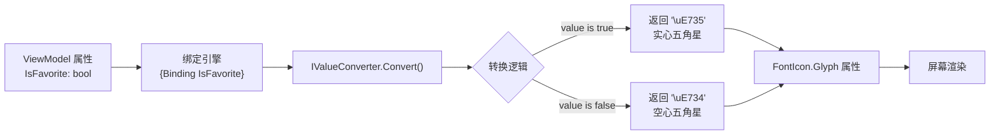

# 第 26 课：值转换器 Converter

## 数据绑定很好，但有时候长得不对

上一课我们讲了数据绑定。绑定能把 ViewModel 里的 bool 直接甩给 UI 控件——但你先想一个场景：ViewModel 里有一个 `IsFavorite` 属性，是 bool 类型，你希望它在界面上显示成一个五角星图标（实心的代表已收藏，空心的代表未收藏）。bool 和图标之间有直接对应关系吗？没有。bool 是 true/false，图标是一个 Unicode 字符，两者类型不同，语义也不同。

再想一个场景：ViewModel 里有一串字符串，可能是工具的描述信息，也可能是 null。你希望当它是 null 的时候，对应的 TextBlock 直接隐藏掉（Visibility = Collapsed）。string 和 Visibility 之间也没有直接对应关系。

你当然可以在 ViewModel 里多写几个属性，比如除了 `IsFavorite` 之外再加一个 `FavoriteGlyph` 字符串属性，但这会让 ViewModel 越来越臃肿——里面塞满了 UI 逻辑。UI 逻辑应该待在 UI 层，ViewModel 只负责数据和业务逻辑。

值转换器（Value Converter）就是来解决这个问题的。它像一个插在绑定线中间的适配器，把源数据的格式翻译成目标控件能直接消费的格式。

## 接口很简单，变化全在你手里

在 WinUI 3（以及 WPF、UWP）里，值转换器是一个实现了 `IValueConverter` 接口的类。这个接口只有两个方法：

```csharp
public interface IValueConverter
{
    object Convert(object value, Type targetType, object parameter, string language);
    object ConvertBack(object value, Type targetType, object parameter, string language);
}
```

`Convert` 在数据从源流向目标时被调用——也就是你最主要的场景。`ConvertBack` 在数据从目标回流到源时调用——比如用户在 TextBox 里输入了内容，这个内容需要写回 ViewModel，中间可能需要转换格式。

大多数时候你只需要实现 `Convert`，`ConvertBack` 直接抛 `NotImplementedException`。因为很多绑定是单向的：ViewModel 告诉 UI 显示什么，UI 不需要反向写回。

参数说明：
- `value`：从绑定源传过来的原始值。可能是 bool、int、string，也可能是 null。
- `targetType`：目标属性期望的类型。写代码时很少用到，但你可以在里面做类型检查。
- `parameter`：从 XAML 的 `ConverterParameter` 传过来的附加参数。很有用——比如 NullToVisibilityConverter 通过它来决定是否反转逻辑。
- `language`：当前语言文化信息。做多语言转换时用到。

## TubaTools 里到底怎么用的

TubaTools 项目里一共定义了 9 个值转换器，分布在 `Pages/FavGlyphConverter.cs`、`Pages/HomePage.xaml.cs` 和 `Pages/FavoritesPage.xaml.cs` 三个文件里。不夸张地说，整个工具卡片界面的显示逻辑，一半靠绑定，一半靠这些转换器在背后做格式翻译。

### 最直观的例子：FavGlyphConverter

```csharp
public sealed class FavGlyphConverter : IValueConverter
{
    private const string StarGlyph = "\uE735";
    private const string StarOutlineGlyph = "\uE734";

    public object Convert(object value, Type targetType, object parameter, string language)
    {
        return value is true ? StarGlyph : StarOutlineGlyph;
    }

    public object ConvertBack(object value, Type targetType, object parameter, string language)
    {
        throw new NotImplementedException();
    }
}
```

逻辑简单到只有一行：如果绑定过来的值是 true，返回实心五角星的 Unicode 字符；如果是 false（或者别的什么东西），返回空心五角星。`ConvertBack` 不需要，因为用户点了收藏按钮之后，代码后面直接用 Click 事件去更新数据，不会通过绑定反向写数据。

它在 XAML 里是这样被声明和使用的：

```xml
<!-- 在 Page.Resources 里声明一个实例 -->
<local:FavGlyphConverter x:Key="FavGlyphConverter" />

<!-- 在 FontIcon 控件的 Glyph 属性上使用 -->
<FontIcon Glyph="{Binding IsFavorite, Converter={StaticResource FavGlyphConverter}}" />
```

注意这行绑定的意思：数据源是 `IsFavorite`（bool），但中间经过 `FavGlyphConverter` 转了一下，最终设置到 `Glyph` 属性（string）上。如果没有这个转换器，你没法直接把 bool 绑到 string 属性上——运行时会报类型不匹配的错误。

### 最常用的模式：Bool 到 Visibility

在 WinUI 里，控制一个元素显示或隐藏的标准方式不是设 `IsVisible`（没这个属性），而是设 `Visibility` 属性，取值为 `Visibility.Visible`（显示）或 `Visibility.Collapsed`（隐藏，不占空间）。

TubaTools 里有四个转换器都在做 bool 和 Visibility 之间的翻译，区别只在于"true 对应显示还是隐藏"以及"要不要额外判断其他条件"。

`BoolToVisibilityConverter` 是最直接的那个——true 就显示，false 就隐藏：

```csharp
public sealed class BoolToVisibilityConverter : IValueConverter
{
    public object Convert(object value, Type targetType, object parameter, string language)
    {
        if (value is bool b)
            return b ? Visibility.Visible : Visibility.Collapsed;
        return Visibility.Collapsed;
    }

    public object ConvertBack(object value, Type targetType, object parameter, string language)
    {
        throw new NotImplementedException();
    }
}
```

`InvertBoolToVisibilityConverter` 反过来：true 隐藏，false 显示。在 TubaTools 的 HomePage 里，它用来控制"下载按钮"的显示——`NeedsDownload` 为 true 时显示下载按钮，但有一个"已安装"标签正好相反，`NeedsDownload` 为 true 时应该隐藏。同一个数据源，两种不同的显示逻辑，靠不同的转换器搞定：

```xml
<!-- 需要下载时显示这个按钮 -->
<Button Visibility="{Binding NeedsDownload, Converter={StaticResource BoolToVis}}" />

<!-- 需要下载时隐藏这个标签（用 InvertBoolToVis） -->
<TextBlock Visibility="{Binding NeedsDownload, Converter={StaticResource InvertBoolToVis}}" />
```

### 带参数的转换器：NullToVisibilityConverter

有些场景下，不光要判断是否 null，还想反转逻辑。"不是 null 就显示"和"是 null 才显示"是两种不同的需求。你可以写两个转换器（`NullToVisibleConverter` 和 `NullToCollapsedConverter`），但 TubaTools 的做法更聪明——用一个转换器，通过 `ConverterParameter` 来控制行为：

```csharp
public sealed class NullToVisibilityConverter : IValueConverter
{
    public object Convert(object value, Type targetType, object parameter, string language)
    {
        var isNull = value is null || (value is string s && string.IsNullOrEmpty(s));
        var invert = parameter is string p && p.Equals("Invert", StringComparison.OrdinalIgnoreCase);
        return (isNull, invert) switch
        {
            (true, false) => Visibility.Collapsed,
            (true, true) => Visibility.Visible,
            (false, false) => Visibility.Visible,
            (false, true) => Visibility.Collapsed,
        };
    }

    public object ConvertBack(object value, Type targetType, object parameter, string language)
    {
        throw new NotImplementedException();
    }
}
```

注意它用了一个 switch 表达式来做四路分支——isNull 和 invert 两个布尔值，组合出四种情况，四种结果。这种写法比嵌套 if-else 清晰得多。

在 XAML 里传参数很简单，加一个 `ConverterParameter`：

```xml
<!-- 默认行为：null/空字符串 → 隐藏 -->
<Image Visibility="{Binding IconPath, Converter={StaticResource NullToCollapse}}" />

<!-- 反转行为：传递 "Invert" 参数 -->
<TextBlock Visibility="{Binding Description, Converter={StaticResource NullToCollapse}, ConverterParameter=Invert}" />
```

TubaTools 的 HomePage 里，`NullToCollapse` 被用了至少四次——工具图标路径为空时隐藏 Image 控件、工具 Glyph 图标为空时隐藏 FontIcon 控件、标签文本为空时隐藏标签 TextBlock。每一个地方的数据都是 string，目标都是 Visibility，用同一个转换器全搞定。

### 非 bool 做判断：ArchOptionsCountConverter

不是所有判断都基于 bool。有时候你要判断一个 int 是否大于某个阈值：

```csharp
public sealed class ArchOptionsCountConverter : IValueConverter
{
    public object Convert(object value, Type targetType, object parameter, string language)
    {
        if (value is int count && count > 1)
            return Visibility.Visible;
        return Visibility.Collapsed;
    }

    public object ConvertBack(object value, Type targetType, object parameter, string language)
    {
        throw new NotImplementedException();
    }
}
```

它的用途：一个工具有多种架构选项（x86/x64/ARM64），如果多于 1 种，就显示一个"多架构选择"面板；如果只有 1 种或者没有，就隐藏掉。数据源是 `ArchOptions.Count`（int），目标还是 `Visibility`。

在 XAML 里路径绑定了子属性：

```xml
<StackPanel Visibility="{Binding ArchOptions.Count, Converter={StaticResource ArchOptionsCountConverter}}">
```

### 两个"成对出现"的转换器：有和无

TubaTools 里还定义了一对有意思的转换器——`HasAlternatesToVisibilityConverter` 和 `NoAlternatesToVisibilityConverter`：

```csharp
public sealed class HasAlternatesToVisibilityConverter : IValueConverter
{
    public object Convert(object value, Type targetType, object parameter, string language)
    {
        return value is true ? Visibility.Visible : Visibility.Collapsed;
    }
}

public sealed class NoAlternatesToVisibilityConverter : IValueConverter
{
    public object Convert(object value, Type targetType, object parameter, string language)
    {
        return value is true ? Visibility.Collapsed : Visibility.Visible;
    }
}
```

一个判断"有替代项时显示"，另一个判断"没有替代项时显示"。逻辑刚好相反，但数据源是同一个 bool。为什么要写两个转换器而不是用一个加参数？两种做法都对，这里写两个是因为名字本身就有语义——`HasAlternatesToVis` 和 `NoAlternatesToVis` 一看就懂，读 XAML 的人不需要去查 ConverterParameter 传了什么。

## 转换器的完整数据流

下面这张图表示了一个绑定从源数据出发，经过转换器，最终抵达 UI 控件的全过程：



反向路径（`ConvertBack`）则是倒过来的：用户在 UI 上的操作 → 目标属性变化 → `ConvertBack` 把 UI 格式翻译回数据格式 → 写回 ViewModel。但这个路径在 TubaTools 里很少用到——大多数交互走的是 Click 事件，不是双向绑定。

## 声明与使用：三步走

**第一步：在 C# 里写转换器类**

任何地方都行，但通常放在对应 Page 的代码文件里，或者专门建一个 Converters 文件夹。TubaTools 的做法是把共享的转换器放在 `FavGlyphConverter.cs`，页面专用的放在对应 `.xaml.cs` 里。

**第二步：在 XAML 的 Resources 里声明实例**

```xml
<Page.Resources>
    <local:FavGlyphConverter x:Key="FavGlyphConverter" />
    <local:NullToVisibilityConverter x:Key="NullToCollapse" />
</Page.Resources>
```

`x:Key` 是你在后面引用时用的名字。注意 `local:` 这个命名空间前缀——它对应页面顶部的 `xmlns:local="using:TubaWinUi3.Pages"`，指向转换器所在的命名空间。

**第三步：在 Binding 表达式里引用**

```xml
<FontIcon Glyph="{Binding IsFavorite, Converter={StaticResource FavGlyphConverter}}" />
```

`{StaticResource FavGlyphConverter}` 会去当前页面的资源字典里找 `x:Key="FavGlyphConverter"` 的那个实例。如果没找到，继续往上层（App.xaml、主题资源等）查找。

你也可以把转换器声明在 App.xaml 的 Application.Resources 里，那样整个应用的所有页面都能用。TubaTools 选择在各页面单独声明，因为这个项目页面不多，而且每个页面用的转换器不完全一样，放在页面级别更干净。

## 什么时候不该用转换器

转换器不是万能药。滥用会让你的 XAML 变成意大利面条——绑定里套转换器，转换器里还要查资源，一条路径追三层才搞清楚谁干了什么。

下面几种情况，换别的做法更好：

1. **逻辑太复杂**——比如转换器里要查数据库、要发网络请求。转换器会在布局计算时被频繁调用，你应该把重逻辑放在 ViewModel 里，提前算好结果，然后直接绑定到算好的属性上。

2. **需要多个输入值**——`IValueConverter` 只能接收一个 `value` 和一个 `parameter`。如果你需要同时看 A、B、C 三个属性来决定输出，用 `IMultiValueConverter`（WPF 有，WinUI 3 目前没有内置支持），或者在 ViewModel 里算出一个综合属性。

3. **纯格式化任务**——比如把 DateTime 格式化成 "yyyy 年 MM 月 dd 日"。这种用 `StringFormat` 就够了，不用写转换器：

```xml
<TextBlock Text="{Binding CreateDate, StringFormat='{}{0:yyyy年MM月dd日}'}" />
```

4. **简单的 bool 取反**——不要只为了取反一个 bool 就写一个转换器。在 ViewModel 里多暴露一个计算属性 `IsNotBusy => !IsBusy` 更省事。

TubaTools 的 9 个转换器都控制在一个很小的范围内：全都是做 Visibility 判断或简单的一对一映射。没有哪个超过 10 行代码，没有哪个做 IO 操作——这就是合理的使用边界。

## 为什么 ConvertBack 都没实现

你注意到没有——TubaTools 所有 9 个转换器的 `ConvertBack` 全都是 `throw new NotImplementedException()`。这是故意的，不是偷懒。

在 WinUI 3 的 MVVM 实践中，绝大多数绑定是单向的（OneWay），数据从 ViewModel 流向 View。用户在界面上点击按钮、选择选项，通常由命令（Command）或事件处理器（Event Handler）来处理，绑定系统不需要反向写数据。只有像 TextBox 这种输入控件才需要双向绑定（TwoWay），那时候才需要 `ConvertBack`。

既然是单向绑定，`ConvertBack` 永远不会被调用，写它做什么？抛异常反而是好的——万一哪天有人错误地把这个转换器用在了双向绑定上，程序直接炸掉，你就知道出问题了，而不是静默地得到错误结果。

只有当你确实需要双向转换时——比如一个滑块的值是 double，但 ViewModel 希望存的是 int——才需要认真实现 `ConvertBack`。

## TubaTools 转换器关系图

```mermaid
classDiagram
    class IValueConverter {
        <<interface>>
        Convert(value, targetType, parameter, language)
        ConvertBack(value, targetType, parameter, language)
    }
    class FavGlyphConverter {
        Convert() bool→string
    }
    class BoolToVisibilityConverter {
        Convert() bool→Visibility
    }
    class InvertBoolToVisibilityConverter {
        Convert() bool→Visibility(反转)
    }
    class NullToVisibilityConverter {
        Convert() null→Visibility
    }
    class HasAlternatesToVisibilityConverter {
        Convert() bool→Visibility
    }
    class NoAlternatesToVisibilityConverter {
        Convert() bool→Visibility(反转)
    }
    class ArchOptionsCountConverter {
        Convert() int→Visibility
    }
    class ZeroToIndeterminateConverter {
        Convert() int→bool
    }
    class HistoryCountToVisibilityConverter {
        Convert() int→Visibility
    }
    class ArchOptionsCountConverterFav {
        Convert() int→Visibility
    }

    IValueConverter <|.. FavGlyphConverter
    IValueConverter <|.. BoolToVisibilityConverter
    IValueConverter <|.. InvertBoolToVisibilityConverter
    IValueConverter <|.. NullToVisibilityConverter
    IValueConverter <|.. HasAlternatesToVisibilityConverter
    IValueConverter <|.. NoAlternatesToVisibilityConverter
    IValueConverter <|.. ArchOptionsCountConverter
    IValueConverter <|.. ZeroToIndeterminateConverter
    IValueConverter <|.. HistoryCountToVisibilityConverter
    IValueConverter <|.. ArchOptionsCountConverterFav
```



这张图里，每一个箭头都表示"实现接口"的关系。10 个类（9 个转换器 + 1 个接口），所有转换器指向同一个接口。这说明了一件事：转换器的"花样"全在于 `Convert` 方法内部的具体逻辑，接口本身极其简单，没有给你任何条条框框——你想返回什么就返回什么。

## 小结

值转换器的本质是一个翻译层。它不产生数据，不存储状态，只负责把 A 格式变成 B 格式。在 WinUI 3 的 XAML 世界里，它是连接"数据和界面"的最后一块拼图——有了绑定，数据和控件对上号了；有了转换器，数据长什么样和控件需要什么样之间的沟壑被填平了。

TubaTools 的转换器代码加起来不超过 200 行，但支撑了整个工具卡片界面的显示逻辑——哪些图标该显示、哪些面板该隐藏、哪些标签该出现，全由这些小转换器决定。它们小到只有几行，但缺了哪一个，界面上就会有一个控件该显示时不显示，或者不该显示时杵在那里。

---

## 小练习

**习题 1（选择）**

以下哪种情况最适合用值转换器解决？

A. 需要在 ViewModel 里计算两个数字的和并显示在界面上  
B. 需要把 ViewModel 里的 bool 值翻译成不同的图标字符显示在 UI 上  
C. 需要在用户点击按钮时弹出一个对话框  
D. 需要从网络加载一张图片显示在 Image 控件里  

**习题 2（填空）**

在 WinUI 3 里实现一个值转换器，你需要让类实现 `________` 接口，其中最主要的方法是 `________`，它在数据从绑定源流向目标时被调用。如果不需要反向转换，`ConvertBack` 方法可以直接抛出 `________`。

**习题 3（实操）**

写一个名为 `NegativeToVisibilityConverter` 的转换器：它接收一个 int 值，如果这个值小于 0，返回 `Visibility.Visible`，否则返回 `Visibility.Collapsed`。写出完整的 C# 类代码，并在 XAML 中展示如何声明和使用它（假设绑定源有一个名为 `ErrorCount` 的 int 属性）。

**习题 4（简答）**

TubaTools 里有 `HasAlternatesToVisibilityConverter` 和 `NoAlternatesToVisibilityConverter` 两个功能相反的转换器。为什么不写成一个，通过 `ConverterParameter` 来控制反转行为？说出至少一个理由。

---

<details>
<summary>练习答案（点击展开）</summary>

**习题 1**：B。转换器的核心用途是格式翻译和数据适配。A 应该在 ViewModel 里算好再绑定；C 是事件处理；D 可能是异步加载，不适合在同步的 Convert 方法里做。

**习题 2**：`IValueConverter`、`Convert`、`NotImplementedException`。

**习题 3**：

```csharp
using Microsoft.UI.Xaml;
using Microsoft.UI.Xaml.Data;

public sealed class NegativeToVisibilityConverter : IValueConverter
{
    public object Convert(object value, Type targetType, object parameter, string language)
    {
        if (value is int n && n < 0)
            return Visibility.Visible;
        return Visibility.Collapsed;
    }

    public object ConvertBack(object value, Type targetType, object parameter, string language)
    {
        throw new NotImplementedException();
    }
}
```

XAML 声明与使用：

```xml
<Page.Resources>
    <local:NegativeToVisibilityConverter x:Key="NegativeToVis" />
</Page.Resources>

<TextBlock Text="检测到错误！"
           Visibility="{Binding ErrorCount, Converter={StaticResource NegativeToVis}}" />
```

**习题 4**：合理答案包括：（1）名字本身就说明了语义——读 XAML 的人看到 `HasAlternatesToVis` 不需要额外理解参数的含义；（2）避免参数拼写错误（有人写 "Invert"、有人写 "invert"、有人写 "Inverse"）导致的隐藏 bug；（3）两个类各一行核心逻辑，维护成本极低，多一个类不增加复杂度；（4）语义明确的两端比一个带参数的可配置中间态更容易被代码审查。

</details>
