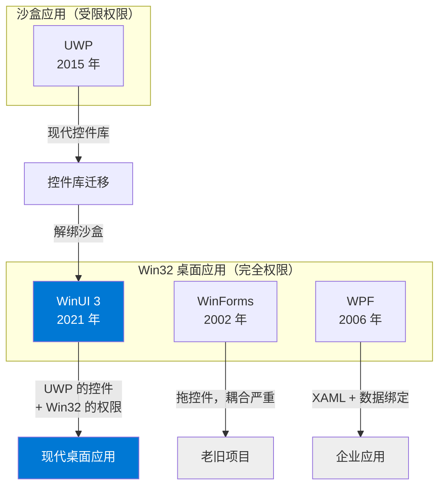
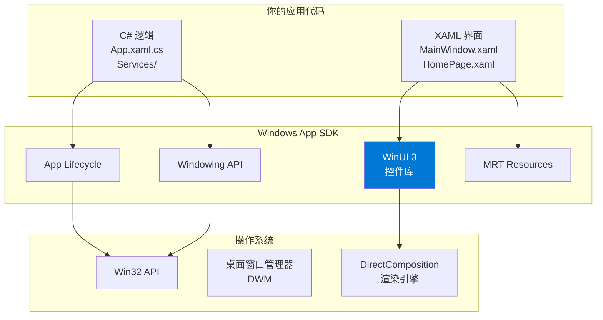

# 第 27 课：WinUI 3 概述

## 为什么学这个

前面 26 课，你学会了 C# 语法、面向对象、异步编程、XAML 布局、数据绑定。这些技术最终要落在一个具体框架上，才能写出真正跑在 Windows 上的桌面应用。WinUI 3 就是这个框架。

TubaTools 整个项目，从启动到界面渲染、从工具加载到硬件检测，底层全靠 WinUI 3 撑着。不理解它，你看 MainWindow.xaml.cs 里的 NavigationView 会懵，看 App.xaml 里的 XamlControlsResources 也会懵。

这节课不讲具体控件怎么写——那是后面几课的事。这节课只解决一个问题：WinUI 3 到底是什么，它在整个 Windows 开发生态里处在什么位置，以及 TubaTools 的项目文件（.csproj）里那些配置项到底是干嘛的。

## WinUI 3 是什么

WinUI 3 是微软在 2021 年随 Windows App SDK 一起发布的原生 UI 框架。说人话：它是一个写 Windows 桌面应用界面的工具包。

它的前身是 WinUI 2，再往前是 UWP（Universal Windows Platform）里的 XAML 控件。但 WinUI 3 做了一个关键改变——它和 UWP 彻底解绑了。UWP 的应用只能跑在沙盒里，权限受限，分发要走微软商店。WinUI 3 的应用是标准 Win32 桌面程序，和你在用的 QQ、微信、Chrome、VS Code 一样，完全不受沙盒限制。

这个变化意味着什么？你可以用 WinUI 3 写一个性能工具（比如 TubaTools），直接调用 WMI 查硬件、读注册表、跑 PowerShell 脚本——这些在 UWP 沙盒里全被禁止。

## WinUI 3 在 Windows UI 家族里的位置

Windows 桌面开发的历史，说白了就是微软反复推翻自己的 UI 框架的历史。搞清楚这些框架的区别，你才能理解 WinUI 3 解决了什么老问题。

### WinForms（2002 年）

Windows 桌面开发的开山框架。写起来简单，拖控件就能搭界面。但问题也很明显：不支持高 DPI 缩放，在 4K 屏幕上控件会糊成一片；不支持现代 UI 效果（毛玻璃、阴影、动画）；界面和逻辑耦合在一起，复杂项目很难维护。

TubaTools 项目里还有一个 `TubaWinUi3.Compatible` 子项目，就是用 WinForms（MetroModernUI 主题）写的兼容版本，目标框架是 .NET Framework 4.5。对比一下两个 .csproj 文件就能直观感受到差距：

WinForms 兼容版：
```xml
<TargetFramework>net45</TargetFramework>
<UseWindowsForms>true</UseWindowsForms>
```

WinUI 3 主版本：
```xml
<TargetFramework>net10.0-windows10.0.26100.0</TargetFramework>
<UseWinUI>true</UseWinUI>
```

`net45` 是十年前的技术栈，`net10.0` 是最新的。这不止是版本号的区别——后者意味着你能用 C# 13 的所有新特性、能用 `Span<T>` 做高性能内存操作、能用 Native AOT 编译成本地代码。

### WPF（2006 年）

WPF 引入了 XAML，把界面和逻辑分开了。它比 WinForms 现代得多，支持数据绑定、样式、模板。但 WPF 的控件风格停留在 Windows 7 时代，而且它的渲染引擎是自研的，和 Windows 自身的渲染管道不完全兼容。你想用 Windows 11 的 Mica 材质？WPF 做不到。

### UWP（2015 年）

UWP 的控件漂亮，原生支持高 DPI，有流畅的动画。但它死在沙盒上。不能自由读写文件系统、不能调外部进程、分发必须走商店审核。开发者用脚投票，UWP 生态至今没有真正起来。

### WinUI 3（2021 年）

WinUI 3 的聪明之处在于它把 UWP 的控件库从沙盒里解放出来，嫁接到了 Win32 应用模型上。你得到了 UWP 级别的现代 UI，同时保留了 Win32 的全部系统权限。这就是 TubaTools 选它的原因——既要好看的界面，又要能深入系统底层读硬件信息。

下面这张图概括了这四个框架的关系：



## WinUI 3 的技术架构

WinUI 3 不是单独一个东西。它是 Windows App SDK（简称 WinAppSDK）里的一个组件。整个架构分三层：

### 最底层：Win32 API

所有 Windows 桌面应用最终都通过 Win32 API 和操作系统交互。创建窗口、响应鼠标、读写文件——这些底层操作经过几十年打磨，稳定得可怕。WinUI 3 没有重写这些，而是在上面盖了一层。

### 中间层：Windows App SDK

WinAppSDK 是微软在 2021 年推出的统一开发包。它把以前散落在 UWP、Win32、.NET 里的各种 API 打包在一起：

- **WinUI 3**：XAML UI 框架（就是我们这课讲的）
- **App Lifecycle**：应用生命周期管理（启动、激活、关闭）
- **Windowing**：窗口管理 API（AppWindow）
- **Resources**：MRT 资源管理系统
- **Push Notifications**：本地和推送通知

在 TubaTools 的 .csproj 里，WinAppSDK 是通过一个 NuGet 包引入的：

```xml
<PackageReference Include="Microsoft.WindowsAppSDK" Version="1.8.260317003" />
```

注意这个版本号——`1.8.260317003`。WinAppSDK 有自己独立的版本节奏，不跟 .NET 或 Windows 走。这意味着即使你的 Windows 没有更新，只要升级这个 NuGet 包，就能获得新的 UI 控件和 API。

### 最上层：你的应用代码

TubaTools 的 App.xaml.cs、MainWindow.xaml.cs、各个 Page，都是在这一层。你写 XAML 描述界面长什么样，写 C# 处理用户操作和业务逻辑。



WinUI 3 的渲染走的是 DirectComposition，这是 Windows 10 引入的硬件加速合成引擎。和 WPF 自研的渲染管道不同，DirectComposition 和 Windows 自身的渲染是同一套机制，所以 WinUI 3 的窗口可以原生支持 Mica 材质、亚克力模糊、圆角窗口——这些效果是操作系统在显卡上直接算出来的，不消耗你的 CPU。

## 解剖 TubaTools 的 .csproj 文件

理论说完，来看真实的代码。TubaTools 的项目文件 `TubaWinUi3.csproj` 一共 86 行，每一行都在告诉 .NET SDK 这件工具怎么构建。我挑出和 WinUI 3 直接相关的配置，逐行解释。

### 输出类型和目标框架

```xml
<OutputType>WinExe</OutputType>
<TargetFramework>net10.0-windows10.0.26100.0</TargetFramework>
<TargetPlatformMinVersion>10.0.17763.0</TargetPlatformMinVersion>
```

`WinExe` 表示这是一个 Windows 桌面 GUI 程序（不是控制台、不是 DLL）。双击运行时会启动一个窗口，没有黑框。

`net10.0-windows10.0.26100.0` 是目标框架的名字。它包含三个信息：
- `net10.0`：基于 .NET 10 运行时
- `windows10.0.26100.0`：要求 Windows SDK 版本 26100（对应 Windows 11 24H2）
- 写成这样的格式意味着这个项目会引用 Windows 平台专属的 API，不能跨 Linux/macOS 跑

`TargetPlatformMinVersion` 设为 `10.0.17763.0`，这是 Windows 10 1809 的版本号。意思是虽然编译用最新的 SDK，但生成的程序最低可以在 2018 年的 Windows 10 1809 上运行。这是 WinUI 3 的硬性最低要求——再低的 Windows 版本不支持 WinAppSDK。

### 平台和运行时标识

```xml
<Platforms>x86;x64;ARM64</Platforms>
<RuntimeIdentifier Condition="'$(RuntimeIdentifier)' == ''">win-$([System.Runtime.InteropServices.RuntimeInformation]::ProcessArchitecture.ToString().ToLowerInvariant())</RuntimeIdentifier>
```

`Platforms` 列出了支持三种 CPU 架构。TubaTools 作为硬件检测工具，必须在不同架构上都能跑——你在 ARM64 设备（比如 Surface Pro X）上打开它，它得能正确识别 ARM 处理器，不能直接崩溃。

`RuntimeIdentifier` 通过一个 MSBuild 内联表达式自动检测当前编译机器的架构。这段代码里 `[System.Runtime.InteropServices.RuntimeInformation]::ProcessArchitecture` 是一个 C# 调用，在 MSBuild 编译时就执行了——不是运行时，是编译时。这很巧妙，开发者不用手动指定 `-r win-x64` 或 `-r win-arm64`。

### WinUI 专属开关

```xml
<UseWinUI>true</UseWinUI>
<WinUISDKReferences>false</WinUISDKReferences>
<EnableMsixTooling>false</EnableMsixTooling>
<WindowsPackageType>None</WindowsPackageType>
<WindowsAppSDKSelfContained>true</WindowsAppSDKSelfContained>
```

`UseWinUI` 设为 `true` 后，.NET SDK 会自动引用 WinUI 3 的控件库、主题、构建目标。你不需要在 `<PackageReference>` 里单独加 WinUI NuGet 包——SDK 帮你处理了。

`WinUISDKReferences` 设为 `false`，这是告诉构建系统不要自动添加 WinUI SDK 的引用。为什么关掉？因为 TubaTools 已经通过 `Microsoft.WindowsAppSDK` 包手动管理了这些引用，再自动加一次会冲突。

`EnableMsixTooling` 和 `WindowsPackageType` 都指向打包方式。MSIX 是微软推的现代打包格式，类似手机上的 APK。TubaTools 选了 `None`，意味着不打 MSIX 包，生成的是传统的独立 .exe 文件——这也是 `WindowsAppSDKSelfContained=true` 的含义：把所有依赖（包括 WinAppSDK 运行时）打包进输出文件夹，用户不用安装任何东西，双击就能跑。

### 代码分析配置

```xml
<ImplicitUsings>enable</ImplicitUsings>
<Nullable>enable</Nullable>
<AllowUnsafeBlocks>true</AllowUnsafeBlocks>
<NoWarn>CA2252;CA2014</NoWarn>
```

`ImplicitUsings` 启用后，你不用在每个 .cs 文件顶部写 `using System;` `using System.Linq;`——这些常用命名空间会被自动引入。这是 .NET 6 之后的默认做法，减少样板代码。

`Nullable` 启用后，编译器会强制检查 null 引用。所有引用类型变量默认不能为 null，除非你用 `?` 标记。这个机制在编译期拦截了大量潜在的 `NullReferenceException`。TubaTools 的 HardwareInfoService.cs 里到处是 `?` 标记，正是因为这个开关。

`AllowUnsafeBlocks` 允许使用指针和非安全代码。TubaTools 里有些场景需要直接读硬件寄存器或调 native API，不用 unsafe 写不了。

`NoWarn` 关掉了两个具体的编译器警告。CA2252 是"预览 API 使用警告"，CA2014 是"不要在循环里用 stackalloc"。TubaTools 开发者在某些场景下确信这些用法没问题，所以显式关掉警告，不让构建日志被大量警告淹没。

### NuGet 依赖

```xml
<PackageReference Include="LibreHardwareMonitorLib" Version="0.9.6" />
<PackageReference Include="Microsoft.Diagnostics.Tracing.TraceEvent" Version="3.2.2" />
<PackageReference Include="Microsoft.Windows.SDK.BuildTools" Version="10.0.26100.7705" />
<PackageReference Include="Microsoft.WindowsAppSDK" Version="1.8.260317003" />
<PackageReference Include="System.Diagnostics.EventLog" Version="10.0.2" />
<PackageReference Include="System.Drawing.Common" Version="10.0.0" />
<PackageReference Include="System.Management" Version="10.0.8" />
```

这里有几个包值得单拎出来说：

**LibreHardwareMonitorLib (0.9.6)**：开源硬件监控库，能读 CPU 温度、风扇转速、电压。TubaTools 的 HardwareInfoService 有 1810 行代码，其中大量的硬件读取逻辑依赖这个库。没有它，光靠 Win32 API 去读 SMBIOS 和传感器数据，工作量会翻好几倍。

**System.Management (10.0.8)**：微软官方的 WMI 查询库。TubaTools 用它查主板型号、BIOS 版本、内存条数量。WMI 是 Windows 的核心管理接口，所有硬件信息基本都能通过 WMI 查到。

**Microsoft.WindowsAppSDK (1.8.260317003)**：前面说过的 WinAppSDK 包。版本 1.8 是 2025 年的较新版本，包含了 NavigationView、InfoBadge、TabView 等新控件。

这几个包拼在一起，刚好揭示了 TubaTools 的技术选型思路：用最新 .NET 和 WinUI 3 做界面骨架，用成熟的开源硬件库做数据采集，用 WMI 作为兜底方案查系统信息。

### 发布配置

```xml
<PublishReadyToRun Condition="'$(Configuration)' == 'Debug'">False</PublishReadyToRun>
<PublishReadyToRun Condition="'$(Configuration)' != 'Debug'">False</PublishReadyToRun>
<PublishTrimmed>false</PublishTrimmed>
<IncludeNativeLibrariesForSelfExtract>true</IncludeNativeLibrariesForSelfExtract>
<IncludeAllContentForSelfExtract>true</IncludeAllContentForSelfExtract>
```

有趣的是 `PublishReadyToRun` 在 Debug 和非 Debug 模式下都设成了 `False`。ReadyToRun 是一种预编译技术，把 IL 代码提前编译成机器码，能加快启动速度。TubaTools 关掉它，可能是因为 ReadyToRun 生成的二进制体积更大，而且对启动速度的要求没那么苛刻——毕竟不是即时通讯软件，多等 0.5 秒启动不打紧。

`PublishTrimmed` 也关了。Trimming 会在编译时裁剪未使用的代码，但可能误删掉通过反射调用的代码。TubaTools 用了大量反射——ToolCatalog 扫描程序集、IBuiltinTool 接口动态发现内置工具——开 trimming 可能会导致运行时找不到工具类。

`IncludeNativeLibrariesForSelfExtract` 和 `IncludeAllContentForSelfExtract` 配合 `WindowsAppSDKSelfContained` 使用，确保所有 native dll 和资源文件都打包进输出目录。用户拿到的是一个完整的文件夹，拷到 U 盘插别的电脑也能直接跑。

## TubaTools 兼容版项目：一个对比案例

TubaTools 仓库里有两个 .csproj 文件。主项目是 WinUI 3 写的；还有一个 `TubaWinUi3.Compatible`，用 WinForms（MetroModernUI 主题）写的兼容版本。

把两个文件摆在一起对比，WinUI 3 的进步清清楚楚：

| 对比点 | WinUI 3 版本 | WinForms 兼容版 |
|--------|-------------|-----------------|
| 目标框架 | net10.0-windows10.0.26100.0 | net45 |
| UI 框架 | WinUI 3 + XAML | WinForms + MetroModernUI |
| null 检查 | Nullable enabled | Nullable disabled |
| 隐式 using | 启用 | 禁用 |
| 包管理 | NuGet PackageReference | NuGet PackageReference |
| 依赖数量 | 6 个 NuGet 包 | 2 个 NuGet 包 + 5 个系统引用 |
| 最低系统 | Windows 10 1809 | Windows 7 SP1 |

兼容版的存在说明了一件事：虽然 WinUI 3 是未来，但现实世界里还有很多跑老系统的设备。TubaTools 作为一个硬件工具，它的用户可能拿着 2012 年的 ThinkPad 来修电脑，这时 WinUI 3 版本根本装不上（最低要求 Windows 10 1809），兼容版就成了救命稻草。

这就是软件工程里常见的权衡——选择新技术意味着丢掉一部分老用户。微软现在也在推这个取舍，Windows 10 将在 2025 年结束支持，届时 WinUI 3 的最低系统要求就不再是包袱了。

## 学完这课你应该记住的东西

1. WinUI 3 = UWP 的现代控件 + Win32 的完整权限，不是沙盒应用
2. WinUI 3 是 Windows App SDK 的一部分，通过 NuGet 包 `Microsoft.WindowsAppSDK` 引入
3. .csproj 文件里的 `<UseWinUI>true</UseWinUI>` 是启用 WinUI 3 的关键开关
4. WinUI 3 最低要求 Windows 10 1809，不能再低了
5. `WindowsAppSDKSelfContained=true` 意味着不需要用户装运行时，拷文件夹就能跑
6. WinUI 3 的渲染走 DirectComposition，原生支持 Mica 材质等现代效果

---

## 小练习

**第 1 题（填空）**

在 TubaTools 的 .csproj 文件中，启用 WinUI 3 的配置项是 `___________`，它的值设为 `true`。

**第 2 题（选择）**

WinUI 3 应用是哪种类型的 Windows 程序？

A. 沙盒应用，必须从微软商店安装
B. 标准 Win32 桌面应用，有完整系统权限
C. Web 应用，在浏览器里运行
D. 控制台应用，没有图形界面

**第 3 题（简答）**

TubaTools 的 .csproj 里 `<WindowsAppSDKSelfContained>` 设为了 `true`。解释这个配置的作用：如果用户从网上下载了 TubaTools 的发布包，他需要提前安装什么东西才能运行吗？为什么？

**第 4 题（实操）**

用记事本打开 TubaTools 的 `TubaWinUi3.csproj` 文件（路径在 `E:\Git\AClaudeDC\tubatools-master\TubaWinUi3.csproj`）。找到所有 `<PackageReference>` 标签，数一数一共有几个 NuGet 依赖包。然后在网上搜索其中任意一个包的名称，看看它能干什么。

---

## 练习答案

<details>
<summary>点击展开答案</summary>

**第 1 题**
`<UseWinUI>`

**第 2 题**
B。WinUI 3 应用是标准 Win32 桌面应用，不受沙盒限制。

**第 3 题**
不需要提前安装任何东西。`WindowsAppSDKSelfContained=true` 的作用是把 WinAppSDK 运行时库打包进应用的输出文件夹。用户下载解压后直接双击 exe 就能运行，不需要安装 .NET 运行时或 Windows App SDK。但要注意，操作系统版本必须满足最低要求（Windows 10 1809 或更高）。

**第 4 题**
一共有 6 个 NuGet 依赖包：
- LibreHardwareMonitorLib
- Microsoft.Diagnostics.Tracing.TraceEvent
- Microsoft.Windows.SDK.BuildTools
- Microsoft.WindowsAppSDK
- System.Diagnostics.EventLog
- System.Drawing.Common
- System.Management（加上这个一共 7 个——实际 .csproj 里列出了 7 个 `<PackageReference>`）

其中 Microsoft.WindowsAppSDK 是整个 WinUI 3 的核心框架包。
</details>
