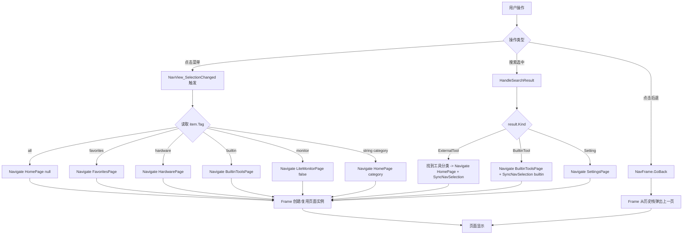

# 第 28 课：页面导航

一个桌面应用如果没有多个页面，就跟一个对话框没什么区别。你打开 TubaTools，能看到"全部"、"常用"、"硬件信息"、"内置"、"硬件监控"这些选项，点一下就切到不同的内容区域——这就是页面导航。这一课讲 WinUI 3 里怎么实现这种侧边栏导航。

## 为什么需要页面导航

单页应用只能做一件事。一个计算器也许不需要导航，但一个工具箱类应用——像 TubaTools 那样有硬件检测、工具分类、设置、监控面板——必须把功能分成不同的页面，然后提供一个切换方式。

导航要做三件事：

1. 让用户知道"我在哪"——选中的菜单项高亮
2. 让用户能去别的地方——点击菜单项跳转
3. 支持"后退"——尤其是从搜索结果跳进去后能回得去

WinUI 3 提供了一套现成的控件来做这件事：NavigationView + Frame。这两个东西配合起来，20 行 XAML 就能搭出一个有模有样的导航结构。

## NavigationView：侧边导航栏

NavigationView 是 WinUI 3 里专门做导航的控件。它自带汉堡菜单（左上角那个三条杠的按钮）、菜单项列表、选中高亮、紧凑模式（只显示图标），甚至还能自动响应窗口宽度变化来折叠/展开。

打开 TubaTools 的 `MainWindow.xaml`，NavigationView 长这样：

```xml
<NavigationView
    x:Name="NavView"
    Grid.Row="1"
    CompactModeThresholdWidth="0"
    ExpandedModeThresholdWidth="600"
    IsBackButtonVisible="Collapsed"
    IsPaneToggleButtonVisible="False"
    OpenPaneLength="200"
    SelectionChanged="NavView_SelectionChanged">
    <NavigationView.MenuItems>
        <NavigationViewItem Content="全部" Tag="all">
            <NavigationViewItem.Icon>
                <FontIcon Glyph="&#xE80F;" />
            </NavigationViewItem.Icon>
        </NavigationViewItem>
        <NavigationViewItem Content="常用" Tag="favorites">
            <NavigationViewItem.Icon>
                <FontIcon Glyph="&#xE735;" />
            </NavigationViewItem.Icon>
        </NavigationViewItem>
        <NavigationViewItem Content="硬件信息" Tag="hardware">
            ...
        </NavigationViewItem>
        ...
    </NavigationView.MenuItems>
    <Frame x:Name="NavFrame" CacheSize="10" />
</NavigationView>
```

拆开来看：

**CompactModeThresholdWidth="0"** 这个设置比较有意思。正常情况下，窗口缩窄到一定宽度时 NavigationView 会自动切到紧凑模式（只显示图标，不显示文字）。设成 0 意味着"永远不要自动折叠"。TubaTools 把它交给 TitleBar 上的按钮手动控制，而不是靠窗口宽度。

**OpenPaneLength="200"** 控制了侧边栏展开后的宽度，200 像素。

**MenuItems** 是静态菜单项。注意每个 NavigationViewItem 都有一个 `Tag` 属性——这是后面代码里判断用户点了哪一个的关键。Tag 可以是任意 object，TubaTools 统一用了 string。

**Frame** 放在了 NavigationView 里面。NavigationView 的设计就是：内容区域放一个 Frame，菜单切换时往 Frame 里加载不同页面。这是 WinUI 的标准用法。

### 动态菜单：工具分类

静态菜单只够放固定的几个入口。TubaTools 还有一个"工具分类"菜单——处理器工具、显卡工具、硬盘工具等等——这些是从 ToolCatalog 扫描出来的，不能写死在 XAML 里。

`MainWindow.xaml.cs` 里的 `PopulateCategories()` 方法干的就是这件事：

```csharp
private void PopulateCategories()
{
    // 先清掉旧的分类菜单（保留前 5 个静态项）
    while (NavView.MenuItems.Count > 5)
    {
        NavView.MenuItems.RemoveAt(5);
    }

    var categories = ToolCatalog.GetCategories();
    var otherCategory = categories.FirstOrDefault(c => c.Contains("其他"));
    var restCategories = categories.Where(c => !c.Contains("其他"));

    // 把"其他"排在最后
    foreach (var category in restCategories)
    {
        NavView.MenuItems.Add(new NavigationViewItem
        {
            Content = category.Replace("工具", ""),
            Tag = category,
            Icon = new FontIcon { Glyph = GetCategoryGlyphStatic(category) }
        });
    }

    if (otherCategory != null)
    {
        NavView.MenuItems.Add(new NavigationViewItem
        {
            Content = otherCategory.Replace("工具", ""),
            Tag = otherCategory,
            Icon = new FontIcon { Glyph = GetCategoryGlyphStatic(otherCategory) }
        });
    }
}
```

这段代码展示了一个重要技巧：NavigationView.MenuItems 是可以在代码里动态增删的。`NavView.MenuItems.RemoveAt(5)` 删掉索引 5 开始的旧分类项，保留前 5 个（全部、常用、硬件信息、内置、硬件监控）。然后从 ToolCatalog 拿到分类列表，逐个 `Add` 进去。

注意 Tag 用了完整的分类名（比如"处理器工具"），因为后面导航时需要靠 Tag 来匹配。Content 则去掉了"工具"后缀，显示时更简洁。

## Frame：页面容器

Frame 是 UWP/WinUI 里做页面导航的核心容器。你不需要自己管理页面切换——只需要调用 `Frame.Navigate(typeof(某页面))`，Frame 就会创建该页面的实例并显示出来。Frame 还会自动维护一个导航历史栈，支持 `GoBack()` 返回上一页。

TubaTools 里用了一个 Frame：

```xml
<Frame x:Name="NavFrame" CacheSize="10" />
```

`CacheSize="10"` 表示 Frame 会缓存最多 10 个页面实例。缓存的页面不会每次导航都重新创建，切换回来时能保持之前的状态（比如滚动位置）。这对于工具列表页很重要——用户从"处理器工具"切到"显卡工具"再切回来，不应该重新加载。

## 响应选择：导航的核心逻辑

用户点击菜单项时，NavigationView 触发 `SelectionChanged` 事件。来看 TubaTools 是怎么处理的：

```csharp
private async void NavView_SelectionChanged(
    NavigationView sender, NavigationViewSelectionChangedEventArgs args)
{
    if (_syncingNavSelection) return;

    if (args.IsSettingsSelected)
    {
        NavFrame.Navigate(typeof(SettingsPage));
    }
    else if (args.SelectedItem is NavigationViewItem item)
    {
        switch (item.Tag)
        {
            case "all":
                NavFrame.Navigate(typeof(HomePage), null);
                break;
            case "favorites":
                NavFrame.Navigate(typeof(FavoritesPage));
                break;
            case "hardware":
                NavFrame.Navigate(typeof(HardwarePage));
                break;
            case "builtin":
                NavFrame.Navigate(typeof(BuiltinToolsPage));
                break;
            case "monitor":
                NavFrame.Navigate(typeof(Pages.LiteMonitorPage), false);
                break;
            case string category:
                NavFrame.Navigate(typeof(HomePage), category);
                break;
        }
    }
}
```

这里有几点值得讲：

**1. Tag 驱动的路由**

这是整个导航设计的核心。每个 NavigationViewItem 的 Tag 就是一个路由标识。switch 语句根据 Tag 值决定跳到哪个页面。分类菜单的 Tag 不是预定义的字符串（"处理器工具"、"显卡工具"等），所以落入 `case string category` 分支，统一跳到 HomePage，但把分类名作为参数传进去。HomePage 拿到这个参数后就知道该显示哪个分类的工具列表。

**2. Navigate 的参数**

`Frame.Navigate(Type sourcePageType, object parameter)` 的第二个参数会传给目标页面的 `OnNavigatedTo` 方法。比如：

- `Navigate(typeof(HomePage), null)` —— 参数 null，HomePage 显示全部工具
- `Navigate(typeof(HomePage), "处理器工具")` —— 参数是分类名，HomePage 过滤显示
- `Navigate(typeof(LiteMonitorPage), false)` —— 注意这里传了 false，LiteMonitorPage 用它来控制某些行为（具体看该页面源码）

**3. Settings 是特殊项**

NavigationView 有一个内置的"设置"菜单项，不放在 MenuItems 里，而是通过 `args.IsSettingsSelected` 来判断。TubaTools 没用在 NavigationView 上挂设置项，所以这个判断虽然写了但实际上不会被触发（设置页是通过其他方式打开的）。

**4. _syncingNavSelection 防抖**

`_syncingNavSelection` 这个布尔变量解决了一个常见问题：代码里设置 `NavView.SelectedItem = xxx` 时也会触发 `SelectionChanged` 事件。如果不加这个标志位，程序逻辑修改选中项就会导致二次导航。看 `SyncNavSelection` 方法：

```csharp
private void SyncNavSelection(string tag)
{
    _syncingNavSelection = true;
    foreach (var item in NavView.MenuItems)
    {
        if (item is NavigationViewItem navItem
            && navItem.Tag is string t && t == tag)
        {
            NavView.SelectedItem = navItem;
            break;
        }
    }
    _syncingNavSelection = false;
}
```

这个方法把侧边栏的选中项高亮同步到某个 Tag 对应的菜单项上，同时设了 `_syncingNavSelection = true` 来阻止 `NavView_SelectionChanged` 再次执行导航逻辑。这是一种很常见的"程序操作 UI 时跳过事件处理"的模式。

## 导航流程图



从图上能看出，所有导航路径最终都汇聚到 Frame.Navigate 或 Frame.GoBack。这就是 WinUI 导航模型的简洁之处——不管你从哪触发，最终都是操作 Frame。

## 搜索到导航的集成

TubaTools 的全局搜索框不仅能搜，搜出来的结果还能直接导航到对应位置。这是个很实用的功能——用户搜"CPU-Z"，不用在分类菜单里翻找，直接跳到那个工具。

搜索集成在 `HandleSearchResult` 方法里：

```csharp
private void HandleSearchResult(SearchResult result)
{
    switch (result.Kind)
    {
        case SearchItemKind.ExternalTool:
        case SearchItemKind.CustomTool:
            NavigateToTool(result.MatchKey);
            break;
        case SearchItemKind.BuiltinTool:
            NavFrame.Navigate(typeof(BuiltinToolsPage),
                new SearchNavigationTarget { HighlightBuiltinId = result.MatchKey });
            SyncNavSelection("builtin");
            break;
        case SearchItemKind.Setting:
            NavFrame.Navigate(typeof(SettingsPage),
                new SearchNavigationTarget { HighlightSettingKey = result.MatchKey });
            break;
        case SearchItemKind.QuickAction:
            HandleQuickAction(result.MatchKey);
            break;
    }
}
```

搜索结果的 `Kind` 决定了跳转方式：

- **外部工具 / 自定义工具**：调用 `NavigateToTool`，这个方法先找到工具所属的分类，然后跳到 HomePage 并高亮那个工具
- **内置工具**：跳到 BuiltinToolsPage，传一个 `SearchNavigationTarget` 告诉页面高亮哪个内置工具
- **设置项**：跳到 SettingsPage，同样传一个 target 告诉它高亮哪个设置
- **快捷操作**：比如"跳转到硬件信息"，直接执行 `SyncNavSelection("hardware")` 并在 Frame 里导航

`SearchNavigationTarget` 是一个简单的数据类，封装了跳转时需要传给目标页面的信息：

```csharp
// 推测的定义（源码中此类型定义可能在 Models 文件夹）
public class SearchNavigationTarget
{
    public string HighlightToolPath { get; set; }
    public string HighlightBuiltinId { get; set; }
    public string HighlightSettingKey { get; set; }
}
```

目标页面（HomePage、BuiltinToolsPage、SettingsPage）在 `OnNavigatedTo` 里检查参数是不是 `SearchNavigationTarget` 类型。如果是，就根据对应字段执行高亮或滚动。

这是一个很干净的"松耦合"设计——发起导航的一方不需要知道目标页面的内部结构，只需要把意图封装成一个 Target 对象，目标页面自己决定怎么处理。

## NavigateToTool：从工具路径反向定位分类

```csharp
private void NavigateToTool(string toolPath)
{
    try
    {
        var tools = ToolCatalog.GetAllToolsCached();
        var tool = tools.FirstOrDefault(t =>
            t.Path.Equals(toolPath, StringComparison.OrdinalIgnoreCase));
        if (tool is not null)
        {
            NavFrame.Navigate(typeof(HomePage),
                new SearchNavigationTarget { HighlightToolPath = toolPath });

            if (!string.IsNullOrEmpty(tool.Category))
                SyncNavSelection(tool.Category);
        }
    }
    catch { }
}
```

这个方法展示了导航里一个常见需求：从数据反向找到 UI 位置。用户搜到一个工具，要知道它属于哪个分类，才能把侧边栏的选中项同步过去。做法是：先拿到工具对象，读出它的 Category 属性，然后调用 `SyncNavSelection`。

注意这里有两个操作：`NavFrame.Navigate`（切换页面内容）和 `SyncNavSelection`（同步侧边栏高亮）。它们必须配套——只换内容不换高亮，用户会困惑"我怎么跳到这个页面的"；只换高亮不换内容，那更没用。

## 后退按钮

后退按钮的显示由 TitleBar 上的 `IsBackButtonVisible` 属性控制，它绑定到了 Frame 的 `CanGoBack` 属性：

```xml
<TitleBar
    ...
    IsBackButtonVisible="{x:Bind NavFrame.CanGoBack, Mode=OneWay}"
    BackRequested="TitleBar_BackRequested"
    ...>
```

Frame 内部维护了一个导航历史栈。每次 `Navigate` 都会往栈里推一条记录。`CanGoBack` 返回 true 时就显示后退按钮。点击后退按钮时：

```csharp
private void TitleBar_BackRequested(TitleBar sender, object args)
{
    NavFrame.GoBack();
}
```

就这么一行。Frame.GoBack() 弹出栈顶记录，导航回上一页。如果栈空了，后退按钮自动隐藏（因为 CanGoBack 变成 false）。

不过 TubaTools 的后退有个小局限：`SyncNavSelection` 修改了侧边栏选中项，但 GoBack 之后侧边栏不会自动同步。比如你从"全部"页搜索了一个内置工具，侧边栏高亮被同步到了"内置"，然后你点后退回到"全部"页——但侧边栏还高亮着"内置"。这是因为 GoBack 只恢复页面内容，不恢复侧边栏状态。在实际使用中这个问题不太明显，因为 TubaTools 的导航深度通常只有一层。

## 默认页面：启动时跳到哪

应用启动时需要一个默认页面。TubaTools 把默认页存在设置里：

```csharp
private void NavigateToDefaultPage()
{
    var defaultPage = AppSettings.Get("DefaultPage") ?? "all";
    NavigationViewItem targetItem = null;

    foreach (var item in NavView.MenuItems)
    {
        if (item is NavigationViewItem navItem
            && navItem.Tag is string tag && tag == defaultPage)
        {
            targetItem = navItem;
            break;
        }
    }

    if (targetItem is not null)
    {
        NavView.SelectedItem = targetItem;
    }
    else
    {
        NavFrame.Navigate(typeof(HomePage), null);
    }
}
```

这段代码的逻辑是：先从设置里读 DefaultPage 的值，然后遍历菜单项找到 Tag 匹配的那个，设置 `NavView.SelectedItem` 来触发 SelectionChanged 事件，从而完成导航。如果找不到匹配的（设置值不合法），fallback 到直接 Navigate 到 HomePage。

这里有一个有趣的细节：设置 `SelectedItem` 会触发 `SelectionChanged` 事件，所以不需要单独调用 `NavFrame.Navigate`——事件处理函数会做这件事。但如果找不到匹配的菜单项，就必须手动 Navigate。

## 导航参数传递：Type 和 Object

Frame.Navigate 的签名是：

```csharp
public bool Navigate(Type sourcePageType, object parameter)
```

第一个参数是页面的 Type，C# 里用 `typeof(HomePage)` 来拿到。第二个参数是 object，可以是任何东西——null、字符串、数字、自定义对象。目标页面在 `OnNavigatedTo` 中接收：

```csharp
protected override void OnNavigatedTo(NavigationEventArgs e)
{
    base.OnNavigatedTo(e);
    // e.Parameter 就是传过来的那个 object
    if (e.Parameter is string category)
    {
        LoadToolsByCategory(category);
    }
}
```

TubaTools 里用了几种参数类型：
- `null`：表示"全部"
- `string category`：分类名
- `SearchNavigationTarget`：搜索结果导航
- `false`（bool）：LiteMonitorPage 的特殊控制标志

用 object 类型做参数的好处是灵活，坏处是调用方和目标页面之间没有编译期类型检查。如果传错了类型，要到运行时才会暴露。在 TubaTools 这种自己控制全部代码的项目里这不是大问题，但如果你在写一个给别人调用的框架，最好定义一个专门的导航参数类型。

## 小结

页面导航在 WinUI 3 里由两个控件配合完成：

- **NavigationView** 管菜单展示和用户选择
- **Frame** 管页面加载和历史栈

它们之间的桥梁是 `SelectionChanged` 事件处理函数，通过 Tag 来判断菜单项身份，然后调用 `Frame.Navigate` 加载对应页面。

TubaTools 在这个基础上加了三层扩展：
1. 动态菜单（工具分类从 ToolCatalog 扫描生成）
2. 搜索到导航的桥接（SearchResult 直接跳到对应页面）
3. 侧边栏选中状态与页面内容的同步（SyncNavSelection）

## 小练习

**1. 填空题**

NavigationView 的菜单项用 `________` 属性来标识身份，代码里通过 `item.Tag` 读取它来判断用户点了哪个菜单项。Frame 通过调用 `________` 方法加载新页面，通过 `________` 方法返回上一页。

**2. 选择题**

以下关于 NavigationView 的描述，哪项是错误的？

A. NavigationView 可以包含静态菜单项（MenuItems）和动态添加的菜单项
B. NavigationView 的 SelectionChanged 事件在代码设置 SelectedItem 时也会触发
C. NavigationView 必须放在 Window 的第一行，不能放在 Grid 的其他行
D. NavigationView 的 CompactModeThresholdWidth 设为 0 表示永不自动折叠

**3. 简答题**

TubaTools 在搜索结果导航时，为什么除了调用 `NavFrame.Navigate` 还要调用 `SyncNavSelection`？如果只做 Navigate 不做 SyncNavSelection，用户会看到什么现象？

**4. 实操题**

假设你要给 TubaTools 加一个新页面叫"日志查看器"（LogViewerPage），入口放在 NavigationView 的静态菜单里，Tag 设为 "logs"。请写出需要在 MainWindow.xaml 和 MainWindow.xaml.cs 里添加的代码片段。（不需要实际运行，写出核心逻辑即可）

---

## 练习答案

**1. 填空**：Tag；Navigate；GoBack

**2. 选择**：C。NavigationView 可以放在 Grid 的任何行，TubaTools 就把它放在 Grid.Row="1"（第二行）。

**3. 简答**：NavFrame.Navigate 只切换了页面内容，侧边栏的选中高亮不会自动变化。如果不调 SyncNavSelection，用户会看到页面内容变成了搜索结果指向的页面（比如内置工具页），但侧边栏还高亮着原来的菜单项（比如"全部"），造成视觉上的不一致——用户不知道自己怎么跳到这个页面的，也搞不清当前在哪个位置。

**4. 实操**：

MainWindow.xaml 在 MenuItems 中添加：
```xml
<NavigationViewItem Content="日志" Tag="logs">
    <NavigationViewItem.Icon>
        <FontIcon Glyph="&#xE7BA;" />
    </NavigationViewItem.Icon>
</NavigationViewItem>
```

MainWindow.xaml.cs 在 NavView_SelectionChanged 的 switch 中添加：
```csharp
case "logs":
    NavFrame.Navigate(typeof(LogViewerPage));
    break;
```
