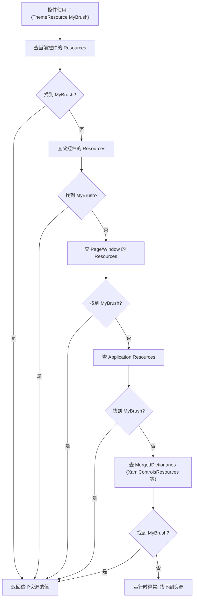

# 第 29 课：资源字典与样式

一个应用如果不做任何样式定制，所有按钮、文本框、列表项都长一个样——系统默认的样子。这不难看，但也没个性。TubaTools 的卡片有圆角、有阴影、有悬停变色；设置页每一项都有统一的间距和字体层次；整个应用能在深色和浅色之间一键切换。这些不是靠给每个控件逐个设置属性做到的，而是靠 XAML 的两套机制：资源字典和样式。

这一课讲这两样东西怎么用，以及 TubaTools 里怎么实践。

## 先搞清楚"资源"是什么

XAML 里的"资源"（Resource）不是图片文件和字体文件那种资源，而是指你定义在 XAML 中、可以被其他地方反复引用的对象。它可以是画笔颜色、字符串、控件模板，也可以是一个 Style 对象。

在代码里写一个常量，你写一次，到处用。XAML 资源也一样——在 `Button` 的 `Background` 里写 `{StaticResource MyBlue}`，就不用每次复制 `#FF2563EB` 这个颜色值。

用资源有两个理由：

第一，改一处全局生效。你的品牌色从蓝色改成绿色，只改资源定义，所有引用它的地方自动更新。

第二，可读性。`AccentFillColorDefaultBrush` 比 `#FF60CDFF` 能让人一眼看懂这个颜色是干什么的。

## ResourceDictionary：放资源的地方

XAML 里每一个资源都放在 `ResourceDictionary` 里面。这就像一个键值对集合——key 是字符串名称，value 是任意 XAML 对象。写法是在 XAML 元素上附加 `x:Key` 属性：

```xml
<ResourceDictionary>
    <SolidColorBrush x:Key="CardBackground" Color="#2D2D2D" />
    <Style x:Key="SectionHeaderStyle" TargetType="TextBlock">
        <Setter Property="FontSize" Value="14" />
        <Setter Property="FontWeight" Value="SemiBold" />
    </Style>
</ResourceDictionary>
```

`ResourceDictionary` 可以在几个层级出现：

- `Application.Resources`：应用程序级别，所有页面和窗口都能用。
- `Page.Resources` 或 `Window.Resources`：只在该页面或窗口内可用。
- `FrameworkElement.Resources`：任何控件都可以有自己的资源字典，只在它和它的子元素中可用。

这个层级关系用一句话概括：子级可以覆盖父级，但父级管不到子级内部。如果你在 App 级别定义了一个 `CardBackground` 为灰色，某个页面重新定义了同名的 `CardBackground` 为蓝色——那这个页面里用的是蓝色，其他页面还是灰色。

## MergedDictionaries：把资源拆到不同文件

一个 ResourceDictionary 装所有资源，几百行甚至上千行，维护起来很痛苦。WinUI 3 支持 `MergedDictionaries`，允许你把多个独立的 ResourceDictionary 拼到一起。

TubaTools 的 `App.xaml` 就是这么干的：

```xml
<Application.Resources>
    <ResourceDictionary>
        <ResourceDictionary.MergedDictionaries>
            <XamlControlsResources xmlns="using:Microsoft.UI.Xaml.Controls" />
            <!-- Other merged dictionaries here -->
        </ResourceDictionary.MergedDictionaries>
        <!-- Other app resources here -->
    </ResourceDictionary>
</Application.Resources>
```

`XamlControlsResources` 是 WinUI 3 官方提供的一套默认样式资源。把它放在 `MergedDictionaries` 的第一项，意味着所有 WinUI 标准控件（Button、TextBox、NavigationView 等）都自动获得 Fluent Design 风格的默认外观。你不写一行样式代码，WinUI 控件就已经比传统 WinForms 好看几个档次了。

合并的顺序有讲究：后合并的字典会覆盖前面同名资源。如果你自己的主题文件放在 `XamlControlsResources` 之后，就能覆盖 WinUI 的默认颜色——这是定制主题的关键。

## Style：把属性打包复用

给一个控件设置 `FontSize=\"14\" FontWeight=\"SemiBold\" Opacity=\"0.62\"` 这不算复杂，但如果你有二十个标题都要这三行，逐个写就蠢了。Style 解决的就是这个问题——把一组属性打包成一个可复用的样式对象。

Style 的定义三部曲：

1. `x:Key`：给这个样式取个名字，引用时用这个名字。
2. `TargetType`：声明这个样式只能用于哪种控件。WinUI 会做类型检查。
3. `Setter`：要设置的属性和值。可以有多个 Setter。

TubaTools 的 `SettingsPage.xaml` 里定义了好几个 Style：

```xml
<Style x:Key="SectionHeaderStyle" TargetType="TextBlock">
    <Setter Property="FontSize" Value="14" />
    <Setter Property="FontWeight" Value="SemiBold" />
    <Setter Property="Opacity" Value="0.62" />
    <Setter Property="Margin" Value="0,24,0,6" />
</Style>

<Style x:Key="SettingsCardStyle" TargetType="Border">
    <Setter Property="Padding" Value="16" />
    <Setter Property="CornerRadius" Value="8" />
    <Setter Property="Background" Value="{ThemeResource CardBackgroundFillColorDefaultBrush}" />
    <Setter Property="BorderBrush" Value="{ThemeResource CardStrokeColorDefaultBrush}" />
    <Setter Property="BorderThickness" Value="1" />
</Style>

<Style x:Key="IconBorderStyle" TargetType="Border">
    <Setter Property="Width" Value="36" />
    <Setter Property="Height" Value="36" />
    <Setter Property="Background" Value="{ThemeResource SubtleFillColorSecondaryBrush}" />
    <Setter Property="CornerRadius" Value="6" />
</Style>
```

使用时这样写：

```xml
<TextBlock Style="{StaticResource SectionHeaderStyle}" Text="关于" />
<Border Style="{StaticResource SettingsCardStyle}">
    <!-- 卡片内容 -->
</Border>
```

你不用 Style 的时候要写 4 行属性，用 Style 之后只一行 `Style="{StaticResource ...}"` 就把所有属性一次注入了。而且在设置页里，所有设置卡片都用同一个 `SettingsCardStyle`——以后想统一改卡片的圆角从 8 改成 12，只改 Style 定义那一处就行。

对读者来说还有一个隐性的好处：看见 `Style="{StaticResource SettingsCardStyle}"` 就知道这是一个设置卡片，不需要再去解析那一堆属性。

## StaticResource 和 ThemeResource：找资源的两种方式

你在 XAML 里引用资源时有两种写法：`{StaticResource ...}` 和 `{ThemeResource ...}`。它们的区别不是语法糖——行为完全不同。

**StaticResource** 是编译时一次查找。XAML 解析到 `{StaticResource MyBrush}` 时，从当前元素的资源字典开始往上爬（当前控件 → 父控件 → Page → App → XamlControlsResources），找到第一个名为 MyBrush 的资源就把它的值钉死。之后就算这个资源在运行时被替换了，引用它的地方也不会变。

**ThemeResource** 是运行时动态查找。每次主题切换（系统从浅色切到深色，或者用户在 TubaTools 设置里手动切主题），所有 `{ThemeResource ...}` 的引用会被重新求值，拿到的可能是另一个值。

`{ThemeResource}` 的核心价值就在主题切换。WinUI 3 内置的 `CardBackgroundFillColorDefaultBrush` 在浅色主题下返回白色，深色主题下返回深灰色。你用 `{ThemeResource CardBackgroundFillColorDefaultBrush}` 设置卡片的背景，主题一切换，所有卡片颜色自动跟着变——零额外代码。

TubaTools 的 `MainWindow.xaml` 中大量使用 `{ThemeResource}`：

```xml
<Border
    Background="{ThemeResource SubtleFillColorSecondaryBrush}"
    CornerRadius="6">
    <!-- 图标区域 -->
</Border>
```

`HomePage.xaml` 的卡片也用：

```xml
<Border
    Padding="16"
    MinHeight="220"
    Background="{ThemeResource CardBackgroundFillColorDefaultBrush}"
    BorderBrush="{ThemeResource CardStrokeColorDefaultBrush}"
    BorderThickness="1"
    CornerRadius="8">
```

这些控件的颜色在浅色和深色模式下看起来完全不同，但代码一行不变。ThemeResource 做了所有脏活。

**选择建议**：如果你的资源值不会随主题变化（比如字号、间距、圆角），用 StaticResource，性能更好。会随主题变化的颜色和画笔，用 ThemeResource。不确定的话，颜色相关的资源统一用 ThemeResource。

## ControlTemplate：当 Setter 不够用

Style 的 Setter 只能改属性。但有时候你要改的不只是颜色和字号——你要彻底改变控件的外观结构。比如让一个 `RadioButton` 不再显示那个小圆点，而是变成一个带圆角的标签按钮。

这就轮到 `ControlTemplate` 出场了。

TubaTools 的 `HomePage.xaml` 里有一个很好的例子——`TagRadioButtonStyle`。它把 RadioButton 重构成了一个标签芯片样式的按钮：

```xml
<Style x:Key="TagRadioButtonStyle" TargetType="RadioButton">
    <Setter Property="Background" Value="{ThemeResource SubtleFillColorSecondaryBrush}" />
    <Setter Property="Foreground" Value="{ThemeResource TextFillColorPrimaryBrush}" />
    <Setter Property="BorderBrush" Value="{ThemeResource CardStrokeColorDefaultBrush}" />
    <Setter Property="BorderThickness" Value="1" />
    <Setter Property="Padding" Value="10,4" />
    <Setter Property="CornerRadius" Value="6" />
    <Setter Property="FontSize" Value="12" />
    <Setter Property="Template">
        <Setter.Value>
            <ControlTemplate TargetType="RadioButton">
                <Border
                    x:Name="RootBorder"
                    Background="{TemplateBinding Background}"
                    BorderBrush="{TemplateBinding BorderBrush}"
                    BorderThickness="{TemplateBinding BorderThickness}"
                    CornerRadius="{TemplateBinding CornerRadius}"
                    Padding="{TemplateBinding Padding}">
                    <VisualStateManager.VisualStateGroups>
                        <VisualStateGroup x:Name="CheckStates">
                            <VisualState x:Name="Checked">
                                <VisualState.Setters>
                                    <Setter Target="RootBorder.Background"
                                            Value="{ThemeResource AccentFillColorDefaultBrush}" />
                                    <Setter Target="RootBorder.BorderBrush"
                                            Value="{ThemeResource AccentFillColorDefaultBrush}" />
                                    <Setter Target="ContentPresenter.Foreground"
                                            Value="{ThemeResource TextOnAccentFillColorPrimaryBrush}" />
                                </VisualState.Setters>
                            </VisualState>
                            <VisualState x:Name="Unchecked" />
                            <VisualState x:Name="Indeterminate" />
                        </VisualStateGroup>
                    </VisualStateManager.VisualStateGroups>
                    <ContentPresenter x:Name="ContentPresenter"
                        HorizontalAlignment="Center" VerticalAlignment="Center" />
                </Border>
            </ControlTemplate>
        </Setter.Value>
    </Setter>
</Style>
```

这段代码做的事情：

1. 把 RadioButton 的默认圆圈和文字布局全部扔掉。
2. 换成一个 `Border` 包裹的 `ContentPresenter`（内容显示区）。
3. 用 `{TemplateBinding ...}` 把外层 Style 里设的 `Background`、`CornerRadius` 等属性传进来——这样可以通过 Setter 控制外观，不用改 Template。
4. 用 `VisualStateManager` 定义了两个视觉状态：
   - `Checked`：选中时背景和边框都变成主题强调色，文字变成白色。
   - `Unchecked`：没选中时保持默认外观，不需要显式写什么。

用户点击这个 RadioButton 时，WinUI 自动切换 `Checked` 和 `Unchecked` 状态，外观自动跟随。而视觉逻辑全部在 XAML 里写死，C# 代码一行不需要。

这里有一个概念容易搞混：`{TemplateBinding}` 只能用在 ControlTemplate 内部，它绑定的是应用了该模板的控件上的属性。`{Binding}` 用在普通数据绑定，绑的是 DataContext。

## 代码侧也能定义颜色：ThemeColors.cs

不是所有颜色都能靠在 XAML 里定义 Style 搞定。有时候你需要在 C# 代码里动态创建控件或设置颜色——比如根据硬件类型给行设置不同的颜色标记。TubaTools 的 `ThemeColors.cs` 就是干这个的：

```csharp
namespace TubaWinUi3.Services;

internal static class ThemeColors
{
    private static bool IsDark
    {
        get
        {
            var appTheme = ThemeService.CurrentTheme;
            if (appTheme == AppTheme.Dark) return true;
            if (appTheme == AppTheme.Light) return false;
            return Application.Current.RequestedTheme == ApplicationTheme.Dark;
        }
    }

    public static Color CardBg => IsDark
        ? Color.FromArgb(255, 45, 45, 45)
        : Color.FromArgb(255, 249, 249, 249);

    public static Color BorderColor => IsDark
        ? Color.FromArgb(255, 60, 60, 60)
        : Color.FromArgb(255, 229, 229, 229);

    public static Color DimText => IsDark
        ? Color.FromArgb(255, 140, 140, 140)
        : Color.FromArgb(255, 110, 110, 110);

    public static readonly Color AccentBlue  = Color.FromArgb(255, 96, 165, 250);
    public static readonly Color AccentGreen = Color.FromArgb(255, 74, 222, 128);

    // ... 更多颜色定义
}
```

这个类干的活很直接：根据当前主题是深色还是浅色，返回不同的颜色值。`IsDark` 属性先检查 TubaTools 应用内部是否手动设置了主题（`ThemeService.CurrentTheme`），没设置的话才跟随系统。

`AccentBlue`、`AccentGreen` 这些强调色则是固定的——不管深色还是浅色主题，蓝色就是蓝色，不需要变。

在 C# 代码里引用时只要 `ThemeColors.CardBg` 就能拿到对应主题下的正确颜色。

## 内置主题资源清单

WinUI 3 自带了一套完整的主题资源，你不需要自己定义就能使用。以下是常用的几组：

| 类别 | 资源名举例 | 用途 |
|------|-----------|------|
| 填充色 | `CardBackgroundFillColorDefaultBrush` | 卡片背景 |
| 填充色 | `SubtleFillColorSecondaryBrush` | 次要区域背景（更淡） |
| 填充色 | `AccentFillColorDefaultBrush` | 强调区域背景 |
| 描边色 | `CardStrokeColorDefaultBrush` | 卡片边框 |
| 描边色 | `DividerStrokeColorDefaultBrush` | 分割线 |
| 文字色 | `TextFillColorPrimaryBrush` | 主要文字 |
| 文字色 | `TextOnAccentFillColorPrimaryBrush` | 强调背景上的文字（反色） |
| 系统色 | `SystemFillColorCriticalBrush` | 危险操作（红色） |

这套命名规则遵循 Fluent Design 体系：`[用途][填充类型][颜色角色][Brush/Color]`。习惯了之后，你看到一个资源名就能猜到它是什么颜色。

## 资源查找的流程

当 XAML 解析器遇到 `{StaticResource KeyName}` 或 `{ThemeResource KeyName}` 时，它会按这个顺序找：



理解这个查找链对调试很有用。如果你的资源没生效，顺着这个链检查：是不是被更近的层级覆盖了？是不是 key 名拼错了？是不是 MergedDictionaries 的顺序有问题？

## TubaTools 里的样式实践总览

把 TubaTools 用到的样式技术串起来看：

1. **App.xaml**：合并 `XamlControlsResources`，为整个应用引入 Fluent Design 默认主题。
2. **ThemeColors.cs**：代码侧管理颜色常量，根据主题返回深浅色，供 C# 代码动态设置控件属性。
3. **HomePage.xaml Page.Resources**：
   - `TagRadioButtonStyle`：自定义 RadioButton 的 ControlTemplate，做成标签芯片外观。
   - `ToolCardStyle` / `CompactCardStyle`：统一 GridViewItem 的间距和对齐。
   - `CompactSearchBoxStyle`：给搜索框设定统一的最小高度和字号。
4. **SettingsPage.xaml Page.Resources**：
   - `SettingsCardStyle`：统一所有设置卡片的边框、圆角、内边距。
   - `SectionHeaderStyle`：统一所有分节标题的字体和间距。
   - `IconBorderStyle`：统一所有图标容器的尺寸和背景。
5. **MainWindow.xaml** 和各个页面：大量使用 `{ThemeResource ...}` 为卡片、边框、文字设置颜色，实现主题跟随。

这些实践有一个共同原则：把重复的外观定义抽离成资源或样式，XAML 只描述结构和逻辑，外观集中管理。

## 小练习

1. **填空题**：要想让控件的颜色随主题切换自动变化，应该用 `{______Resource ...}` 而不是 `{______Resource ...}`。

2. **选择题**：在 Page.Resources 里定义了一个名为 MyBrush 的 SolidColorBrush，App.xaml 的 Application.Resources 里也定义了一个同名的 MyBrush。页面上的控件用 `{StaticResource MyBrush}` 会拿到哪一个？
   - A. App.xaml 里定义的
   - B. Page.Resources 里定义的
   - C. 编译报错
   - D. 随机选一个

3. **简答题**：`TemplateBinding` 和 `Binding` 的区别是什么？分别在什么场景下使用？

4. **实操题**：阅读 TubaTools 的 `HomePage.xaml` 中 `TagRadioButtonStyle` 的定义（本课已给出），画出这个 RadioButton 在 Checked 和 Unchecked 两种状态下的视觉差异示意图（用文字描述即可）。然后尝试解释：为什么 `Checked` 状态的 Setter 里没有设置 `ContentPresenter.Foreground` 在 `Unchecked` 时变回默认值——Unchecked 时的文字颜色是从哪来的？

## 练习答案

**第一题**：`{ThemeResource ...}` 而不是 `{StaticResource ...}`。ThemeResource 在主题切换时会重新求值，StaticResource 只在解析时求值一次。

**第二题**：B。StaticResource 的查找顺序是从当前元素往上爬，Page.Resources 比 Application.Resources 更近，所以控件的 Resources 没有 → 查到 Page.Resources 就停了，不会继续查到 App.xaml。

**第三题**：`TemplateBinding` 用于 ControlTemplate 内部，绑定的是应用该模板的控件自身的属性。比如控件设置了 `Background="Red"`，模板里的 `{TemplateBinding Background}` 就能拿到 Red。`Binding` 用于普通数据绑定，绑的是 DataContext 对象上的属性。简单说：TemplateBinding 看的是控件本身，Binding 看的是数据。

**第四题**：Checked 状态下背景和边框变成强调色（AccentFillColorDefaultBrush，典型蓝色），文字变成白色（TextOnAccentFillColorPrimaryBrush）。Unchecked 状态下没有显式的 Setter，所有属性回到 Style 里最外层 Setter 设定的默认值——背景为 SubtleFillColorSecondaryBrush（淡灰色），文字为 TextFillColorPrimaryBrush。VisualStateManager 的 Unchecked 状态不需要写任何 Setter，因为它会自动回退到"未选中"的默认外观——也就是 ControlTemplate 第一层定义的那些 `{TemplateBinding ...}` 的值。这是 VisualStateManager 的内在行为：状态离开时自动撤销该状态的 Setter，恢复到基态。
