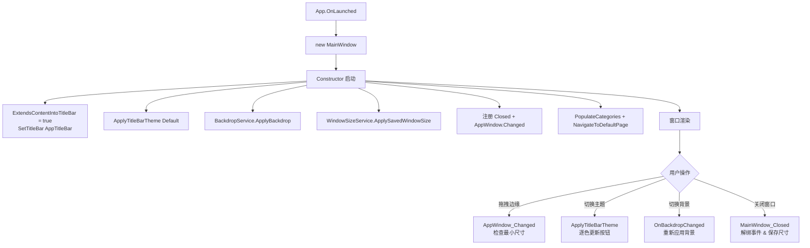

# 第 30 课：窗口管理

你花了几节课学会了页面布局、学会了数据绑定。然后一个实际问题摆在你面前：窗口从哪来？窗口的标题栏能不能定制？窗口多大？下次打开能不能记住上次的大小？最小化后恢复状态怎么处理？

这些问题归到一个主题：窗口管理。

WinUI 3 里，"窗口"不是 XAML 的 `Window` 标签本身那么简单。它背后有一套完整的 API，让你可以控制标题栏颜色、限制最小尺寸、保存和恢复窗口位置。TubaTools 的 `MainWindow.xaml.cs` 把这些能力基本都用上了，这一课直接拿它当教材。

## 1. Window 类：一个窗口从哪里开始

XAML 里声明一个窗口，要先写这个：

```xml
<Window
    x:Class="TubaWinUi3.MainWindow"
    xmlns="http://schemas.microsoft.com/winfx/2006/xaml/presentation"
    Title="图吧工具箱">
```

这个 `<Window>` 标签对应 C# 里的 `Microsoft.UI.Xaml.Window` 类。每个 WinUI 3 应用至少有一个窗口。应用启动时，`App.xaml.cs` 里 `OnLaunched` 方法中 new 一个 MainWindow 出来，然后调用 `Activate()`，窗口就显示在屏幕上了。

但 `Window` 类自己只管 XAML 层面的东西：里面装什么控件、标题是什么。真正的窗口行为——最大化、最小化、调整大小、标题栏颜色——归另一个对象管：`AppWindow`。

每个 `Window` 背后都有一个 `AppWindow`，通过 `window.AppWindow` 拿到它。你可以把 `Window` 理解成"壳的内容"，`AppWindow` 是"壳本身"。TubaTools 所有的窗口管理代码，几乎都是围绕 `AppWindow` 写的。

## 2. 标题栏定制：把标题栏变成你自己的

Windows 应用默认有个白/灰的标题栏，上面写标题文字，右边三个按钮（最小化/最大化/关闭）。如果你想要一个看起来更现代的标题栏——把搜索框塞进去，或者让导航按钮和标题栏融为一体——你得跨过两步。

### 2.1 扩展内容到标题栏区域

第一步是告诉系统："标题栏区域我要自己画内容"：

```csharp
ExtendsContentIntoTitleBar = true;
SetTitleBar(AppTitleBar);
```

`ExtendsContentIntoTitleBar = true` 让窗口的客户区延伸到标题栏区域。原本那个系统画的标题栏被你的内容盖住了。

`SetTitleBar(AppTitleBar)` 指定一个 UI 元素作为"逻辑标题栏"。系统拖拽窗口、右键弹出系统菜单、双击最大化这些交互，只有点击被设为 TitleBar 的那个元素区域才生效。如果你不设这个，用户拖不到窗口的边缘，窗口就钉在屏幕中央动不了。

TubaTools 的 MainWindow.xaml 里，`AppTitleBar` 是一个 `<TitleBar>` 控件（WinUI 3 提供的内置控件），放在 Grid 的第一行，高度 48 像素：

```xml
<TitleBar
    x:Name="AppTitleBar"
    Title="图吧工具箱"
    BackRequested="TitleBar_BackRequested"
    IsBackButtonVisible="{x:Bind NavFrame.CanGoBack, Mode=OneWay}"
    IsPaneToggleButtonVisible="True"
    PaneToggleRequested="TitleBar_PaneToggleRequested">
    <TitleBar.Content>
        <AutoSuggestBox
            x:Name="GlobalSearchBox"
            PlaceholderText="搜索工具、设置..."
            Width="320" />
    </TitleBar.Content>
</TitleBar>
```

注意 `<TitleBar.Content>` 里塞了一个 `AutoSuggestBox`——全局搜索框。标题栏不再是只放标题文字的地方，它变成了功能入口。

### 2.2 标题栏颜色：适配亮/暗主题

标题栏的三个系统按钮（最小化、最大化、关闭）的颜色是可以调的。TubaTools 做了一套完整的暗/亮主题适配：

```csharp
public void ApplyTitleBarTheme(ElementTheme theme)
{
    var tb = AppWindow.TitleBar;
    var isDark = theme == ElementTheme.Dark ||
                 (theme == ElementTheme.Default &&
                  Application.Current.RequestedTheme == ApplicationTheme.Dark);

    if (isDark)
    {
        tb.ButtonForegroundColor = Color.FromArgb(255, 255, 255, 255);
        tb.ButtonBackgroundColor = Color.FromArgb(0, 255, 255, 255);
        tb.ButtonHoverForegroundColor = Color.FromArgb(255, 255, 255, 255);
        tb.ButtonHoverBackgroundColor = Color.FromArgb(255, 50, 50, 50);
        tb.ButtonPressedForegroundColor = Color.FromArgb(255, 180, 180, 180);
        tb.ButtonPressedBackgroundColor = Color.FromArgb(255, 30, 30, 30);
        // 背景也设成暗色
        tb.BackgroundColor = Color.FromArgb(255, 32, 32, 32);
        tb.InactiveBackgroundColor = Color.FromArgb(255, 32, 32, 32);
    }
    else
    {
        // 亮色模式下的对应颜色
        tb.ButtonForegroundColor = Color.FromArgb(255, 30, 30, 30);
        // ...省略中间部分
        tb.BackgroundColor = Color.FromArgb(0, 255, 255, 255);
        tb.InactiveBackgroundColor = Color.FromArgb(0, 255, 255, 255);
    }

    tb.ButtonInactiveForegroundColor = Color.FromArgb(255, 160, 160, 160);
}
```

这段代码做的事：根据当前主题是暗还是亮，把标题栏按钮的"正常态""悬停态""按下态"的前景色和背景色全部设好。`AppWindow.TitleBar` 返回一个 `AppWindowTitleBar` 对象，它有一堆属性可以设色。

注意一个细节：亮色模式下 `tb.BackgroundColor` 的 Alpha 是 0——完全透明。这样标题栏背景就透出 XAML 内容区的颜色，视觉上你的 XAML 区域和标题栏无缝融合。暗色模式下 Alpha 是 255，因为暗色透明显得格格不入。

构造函数里还做了一件事：

```csharp
AppWindow.TitleBar.PreferredHeightOption = TitleBarHeightOption.Tall;
```

这行让标题栏比默认高一些。默认的 Standard 高度是 32px，Tall 是 48px——正好和 XAML 里 `TitleBar` 控件的 `Height="48"` 对得上。如果这俩不匹配，标题栏会和下面的内容重叠一小截。

## 3. 窗口大小管理：能多大、多大合适、下次还记得吗

### 3.1 最小尺寸限制

用户把窗口拖得太小，内容显示不全怎么办？限制最小尺寸。TubaTools 的做法是监听 `AppWindow.Changed` 事件：

```csharp
private void AppWindow_Changed(AppWindow sender, AppWindowChangedEventArgs args)
{
    if (!args.DidSizeChange) return;
    var size = sender.Size;
    var minWidth = 800;
    var minHeight = 600;
    var needsResize = false;
    var newW = size.Width;
    var newH = size.Height;

    if (size.Width < minWidth)  { newW = minWidth; needsResize = true; }
    if (size.Height < minHeight) { newH = minHeight; needsResize = true; }

    if (needsResize)
        sender.Resize(new Windows.Graphics.SizeInt32(newW, newH));
}
```

逻辑不复杂：每次窗口大小变化，检查宽度是否低于 800 或高度是否低于 600，低于就强制拉回来。`args.DidSizeChange` 把其他类型的 change（比如位置变化、Z 序变化）过滤掉。

### 3.2 记住窗口大小

用户上次关了窗口，下次打开，窗口是多大？TubaTools 通过 `WindowSizeService` 解决这个问题：

```csharp
public static void SaveWindowSize(MainWindow window)
{
    if (!IsRememberEnabled()) return;
    if (window is null) return;

    var appWindow = window.AppWindow;
    if (appWindow is null) return;

    var presenter = appWindow.Presenter as OverlappedPresenter;
    var isMaximized = presenter?.State == OverlappedPresenterState.Maximized;

    if (isMaximized)
        AppSettings.Set(MaximizedKey, true);
    else
    {
        AppSettings.Set(MaximizedKey, false);
        AppSettings.Set(WidthKey, appWindow.Size.Width);
        AppSettings.Set(HeightKey, appWindow.Size.Height);
    }
}
```

窗口关闭时（`MainWindow_Closed` 事件里），把当前的宽高和是否最大化写到 `AppSettings`（一个本地存储，本质是 JSON 文件或注册表）。下次启动时再读出来：

```csharp
public static void ApplySavedWindowSize(MainWindow window)
{
    if (window is null) return;
    var appWindow = window.AppWindow;

    if (IsRememberEnabled())
    {
        int width = AppSettings.GetInt(WidthKey, 0);
        int height = AppSettings.GetInt(HeightKey, 0);
        bool maximized = AppSettings.GetBool(MaximizedKey);

        if (width > 0 && height > 0)
        {
            width = Math.Max(800, width);
            height = Math.Max(600, height);
            appWindow.Resize(new Windows.Graphics.SizeInt32(width, height));

            if (maximized)
            {
                var presenter = appWindow.Presenter as OverlappedPresenter;
                presenter?.Maximize();
            }
            return;
        }
    }

    // 没保存过或是用户关闭了记忆功能时，用屏幕 80% 的大小居中
    var displayArea = DisplayArea.GetFromWindowId(
        appWindow.Id, DisplayAreaFallback.Primary);
    if (displayArea is not null)
    {
        var workArea = displayArea.WorkArea;
        int width = (int)(workArea.Width * 0.8);
        int height = (int)(workArea.Height * 0.8);
        width = Math.Max(800, width);
        height = Math.Max(600, height);

        appWindow.Resize(new Windows.Graphics.SizeInt32(width, height));

        int x = workArea.X + (workArea.Width - width) / 2;
        int y = workArea.Y + (workArea.Height - height) / 2;
        appWindow.Move(new Windows.Graphics.PointInt32(x, y));
    }
}
```

这段代码做了一个退路：如果没有保存过尺寸（用户第一次打开），就把窗口设成屏幕工作区的 80% 大小，然后居中。`DisplayArea.GetFromWindowId` 拿到窗口所在显示器的可用区域，`WorkArea` 是去掉任务栏之后的区域。计算出 x, y 坐标，`appWindow.Move()` 把窗口挪过去。

这套逻辑比你想象的要周到：把最小尺寸保护（`Math.Max(800, ...)`）嵌在两次 resize 里，保证不管什么路径，窗口都不会缩到比 800x600 更小。

### 3.3 依赖注入 MainWindow

`WindowSizeService` 的方法签名接受 `MainWindow` 参数，而不是 `AppWindow`。这样做方便在调用端直接用 `this`：

```csharp
// MainWindow 构造函数里：
WindowSizeService.ApplySavedWindowSize(this);

// MainWindow_Closed 里：
WindowSizeService.SaveWindowSize(this);
```

`MainWindow` 是 `Window` 的子类，`WindowSizeService` 通过 `window.AppWindow` 拿到底层的 `AppWindow`。这种设计避免了在 Service 层直接操作 `Microsoft.UI.Windowing` 的复杂类型，Service 只需要知道自己接收的是一个"窗口"。

## 4. 背景效果：窗口的"皮肤"

TubaTools 还给窗口加了一层背景效果——亚克力模糊或云母材质。这个功能在 `BackdropService` 里实现，不是本课要细讲的重点，但它在窗口管理里是个重要环节：

```csharp
// 构造函数：
BackdropService.ApplyBackdrop(this);
BackdropService.BackdropChanged += OnBackdropChanged;

// 窗口关闭时：
BackdropService.BackdropChanged -= OnBackdropChanged;

private void OnBackdropChanged()
{
    DispatcherQueue.TryEnqueue(() => BackdropService.ApplyBackdrop(this));
}
```

用户切换背景类型时，`BackdropService` 触发事件，`MainWindow` 收到通知，在 UI 线程上重新应用背景效果。`Closed` 事件里解绑事件处理器——如果不解绑，Service 是静态的（生命周期比窗口长），它会一直持有对 MainWindow 的引用，窗口关了也释放不掉，造成内存泄漏。

## 5. 窗口生命周期事件

MainWindow 构造函数里注册了两个关键事件：

```csharp
Closed += MainWindow_Closed;
AppWindow.Changed += AppWindow_Changed;
```

`Closed` 事件在窗口关闭时触发。这里做的事情：解绑事件、保存窗口大小。这是窗口"善后"的统一入口。

`AppWindow.Changed` 事件更频繁——窗口大小、位置、Z 序、是否激活，任何变化都触发一次。TubaTools 只用它来做最小尺寸限制（前面讲过了）。

还有一件事：窗口图标。这行代码设置了窗口左上角的小图标和任务栏图标：

```csharp
var iconPath = Path.Combine(AppContext.BaseDirectory, "Assets", "AppIcon.ico");
AppWindow.SetIcon(iconPath);
```

`AppWindow.SetIcon()` 接收一个 .ico 文件的绝对路径。`AppContext.BaseDirectory` 是应用运行目录。

## 6. 整体流程



构造函数里的调用顺序不是随意的。`ExtendsContentIntoTitleBar` 和 `SetTitleBar` 必须在窗口显示之前设好，否则标题栏区域不会正确渲染。`ApplySavedWindowSize` 放在最后也没关系——窗口激活后再 `Resize` 一样生效，但放在构造里少一次额外的重绘。

## 7. 一个你可能没注意到的问题

`AppWindow_Changed` 里只检查了 `DidSizeChange`，没有检查 `DidPositionChange`。这意味着什么？如果你把窗口拖到屏幕边缘之外（比如接了双屏又拔掉），窗口可能跑到看不见的地方去了，代码不会自动把它拉回来。

这也是窗口管理里容易被忽略的问题：多屏切换。`DisplayArea` 可以解决一部分——`ApplySavedWindowSize` 在首次启动时通过 `DisplayArea.GetFromWindowId` 拿到当前屏幕的 WorkArea，然后居中。但如果你保存了上次的位置（TubaTools 的当前版本没有保存位置 x/y 坐标），窗口就在上次的位置重新显示，可能已经不在可见区域。

这不是 bug，是取舍。TubaTools 选择只记住大小，不记住位置。位置由系统 WindowManager 自己管。

## 8. 小练习

### 练习 1：改最小尺寸

打开 `MainWindow.xaml.cs`，找到 `AppWindow_Changed` 方法，把 `minWidth` 从 800 改成 500，`minHeight` 从 600 改成 400。编译运行，拖小窗口，看效果。

问题：如果用户把窗口拖动到比最小尺寸更小，你看到的现象是什么？窗口会"弹"回来，还是一直保持最小尺寸？

### 练习 2：标题栏颜色调色盘

阅读 `ApplyTitleBarTheme` 方法。假设你要加一个自定义主题——标题栏背景用深蓝色 #1E3A5F，按钮文字用白色——需要设置哪些属性？写出来，并在代码里实现。

### 练习 3：窗口位置记忆

当前 `WindowSizeService` 只保存了 `Width` 和 `Height`。仿照它的写法，增加保存和恢复窗口 X/Y 坐标的功能：

- 在 `SaveWindowSize` 里通过 `appWindow.Position` 拿到 X 和 Y，保存到 AppSettings
- 在 `ApplySavedWindowSize` 里读取 X 和 Y，用 `appWindow.Move()` 恢复位置
- 注意处理多屏场景：如果保存的坐标不在任何显示器的范围内（比如 1920x1080 的屏幕却存了 x=3000），需要使用 `DisplayArea` 作为 fallback

### 练习 4：双击标题栏最大化

当前 TubaTools 的 `SetTitleBar(AppTitleBar)` 已经让系统拖拽和双击最大化生效。但如果你把标题栏换成自己画的 `Grid` 而不是 `TitleBar` 控件，双击最大化就不灵了。思考：`TitleBar` 控件内部做了什么让系统知道"这是一个标题栏区域"？提示：查 `SetTitleBar` 的文档，看它接收的参数是什么类型。
