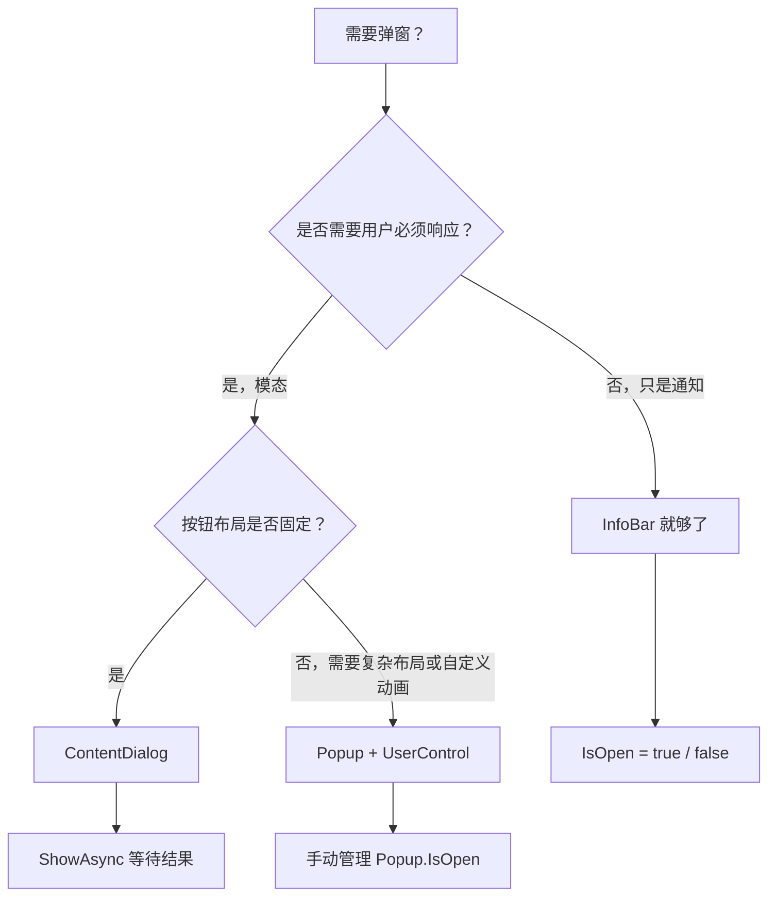
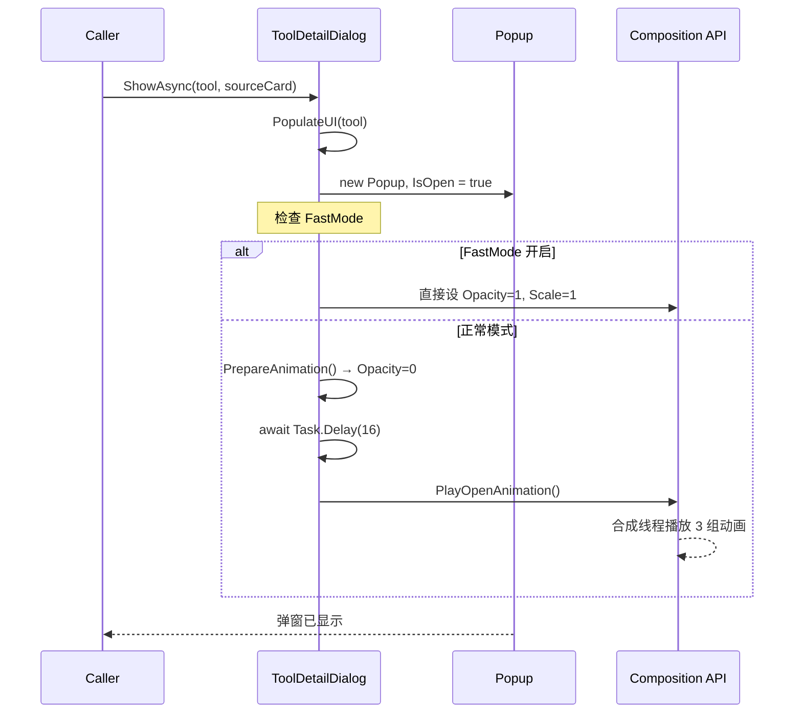

# 第 31 课：弹窗与对话框

## 为什么学这个

一个桌面应用，如果所有的内容都挤在主窗口里，用户翻来翻去找不到重点。弹窗（Popup）和对话框（Dialog）帮你把注意力集中到一件事上：问用户确认、展示详细信息、报告错误、处理下载进度。没有弹窗的应用就像一本书没有页码——信息全在，但找不到。

WinUI 3 提供了两套弹窗方案：ContentDialog 和 Popup + UserControl。它们长得像，背后的机制完全不同。搞混了你会在异步操作、动画、关闭逻辑上踩坑。本课用 TubaTools 的真实代码把两种方案拆开看。

## 弹窗不是什么新东西

弹窗的本质很简单：在主窗口上面再放一层 UI，挡住下面的内容，强迫用户先处理弹窗里的东西再回到主窗口。

Windows 平台上，弹窗的历史可以追溯到 Windows 3.1 时代的消息框 `MessageBox`。WinUI 3 继承了这套思路，但用 XAML + C# 重写了全部基础设施。你不再用 `MessageBox.Show("确定要删除吗？")` 这种死板的系统级弹窗，而是自己用 XAML 画一个完全自定义的弹窗——颜色、圆角、动画、布局全部可控。

## WinUI 3 里的三种"弹窗"

### ContentDialog：系统级模态对话框

ContentDialog 继承自 `ContentDialog` 基类，是 WinUI 3 内置的对话框控件。它有几个天然优势：

- 自动半透明遮罩层挡住后面的内容
- 内置 PrimaryButton / SecondaryButton / CloseButton 三套按钮
- 自动处理按钮点击事件和返回值（`ContentDialogResult`）
- 用 `await dialog.ShowAsync()` 等待用户操作，代码是同步思维写异步逻辑

ContentDialog 的缺点也很明显：你不能完全控制遮罩样式，不能自定义关闭动画，布局灵活性受限于 XAML 属性定义。

在 TubaTools 中，`UpdateDialog` 就是一个典型的 ContentDialog。看它的 XAML 头部声明：

```xml
<ContentDialog
    x:Class="TubaWinUi3.Pages.UpdateDialog"
    Title="发现新版本"
    PrimaryButtonText="立即更新"
    SecondaryButtonText="稍后提醒"
    CloseButtonText="跳过此版本"
    DefaultButton="Primary"
    PrimaryButtonClick="OnPrimaryButtonClick"
    SecondaryButtonClick="OnSecondaryButtonClick"
    CloseButtonClick="OnCloseButtonClick">
```

Title 和三个按钮的文本直接在 XAML 属性里写死，三个点击事件绑定同名方法。这种写法适合逻辑固定的对话框：更新提示、确认删除、设置重命名——那些你不需要改按钮文字和数量的场景。

### Popup + UserControl：完全自定义的"假弹窗"

说"假弹窗"不是贬义。Popup 是一个轻量级的浮层容器，它本身不提供遮罩、不提供按钮、不提供任何对话框的表象。你把一个 UserControl 塞进去，然后你手动画遮罩（一个半透明 Rectangle）、手动处理动画、手动处理关闭逻辑。

TubaTools 的 `ToolDetailDialog` 就是 Popup + UserControl 的典型案例。它不是继承自 ContentDialog，而是继承自 UserControl：

```csharp
public sealed partial class ToolDetailDialog : UserControl
```

然后通过代码创建一个 Popup 把自己放进去：

```csharp
_popup = new Popup
{
    XamlRoot = xamlRoot,
    IsLightDismissEnabled = true,
    LightDismissOverlayMode = LightDismissOverlayMode.Off
};

_popup.Child = this;
_popup.IsOpen = true;
```

注意两件事：`IsLightDismissEnabled = true` 让用户点击弹窗外部区域时自动关闭；`LightDismissOverlayMode = Off` 表示关闭时不播放系统默认的过度动画——因为 ToolDetailDialog 自己做了开合动画。

### InfoBar：页面内的非模态通知

InfoBar 不是严格意义上的"弹窗"，因为它不浮在主窗口之上，而是嵌入在页面布局中。但它充当了轻量级的反馈通道：操作成功/失败/警告，一条消息滑出来，用户可以关闭也可以不管。

TubaTools 在两个对话框里都用了 InfoBar。ToolDetailDialog 用它报告管理员启动结果：

```xml
<InfoBar
    x:Name="StatusBar"
    IsClosable="True"
    IsOpen="False" />
```

```csharp
private void ShowStatus(string title, string message, InfoBarSeverity severity)
{
    StatusBar.Title = title;
    StatusBar.Message = message;
    StatusBar.Severity = severity;
    StatusBar.IsOpen = true;
}
```

UpdateDialog 用它报告下载错误：

```xml
<InfoBar
    x:Name="ErrorInfoBar"
    IsOpen="False"
    Severity="Error"
    Title="更新失败" />
```

InfoBar 的作用域在对话框内部，不干扰主窗口。它是对话框的"子通知系统"。

## 三种方案的选用决策

用 Mermaid 画一个决策流程，帮你选对方案：



有一件事要说清楚：Popup + UserControl 很灵活，但复杂度比 ContentDialog 高一个数量级。ToolDetailDialog 用了 500+ 行代码，光是开合动画就写了三个方法（PrepareAnimation、PlayOpenAnimation、PlayCloseAnimation），外加一个 SkipAnimationToVisible 给快速模式用的捷径。如果你的需求只是"按确定继续，按取消返回"，ContentDialog 20 行 XAML 搞定。

## 异步：对话框的隐藏复杂度

对话框最让人头疼的不是布局，是异步操作。用户点击按钮后，你可能要下文件、测代理、写配置——这些都是耗时的异步任务。WinUI 3 的 UI 线程不能阻塞，所以按钮事件处理过程必须是 async。

ContentDialog 提供了 `ContentDialogButtonClickEventArgs.GetDeferral()` 来解决这个问题。看 UpdateDialog 怎么用：

```csharp
private async void OnPrimaryButtonClick(ContentDialog sender, ContentDialogButtonClickEventArgs args)
{
    if (_isDownloading) return;

    var deferral = args.GetDeferral();
    args.Cancel = true;  // 先取消默认关闭行为

    try
    {
        await StartUpdateProcess();  // 异步下载，可能要几十秒
    }
    finally
    {
        deferral.Complete();  // 任务完成后才关闭对话框
    }
}
```

这是 ContentDialog 里一个很容易踩的坑：如果你不调 `GetDeferral()`，`ShowAsync()` 在按钮点击时立刻返回，你的异步任务还在后台跑，对话框已经关了。拿到 deferral 后，框架等你调 `Complete()` 才真正关闭对话框。

Popup + UserControl 没有这个机制——你完全自己控制 `_popup.IsOpen = false` 的时机。ToolDetailDialog 在点击"启动"按钮后直接关弹窗，不需要等异步操作：

```csharp
private void LaunchButton_Click(object sender, RoutedEventArgs e)
{
    if (_tool is null) return;
    ToolLaunched?.Invoke(_tool);
    Close();  // 直接关，不等工具启动结果
}
```

但如果是管理员启动，它会在本地同步调用 `Process.Start` 后通过 InfoBar 报告结果，也不阻塞弹窗。

## 开合动画的工程实现

ToolDetailDialog 的动画实现值得单独拿出来讲，因为它不是玩具代码，是生产环境的质量标准。

动画使用了 WinUI 3 的 Composition API，不是 Storyboard。Composition API 运行在独立于 UI 线程的合成线程上，性能更好。整套动画分三组：

- SmokeLayer（遮罩层）：透明度从 0 到 1，350ms
- ContentPanel（内容面板）：透明度 + 缩放（0.92 → 1.0），450-500ms
- HeroSection（头部区域）：透明度 + 缩放 + 从上方 40px 滑入，450-550ms

用 Mermaid 时序图表示 Opening 动画的流程：



关闭动画的难点在于：动画播完后才能关 Popup，不能动画播一半 Popup 就没了。ToolDetailDialog 用 `CompositionScopedBatch` 解决：

```csharp
var batch = compositor.CreateScopedBatch(CompositionBatchTypes.Animation);
batch.Completed += (_, _) =>
{
    if (_popup is not null)
    {
        _popup.IsOpen = false;
        _popup.Closed -= OnPopupClosed;
    }
    _isClosing = false;
};
batch.End();
```

`CreateScopedBatch` 把在 `batch.End()` 之前创建的所有动画打包成一个组，等这组动画全部播完才触发 `Completed` 事件。在 Completed 回调里关 Popup，时间刚好。

还有一个防御性细节：`_isClosing` 标志位防止快速双击导致的重复关闭动画。如果用户狂点返回按钮，第二次及以后的点击直接被 `if (_isClosing || !_isOpen) return;` 拦截。

## ContentDialog 的动态 UI 构建

UpdateDialog 里有一个值得注意的模式：下载完成后，它用纯 C# 代码动态创建一个新的 ContentDialog，而不是用 XAML 预定义。

```csharp
var dialog = new ContentDialog
{
    Title = "下载完成",
    XamlRoot = XamlRoot,
    PrimaryButtonText = isExe ? "立即安装" : "打开文件夹",
    SecondaryButtonText = "稍后手动安装",
    RequestedTheme = ThemeService.CurrentElementTheme
};

// 然后用代码逐个创建 Border、Grid、FontIcon、TextBlock...
dialog.Content = stack;

var result = await dialog.ShowAsync();
```

为什么不用 XAML？因为这个对话框的按钮文字、内容布局依赖于下载结果（是不是 exe 文件、文件路径是什么），编译时不知道。用 C# 动态构建 UI 在 WinUI 3 里完全可行，XAML 和代码可以互换。

但这么写代码可读性是灾难——80 行代码拼一个简单的成功提示。TubaTools 选择这么做的原因是：UpdateDialog 已经是 ContentDialog 子类了，不能再嵌套一个 XAML 定义的 ContentDialog（WinUI 3 不支持 ContentDialog 嵌套 ContentDialog）。所以要么用代码动态构建，要么把这个确认弹窗也改成 Popup + UserControl。团队选了前者。

## 传数据进出对话框

对话框不是孤岛——你要往里传数据（展示什么），也要往外拿结果（用户做了什么操作）。

### 传入数据

ToolDetailDialog 通过 `ShowAsync` 方法的参数传入：

```csharp
public async Task ShowAsync(ToolItem tool, FrameworkElement? sourceCard)
{
    _tool = tool;
    PopulateUI(tool);
    // ...
}
```

调用方：

```csharp
await toolDetailDialog.ShowAsync(selectedTool, sourceCard);
```

UpdateDialog 类似：

```csharp
public async Task ShowUpdateAsync(UpdateInfo updateInfo)
{
    _updateInfo = updateInfo;
    NewVersionText.Text = updateInfo.Version;
    // ...
    await ShowAsync();
}
```

### 传出结果

两种常见做法。一是事件：

```csharp
public event Action<ToolItem>? ToolLaunched;
public event Action<ToolItem>? FavoriteChanged;

// 在按钮点击时触发
ToolLaunched?.Invoke(_tool);
```

二是公开属性，对话框关闭后读取：

```csharp
public bool SkipThisVersion { get; private set; }

// 在关闭按钮点击时赋值
SkipThisVersion = true;
```

调用方在 `await ShowAsync()` 之后检查属性值。两种方式不互斥，TubaTools 同时用了这两种：ToolDetailDialog 用事件因为操作需要实时反馈，UpdateDialog 用属性因为调用方只需要知道"跳不跳过"这一个布尔结果。

## TubaTools 中其他对话框

实际上 TubaTools 用对话框的地方不止这两处。项目里还有：

- `ConfigManagerDialog`：管理用户自添加的配置项
- `SetupWizardDialog`：首次使用时的设置向导
- `ToolDownloadDialog`：工具下载进度
- `ToolsBundleDownloadDialog`：工具包批量下载

每个对话框都根据自身需求选了 ContentDialog 或 Popup + UserControl。有一条规律：需要进度条、下载状态这些持续性反馈的，倾向于 Popup + UserControl（动画可控、不会意外关闭）；确认类的一次性交互，ContentDialog 就够了。

## 本课小结

WinUI 3 的弹窗体系没有银弹。ContentDialog 适合标准化流程——确认、选择、简单输入——它给你省代码。Popup + UserControl 适合定制化场景——动画、复杂布局、持续进度反馈——它给你完全控制权，代价是代码量翻倍。InfoBar 是轻量级通知，不该被当成对话框用。

理解这三种方案的区别后，看 TubaTools 的对话框代码就不会觉得"为什么有的继承 ContentDialog 有的继承 UserControl"是一个随意决定。每个选择背后都是从需求和复杂度之间的权衡。

---

## 小练习

**第 1 题（选择）**

TubaTools 的 UpdateDialog 中，以下哪段代码保证了异步下载任务完成前对话框不会关闭？

A. `args.Cancel = true;`
B. `var deferral = args.GetDeferral();`
C. `await StartUpdateProcess();`
D. 以上都需要

**第 2 题（填空）**

ToolDetailDialog 使用 `CompositionScopedBatch` 的目的是：等待关闭动画 ____________ 后再关闭 Popup，防止动画播一半弹窗就消失了。

**第 3 题（简答）**

一个文件管理器应用需要在右键菜单中弹出"属性"窗口，显示文件大小、修改日期、MD5 哈希值。窗口右上角有关闭按钮，右下角有"复制路径"和"确定"两个按钮。你选 ContentDialog 还是 Popup + UserControl？说明理由。

**第 4 题（实操）**

在 WinUI 3 项目中创建一个简单的 ContentDialog，标题为"确认退出"，内容为"你还有未保存的修改，确定退出吗？"，PrimaryButton 文字为"退出"，SecondaryButton 文字为"取消"。用 `ShowAsync()` 显示并根据返回值决定是否退出。（提示：参考 UpdateDialog.xaml 的结构，但不需要继承，直接用 `new ContentDialog { ... }` 创建。）

---

## 练习答案

**第 1 题**：D。`GetDeferral()` 获取延迟对象，`args.Cancel = true` 阻止默认关闭行为，`await StartUpdateProcess()` 执行异步任务，三者缺一不可。没有 deferral，Cancel 无效；没有 Cancel，框架在按钮事件返回后立即关闭；没有 await，异步任务还没跑完对话框就关了。

**第 2 题**：全部播放完毕（或"完成"）。

**第 3 题**：选 Popup + UserControl。原因：属性窗口内容复杂（多行信息展示、分段布局），不是简单的"确认/取消"二选一；右上角的关闭按钮和右下角的确定按钮不是 ContentDialog 默认的三按钮布局；文件属性窗口是信息展示型，不是模态交互型，用户可能想一边看属性一边操作主窗口（虽然弹窗是模态的，但从交互心理上更接近查看而非决策）。如果你的需求只是"是否删除？"那就是 ContentDialog。

**第 4 题**：参考代码：

```csharp
var dialog = new ContentDialog
{
    Title = "确认退出",
    Content = "你还有未保存的修改，确定退出吗？",
    PrimaryButtonText = "退出",
    SecondaryButtonText = "取消",
    XamlRoot = this.XamlRoot  // 在 Page 或 Window 中使用
};

var result = await dialog.ShowAsync();
if (result == ContentDialogResult.Primary)
{
    // 执行退出逻辑
    Application.Current.Exit();
}
```
