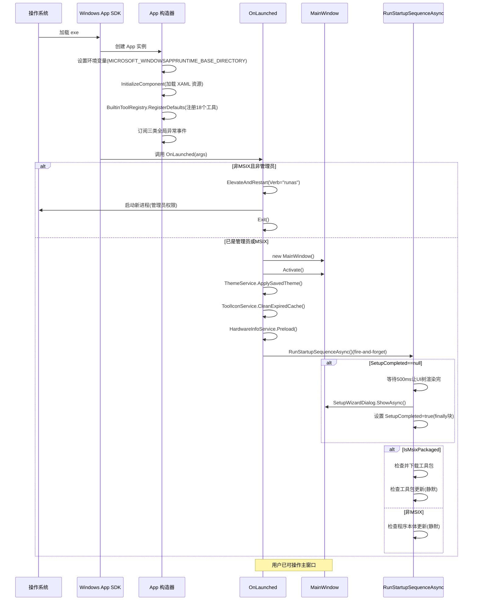

# 第 32 课：App.xaml.cs 启动流程

## 为什么学这个

你双击 TubaTools 图标，等了两秒，一个窗口弹出来。这两秒里发生了什么？没人跟你说过。

大部分教程教你写代码，但不教你怎么把代码接到"程序启动"这根导火索上。App.xaml.cs 就是这根导火索。它决定你的程序从哪开始、加载什么、出错了怎么办。不理解它，你写的所有代码都是悬空的——你知道某个功能怎么写，但不知道它"什么时候"被调用。

本课把 TubaTools 的 App.xaml.cs 从头到尾剖开。228 行代码，每一步都有明确的工程意图，不是胡乱堆的。

## WinUI 3 程序的"心脏"在哪里

先说一个容易搞混的点：WinUI 3 程序的入口不是 `Main` 方法。

控制台程序你写 `static void Main(string[] args)`，那是入口。WinUI 3 不一样——入口藏在 Windows App SDK 生成的 `Program.cs` 里，那是一段你不该动的胶水代码。真正属于你的第一行代码，在 `App` 类的构造器里。

```csharp
public partial class App : Application
```

`App` 继承自 `Microsoft.UI.Xaml.Application`。WinUI 3 的 Application 基类有一个方法叫 `OnLaunched`，它是一个虚方法（virtual）。基类在启动时自动调用这个方法。你不需要手动调用它，只需要 override（重写）它。

所以整个启动的时序是这样的：

1. 操作系统加载你的 exe
2. Windows App SDK 初始化 WinUI 运行时
3. 创建 App 实例（执行构造器）
4. 调用 OnLaunched
5. 你的窗口出现了

步骤 1 和 2 你改不了，步骤 3、4、5 就是 App.xaml.cs 的管辖范围。

## 构造器：窗口出现前的事

TubaTools 的 App 构造器做了四件事：

```csharp
public App()
{
    Environment.SetEnvironmentVariable(
        "MICROSOFT_WINDOWSAPPRUNTIME_BASE_DIRECTORY", 
        AppContext.BaseDirectory);
    InitializeComponent();
    BuiltinToolRegistry.RegisterDefaults();

    AppDomain.CurrentDomain.UnhandledException += OnUnhandledException;
    TaskScheduler.UnobservedTaskException += OnUnobservedTaskException;
    UnhandledException += OnWinUIUnhandledException;
}
```

### 第一行：环境变量

`Environment.SetEnvironmentVariable("MICROSOFT_WINDOWSAPPRUNTIME_BASE_DIRECTORY", AppContext.BaseDirectory)`

这一行看着突兀。目的很简单：非 MSIX 打包的应用（就是普通 exe），Windows App SDK 有时候找不到自己的运行时文件。设置这个环境变量告诉它："运行时文件在 exe 同级目录下"。调这行没别的原因——不加它，某些用户机器上启动就崩。

### 第二行：InitializeComponent

`InitializeComponent()` 不是你自己写的方法，是 XAML 编译器根据 `App.xaml` 自动生成的。App.xaml 里有什么？资源字典：

```xml
<Application.Resources>
    <ResourceDictionary>
        <ResourceDictionary.MergedDictionaries>
            <XamlControlsResources xmlns="using:Microsoft.UI.Xaml.Controls" />
        </ResourceDictionary.MergedDictionaries>
    </ResourceDictionary>
</Application.Resources>
```

`InitializeComponent` 解析这些 XAML 并加载 WinUI 3 的内置控件资源。没有它，你后面写的 Button、TextBox、NavigationView 全都没有默认样式，界面会变成白板+黑框。

### 第三行：注册内置工具

`BuiltinToolRegistry.RegisterDefaults()` 一口气注册 18 个内置工具。把这个调用放在构造器里意味着：程序还没显示窗口，工具列表已经就绪。后面任何页面查询 `BuiltinToolRegistry.Tools` 都不会空等。

RegisterDefaults 实际上是这样的：

```csharp
public static void RegisterDefaults()
{
    Register(new CertBlockTool());
    Register(new PortViewerTool());
    Register(new HostsEditorTool());
    Register(new KeyboardTestTool());
    Register(new JunkCleanerTool());
    Register(new BsodAnalysisTool());
    Register(new WingetInstallerTool());
    Register(new BatteryAnalyzerTool());
    Register(new SpeedTestTool());
    Register(new WifiPasswordTool());
    Register(new DiskSpaceAnalyzerTool());
    Register(new LiteMonitorTool());
    Register(new WindowsActivationTool());
    Register(new DefenderTool());
    Register(new CpuRankingTool());
    Register(new GpuRankingTool());
    Register(new ContextMenuMgrTool());
    Register(new HardwareSpooferTool());
}
```

每个工具都是一个实现了 `IBuiltinTool` 接口的类。Register 方法检查重复 ID，然后塞到一个静态 List 里。这套机制在第 34 课会展开讲，这里你只需要知道：构造器阶段，工具目录已经初始化完毕。

### 第四五六行：异常防线

三个事件订阅，放在构造器末尾，覆盖三类不同的异常传播路径：

- `AppDomain.CurrentDomain.UnhandledException`：捕获非 UI 线程上的未处理异常（比如后台 Task 里抛出来的）
- `TaskScheduler.UnobservedTaskException`：捕获被遗忘的 Task 异常（Task 抛了异常但没人 await 也没人 .Wait()）
- `App.UnhandledException`：捕获 WinUI UI 线程上的未处理异常（XAML 绑定错误、布局异常等）

三条防线不互相替代。每个事件只覆盖一种传播路径。丢了任何一条，就有一个缺口让异常无声无息地吞掉或者让程序直接崩溃到桌面。

## OnLaunched：真正的起点

构造器跑完后，基类调用 `OnLaunched`。这个方法决定你的程序"怎么"启动。

```csharp
protected override void OnLaunched(LaunchActivatedEventArgs args)
{
    if (!RuntimeHelper.IsMsixPackaged && !IsRunningAsAdmin())
    {
        ElevateAndRestart();
        Exit();
        return;
    }

    _window = new MainWindow();
    _window.Activate();
    ThemeService.ApplySavedTheme();
    ToolIconService.CleanExpiredCache();
    HardwareInfoService.Preload();

    _ = RunStartupSequenceAsync();
}
```

这 67 行代码做了几个关键决策，逐个看。

### 管理员权限检查

```csharp
if (!RuntimeHelper.IsMsixPackaged && !IsRunningAsAdmin())
{
    ElevateAndRestart();
    Exit();
    return;
}
```

TubaTools 是一个系统工具箱——主机文件编辑、端口扫描、证书拦截、驱动级硬件检测，很多功能需要管理员权限。你不让用户碰壁后再弹 UAC 提示，而是启动的一瞬间就检查权限。如果不是管理员，不是 MSIX 打包版本，就用 `Process.Start` 的 `Verb = "runas"` 重新启动自己：

```csharp
private static void ElevateAndRestart()
{
    var exePath = Process.GetCurrentProcess().MainModule?.FileName;
    if (string.IsNullOrEmpty(exePath)) return;

    try
    {
        Process.Start(new ProcessStartInfo(exePath)
        {
            Verb = "runas",
            UseShellExecute = true
        });
    }
    catch
    {
        // 用户拒绝了 UAC 提升，静默退出
    }
}
```

注意 `ElevateAndRestart` 的 catch 块是空的。这不是偷懒。用户点了 UAC 弹窗的"否"，你弹一个"权限不足无法运行"的错误框毫无意义——用户已经明确拒绝了。静默退出是最合理的选择。

提升成功后，当前进程立刻 `Exit()`。新进程（管理员权限）重新走一遍构造器和 OnLaunched，这次 `IsRunningAsAdmin()` 返回 true，直接往下走。

### 创建主窗口

```csharp
_window = new MainWindow();
_window.Activate();
```

`_window` 是一个 `Window?` 私有字段，同时暴露了一个静态属性：

```csharp
public static Window? MainWindow => ((App)Current)?._window;
```

这个静态访问器是全局访问主窗口的唯一合法入口。其他页面通过 `App.MainWindow` 拿到 Window 引用，不需要互相传递引用。

### 主题和服务初始化

```csharp
ThemeService.ApplySavedTheme();
ToolIconService.CleanExpiredCache();
HardwareInfoService.Preload();
```

这三行在主窗口激活之后立刻执行：

- `ThemeService.ApplySavedTheme()`：从 AppSettings 读取用户上次选的主题（浅色/深色/跟随系统），应用到当前窗口。
- `ToolIconService.CleanExpiredCache()`：清除过期的工具图标缓存文件。图标缓存有有效期，避免用户更新工具包后看到旧图标。
- `HardwareInfoService.Preload()`：预加载硬件信息——CPU 型号、显卡信息、内存容量等。这些数据后面在硬件信息页面和首页工具卡片上都要用。提前加载避免用户点进去时卡顿。

### 启动异步序列

```csharp
_ = RunStartupSequenceAsync();
```

前面 `_window.Activate()` 是同步的，窗口已经出来了。`RunStartupSequenceAsync` 是异步的，但它不阻塞窗口。用户看到窗口的同时，后台跑首次设置向导、工具包下载、更新检查这些操作。

注意前面的 `_ =`：这叫 "fire and forget"——我不等它，也不存 Task。这种写法有争议，因为如果 Task 里抛异常没人 observe。但 TubaTools 在这个方法的内部已经包了 try/catch，所以可以不 await。

## RunStartupSequenceAsync：启动后的三件事

```csharp
private static async Task RunStartupSequenceAsync()
{
    try
    {
        if (AppSettings.Get("SetupCompleted") == null)
        {
            await Task.Delay(500);
            if (MainWindow?.Content is FrameworkElement root)
            {
                var wizard = new SetupWizardDialog
                {
                    XamlRoot = root.XamlRoot,
                    RequestedTheme = ThemeService.CurrentElementTheme
                };
                await wizard.ShowAsync();
            }
        }
    }
    catch (Exception ex)
    {
        Debug.WriteLine($"[Setup] Wizard failed: {ex.Message}");
    }
    finally
    {
        if (AppSettings.Get("SetupCompleted") == null)
            AppSettings.Set("SetupCompleted", true);
    }

    if (RuntimeHelper.IsMsixPackaged)
    {
        if (!ToolsBundleService.IsToolsBundleReady())
            await ShowToolsBundleDownloadDialogAsync();
        _ = CheckForToolsUpdateSilentAsync();
    }
    else
    {
        _ = CheckForUpdateSilentAsync();
    }
}
```

这个方法做三件事，依次排队：

### 第一件：首次设置向导

`AppSettings.Get("SetupCompleted")` 检查有没有 "SetupCompleted" 这个 key。如果是 null（用户从来没设置过），弹一个 `SetupWizardDialog`。向导让用户选主题颜色、语言偏好、工具分类偏好。500ms 的 `Task.Delay` 不是等网络，是等主窗口的 UI 树完全渲染好——不然 `MainWindow.Content` 可能是 null。

关键设计：`finally` 块。

```csharp
finally
{
    if (AppSettings.Get("SetupCompleted") == null)
        AppSettings.Set("SetupCompleted", true);
}
```

向导失败（用户中途关了、崩溃了），照样标记 `SetupCompleted = true`。这是刻意为之——如果标记不上，用户每次启动都弹向导，比向导失败本身更糟糕。这也意味着：向导只有"一次机会"。用户跳过了，以后不会再弹。

### 第二件：MSIX 版本的工具包下载

```csharp
if (RuntimeHelper.IsMsixPackaged)
{
    if (!ToolsBundleService.IsToolsBundleReady())
        await ShowToolsBundleDownloadDialogAsync();
    _ = CheckForToolsUpdateSilentAsync();
}
```

`RuntimeHelper.IsMsixPackaged` 通过一个静态构造函数检测运行环境：

```csharp
private static bool DetectMsixPackaged()
{
    try
    {
        var _ = Windows.ApplicationModel.Package.Current;
        return true;
    }
    catch
    {
        return false;
    }
}
```

如果 `Package.Current` 不抛异常，说明你在 MSIX 容器里跑。MSIX 版本的工具是分开打包的（tuba-tools-bundle），需要额外下载。非 MSIX 版本（解压即用版）工具直接放在 tools/ 目录下，不需要下载。

### 第三件：静默更新检查

MSIX 版调用 `CheckForToolsUpdateSilentAsync()`（检查工具包更新），非 MSIX 版调用 `CheckForUpdateSilentAsync()`（检查程序本体更新）。都是 fire-and-forget，不阻塞用户。

更新检查的核心逻辑是异步请求——拿到服务器上的版本号，和本地版本号对比。如果有更新的版本，而且不是用户"跳过"的版本，就用 DispatcherQueue 弹一个更新对话框。DispatcherQueue 的作用是把弹窗操作切换到 UI 线程。因为更新检查从网络回调里触发，回调可能在后台线程，不能直接操作 UI。

## 全局异常处理的三道防线

回到构造器里那三个事件订阅。它们的处理逻辑惊人相似，但又不完全相同：

```csharp
private void OnUnhandledException(object sender, UnhandledExceptionEventArgs e)
{
    _pendingException = e.ExceptionObject as Exception 
        ?? new Exception(e.ExceptionObject?.ToString() ?? "未知错误");
    NavigateToErrorPage();
}

private void OnUnobservedTaskException(object? sender, UnobservedTaskExceptionEventArgs e)
{
    _pendingException = e.Exception;
    NavigateToErrorPage();
    e.SetObserved();
}

private void OnWinUIUnhandledException(object sender, 
    Microsoft.UI.Xaml.UnhandledExceptionEventArgs e)
{
    _pendingException = e.Exception ?? new Exception(e.Message);
    NavigateToErrorPage();
    e.Handled = true;
}
```

三个方法的共同点：把异常保存到静态字段 `_pendingException`，然后导航到错误页面。

不同点：

- `OnUnhandledException`（AppDomain 级别）：异常对象不是 `Exception` 类型（有些语言可以抛出任意对象），所以做了一步类型转换。
- `OnUnobservedTaskException`：处理完后调用 `e.SetObserved()`，告诉 CLR "我知道这个异常了，别把进程杀掉"。不调这行的话，CLR 会在终结器线程上触发 `UnobservedTaskException` 后终止进程（.NET 4.0 之后默认不终止，但显式 SetObserved 是最佳实践）。
- `OnWinUIUnhandledException`：调用 `e.Handled = true` 阻止进程崩溃。WinUI 默认行为是崩溃——设置 Handled 让你有机会做清理和错误显示。

`NavigateToErrorPage` 创建了一个独立的错误窗口：

```csharp
private void NavigateToErrorPage()
{
    _window?.DispatcherQueue.TryEnqueue(() =>
    {
        var errorWindow = new Pages.ErrorWindow();
        errorWindow.Activate();
    });
}
```

创建的是新 Window 而不是导航到现有窗口内的错误页面。这很关键——异常发生时，当前窗口的 UI 树可能已经被破坏了，导航到某个页面会引发二次崩溃。新窗口是干净的，不受影响。

`ConsumePendingException()` 方法让错误页面取走异常信息：

```csharp
public static Exception? ConsumePendingException()
{
    var ex = _pendingException;
    _pendingException = null;
    return ex;
}
```

取完就置 null，一个异常只报告一次。用户看到错误页面后自己决定发送日志还是忽略。

## 启动流程时序图

下面这张图展示了从用户双击图标到主窗口可用的完整路径。注意中间的分叉：管理员权限检查和 MSIX 判断是两个关键的"分岔口"。



## 小结

App.xaml.cs 不是"配置文件"也不是"启动脚本"。它是一个精心编排的启动序列：构造器做纯初始化（不依赖 UI），OnLaunched 做权限决策和窗口创建，RunStartupSequenceAsync 做非关键的后台任务。

你看完这 228 行代码之后，再回头看第 01 课的"计算机是怎么工作的"——那个问题其实答案就在这 228 行里：程序启动就是用一系列 if 判断和异步调用，把散落在几十个 .cs 文件里的代码按顺序"点燃"。App.xaml.cs 就是那根火柴。

## 小练习

### 题 1：顺序填空

App.xaml.cs 中，构造器和 `OnLaunched` 的执行顺序是什么？按先后排列下列事件：

A. `MainWindow` 被创建并激活
B. 三个全局异常事件被订阅
C. `InitializeComponent()` 被调用
D. `RunStartupSequenceAsync()` 被触发
E. `BuiltinToolRegistry.RegisterDefaults()` 被调用

### 题 2：选择题

TubaTools 的 `ElevateAndRestart` 方法里，catch 块是空的。这样做的主要原因是：

A. 开发者忘记了写异常处理
B. try 块里的代码不可能抛出异常
C. 用户拒绝了 UAC 提升，继续弹错误提示不如静默退出
D. C# 语法要求 catch 必须为空

### 题 3：简答题

`RunStartupSequenceAsync` 方法在 `finally` 块里强制设置 `SetupCompleted = true`，即使向导崩溃了。为什么这样做？如果你自己写一个首次设置向导，你会用同样的策略吗？说说理由。

### 题 4：实操题

写一个简单的 WinUI 3 App 类（伪代码即可），要求：

1. 构造器中设置一个环境变量 "MY_APP_HOME" 指向程序所在目录
2. OnLaunched 中检查今天是星期几，如果是星期一，先弹一个提示（伪代码即可）
3. 如果发生未处理异常，导航到一个你画好的错误页面

---

## 练习答案

### 题 1 答案

顺序：C -> E -> B -> A -> D

具体解释：
1. `InitializeComponent()` 加载 XAML 资源（构造器第一步）
2. `BuiltinToolRegistry.RegisterDefaults()` 注册工具（构造器第二步）
3. 三个全局异常事件订阅（构造器第三步）
4. `OnLaunched` 被基类调用，创建并激活 `MainWindow`
5. `_ = RunStartupSequenceAsync()` 在窗口激活后异步执行

### 题 2 答案

C。

`Process.Start` 的 `Verb = "runas"` 会触发 Windows UAC 弹窗。用户点"否"，Windows 抛出 Win32Exception。此时弹一个"需要管理员权限"的提示没有意义——用户已经看到了 UAC 弹窗并主动拒绝了。安静退出是尊重用户选择。

### 题 3 答案

标记为已完成的目的不是"向导成功了"，而是"向导已经出现过一次"。如果向导崩溃了不标记，用户每次启动都会重新弹出向导——大概率继续崩溃，形成死循环。对用户来说，一个反复崩溃的向导比"跳过了向导"糟糕得多。

至于你自己的策略：如果你的向导是不可跳过的（比如没完成设置应用无法使用），你就不能在 finally 里强标完成。你需要区分"用户主动关闭"和"崩溃"两种情况——崩溃时记录错误日志，下次启动重试；用户主动关闭时标记完成。TubaTools 的向导不阻塞使用（所有功能在向导外也能设置），所以"错过一次"可以接受。

### 题 4 答案

```csharp
public partial class App : Application
{
    private Window? _window;

    public App()
    {
        Environment.SetEnvironmentVariable(
            "MY_APP_HOME", AppContext.BaseDirectory);
        InitializeComponent();
        AppDomain.CurrentDomain.UnhandledException += OnUnhandledException;
    }

    protected override void OnLaunched(LaunchActivatedEventArgs args)
    {
        _window = new MainWindow();
        _window.Activate();

        if (DateTime.Now.DayOfWeek == DayOfWeek.Monday)
        {
            // 伪代码：弹一个 ContentDialog
            // await new MondayTipDialog().ShowAsync();
        }
    }

    private void OnUnhandledException(object sender, 
        UnhandledExceptionEventArgs e)
    {
        var errorWindow = new ErrorWindow();
        errorWindow.Activate();
    }
}
```

注意几个要点：环境变量用 `AppContext.BaseDirectory` 而不是 `Environment.CurrentDirectory`（CurrentDirectory 会变）；异常处理里创建新 Window 而不是在当前 Window 里导航（原因前面讲过了）；星期判断用 `DateTime.Now.DayOfWeek` 枚举比较而不是字符串。
