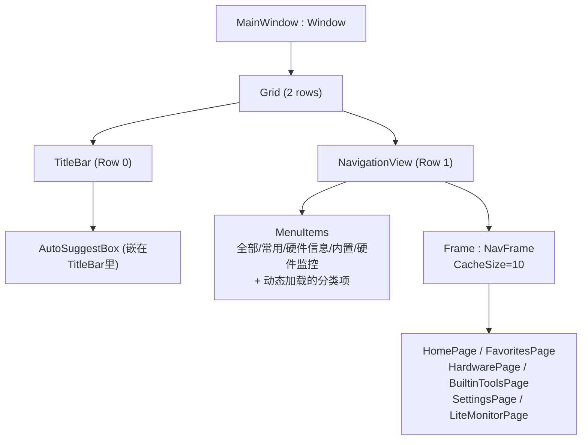
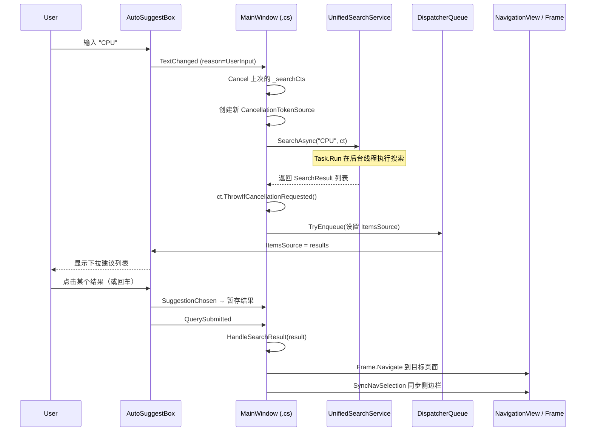

# 第 33 课：MainWindow 导航与搜索

TubaTools 启动后你看到的第一个东西是什么？一个带有侧边导航栏的窗口。左边是"全部"、"常用"、"硬件信息"这些菜单项，正上方嵌着一个搜索框。点一下菜单，右边内容区域就切换成不同的页面；在搜索框里敲几个字，底下弹出一列匹配结果，选一个就能跳过去。

这些都是 MainWindow 干的活。它不像普通窗口那样只是"显示一块固定内容"，而是一个**壳**——它本身几乎不展示业务数据，它的任务是把侧边栏、搜索框、页面容器拼接在一起，让用户在它们之间自由穿梭。WinUI 3 里管这个叫"导航视图"（NavigationView）架构。

这篇就把 MainWindow 拆开来看：窗口是怎么拼起来的，选菜单后页面怎么跳转，搜索框从打字到打开工具的一整条链路长什么样。

## 一、MainWindow 的结构：壳的思路

MainWindow 不是什么普通的 Window。它的 XAML 只画了两行：第一行放标题栏（含搜索框），第二行放 NavigationView（含侧边导航和页面容器）。用代码说就是：

```xml
<Grid>
    <Grid.RowDefinitions>
        <RowDefinition Height="48" />
        <RowDefinition Height="*" />
    </Grid.RowDefinitions>

    <!-- 第 0 行：标题栏 + 嵌在标题栏里的搜索框 -->
    <TitleBar x:Name="AppTitleBar"
              Title="图吧工具箱"
              BackRequested="TitleBar_BackRequested"
              IsBackButtonVisible="{x:Bind NavFrame.CanGoBack, Mode=OneWay}"
              IsPaneToggleButtonVisible="True"
              PaneToggleRequested="TitleBar_PaneToggleRequested">
        <TitleBar.Content>
            <AutoSuggestBox x:Name="GlobalSearchBox"
                            PlaceholderText="搜索工具、设置..."
                            QueryIcon="Find"
                            Width="320"
                            TextChanged="GlobalSearchBox_TextChanged"
                            SuggestionChosen="GlobalSearchBox_SuggestionChosen"
                            QuerySubmitted="GlobalSearchBox_QuerySubmitted"
                            KeyDown="GlobalSearchBox_KeyDown" />
        </TitleBar.Content>
    </TitleBar>

    <!-- 第 1 行：导航视图（侧边栏 + 页面容器） -->
    <NavigationView x:Name="NavView" Grid.Row="1"
                    OpenPaneLength="200"
                    SelectionChanged="NavView_SelectionChanged">
        <NavigationView.MenuItems>
            <NavigationViewItem Content="全部" Tag="all" />
            <NavigationViewItem Content="常用" Tag="favorites" />
            <NavigationViewItem Content="硬件信息" Tag="hardware" />
            <NavigationViewItem Content="内置" Tag="builtin" />
            <NavigationViewItem Content="硬件监控" Tag="monitor" />
        </NavigationView.MenuItems>
        <Frame x:Name="NavFrame" CacheSize="10" />
    </NavigationView>
</Grid>
```

看到这里的结构图了吗——TitleBar 里套着一个 AutoSuggestBox，NavigationView 里套着一个 Frame。AutoSuggestBox 负责搜索，Frame 负责装载页面，NavigationView 负责在两者之间牵线搭桥。它们各干各的，互不越界。

骨架图：



## 二、导航是怎么工作的

WinUI 3 的 NavigationView 本身不负责"显示什么页面"——它只是提供一个可点击的菜单列表，外加一个 Frame 作为容器。真正决定"点完菜单后右侧显示哪个页面"的逻辑在 C# 里，而且方式是 Frame.Navigate。

### Tag 做钥匙

看 XAML 里每个 NavigationViewItem 都带一个 Tag：

```xml
<NavigationViewItem Content="全部"   Tag="all" />
<NavigationViewItem Content="常用"   Tag="favorites" />
<NavigationViewItem Content="硬件信息" Tag="hardware" />
```

这些 Tag 是字符串标记，它们是导航的钥匙。选中某个菜单项时，SelectionChanged 事件触发，C# 代码检查选中项的 Tag，然后决定 Frame 要 Navigate 到哪个页面类型：

```csharp
private async void NavView_SelectionChanged(NavigationView sender,
    NavigationViewSelectionChangedEventArgs args)
{
    if (_syncingNavSelection) return;

    if (args.IsSettingsSelected)
    {
        NavFrame.Navigate(typeof(SettingsPage));
    }
    else if (args.SelectedItem is NavigationViewItem item)
    {
        switch (item.Tag)
        {
            case "all":
                NavFrame.Navigate(typeof(HomePage), null);
                break;
            case "favorites":
                NavFrame.Navigate(typeof(FavoritesPage));
                break;
            case "hardware":
                NavFrame.Navigate(typeof(HardwarePage));
                break;
            case "builtin":
                NavFrame.Navigate(typeof(BuiltinToolsPage));
                break;
            case "monitor":
                NavFrame.Navigate(typeof(Pages.LiteMonitorPage), false);
                break;
            case string category:
                // 动态加载的分类项 —— Tag 直接是分类名（如"处理器工具"）
                NavFrame.Navigate(typeof(HomePage), category);
                break;
        }
    }
}
```

Frame.Navigate 的第一个参数是页面类型（typeof(HomePage)），第二个参数是可选的——传给目标页面的数据。这里的 null、"处理器工具"这些字符串就是通过第二个参数塞进页面的。目标页面的 OnNavigatedTo 方法里可以拿到这个参数。

注意那个 `case string category:` 分支。前面的 "all"、"favorites" 是固定菜单项，但后面从 ToolCatalog 动态加载进来的分类（"处理器工具"、"显卡工具"等等）也走同一个 switch，Tag 就是分类名本身，所以用 `string category` 来兜底匹配。

另外有个 `_syncingNavSelection` 的布尔变量。它是干什么的？搜索功能有时需要"同步"侧边栏的选中状态——比如搜索到一个内置工具，程序会导航到 BuiltinToolsPage，同时把侧边栏的"内置"菜单项高亮。这时候 SelectionChanged 本来会再次触发并尝试跳转，但程序用一个 `_syncingNavSelection` 标志位把自己的操作屏蔽掉，避免死循环。

### 默认页面的选择

MainWindow 启动时不是直接跳到"全部"页——它读一个设置项：

```csharp
private void NavigateToDefaultPage()
{
    var defaultPage = AppSettings.Get("DefaultPage") ?? "all";
    NavigationViewItem? targetItem = null;

    foreach (var item in NavView.MenuItems)
    {
        if (item is NavigationViewItem navItem
            && navItem.Tag is string tag
            && tag == defaultPage)
        {
            targetItem = navItem;
            break;
        }
    }

    if (targetItem is not null)
        NavView.SelectedItem = targetItem;
    else
        NavFrame.Navigate(typeof(HomePage), null);
}
```

逻辑很直：从 AppSettings 读出默认页面的 Tag 值，在菜单项里找到匹配的那一个，把它设为选中。找不到就回退到 HomePage。用户如果把默认页面改成了"硬件信息"，下次启动就直接跳过去。

## 三、动态分类：把菜单项从代码里"长"出来

XAML 里只有 5 个固定的 MenuItems。但实际运行时侧边栏远不止 5 项——它还会有"处理器"、"显卡"、"硬盘"、"外设"、"游戏"等等分类，这些分类都是根据系统中可用的工具列表动态生成的。

```csharp
private void PopulateCategories()
{
    // 先清掉动态项：前 5 项是固定的，从第 6 项开始都是动态的
    while (NavView.MenuItems.Count > 5)
        NavView.MenuItems.RemoveAt(5);

    var categories = ToolCatalog.GetCategories();
    var otherCategory = categories.FirstOrDefault(c => c.Contains("其他"));
    var restCategories = categories.Where(c => !c.Contains("其他"));

    foreach (var category in restCategories)
    {
        NavView.MenuItems.Add(new NavigationViewItem
        {
            Content = category.Replace("工具", ""),
            Tag = category,
            Icon = new FontIcon {
                Glyph = GetCategoryGlyphStatic(category)
            }
        });
    }

    // "其他"分类放到最后
    if (otherCategory != null)
    {
        NavView.MenuItems.Add(new NavigationViewItem
        {
            Content = otherCategory.Replace("工具", ""),
            Tag = otherCategory,
            Icon = new FontIcon {
                Glyph = GetCategoryGlyphStatic(otherCategory)
            }
        });
    }
}
```

这段做的事情：

1. 清掉第 5 项之后的所有菜单项（第 0-4 是固定项）
2. 从 ToolCatalog.GetCategories() 获取所有分类（"处理器工具"、"显卡工具"……）
3. 把"其他"单独拎出来，放到最后
4. 每个分类创建一个新的 NavigationViewItem，Content 去掉"工具"两个字，Tag 保留完整分类名
5. 根据分类名分配不同的图标 Glyph

GetCategoryGlyphStatic 是一个静态方法，根据分类名返回对应的 Segoe Fluent Icons 字体的 Unicode 码点。比如"处理器"返回 `\uEEA1`，"显卡"返回 `\uF211`。每个分类都有自己的图标，一眼能看出来。

这种设计有一个好处：TubaTools 的可扩展性不用改 XAML。以后有人加了新工具、新分类，只要 ToolCatalog 能扫描出来，侧边栏就自动多出一个菜单项。

## 四、搜索框的完整链路

搜索框是整个 MainWindow 里最复杂的交互组件。它不是简单的"输入-查询-显示"三件套——它涉及异步操作、防抖（debounce）、取消令牌、多种结果类型的分发。拆成四步来看：

### 第一步：用户打字，触发 TextChanged

```csharp
private void GlobalSearchBox_TextChanged(
    AutoSuggestBox sender, AutoSuggestBoxTextChangedEventArgs args)
{
    if (args.Reason != AutoSuggestionBoxTextChangeReason.UserInput)
        return;

    var query = sender.Text.Trim();

    if (query.Length == 0)
    {
        PopulateSearchSuggestions();
        return;
    }

    _searchCts?.Cancel();
    var cts = new CancellationTokenSource();
    _searchCts = cts;

    _ = SearchAsync(query, cts.Token);
}
```

首先过滤：只响应用户输入，程序自己改了 Text 不管。然后如果输入为空，恢复默认的快捷提示列表。如果输入不为空，做两件事：取消上一次还没跑完的搜索，发起一次新搜索。

`_searchCts?.Cancel()` 这里是关键。用户快速打字时，前一个搜索还没返回结果就失去了意义——用户已经改了查询词。Cancel 掉上一个，只保留最新一个。这是一种常见的防抖策略，比单纯加一个 Timer 延迟更精确，因为取消发生在任务层面而不是时间层面。

注意 `_ = SearchAsync(query, cts.Token)` 前面的弃元符号 `_`。SearchAsync 返回的是 Task，但在事件处理器里不需要 await 它——事件处理器是 async void 类型，如果 await 会导致搜索变成串行的、阻塞后续按键响应。所以这里把 Task 丢出去，让它自己在后台跑。

### 第二步：异步搜索

```csharp
private async Task SearchAsync(string query, CancellationToken ct)
{
    try
    {
        var results = await Task.Run(
            () => UnifiedSearchService.Search(query), ct);
        ct.ThrowIfCancellationRequested();

        DispatcherQueue.TryEnqueue(() =>
        {
            GlobalSearchBox.ItemsSource = results;
        });
    }
    catch (OperationCanceledException) { }
}
```

搜索实际调用 UnifiedSearchService.Search，包装在 Task.Run 里跑在后台线程上。理由是 Search 方法可能扫描硬盘上的工具目录、读取 JSON 配置、做字符串匹配——这些操作如果在 UI 线程上跑会卡界面。

Cancel 后抛出的 OperationCanceledException 被静默吞掉——这正是想要的行为：用户取消了搜索，不需要提示任何错误。

拿到结果后，用 DispatcherQueue.TryEnqueue 把结果推回 UI 线程。WinUI 3 里 UI 元素只能从 UI 线程操作，后台线程直接设 ItemsSource 会崩。DispatcherQueue 是往返于后台线程和 UI 线程之间的桥梁。

### 第三步：用户选建议或提交

AutoSuggestBox 有两个与"选中"相关的事件：

- **SuggestionChosen**：用户用鼠标或键盘在建议列表中高亮了一项（但还没按下回车）
- **QuerySubmitted**：用户按了回车，或者直接点了某个建议项

TubaTools 的实现里，SuggestionChosen 只是把选中的结果暂存起来：

```csharp
private void GlobalSearchBox_SuggestionChosen(
    AutoSuggestBox sender, AutoSuggestBoxSuggestionChosenEventArgs args)
{
    if (args.SelectedItem is SearchResult result)
        _pendingSearchResult = result;
}
```

真正执行跳转的是 QuerySubmitted：

```csharp
private void GlobalSearchBox_QuerySubmitted(
    AutoSuggestBox sender, AutoSuggestBoxQuerySubmittedEventArgs args)
{
    if (_pendingSearchResult is not null)
    {
        // 用户明确选了一项
        var result = _pendingSearchResult;
        _pendingSearchResult = null;
        sender.Text = string.Empty;
        HandleSearchResult(result);
    }
    else if (!string.IsNullOrWhiteSpace(args.QueryText))
    {
        // 用户没选建议，直接回车 —— 取列表第一项
        var first = (sender.ItemsSource as System.Collections.IList)?
            .Cast<SearchResult>().FirstOrDefault();
        if (first is not null)
        {
            sender.Text = string.Empty;
            HandleSearchResult(first);
        }
    }
}
```

两种情况：如果用了 SuggestionChosen，就用用户选中的结果；如果直接回车没选，就用列表第一项。清空搜索框文本的作用是重置搜索状态，下次打开搜索框时显示默认提示列表。

### 第四步：结果分发

```csharp
private void HandleSearchResult(SearchResult result)
{
    switch (result.Kind)
    {
        case SearchItemKind.ExternalTool:
        case SearchItemKind.CustomTool:
            NavigateToTool(result.MatchKey);
            break;
        case SearchItemKind.BuiltinTool:
            NavFrame.Navigate(typeof(BuiltinToolsPage),
                new SearchNavigationTarget {
                    HighlightBuiltinId = result.MatchKey
                });
            SyncNavSelection("builtin");
            break;
        case SearchItemKind.Setting:
            NavFrame.Navigate(typeof(SettingsPage),
                new SearchNavigationTarget {
                    HighlightSettingKey = result.MatchKey
                });
            break;
        case SearchItemKind.QuickAction:
            HandleQuickAction(result.MatchKey);
            break;
    }
}
```

搜索结果的 Kind 决定了跳转方式：

- 外部工具 / 自定义工具：查出工具的路径，在 HomePage 里高亮显示这个工具，同时把侧边栏同步到对应分类
- 内置工具：跳到 BuiltinToolsPage，并指定要高亮的内置工具 ID，侧边栏同步到 "builtin"
- 设置项：跳到 SettingsPage，高亮对应设置项
- 快捷操作：当前支持 "navigate:hardware"、"navigate:monitor" 等导航动作

SyncNavSelection 方法把侧边栏的选中状态和实际页面内容保持同步。它的实现很简单——遍历菜单项，找到 Tag 匹配的那一项，设为选中，用 `_syncingNavSelection` 标志位防止 SelectionChanged 事件再次触发导航。

下面是搜索整条链路的序列图：



## 五、其他值得关注的设计细节

### 窗口最小尺寸限制

MainWindow 没有直接设 MinWidth/MinHeight 属性，而是在 AppWindow.Changed 事件里手动兜底：

```csharp
private void AppWindow_Changed(AppWindow sender, AppWindowChangedEventArgs args)
{
    if (!args.DidSizeChange) return;
    var size = sender.Size;
    var minWidth = 800;
    var minHeight = 600;
    var needsResize = false;
    var newW = size.Width;
    var newH = size.Height;

    if (size.Width < minWidth)  { newW = minWidth; needsResize = true; }
    if (size.Height < minHeight) { newH = minHeight; needsResize = true; }

    if (needsResize)
        sender.Resize(new Windows.Graphics.SizeInt32(newW, newH));
}
```

这样做的原因是 WinUI 3 里窗口本身的 MinWidth/MinHeight 有时不太灵——尤其是跟 AppWindow API 交互的时候。用事件手动强制拉回最小尺寸是一种稳妥的兜底。

### 搜索框 Escape 键

按 Escape 清空搜索框并关闭建议列表：

```csharp
private void GlobalSearchBox_KeyDown(object sender, KeyRoutedEventArgs e)
{
    if (e.Key == Windows.System.VirtualKey.Escape)
    {
        GlobalSearchBox.Text = string.Empty;
        GlobalSearchBox.IsSuggestionListOpen = false;
        e.Handled = true;
    }
}
```

这是桌面应用里搜索框的标配行为——和文件资源管理器搜索框、VS Code 命令面板一致。

### Frame.CacheSize = 10

```xml
<Frame x:Name="NavFrame" CacheSize="10" />
```

CacheSize 表示 Frame 缓存多少个页面实例。设为 10 意味着最多缓存 10 个访问过的页面，切换到之前访问过的页面时不需要重新创建实例，导航更快。对于 TubaTools 这种工具类应用，用户通常在几个页面之间来回切，缓存效果明显。

## 六、MainWindow 的启动流程

构造函数里做的事，按顺序列出来：

1. **InitializeComponent()** —— 加载 XAML 定义的控件树
2. **标题栏配置** —— 延伸到标题栏区域、设置图标、设置首选高度
3. **ApplyTitleBarTheme** —— 根据系统主题（亮/暗）设置标题栏按钮颜色
4. **BackdropService.ApplyBackdrop** —— 应用窗口背景效果（Mica/亚克力）
5. **WindowSizeService.ApplySavedWindowSize** —— 恢复上次关闭时的窗口大小
6. **PopulateCategories()** —— 从 ToolCatalog 加载动态分类菜单项
7. **NavigateToDefaultPage()** —— 跳到默认页面（或"全部"）
8. **PopulateSearchSuggestions()** —— 加载搜索框的默认快捷提示

为什么 PopulateCategories 要在 NavigateToDefaultPage 之前？因为默认页面如果是某个分类页，需要那个分类的菜单项已经存在，否则设置 SelectedItem 会失败。

## 小结

MainWindow 是整个 TubaTools 应用的中枢——不是因为它承载了最多的业务逻辑，而是因为它定义了用户在应用里"怎么走"。NavigationView + Frame 的模式让页面切换变成一行代码，AutoSuggestBox 让任意页面、任意工具都可以从搜索框直达。动态加载分类的设计让架构在功能增长时不需要改主窗口代码。搜索链路里的 CancellationToken 防抖和 DispatcherQueue 线程切换，是两个在实际开发中最容易出 bug 的地方，处理好了搜索体验就流畅；处理不好要么界面卡顿，要么崩溃。

---

## 小练习

**第 1 题（选择）：** NavigationView 在 TubaTools 中有什么作用？

A. 显示应用的主标题和图标
B. 提供侧边导航菜单和页面容器（Frame）
C. 管理窗口的大小和位置
D. 处理系统主题切换

**第 2 题（填空）：** 在搜索流程中，`_searchCts?.Cancel()` 的作用是 ____，防止 ____。

**第 3 题（简答）：** 阅读 HandleQuickAction 方法的源码（MainWindow.xaml.cs 第 420-447 行），如果 `action` 的值是 `"navigate:favorites"`，程序会依次做哪两件事？

**第 4 题（实操）：** 在 PopulateCategories 方法中，动态分类的菜单项被插入到第 5 项之后。如果要增加一个新的固定菜单项 "日志"（Tag 为 "logs"），让它排在"硬件监控"之后，你应该在 XAML 和 C# 中各加什么代码？

---

<details>
<summary>练习答案</summary>

**第 1 题答案：** B。NavigationView 是 WinUI 3 的导航控件，包含侧边栏菜单（MenuItems）和内容区域（Frame）。

**第 2 题答案：** 取消上一次尚未完成的搜索任务；防止旧的搜索结果覆盖新的搜索结果（或防止无效的异步操作继续执行）。

**第 3 题答案：** 
1. `NavFrame.Navigate(typeof(FavoritesPage))` —— 将 Frame 导航到常用页面。
2. `SyncNavSelection("favorites")` —— 将侧边栏的"常用"菜单项设为选中状态。

**第 4 题答案：**
- XAML：在 `<NavigationView.MenuItems>` 中"硬件监控"的 NavigationViewItem 后面插入：
```xml
<NavigationViewItem Content="日志" Tag="logs">
    <NavigationViewItem.Icon>
        <FontIcon Glyph="&#xE7BA;" />
    </NavigationViewItem.Icon>
</NavigationViewItem>
```
- C#：在 NavView_SelectionChanged 的 switch 中增加：
```csharp
case "logs":
    NavFrame.Navigate(typeof(LogsPage));
    break;
```
- 同时需要把 PopulateCategories 方法里的数字 5 改成 6（因为固定菜单项变成了 6 个）。

</details>
