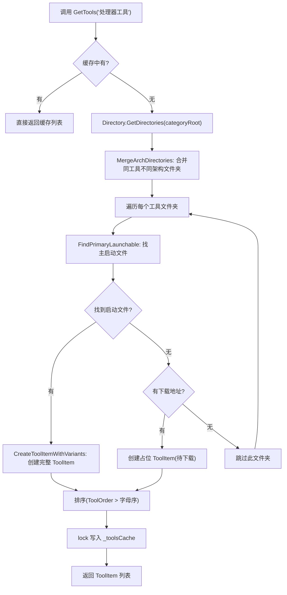

# 第 34 课：ToolCatalog 工具扫描

上两课我们拆了 App.xaml.cs 的启动流程和 MainWindow 的导航搜索。窗口拼好了，搜索框也亮了，但有个问题没解决：**首页那上百个工具卡片到底从哪来的？**

你可以手动往一个列表里塞几条数据，但 TubaTools 不能这么干。它的工具不是程序员一个一个敲进去的——是你下载工具包之后，把可执行文件放到 Tools 文件夹下，程序自己"发现"它们的。新增一个工具、删掉一个工具、换个架构版本，不用改一行代码，工具卡片自动更新。

完成这个"自动发现"工作的类，就是 `Services/ToolCatalog.cs`。697 行代码，不算小。这篇把它逐一拆开，看它怎么从一堆文件夹里提取出有序的、带架构信息的、可直接展示的工具列表。

## 一、先理解数据源：Tools 文件夹长什么样

ToolCatalog 不从数据库读数据，也不从云端 API 拉列表。它只做一件事：**读文件夹**。

Tools 文件夹的典型结构大概是这样的：

```
Tools/
├── 处理器工具/
│   ├── CPU-Z/
│   │   ├── cpuz_x64.exe
│   │   └── cpuz_x86.exe
│   ├── AIDA64/
│   │   └── aida64.exe
│   └── HWiNFO64/
│       └── HWiNFO64.exe
├── 显卡工具/
│   ├── GPU-Z/
│   │   ├── GPU-Z.exe
│   │   └── tools.json          (元数据)
│   ├── FurMark/
│   │   └── FurMark.exe
│   └── MSI Afterburner/        (未下载，占位)
│       └── (空目录 + tools.json 里有 DownloadUrl)
└── 内存工具/
    └── ...
```

每一层对应一个概念：
- **一级文件夹**（处理器工具、显卡工具…）= 分类（Category）
- **二级文件夹**（CPU-Z、GPU-Z…）= 工具
- **二级文件夹里的 .exe/.bat 等** = 可启动文件（Launchable）

ToolCatalog 要做的就是：遍历这棵树，把分类名 → 工具名 → 启动文件路径 → 架构信息 → 元数据，统统封装进 `ToolItem` 对象。

## 二、ToolsRoot：从哪开始扫

代码一开头就定义了一个静态属性 `ToolsRoot`，调用私有方法 `FindToolsRoot()`。这个方法决定了扫描的起点在哪。

```csharp
public static string ToolsRoot => FindToolsRoot();

private static string FindToolsRoot()
{
    if (RuntimeHelper.IsMsixPackaged)
    {
        return Path.Combine(
            Environment.GetFolderPath(Environment.SpecialFolder.LocalApplicationData),
            "TubaWinUi3", "Tools");
    }

    var outputTools = Path.Combine(AppDirectory, "Tools");
    if (Directory.Exists(outputTools))
        return outputTools;

    var directory = new DirectoryInfo(AppDirectory);
    while (directory is not null)
    {
        var candidate = Path.Combine(directory.FullName, "Tools");
        if (Directory.Exists(candidate))
            return candidate;
        directory = directory.Parent;
    }
    return outputTools;
}
```

逻辑分三层：

1. **MSIX 打包模式**：工具放在 `LocalApplicationData\TubaWinUi3\Tools`。这是 Windows 应用商店打包的要求——程序目录不可写，所以工具文件夹必须放在用户数据区。
2. **开发/便携模式**：先检查 `AppDirectory\Tools` 存不存在。`AppDirectory` 是程序 exe 所在的目录。
3. **向上回溯**：如果当前目录没有 Tools，就一层一层往上翻父目录，直到找到一个叫 Tools 的文件夹。这方便你在开发时把 Tools 放在项目根目录而不必跟 build 输出混在一起。

说白了就是：用各种策略找到一个叫 "Tools" 的文件夹，找不着就用默认位置。启动之后，所有工具扫描都从这个根目录开始。

## 三、GetCategories()：分类怎么来的

`GetCategories()` 做的事情很简单：列出 Tools 根目录下的所有子文件夹名，排好序，返回。

```csharp
public static IReadOnlyList<string> GetCategories()
{
    if (!Directory.Exists(ToolsRoot))
        return [];

    var dirs = Directory.GetDirectories(ToolsRoot)
        .Select(Path.GetFileName)
        .Where(name => !string.IsNullOrWhiteSpace(name))
        .Cast<string>()
        .ToList();

    var orderJson = AppSettings.Get("CategoryOrder");
    List<string>? ordered = null;
    if (!string.IsNullOrWhiteSpace(orderJson))
    {
        try
        {
            ordered = System.Text.Json.JsonSerializer.Deserialize<List<string>>(orderJson);
        }
        catch { }
    }

    if (ordered is not null && ordered.Count > 0)
    {
        var orderedSet = new HashSet<string>(ordered, StringComparer.CurrentCultureIgnoreCase);
        var result = ordered.Where(name => dirs.Contains(name!)).ToList();
        foreach (var d in dirs.OrderBy(d => d, StringComparer.CurrentCultureIgnoreCase))
        {
            if (!orderedSet.Contains(d))
                result.Add(d);
        }
        return result;
    }

    return dirs.OrderBy(name => name, StringComparer.CurrentCultureIgnoreCase).ToList();
}
```

这里有一个值得注意的设计：**自定义排序**。用户可以通过设置里存一个 JSON（`CategoryOrder`），比如 `["处理器工具", "显卡工具", "内存工具"]`，告诉程序"这些分类按照我指定的顺序排在最前面"。不在列表里的分类会按字母序排在后面。

如果没有自定义顺序——也就是 `orderJson` 为空或解析失败——那就直接按字母排。

`try { } catch { }` 这个写法很直接：JSON 反序列化可能出错（用户改了设置文件导致格式不对），出错了就当没有自定义排序，不报错、不影响程序继续跑。

## 四、GetTools()：一个分类下怎么扫出所有工具

这是 ToolCatalog 最核心的方法，大概占了 65 行。流程如下：

**第一步：检查缓存。**
如果这个分类已经扫过了，直接返回缓存结果，避免重复 I/O。

```csharp
lock (_cacheLock)
{
    if (_toolsCache.TryGetValue(category, out var cached))
        return cached;
}
```

**第二步：列出工具子文件夹，合并同工具的不同架构文件夹。**

工具目录下可能有这样的结构：

```
CPU-Z/
CPU-Z_x64/
```

两个文件夹其实代表同一个工具"CPU-Z"的不同架构版本。`MergeArchDirectories` 方法通过去掉文件夹名末尾的架构后缀（`_x64`、`_x86`、`_ARM64` 等）进行对比，如果去后缀之后名字一样，就认为是同一个工具，只保留第一个（后面的通过架构扫描来找变体）。

```csharp
private static List<string> MergeArchDirectories(List<string> toolDirs)
{
    var dirNames = toolDirs.Select(d => Path.GetFileName(d)!).ToList();
    var consumed = new HashSet<int>();
    var result = new List<string>();
    for (var i = 0; i < toolDirs.Count; i++)
    {
        if (consumed.Contains(i)) continue;
        var strippedI = StripArchSuffix(dirNames[i]);
        result.Add(toolDirs[i]);
        for (var j = i + 1; j < toolDirs.Count; j++)
        {
            if (consumed.Contains(j)) continue;
            var strippedJ = StripArchSuffix(dirNames[j]);
            if (strippedI.Equals(strippedJ, StringComparison.OrdinalIgnoreCase))
                consumed.Add(j);
        }
    }
    return result;
}
```

**第三步：找启动文件。**

合并后的每个工具文件夹，调用 `FindPrimaryLaunchable` 来找主启动文件。

`FindPrimaryLaunchable` 的逻辑也很讲究——它不是简单地拿文件夹里第一个 .exe：

1. 先查 tools.json 元数据里有没有指定 `LaunchTarget`（手动指定的启动入口文件）。
2. 如果只有一个可启动文件，那就是它。
3. 如果多个，优先选名字跟文件夹名匹配的那个（比如文件夹叫 "CPU-Z"，里面有 `cpuz_x64.exe`、`cpuz_x86.exe`、`uninstall.exe`，优先匹配 `cpuz*`，忽略 `uninstall.exe`）。
4. 匹配不到再看架构后缀：去后缀后名字一致的优先。
5. 都匹配不到，就取当前系统架构最优的那个。
6. 最后兜底：取直接放在根层的第一个可启动文件。

这一整段 60 行代码的目的是：**在不需要用户手动配置的情况下，尽可能准确地猜出哪个文件是主程序**。

**第四步：创建 ToolItem。**

每个找到的工具（启动文件路径 + 文件夹路径），通过 `CreateToolItemWithVariants` 创建完整的 ToolItem 对象。这个方法负责：

- 从 tools.json（通过 ToolMetadataService）读取该工具的描述、版本、标签、下载地址、Winget ID 等元数据
- 检测架构（从文件名后缀判断是 x64/x86/ARM64）
- 扫描同文件夹下的其他架构变体（比如 cpuz_x64.exe 和 cpuz_x86.exe 互为变体）
- 组装成 ToolItem

**第五步：排序并缓存。**

排序逻辑跟 GetCategories 如出一辙——如果有自定义排序配置（`ToolOrder_{分类名}`），先按自定义顺序排，其余按字母排。

最后把结果存入 `_toolsCache`，锁保护。

```csharp
lock (_cacheLock) { _toolsCache[category] = result; }
return result;
```

## 五、架构检测：x64、x86、ARM64 怎么区分

这是 ToolCatalog 里技术细节最密集的部分。TubaTools 的工具很多带架构后缀，比如：

| 文件名 | 架构 | 原因 |
|--------|------|------|
| `cpuz_x64.exe` | x64 | 末尾有 `_x64` |
| `HWiNFO64.exe` | x64 | 末尾有 `64` |
| `aida64.exe` | x64 | 末尾有 `64` |
| `cpuz_x86.exe` | x86 | 末尾有 `_x86` |
| `FurMark_ARM64.exe` | ARM64 | 末尾有 `_ARM64` |

`DetectArch` 方法用三组模式串来匹配：

```csharp
private static readonly string[] ArchX64Patterns = ["x64", "_x64", "w64", "_Win64"];
private static readonly string[] ArchArm64Patterns = ["ARM64", "_ARM64", "arm64", "_arm64"];
private static readonly string[] Arch32Patterns = ["x86", "_x86", "32", "_32", "w32", "_Win32"];
```

按 ARM64 → x64 → x86 的优先级依次尝试匹配。你的 Windows 是 ARM64 的话，`PickPreferredArch` 优先选 ARM64 版本；是 x64 的话优先选 x64 版本；是 32 位系统的话优先选 x86 版本。

架构信息最终会存入 ToolItem 的 `PrimaryArch` 属性和 `AlternateVersions` 列表。UI 层据此显示"x64 / ARM64"这样的架构切换按钮。

## 六、缓存策略：避免每次都读硬盘

ToolCatalog 用了三层缓存：

| 缓存字段 | 缓存什么 | 清除时机 |
|----------|----------|----------|
| `_toolsCache` (Dictionary) | 按分类缓存的工具列表 | `InvalidateTagsCache()` |
| `_cachedAllTools` | 全量工具列表 | `InvalidateTagsCache()` |
| `_cachedTags` | 所有标签 | `InvalidateTagsCache()` |

缓存的写入都加了 `lock (_cacheLock)`。读缓存时也加锁——`GetTools` 在检查缓存时锁住读取，`GetAllToolsCached` 直接判空后一次性构建全量缓存。

```csharp
public static IReadOnlyList<ToolItem> GetAllToolsCached()
{
    if (_cachedAllTools is not null)
        return _cachedAllTools;

    if (!Directory.Exists(ToolsRoot))
        return _cachedAllTools = [];

    _cachedAllTools = GetCategories()
        .SelectMany(GetTools)
        .ToList();
    return _cachedAllTools;
}
```

`GetAllToolsCached()` 用 `SelectMany` 把所有分类的工具铺平成一个列表，一次性构建后就不再碰硬盘。

`InvalidateTagsCache()` 是唯一清除缓存入口，一通全清：

```csharp
public static void InvalidateTagsCache()
{
    _cachedTags = null;
    _cachedAllTools = null;
    lock (_cacheLock) { _toolsCache.Clear(); }
    Interlocked.Increment(ref _cacheVersion);
}
```

`_cacheVersion` 用 `Interlocked.Increment` 自增，线程安全的计数，UI 层可以用它来判断缓存是否变了——变了就重新绑定数据。

这套缓存策略把**工具扫描的开销（主要是Directory API调用）控制在只在必要时发生**：启动后首次访问分类或搜索时做一次扫描，之后全是内存读取。用户添加/删除工具后，手动触发一次 `InvalidateTagsCache()` 即可刷新。

## 七、Search()：全文匹配的搜索

搜索方法相对简洁，但设计上有些细节：

```csharp
public static IReadOnlyList<ToolItem> Search(string query, string? tag = null)
{
    if (!Directory.Exists(ToolsRoot))
        return [];

    var normalizedQuery = query.Trim();
    if (normalizedQuery.Length == 0 && string.IsNullOrEmpty(tag))
        return [];

    var allTools = GetAllToolsCached();

    return allTools
        .Where(item =>
        {
            var matchesQuery = normalizedQuery.Length == 0 ||
                item.Name.Contains(normalizedQuery, StringComparison.CurrentCultureIgnoreCase) ||
                item.RelativePath.Contains(normalizedQuery, StringComparison.CurrentCultureIgnoreCase) ||
                (item.Tags?.Any(t => t.Contains(normalizedQuery, StringComparison.CurrentCultureIgnoreCase)) ?? false);

            var matchesTag = string.IsNullOrEmpty(tag) ||
                (item.Tags?.Any(t => t.Equals(tag, StringComparison.CurrentCultureIgnoreCase)) ?? false);

            return matchesQuery && matchesTag;
        })
        .ToList();
}
```

搜索匹配三个维度：工具名、相对路径、标签。全是 `Contains` 子串匹配，不区分大小写。这不是什么搜索引擎级别的倒排索引——只是近百个工具的规模，`Where` 遍历绰绰有余。

标签匹配是精确匹配（不是包含）：搜标签"显卡"时，只有标签精确为"显卡"的工具才出来，不会匹配到"显卡测试"这样的标签。这个设计是故意的——标签做筛选，查询词做模糊搜，两个维度独立。

## 八、Mermaid 流程图：完整扫描链路



整个链路最耗时的步骤是 `Directory.GetDirectories` 和 `Directory.EnumerateFiles` 这些 I/O 调用。因为有了缓存，同一分类在同一个缓存周期内只扫一次。

## 九、ToolItem：扫描的产物

扫了一圈，最终产出的每个工具都封装在一个 `ToolItem` 对象里。这个类的字段大致分四类：

**基础信息**（必填，来自文件系统）：
- `Name`：显示名，经过 CleanupName 处理（去掉下划线、规范架构后缀显示）
- `Category`：所属分类
- `Path`：启动文件完整路径
- `RelativePath`：相对于分类根目录的路径
- `Extension`：扩展名，大写（EXE、BAT、LNK...），未下载的显示"待下载"

**元数据**（可选，来自 tools.json）：
- `Description`、`Publisher`、`Version`
- `Tags`：标签列表
- `DownloadUrl`、`RemoteUrl`、`WingetId`：下载/安装来源
- `DatabaseSource`：数据来源标注

**架构信息**：
- `PrimaryArch`：主架构（如 "x64"）
- `AlternateVersions`：变体列表
- `ArchOptions`：UI 用的可选项集合（ObservableCollection）
- `SelectedArch`：当前选中的架构

**运行时状态**：
- `IsFavorite`：是否收藏（可变更，通知 UI）
- `IsWingetInstalled`、`IsWingetInstalling`：Winget 安装状态
- `LaunchButtonText`：按钮文本（"打开"/"下载"/"安装中..."）

注意这些属性的声明方式。像 `Name`、`Category`、`Path` 这些用 `required` 和 `init`——一旦创建就不能改。而 `IsFavorite`、`SelectedArch` 等用 `get/set` + `SetField` 触发 `PropertyChanged` 事件——因为 UI 需要实时响应这些变化。

```csharp
public sealed class ToolItem : INotifyPropertyChanged
{
    public required string Name { get; init; }
    public required string Category { get; init; }
    public required string Path { get; init; }
    // ... 更多 init-only 属性

    private bool _isFavorite;
    public bool IsFavorite
    {
        get => _isFavorite;
        set => SetField(ref _isFavorite, value);
    }
    // ...
}
```

`SetField` 的模式也很标准：值没变就不触发事件，避免无意义的 UI 刷新。

## 十、完整调用链：从主页加载到工具卡片展示

把整条线串起来：

1. 主页（HomePage）初始化时调用 `ToolCatalog.GetCategories()` 拿到分类列表。
2. 对当前选中的分类调用 `ToolCatalog.GetTools(category)` 拿到工具列表。
3. 搜索框打字时调用 `ToolCatalog.Search(query)` 拿到匹配结果。
4. 每次调用内部检查缓存，缓存没有就扫硬盘，有了直接用。
5. 用户操作（装新工具、删工具、改标签）后，页面调用 `ToolCatalog.InvalidateTagsCache()` 清缓存，下次访问重新扫描。

这是一套**懒加载 + 缓存**的典型模式：不主动扫全部，只在需要时扫需要的部分；扫完记住，重复访问不再扫。

## 小练习

**第 1 题（填空）**

TubaTools 把 Tools 文件夹下一级子文件夹名当作 ________，二级子文件夹名当作 ________。当一个文件夹里没有可执行文件但 tools.json 里有 DownloadUrl 时，ToolCatalog 会创建一个 ________。

**第 2 题（选择）**

`FindPrimaryLaunchable` 方法在多选一的时候，最后兜底的策略是什么？

A. 选文件体积最小的
B. 选文件修改时间最新的
C. 选直接放在工具根层的第一个可启动文件
D. 随机选一个

**第 3 题（简答）**

ToolCatalog 有三层缓存（`_toolsCache`、`_cachedAllTools`、`_cachedTags`），分别缓存什么数据？什么情况下需要调用 `InvalidateTagsCache()` 来清空它们？

**第 4 题（实操）**

打开你的 TubaTools 项目，找到 Tools 文件夹，看一个分类下的工具目录结构。然后打开 `Services/ToolCatalog.cs`，找到 `Search` 方法。试着在搜索逻辑里加一个匹配维度：也匹配 `Description` 字段。改完后编译运行，搜索看看效果。

---

**答案**

1. 分类（Category）、工具（Tool）、占位符（Placeholder）/ "待下载" 状态的 ToolItem
2. C。代码逻辑是如果直接根层的可启动文件有多个，优先匹配目录名、匹配架构后缀，都匹配不到就取 `directLaunchables[0]`，再没有就取 `allLaunchables[0]`。
3. `_toolsCache` 缓存每个分类的工具列表（按分类名索引的 Dictionary）；`_cachedAllTools` 缓存全量工具列表（所有分类铺平）；`_cachedTags` 缓存所有标签去重后的列表。当用户手动添加/删除了工具文件夹、修改了 tools.json、或者改变了标签/收藏状态后，需要调用 `InvalidateTagsCache()` 让下次访问重新扫描。
4. 实操题，核心改动是在 `Search` 方法的 `matchesQuery` 条件里加一行：
   ```csharp
   (item.Description?.Contains(normalizedQuery, StringComparison.CurrentCultureIgnoreCase) ?? false)
   ```
   放在 `item.Name.Contains` 后面，用 `||` 连接。注意要先判空（`item.Description?`），因为 Description 是 nullable 的。
