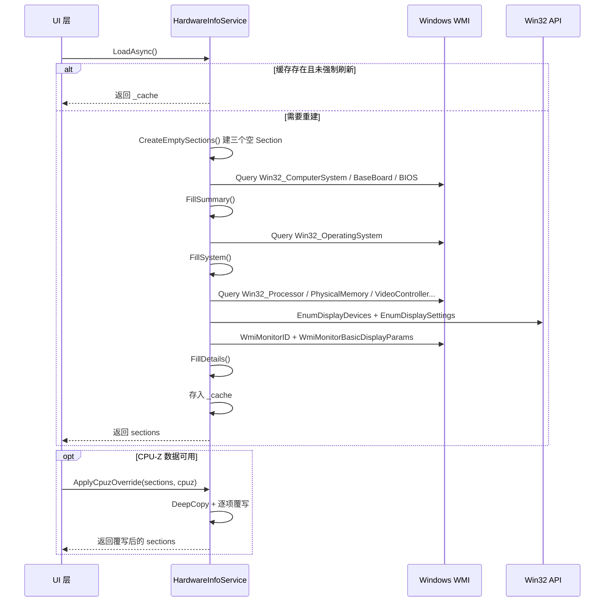

# 第 35 课：HardwareInfoService——硬件检测引擎

在 TubaTools 里，有一个 Service 负责回答"这台电脑装了什么硬件"。它要知道 CPU 型号、内存多大、显卡是哪张、硬盘多少 GB、显示器分辨率……等等。这个 Service 有 1810 行代码，是本项目最复杂、逻辑密度最高的单个文件。

本课拆开它看里面怎么运作的。

## 一个入口，两层数据

HardwareInfoService 往外暴露两种粒度的数据：

- **概览层**（`LoadAsync`）：返回 `List<HardwareInfoSection>`，分"型号信息""系统信息""详细信息"三个区块，每个区块里是一堆标签-值对（Label/Value），用于 HomePage 首页的工具网格卡片。
- **详情层**（`LoadDetailAsync`）：返回 `HardwareDetailData`，拆分出 CPU、主板、内存、显卡、硬盘、显示器、声卡、网卡各自的完整字段，用于点进某一类硬件后的详情弹窗。

两个接口各自有一套 `BuildSections` / `BuildDetailData` 私有方法，也各自维护缓存：

```csharp
private static IReadOnlyList<HardwareInfoSection>? _cache;
private static readonly object _lock = new();

private static HardwareDetailData? _detailCache;
```

缓存用 `lock` 保护，因为硬件信息不会在运行时变，调一次就够了。如果用户强制刷新（`forceRefresh=true`），就清缓存重建。

## WMI 查询引擎

整个 Service 的底座是 Windows 自带的 WMI（Windows Management Instrumentation）。WMI 里有几十个硬件类：`Win32_Processor` 对应 CPU，`Win32_PhysicalMemory` 对应内存条，`Win32_VideoController` 对应显卡，以此类推。

TubaTools 封装了一个极简的查询层。核心就四个方法：

```csharp
private static IEnumerable<ManagementBaseObject> Query(string className)
{
    try
    {
        using var searcher = new ManagementObjectSearcher($"SELECT * FROM {className}");
        foreach (ManagementBaseObject item in searcher.Get())
        {
            yield return item;
        }
    }
    finally { }
}

private static ManagementBaseObject? First(string className)
{
    return Query(className).FirstOrDefault();
}

private static string? Get(ManagementBaseObject? item, string propertyName)
{
    try
    {
        return item?[propertyName]?.ToString()?.Trim();
    }
    catch
    {
        return null;
    }
}
```

`Query` 用 `yield return` 所以是延迟枚举——调用方只取第一条或者只收集到 List 里才真正执行 WMI 查询。`Get` 是安全取值器，任何属性不存在都不抛异常，返回 null。还有 `IsTrue`、`ToInt`、`ToLong`、`ContainsAny`、`Join` 等多个短小但被反复调用的辅助方法。

这种"工具方法层 + 业务逻辑层"的两层写法是整个 Service 的设计基调。后面 Section 填充、Detail 构建全都调用这些底层方法，绝不用原始 WMI API。

## 三个 Section 怎么填充的

`BuildSections` 先建三个空的 Section，然后分别调用三个 Fill 方法。

### FillSummary——型号信息

```csharp
private static void FillSummary(HardwareInfoSection section)
{
    var computer = First("Win32_ComputerSystem");
    var board = First("Win32_BaseBoard");
    var bios = First("Win32_BIOS");

    section.Items.Add(Item("设备型号", Join(Get(computer, "Manufacturer"), Get(computer, "Model"))));
    section.Items.Add(Item("主板", Join(Get(board, "Manufacturer"), Get(board, "Product"))));
    section.Items.Add(Item("BIOS", Join(Get(bios, "Manufacturer"), Get(bios, "SMBIOSBIOSVersion"))));
}
```

三个 WMI 类，三行数据，拼到一起。`Item` 是个工厂方法，把 label 和 value 塞进 `HardwareInfoItem`，value 为 null 就写"未知"。

### FillSystem——系统信息

查一次 `Win32_OperatingSystem`，取三项：系统名 + 架构（比如"Microsoft Windows 11 专业版 x64"）、版本号、运行时间。

运行时间的实现用了 `Environment.TickCount64`——自系统启动以来经过的毫秒数，转成"X天X小时X分钟X秒"：

```csharp
private static string FormatUptime()
{
    var uptime = TimeSpan.FromMilliseconds(Environment.TickCount64);
    return $"{uptime.Days}天{uptime.Hours}小时{uptime.Minutes}分钟{uptime.Seconds}秒";
}
```

### FillDetails——详细信息

这是最重的部分，因为要查 CPU、内存、显卡、显示器、硬盘、声卡、网卡，而且每种都有过滤逻辑。

CPU 很简单——取 `Win32_Processor` 第一条的 Name。但紧接着做了一道 `DetectCpuBrand`：

```csharp
private static string? DetectCpuBrand(string? cpuName)
{
    if (string.IsNullOrWhiteSpace(cpuName)) return null;
    var name = cpuName.ToUpperInvariant();
    if (name.Contains("INTEL")) return "intel";
    if (name.Contains("AMD")) return "amd";
    if (name.Contains("APPLE") || name.Contains("M1") || ...) return "apple";
    if (name.Contains("QUALCOMM") || name.Contains("SNAPDRAGON")) return "qualcomm";
    return null;
}
```

这行 BrandKey 决定了 UI 上显示什么图标。显卡同理，有 `DetectGpuBrand`，NV 匹配 "NVIDIA"/"GEFORCE"/"RTX"/"GTX"，AMD 匹配 "AMD"/"RADEON"，Intel 匹配 "INTEL"/"ARC"/"UHD"/"IRIS"。

显卡查询独有"虚拟显卡过滤"逻辑。`JoinNames("Win32_VideoController", filter)` 会排除 Microsoft Basic Render、各种 Remote Display、虚拟显示适配器、以及名字里带"虚拟"的条目。这是 TubaTools 项目最实打实的细节——WMI 会返回一堆虚拟显卡，不用 filter 的话用户看到的显卡列表会多出一堆没用的东西。

声卡同理，过滤掉 "Virtual"、"Software"、"VB-Audio"、"Voicemeeter"、"CABLE" 等虚拟音频设备。网卡过滤掉非物理适配器（`PhysicalAdapter != true`）、蓝牙、WAN Miniport。

## 显示器检测——最复杂的子系统

显示器是本 Service 里最复杂的一块，因为 WMI 的显示器信息不够用。

核心思路是：**Win32 API（EnumDisplayDevices）+ WMI（WmiMonitorID / WmiMonitorBasicDisplayParams）双线作战**。

Step-by-step 流程：

1. **P/Invoke 调 Win32 EnumDisplayDevices** 枚举所有连到桌面的显示适配器。每个适配器能拿到设备名（如 `\\.\DISPLAY1`）和是否是主屏。

2. **EnumDisplaySettings** 拿当前分辨率（`dmPelsWidth x dmPelsHeight`）和刷新率。

3. **EnumDisplayDevices 再次调用**，传适配器名，枚举显示器设备，拿到 DeviceString（比如 "DELL U2723QE"）和 DeviceID（含 PNP 码）。

4. **WMI `WmiMonitorID`** 从 `root\WMI` 命名空间读 ManufacturerName / ProductName / SerialNumberID——这些都是 `ushort[]` 数组，需要转换成字符串。这比 Display Device String 更精准。

5. **WMI `WmiMonitorBasicDisplayParams`** 读物理尺寸（MaxHorizontalImageSize / MaxVerticalImageSize，单位厘米），用勾股定理算对角线英寸数。

6. **标签选择逻辑**：优先取 WMI 解码的标签 > Display Device String（非 Generic PnP）> PNP 码三段字母反查厂商名。

7. **后备方案**：如果 Win32 API 枚举不到显示器（远程桌面等场景），改查 `Win32_PnPEntity`（PNPClass = "Monitor"）和 `Win32_VideoController` 的 CurrentHorizontalResolution / CurrentVerticalResolution。

P/Invoke 签名写在类顶部：

```csharp
[DllImport("user32.dll", CharSet = CharSet.Auto)]
private static extern bool EnumDisplayDevices(string? lpDevice, uint iDevNum,
    ref DISPLAY_DEVICE lpDisplayDevice, uint dwFlags);

[DllImport("user32.dll", CharSet = CharSet.Auto)]
private static extern bool EnumDisplaySettings(string? lpszDeviceName,
    int iModeNum, ref DEVMODE lpDevMode);
```

`DISPLAY_DEVICE` 和 `DEVMODE` 是原生 C 结构体，C# 里用 `StructLayout(LayoutKind.Sequential)` 和 `MarshalAs` 标注来映射。`DISPLAY_DEVICE.Size` 必须在调用前设为 `Marshal.SizeOf<DISPLAY_DEVICE>()`，这是 Win32 API 的标准约定——结构体第一个字段告诉 API 结构体多大。

显示器标签的查找优先级是：

```csharp
private static string ChooseDisplayLabel(
    string? monitorDeviceString, string? pnpCode,
    string? adapterDeviceString, IReadOnlyDictionary<string, string> wmiLabels)
{
    // 首选：WMI MonitorID 的标签
    if (!string.IsNullOrWhiteSpace(pnpCode) &&
        wmiLabels.TryGetValue(pnpCode, out var wmiLabel) &&
        !string.IsNullOrWhiteSpace(wmiLabel))
        return wmiLabel;

    // 次选：Display Device String（如果不是 Generic PnP）
    if (!string.IsNullOrWhiteSpace(monitorLabel) &&
        !IsGenericMonitorLabel(monitorLabel))
        return monitorLabel;

    // 再次：PNP 码三段字母反查制造商（如 "DEL" -> "Dell(戴尔)"）
    var pnpMfr = pnpCode?.Length >= 3 ? ResolveManufacturer(pnpCode[..3]) : null;
    if (!string.IsNullOrWhiteSpace(pnpMfr)) return pnpMfr;

    return "";
}
```

`ResolveManufacturer` 是一个超大的 switch 表达式，映射了 200+ 个制造商三字母码到中文名。比如 "BOE" 映射到"京东方(BOE)"，"LEN" 映射到"联想(Lenovo)"，"PHL" 映射到"飞利浦(Philips)"。这是手工整理的硬件厂商数据字典，每个条目都有来源——WMI 里 PNP 设备 ID 的前三个字母就是制造商代码。

## CPU-Z 数据覆写

TubaTools 允许用户用 CPU-Z 的导出数据来"修正" WMI 数据。CPU-Z 是第三方工具，它读到的 CPU 代号、步进、主板芯片组等信息比 WMI 更丰富。

`ApplyCpuzOverride` 方法接收 WMI 生成的 sections 和 CPU-Z 解析结果（`CpuzInfo`），做 `DeepCopy` 后覆写对应字段。覆写是有选择的——只改 CPU-Z 提供了的值，WMI 原有的其他数据保留。

```csharp
public static IReadOnlyList<HardwareInfoSection> ApplyCpuzOverride(
    IReadOnlyList<HardwareInfoSection> wmiSections, CpuzInfo cpuz)
{
    var sections = DeepCopy(wmiSections);
    // 覆写 CPU 名字，追加代号和核心/线程数
    // 覆写主板制造商+型号
    // 覆写 BIOS 品牌+版本
    // 覆写内存制造商+大小+速度
    // 覆写显卡名+显存
    return sections;
}
```

覆写后 `IsVerified` 标记为 true，UI 上会显示一个小勾表示"CPU-Z 验证过的数据"。

## 内存检测的细节

内存是另一个逻辑复杂的模块。WMI 的 `Win32_PhysicalMemory` 返回每条内存条的原始数据——容量、速度、制造商、类型。

`FormatMemory` 做了这些事：

1. 查 `Win32_PhysicalMemoryArray` 获取总插槽数（`MemoryDevices`）
2. 过滤容量 > 0 的插槽（空插槽容量为 0 或不存在）
3. 累加总容量，转成 GB
4. 取 `SMBIOSMemoryType` 映射成 DDR/DDR2/DDR3/DDR4/DDR5 等类型名
5. 计算速度——要注意 `ConfiguredClockSpeed` 和 `Speed` 的差异：在 DDR3/DDR4/DDR5 上 `ConfiguredClockSpeed` 可能报告的是基频（比如 1600MHz），而需要乘 2 才是等效频率（3200MT/s）。`GetMemoryDataRateMts` 方法做了这个判断。

内存制造商的解码也很有心——JEDEC 标准用 2 位或 4 位十六进制编码制造商。比如 `0x80` = 三星，`0x81` = 海力士，`0x2C` = 金士顿。`DecodeJedecManufacturer` 先判断输入是否是十六进制码，是的话走 JEDEC 解码表，不是的话走品牌名 switch。最终都映射成"中文(英文)"的格式，如"金士顿(Kingston)"、"三星(Samsung)"。



## 数据流转全景

从最底层到最上层，数据经过三层抽象：

1. **WMI 原始数据**：`ManagementBaseObject`，属性是 `object`，读取要用 `item["PropertyName"]`，类型不安全。
2. **辅助方法层**：`Get`/`ToInt`/`ToLong`/`IsTrue`/`ContainsAny`/`Join`，把不安全的 WMI 取值变成安全的字符串/数字/布尔操作。
3. **DTO 层**：`HardwareInfoItem`（Label + Value + BrandKey + IsVerified）和 `HardwareDetailData` 体系（CpuDetail、MemoryDetail 等）。UI 只和这层打交道。

举个例子，一条"处理器: Intel Core i7-13700K"的数据经历了：

```
WMI: item["Name"] = "Intel(R) Core(TM) i7-13700K"
  -> Get(cpu, "Name") 返回 "Intel(R) Core(TM) i7-13700K"
  -> Item("处理器", cpuName) 生成 HardwareInfoItem { Label="处理器", Value="Intel(R) Core(TM) i7-13700K" }
  -> DetectCpuBrand(cpuName) 返回 "intel"，设置 BrandKey
  -> section.Items.Add(cpuItem)
```

UI 拿到 `HardwareInfoItem` 后，根据 `BrandKey` 显示 Intel 图标，根据 `Value` 在卡片上显示名称。

## 值得注意的细节

**安全取值**。这个 Service 没有一处直接抛异常。所有 WMI 取值都包在 try/catch 里。`Get` 方法 return null 而不是崩；`Query` 在 catch 块什么都不做，返回空枚举。这种"宁可沉默也不炸"的策略，是因为 WMI 在不同机器上返回的字段可能有差异，某些类在某些系统上直接不存在（比如 Win32_PhysicalMemory 在虚拟机里可能是空的）。

**过滤虚拟设备**。显卡、声卡、网卡都有虚拟设备过滤。`ContainsAny` 方法做不区分大小写的 contains 匹配，是过滤逻辑的基础。这些过滤规则来自实际测试——在不同电脑上跑 TubaTools，看到一些奇奇怪怪的虚拟设备后，手工加上排除规则。

**类型映射枚举**。SMBIOS 内存类型码映射（18=DDR, 26=DDR4, 34=DDR5 等）、CPU 架构码映射（0=x86, 9=x64, 12=ARM64）、BIOS 日期格式化（从 "20240115000000.000000+000" 截前 8 位转 "2024-01-15"）——这些都是 switch 表达式，短小精准。

**静态类，全局唯一**。`HardwareInfoService` 是 `static class`，所有方法都是静态的。这么做意味着整个应用只有一个硬件信息采集点，缓存天然是全局的。在 App 启动时调用一次 `Preload()`，后续任何页面需要硬件信息都从缓存读，不再查 WMI。

---

## 小练习

**练习 1（填空）**：HardwareInfoService 使用 `static class` 修饰，所有方法都是 _____ 的。它对外暴露两个主要方法：`LoadAsync` 返回 _____ 列表，`LoadDetailAsync` 返回 _____ 对象。

**练习 2（简答）**：WMI 的 `Win32_VideoController` 可能返回虚拟显卡。TubaTools 是怎么过滤它们的？列举至少三个被排除的设备名称关键词。

**练习 3（简答）**：为什么显示器检测需要同时用 Win32 API（EnumDisplayDevices）和 WMI（WmiMonitorID）？只用 WMI 有什么问题？

**练习 4（代码阅读）**：阅读 `FormatMemory` 方法（第 378-428 行）。它先从 `Win32_PhysicalMemory` 取内存条，为什么还要再查 `Win32_PhysicalMemoryArray`？两个 WMI 类的区别在哪里？

**练习 5（实操）**：写一个简化版的 `DetectCpuBrand` 方法，接收 CPU 名字字符串，返回品牌代号。要求：能识别 Intel、AMD、Apple Silicon 三类。参考 TubaTools 里的实现，但只写核心逻辑。

<details>
<summary>练习答案（参考）</summary>

**练习 1**：静态；`IReadOnlyList<HardwareInfoSection>`；`HardwareDetailData`

**练习 2**：`FillDetails` 调用 `JoinNames("Win32_VideoController", filter)`，filter 用 `ContainsAny` 排除名字中包含以下关键词的条目："Microsoft Basic Render"、"Microsoft Remote Display"、"DDA Wrapper"、"Idd Desk"、"GameViewer Virtual Display"、"Honor Virtual Display"、"Virtual Display"、"Virtual GPU"、"Virtual Adapter"、"虚拟"、"Remote Display Adapter"

**练习 3**：WMI 的显示器信息（PnPEntity）只能拿到设备名，拿不到 EDID 里的制造商名、产品名、序列号、物理尺寸。而 `WmiMonitorID` 从 EDID 直接解码这些字段。Win32 API 的 EnumDisplayDevices 能提供 DeviceString（有时是更清晰的名字）和主屏标识。只查 WMI 的话：显示器标签可能只显示"通用即插即用监视器"，没有分辨率。两者结合才能拿到准确且完整的显示器信息。

**练习 4**：`Win32_PhysicalMemory` 返回的是实际安装的每条内存条（有容量即可），而 `Win32_PhysicalMemoryArray` 描述的是主板上的物理内存阵列（物理插槽结构），其中 `MemoryDevices` 表示该阵列的总插槽数。前者告诉你插了哪几条，后者告诉你主板有多少个槽位。两者结合才能得出"8GB x 2 / 4 插槽"这样的完整描述。

**练习 5**：

```csharp
static string? DetectCpuBrand(string? cpuName)
{
    if (string.IsNullOrWhiteSpace(cpuName)) return null;
    var n = cpuName.ToUpperInvariant();
    if (n.Contains("INTEL")) return "intel";
    if (n.Contains("AMD")) return "amd";
    if (n.Contains("APPLE") || n.Contains("M1") || n.Contains("M2") || n.Contains("M3")) return "apple";
    return null;
}
```

</details>
