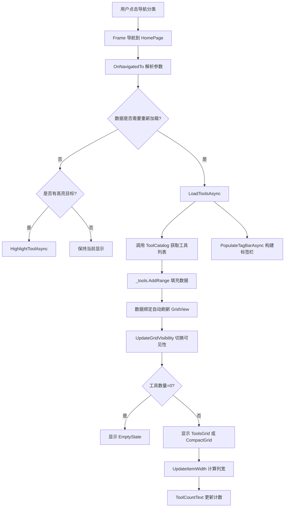

# 第 36 课：HomePage 工具网格——整个应用的"门面"

首页是 TubaTools 打开后第一眼看到的东西。几十上百个工具图标排成网格，每个卡片上有名字、描述、图标、分类标签、一个"打开"按钮。用户在这页上完成三件事：浏览所有工具、搜索筛选、点击打开某个工具。

本课拆开 `Pages/HomePage.xaml` 和 `Pages/HomePage.xaml.cs`，看这个页面的完整运作方式——从 XAML 布局到 C# 代码逻辑。

## 整体布局：一张图三层结构

打开 HomePage.xaml，最外层是一个 `<Page>` 标签。Page 里面直接放了一个 `<Grid>`（没有额外嵌套的布局控件）。这个顶层 Grid 里有两样东西：

1. 背景图（`BackgroundImg`）：一个铺满全屏的 Image，透明度 0.15，`IsHitTestVisible="False"`（点击穿透，不挡交互）。
2. 内容 Grid：`Padding="28,18,28,24"`，三行布局——

```
Row 0 (Auto): 标题 + 工具数量
Row 1 (Auto): 标签筛选栏（TagBar）
Row 2 (*):    主体——工具网格 / 紧凑网格 / 空状态
```

Row 2 是 `*` 高度，占满剩余空间。里面同时放了三个控件——`ToolsGrid`（正常卡片）、`CompactGrid`（紧凑图标）、`EmptyState`（空结果提示）——但同一时刻只有一个 Visible，另外两个 `Visibility="Collapsed"`。这是 WinUI 里省事的做法：不用动态增删控件，直接切换可见性。

```xml
<GridView x:Name="ToolsGrid" ... Visibility="Collapsed">
    ...
</GridView>

<GridView x:Name="CompactGrid" ... Visibility="Collapsed">
    ...
</GridView>

<StackPanel x:Name="EmptyState" ... Visibility="Collapsed">
    ...
</StackPanel>
```

## 工具卡片的数据模板

ToolsGrid 是一个 `GridView`。`GridView` 是 WinUI 里用来显示"网格排列的可选项目"的控件，比 ListView 更适合图标类布局。

关键属性：

- `IsItemClickEnabled="True"`——点击整个卡片触发 `ItemClick` 事件（不只是按钮）
- `SelectionMode="None"`——不需要选中高亮，要的是点击动作
- `ItemContainerStyle="{StaticResource ToolCardStyle}"`——每个格子外边距 0,0,12,12
- `SizeChanged="ToolsGrid_SizeChanged"`——窗口宽度变化时重新算每列宽度

每个卡片的视觉结构定义在 `<GridView.ItemTemplate>` 的 `<DataTemplate>` 里。从外到内：

```
Border (圆角卡片, MinHeight=220)
  └── Grid (5行: Auto / 44 / Auto / Auto / Auto)
        ├── 第1行：图标 + 名称 + 收藏按钮
        │     Grid(3列: 48 / * / Auto)
        │     ├── 图标区：48x48 Border 里面 Image 或 FontIcon（二选一）
        │     ├── 名称 Column：Name 绑定 + Category 绑定
        │     └── 收藏按钮：FontIcon 根据 IsFavorite 切换星号
        ├── 第2行：Description 描述文本 (MaxLines=2)
        ├── 第3行：TagsText 标签行
        ├── 第4行：Extension 扩展名徽章 + ArchOptions 架构下拉框
        └── 第5行：操作按钮栏
              ├── 发送到桌面
              ├── 管理员运行（有下载任务的工具隐藏）
              └── 打开/下载按钮（LaunchButtonText）
```

这里有个值得注意的设计：图标展示用了两种控件叠加——`Image` 和 `FontIcon` 放在同一个 `Grid` 格子里，各自的 `Visibility` 绑定同一个 `NullToCollapse` 转换器。如果工具配置了图标文件路径，Image 显示、FontIcon 隐藏；如果配置的是字体图标字符（Glyph），反过来。实际上每个工具只会有一种图标源，另一个绑定 null 就被转换器变成 Collapsed。

```xml
<Image Source="{Binding IconPath}"
       Visibility="{Binding IconPath, Converter={StaticResource NullToCollapse}}" />
<FontIcon Glyph="{Binding IconGlyph}"
          Visibility="{Binding IconGlyph, Converter={StaticResource NullToCollapse}}" />
```

这种"两个控件只显一个"的模式在下面还会出现——紧凑模式的图标区也是一样的结构。

## 紧凑模式：同一份数据，两套皮肤

HomePage 支持"紧凑模式"，用户可以在设置里切换。切换后：

- `ToolsGrid` 隐藏，`CompactGrid` 显示
- 卡片从 280px 最小宽度缩到 100px
- 卡片内容从五行的详细信息变成只有图标 + 名称（居中排列）
- 工具描述变成 ToolTip 悬停提示

两个 GridView 绑定的是**同一份数据源** `_tools`：

```csharp
ToolsGrid.ItemsSource = _tools;
CompactGrid.ItemsSource = _tools;
```

所以紧凑模式不需要重新加载数据，只需要切换可见性。`ApplyCompactMode()` 方法做的事就是决定哪个 GridView 显示、调用 `UpdateItemWidth()` 重新算列宽。

## 响应式列宽：窗口多大就排几列

`UpdateItemWidth()` 是 HomePage 里比较巧妙的一段算法。GridView 用 `ItemsWrapGrid` 做布局面板，`ItemsWrapGrid` 有一个 `ItemWidth` 属性可以设每列的固定宽度。问题是：窗口宽度是变量，不同分辨率下列数不同。

算法思路：

```
给定：可用宽度 = 控件实际宽度 - 左右 Padding
      最小列宽 = 正常模式 280 / 紧凑模式 100
      列间距 = 正常模式 12 / 紧凑模式 10

先算能放几列：columns = (可用宽度 + 列间距) / (最小列宽 + 列间距)
再算实际列宽：itemWidth = (可用宽度 - (columns-1)*列间距) / columns
结果取 itemWidth 和 minItemWidth 的较大值
```

这样 1920 宽的屏幕、正常模式下，除去 56px 左右 Padding 剩约 1864px，每列至少 280px + 12px = 292px，能放 6 列；实际列宽约 (1864 - 60) / 6 ≈ 300px。缩小窗口到 1200 宽则自动变成 4 列。整个过程在 `SizeChanged` 事件里触发。

```csharp
private void UpdateItemWidth()
{
    var grid = _compactMode ? CompactGrid : ToolsGrid;
    var panel = grid.ItemsPanelRoot as ItemsWrapGrid;
    if (panel is null) return;

    double minItemWidth = _compactMode ? 100 : 280;
    double spacing = _compactMode ? 10 : 12;
    double availableWidth = grid.ActualWidth - grid.Padding.Left - grid.Padding.Right;

    if (availableWidth <= 0) return;

    int columns = Math.Max(1, (int)((availableWidth + spacing) / (minItemWidth + spacing)));
    double itemWidth = (availableWidth - (columns - 1) * spacing) / columns;
    panel.ItemWidth = Math.Max(minItemWidth, itemWidth);
}
```

这段算法不依赖任何外部库，就靠几行除法和取整。WinUI 的 GridView 本身没有 CSS Grid 那种 `auto-fill / minmax` 的能力，所以需要手动算。

## 数据流：ToolItem 模型

每个卡片背后是一个 `ToolItem` 对象。ToolItem 是 TubaTools 的核心数据模型，实现了 `INotifyPropertyChanged`，所以 UI 能响应属性变化自动刷新。

看一眼它的关键属性：

```csharp
public sealed class ToolItem : INotifyPropertyChanged
{
    public required string Name { get; init; }         // 工具名
    public required string Category { get; init; }      // 分类
    public required string Path { get; init; }          // exe 路径
    public required string Extension { get; init; }     // 文件扩展名
    public string? IconPath { get; set; }               // 图标图片路径
    public string? IconGlyph { get; set; }              // 图标字体字符
    public string? Description { get; init; }           // 描述
    public bool IsFavorite { get; set; }                // 是否收藏
    public string TagsText => string.Join("  ", Tags);  // 标签文本
    public IReadOnlyList<string> Tags { get; init; }    // 标签列表
    public ObservableCollection<ArchOption> ArchOptions { get; }  // 架构选项
    public ArchOption? SelectedArch { get; set; }       // 当前选中的架构
    public string LaunchButtonText { get; }             // 按钮文字（打开/下载/安装中）
    public bool CanLaunch { get; }                      // 能否启动
    // ... 更多属性
}
```

有几个属性是计算属性（没有 setter），比如 `LaunchButtonText`：

```csharp
public string LaunchButtonText
{
    get
    {
        if (!string.IsNullOrWhiteSpace(DownloadUrl)) return "下载";
        if (!string.IsNullOrWhiteSpace(WingetId))
        {
            if (IsWingetInstalling) return "安装中...";
            return IsWingetInstalled ? "打开" : "下载";
        }
        if (!string.IsNullOrWhiteSpace(RemoteUrl) && !File.Exists(EffectivePath))
            return "下载";
        return "打开";
    }
}
```

这段逻辑决定了卡片右下角按钮显示什么文字。它的判断顺序很重要：先看是不是下载类工具，再看是不是 winget 安装，最后才看本地文件是否存在。按钮的文字不是由外部赋值的，而是根据工具的下载状态、安装状态动态计算。当 `IsWingetInstalled` 从 false 变成 true 时（比如 winget 安装完成），`SetField` 方法触发 `PropertyChanged` 通知，UI 自动把按钮从"下载"变成"打开"。

## 页面生命周期：导航到这里时发生了什么

用户从左侧导航栏点击一个分类，Frame 就会导航到 HomePage。导航触发 `OnNavigatedTo`。

```csharp
protected override void OnNavigatedTo(NavigationEventArgs e)
{
    base.OnNavigatedTo(e);

    if (e.Parameter is SearchNavigationTarget target && target.HighlightToolPath is not null)
    {
        // 来自搜索：高亮某个特定工具
        _highlightToolPath = target.HighlightToolPath;
        _category = ToolCatalog.GetAllToolsCached()
            .FirstOrDefault(t => t.Path.Equals(_highlightToolPath, ...))?.Category;
    }
    else if (e.Parameter is string category)
    {
        // 来自分类导航：过滤显示某一类工具
        _category = category;
    }
    else
    {
        _category = null;  // 显示全部
    }

    _searchQuery = string.Empty;
    _selectedTag = null;
    ApplyBackground();
    UpdateTitle();

    // 判断是否需要重新加载数据
    var needsReload = _category != _lastLoadedCategory ||
                      _selectedTag != _lastLoadedTag ||
                      _searchQuery != _lastLoadedQuery ||
                      ToolCatalog.CacheVersion != _lastCacheVersion;

    if (needsReload)
        _ = LoadToolsAsync();   // 触发热加载
    else if (_highlightToolPath is not null)
        _ = HighlightToolAsync(_highlightToolPath);
}
```

注意 `_ = LoadToolsAsync()` 这种写法——`async Task` 方法用 discard 调用，意思是"触发了，不等它跑完"。WinUI 的页面导航本身是同步的，加载数据是异步的，不能让导航等数据加载完才显示页面。所以页面先渲染出来，网格是空的，数据回来后再通过数据绑定刷新。

## 标签筛选栏：动态创建 RadioButton

标签栏（TagBar）不是写在 XAML 里的静态控件，而是完全在 C# 里动态构建的。`PopulateTagBarAsync()` 方法：

1. 异步调用 `ToolCatalog.GetAllTags()` 拿到所有标签
2. 回到 UI 线程（`DispatcherQueue.TryEnqueue`）
3. 清空 TagBarPanel
4. 先加一个"全部"RadioButton
5. 遍历标签列表，每个标签创建一个 RadioButton
6. 所有 RadioButton 绑定同一个 `TagRadioButton_Click` 事件

RadioButton 的样式来自 `Page.Resources` 里定义的 `TagRadioButtonStyle`——选中时显示主题色填充，未选中时显示灰色。这是个典型的"Pill Button"（药丸按钮）样式。

点击标签按钮后：

```csharp
private void TagRadioButton_Click(object sender, RoutedEventArgs e)
{
    if (sender is RadioButton rb)
    {
        _selectedTag = rb.Tag as string;
        // 取消其他按钮的选中状态
        foreach (var child in TagBarPanel.Children)
        {
            if (child is RadioButton other && other != rb)
                other.IsChecked = false;
        }
        UpdateTitle();
        _ = LoadToolsAsync();  // 重新加载过滤后的工具列表
    }
}
```

这里手动循环取消其他按钮的选中，因为 RadioButton 的 GroupName 没设——它们是动态创建的，GroupName 机制不好用。不如直接遍历一次，简单可靠。

## 右键菜单：MenuFlyout 的两种实例

点击工具卡片是打开工具，右键点击弹出菜单。菜单选项包括：

- 发送到桌面快捷方式
- 以管理员身份运行
- 打开工具所在目录
- 选择架构（有多架构版本时显示）
- 检查更新（有更新源时显示）
- 删除工具（红色警告色）

正常模式和紧凑模式各有一套 `MenuFlyout`，分别存在 `ToolsGrid.Resources` 和 `CompactGrid.Resources` 里。两套菜单功能一样，但获取方式不同：

```
ToolsGrid 右键：取 ToolsGrid.Resources["NormalItemFlyout"]
CompactGrid 右键：取 CompactGrid.Resources["CompactItemFlyout"]
```

弹出前还会动态填充架构子菜单（`PopulateArchSubmenu`）和更新菜单项的可见性（`UpdateCheckUpdateVisibility`）——因为不同工具有不同的架构选项和更新源，菜单元数据不能写死。

架构选择菜单尤其有意思：它遍历 `tool.ArchOptions`，每个选项是一个 `ToggleMenuFlyoutItem`，点击后直接改 `tool.SelectedArch`，工具模型自动更新 `EffectivePath`、`LaunchButtonText` 等属性。

## 空状态

当工具列表为空时（比如搜索无结果），页面显示 `EmptyState`：

```xml
<StackPanel x:Name="EmptyState" ... Visibility="Collapsed">
    <FontIcon FontSize="48" Glyph="&#xE721;" Opacity="0.3" />
    <TextBlock FontSize="18" Text="没有找到匹配的工具" />
    <TextBlock x:Name="EmptyStateText" Text="" />
</StackPanel>
```

`EmptyStateText.Text` 在 `LoadToolsAsync` 里动态设置，根据是搜索无匹配、标签无匹配还是分类为空给出不同提示：

```csharp
EmptyStateText.Text = query.Length > 0
    ? $"未找到与\u201C{query}\u201D相关的工具。"
    : _selectedTag is not null
        ? $"未找到带有「{_selectedTag}」标签的工具。"
        : _category is not null
            ? "此分类下没有可用工具。"
            : "没有找到任何工具，请检查 Tools 目录。";
```

## 高亮定位动画

从搜索页跳转到首页并需要高亮某个工具时，`HighlightToolAsync` 登场。它做的事：

1. 在 `_tools` 列表里找到目标工具
2. `ScrollIntoView` 把工具滚到可视区
3. 等 100ms 让滚动完成
4. 获取对应的 `GridViewItem` 容器
5. `StartBringIntoView` 把工具卡片动画居中
6. 等 500ms 让动画跑完
7. `FindChildBorder` 递归遍历 Visual Tree 找到卡片里的 Border
8. 调用 `SearchHighlightService.HighlightBorder` 给它加一圈高亮动画

`FindChildBorder` 是一个递归方法，用 `VisualTreeHelper.GetChildrenCount` 和 `VisualTreeHelper.GetChild` 遍历可视树。这个方法不依赖 x:Name，所以不管卡片模板怎么改都能找到 Border——虽然查找的是模板生成后的运行时控件，不是 XAML 定义时的元素。

## 流程总览



## 真实代码片段：绑定是怎样工作的

XAML 数据绑定是 HomePage 的灵魂。每个 `{Binding PropertyName}` 都不是魔法——它背后是 WinUI 的 `Binding` 引擎在运行时查找 DataContext 上的属性。

以收藏按钮为例。XAML 中：

```xml
<Button Click="FavoriteButton_Click" ToolTipService.ToolTip="收藏">
    <FontIcon Glyph="{Binding IsFavorite, Converter={StaticResource FavGlyphConverter}}" />
</Button>
```

当 `ToolItem.IsFavorite` 从 false 变成 true 时：

1. `SetField` 检测到值变化
2. 触发 `PropertyChanged` 事件
3. Binding 引擎收到通知
4. 调用 `FavGlyphConverter.Convert(true)` → 返回实心星号字符
5. FontIcon 的 Glyph 属性更新 → 界面显示实心星

整个过程没有一行手动 UI 刷新代码。这就是 MVVM 模式的核心优势：数据变了，界面自己跟上。

FavGlyphConverter 的实现也很短：

```csharp
// 省略命名空间和类声明
public object Convert(object value, Type targetType, object parameter, string language)
{
    return value is true ? "\uE735" : "\uE734";
    // \uE735 = 实心星, \uE734 = 空心星
}
```

## 为什么用两个 GridView 而不是模板切换

你可能会想：正常模式和紧凑模式不就是卡片长不一样吗，为什么不用 DataTemplateSelector 动态切换模板？

实际上 TubaTools 用两个 GridView 而不是一个 GridView + 模板选择器，原因在于：紧凑模式不但要换卡片模板，还要换 `ItemContainerStyle`（Margin 不同）、菜单（`MenuFlyout` 不同）、最小列宽（100 vs 280）、间距（10 vs 12）。如果全用模板选择器，仍然要在多处分支判断。拆成两个 GridView，每个独立配置自己的 ItemContainerStyle、DataTemplate 和 MenuFlyout，代码更直白——哪个模式就用哪个控件，不绕弯子。

代价是内存中同时存在两个 GridView（虽然不显示的那个不渲染，但控件对象还在），对于几十上百个工具卡片来说这点开销可以忽略。

## 小练习

**练习 1（填空）**：HomePage 里工具网格的正常模式用 `______` 控件，紧凑模式用 `______` 控件。它们绑定同一个 `_tools` 集合，所以切换模式不需要重新加载数据。

**练习 2（简答）**：`UpdateItemWidth()` 方法里为什么要用 `(availableWidth + spacing)` 去除以 `(minItemWidth + spacing)` 来计算列数？如果直接拿 `availableWidth / minItemWidth` 会有什么问题？

**练习 3（实操）**：打开 `Pages/HomePage.xaml`，找到 ToolsGrid 的 DataTemplate 里显示 Description 的 TextBlock。它设置了 `MaxLines="2"` 和 `TextTrimming="CharacterEllipsis"`。如果把 MaxLines 改成 1，保存后重新编译运行，观察卡片上描述文字的变化。想一下：为什么这里用 CharacterEllipsis 而不是 WordEllipsis？

**练习 4（思考）**：`LoadToolsAsync()` 开头有一行 `_loadCts?.Cancel();`，然后新建一个 `CancellationTokenSource`。为什么每次加载前要先取消上一次的加载任务？如果不取消，用户连续快速点击三个分类标签会发生什么？

**练习 5（简答）**：HomePage 的标签栏 RadioButton 没有设置 `GroupName`，而是在 `TagRadioButton_Click` 里手动循环取消其他按钮。如果这里用 `GroupName` 会有什么潜在问题？（提示：这些按钮是动态创建的。）

---

## 练习答案

**练习 1**：ToolsGrid（正常模式），CompactGrid（紧凑模式）

**练习 2**：如果直接 `availableWidth / minItemWidth`，只能得到整数列（向下取整），剩余的空白空间会被浪费在右侧。加上 spacing 再除，公式等价于：假设最后一列右侧也有一个 spacing，均匀分配后得到更准确的最大列数。简单说：把间距也当作列宽的一部分参与计算，列数算出来更合理。

**练习 3**：`MaxLines="1"` 会让所有描述只显示一行，超出用省略号截断。用 `CharacterEllipsis` 而不是 `WordEllipsis` 是因为工具描述里经常有英文单词、路径、版本号，`WordEllipsis` 按单词截断会导致省略号出现得很早（可能一整行前半截是空白），用户体验更差。`CharacterEllipsis` 按字符截断，充分利用空间。

**练习 4**：如果不取消上一次加载，用户快速切换分类时，旧请求完成后会覆盖新请求的数据——可能先发出"磁盘工具"的查询再发出"网络工具"的查询，但"磁盘工具"的查询更慢、后返回，结果页面显示的是旧分类的数据。用 `CancellationTokenSource` 取消旧任务，旧任务的 ContinueWith 或 await 后续代码检测到取消就直接退出，不会污染界面。

**练习 5**：`GroupName` 是 XAML 的 RadioButton 分组机制，依赖同一个父容器下的逻辑分组。动态创建的按钮如果分别放在不同的 `StackPanel.Children` 位置，GroupName 行为可能不稳定。另外，如果要支持"取消选中"（点击已选中的标签回到"全部"），GroupName 机制下至少需要一个按钮始终选中——但标签筛选逻辑里"全部"和具体标签是互斥的，GroupName 不能轻松表达"要么选中全部，要么选中某一个标签，也可以全不选"的三态关系。手动循环控制更灵活。
