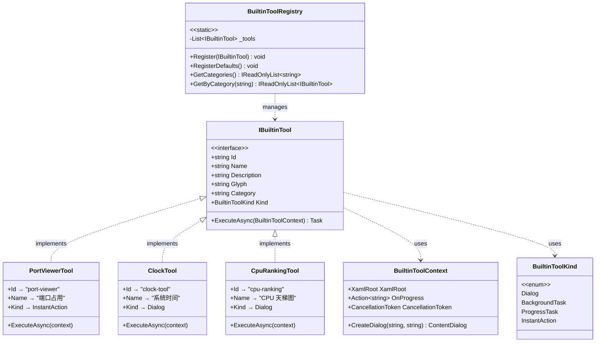

# 第37课：加一个内置工具

## 为什么这课重要

前面 36 课你学了很多东西：变量、循环、类、接口、XAML、数据绑定、导航。但如果只学不用，那些知识跟你硬盘里吃灰的电子书没什么区别。

这一课的目标很直接——在 TubaTools 里加一个你自己的内置工具。不是"理解原理"，是真的写代码、真的跑起来。等你走完这一遍，你对整个 WinUI 3 项目的结构、接口怎么用、注册机制怎么工作，会有一种"啊原来就是这回事"的感觉。

## 内置工具是什么

TubaTools 里的"内置工具"指的是直接写死在代码里的功能模块。每一个内置工具都是一个类，它实现了 `IBuiltinTool` 接口，然后把自己注册到 `BuiltinToolRegistry` 里。注册之后，首页的工具网格里就会出现它，用户点一下就能运行。

跟"外部工具"（通过 JSON 配置文件加载的 .exe）不同，内置工具完全用 C# 和 WinUI 3 API 编写，可以直接创建窗口、弹对话框、调用系统功能，灵活性高得多。

## IBuiltinTool 接口

一个内置工具必须实现 `IBuiltinTool`。这个接口定义在 `Services/IBuiltinTool.cs` 里，只有 7 个属性和 1 个方法：

```csharp
public interface IBuiltinTool
{
    string Id { get; }           // 唯一标识，比如 "cpu-ranking"
    string Name { get; }         // 显示名称，比如 "CPU 天梯图"
    string Description { get; }  // 描述文字
    string Glyph { get; }        // Segoe Fluent Icon 的 Unicode 码点
    string Category { get; }     // 分类，比如 "硬件信息"、"系统工具"
    BuiltinToolKind Kind { get; } // 工具类型
    Task ExecuteAsync(BuiltinToolContext context); // 执行入口
}
```

### Id —— 全局唯一的名字

`Id` 是工具的身份证号。TubaTools 用它来从注册表中查找工具、处理搜索高亮、避免重复注册。命名一般用小写加连字符，比如 `"port-viewer"`、`"junk-cleaner"`。如果你写 `"my-tool"` 而另一个人也写了 `"my-tool"`，后注册的那个会直接抛异常——`Register` 方法里做了重复检查。

### Name 和 Description

`Name` 会显示在工具卡片的大字标题位置。`Description` 是卡片上的小字说明。保持 `Name` 简短（一般 4-6 个字），`Description` 一句话说清楚这工具干什么。

### Glyph —— 图标码点

TubaTools 使用 Windows 内置的 Segoe Fluent Icons 字体来渲染工具图标。`Glyph` 存的是单个字符的 Unicode 码点，格式是 `"\uXXXX"`，比如 `"\uE774"` 是一个网络端口图标，`"\uEEA1"` 是一个芯片图标。

怎么知道该用哪个码点？打开 Windows 自带的"字符映射表"，字体选 "Segoe Fluent Icons"，随便挑一个，复制它的 Unicode 值就行。或者直接参考已有的工具用了什么码点，扒一个差不多的。

### Category —— 分类

`Category` 是一个字符串，用来把工具分组。首页的分类下拉框就是从所有已注册工具的 `Category` 里自动收集的。如果你写 `"网络工具"`，而项目里已经有其他网络工具，它们会自动归到一起。如果你想新建一个分类，直接写个新的字符串就行，比如 `"我的工具"`，下拉框里会自动出现这个分类。

### Kind —— 工具类型

`BuiltinToolKind` 是一个枚举，有 4 个值：

| 值 | 含义 |
|---|---|
| `Dialog` | 打开一个弹窗（ContentDialog），工具的功能在弹窗里完成 |
| `BackgroundTask` | 在后台执行，不阻塞界面，执行完显示结果 |
| `ProgressTask` | 有进度反馈的长任务，比如 JunkCleaner 的扫描 |
| `InstantAction` | 立刻执行一个动作，不打开复杂 UI，比如 PortViewer 直接弹个窗口 |

`Kind` 决定了工具卡片上显示的标签（"弹窗"、"后台任务"、"进度任务"、"即时操作"），也暗示了 `ExecuteAsync` 里的大致写法。但实际上它就是个标签——具体怎么执行完全由你的代码决定。JunkCleaner 标记为 `ProgressTask`，但代码里照样走了弹窗路线。

### ExecuteAsync 和 BuiltinToolContext

这是核心。当用户点击工具卡片的"运行"按钮，框架会构建一个 `BuiltinToolContext`，然后调用 `ExecuteAsync`。返回值是 `Task`，所以你可以用 `async/await`。

`BuiltinToolContext` 给了你三个东西：

- `XamlRoot`：UI 元素的根，创建弹窗和对话框必须传这个，不然会崩
- `OnProgress`：一个回调，传一条消息给主界面的状态栏
- `CancellationToken`：取消令牌，用户切到别的工具时会被取消

典型的用法像这样——PortViewerTool 的完整实现：

```csharp
public sealed class PortViewerTool : IBuiltinTool
{
    public string Id => "port-viewer";
    public string Name => "端口占用";
    public string Description => "查看系统所有 TCP/UDP 端口占用情况，定位占用进程。";
    public string Glyph => "\uE774";
    public string Category => "网络工具";
    public BuiltinToolKind Kind => BuiltinToolKind.InstantAction;

    public Task ExecuteAsync(BuiltinToolContext context)
    {
        context.OnProgress?.Invoke("正在打开端口占用...");

        App.MainWindow?.DispatcherQueue.TryEnqueue(() =>
        {
            var window = new TubaWinUi3.Pages.PortViewerWindow();
            window.Activate();
        });

        return Task.CompletedTask;
    }
}
```

注意 PortViewer 用 `InstantAction`，逻辑非常短：发一条进度消息，然后调度到 UI 线程创建一个新窗口。不涉及 `await`，所以直接返回 `Task.CompletedTask`。

再看一个用了 `await` 的例子——JunkCleanerTool 简化后的核心部分：

```csharp
public async Task ExecuteAsync(BuiltinToolContext context)
{
    var dialog = context.CreateDialog("垃圾清理");
    dialog.Content = BuildDialogContent();
    await dialog.ShowAsync();
}
```

它用 `context.CreateDialog` 创建了一个 `ContentDialog`，这个方法会自动帮你把 `XamlRoot` 和当前主题设置好，不需要每次手动写。然后 `await dialog.ShowAsync()` 阻塞直到用户关闭弹窗。

## BuiltinToolRegistry —— 注册机制

光写好一个类还不够，必须把它注册到 `BuiltinToolRegistry`。这个类定义在 `Services/BuiltinToolRegistry.cs`，是一个静态类：

```csharp
public static class BuiltinToolRegistry
{
    private static readonly List<IBuiltinTool> _tools = [];

    public static IReadOnlyList<IBuiltinTool> Tools => _tools;

    public static void Register(IBuiltinTool tool)
    {
        if (_tools.Any(t => t.Id == tool.Id))
            throw new InvalidOperationException($"内置工具 '{tool.Id}' 已注册。");
        _tools.Add(tool);
    }

    public static void RegisterDefaults()
    {
        Register(new CertBlockTool());
        Register(new PortViewerTool());
        Register(new HostsEditorTool());
        Register(new KeyboardTestTool());
        Register(new JunkCleanerTool());
        // ... 其他工具
    }
}
```

`RegisterDefaults` 在应用启动时被调用一次（在 `App.xaml.cs` 里），把所有内置工具一次性注册进去。`Register` 方法会检查 `Id` 冲突，冲突了就抛异常——这是一个很常见的防御性写法。

如果你要加自己的工具，需要做两件事：
1. 在 `RegisterDefaults` 里加一行 `Register(new MyNewTool());`
2. 确保 `MyNewTool` 类实现了 `IBuiltinTool`

## 工具的 UI 是怎么连起来的

注册完工具之后，剩下的都是自动的。`BuiltinToolsPage` 的 `LoadTools` 方法从 `BuiltinToolRegistry.Tools` 读取所有工具，转成 `BuiltinToolViewModel`，绑定到 `GridView`。用户点击后，`ExecuteToolAsync` 构建 `BuiltinToolContext` 并调用 `ExecuteAsync`。

下面是这个调用链的 Mermaid 流程图：

```mermaid
sequenceDiagram
    participant User as 用户
    participant Page as BuiltinToolsPage
    participant VM as BuiltinToolViewModel
    participant Tool as MyTool (IBuiltinTool)
    participant Registry as BuiltinToolRegistry

    Registry->>Registry: RegisterDefaults() 在启动时调用
    Registry->>Registry: Register(new MyTool())
    User->>Page: 打开内置工具页面
    Page->>Registry: Tools (读取全部工具列表)
    Registry-->>Page: IReadOnlyList&lt;IBuiltinTool&gt;
    Page->>VM: new BuiltinToolViewModel(tool)
    Page->>Page: 绑定到 GridView
    User->>Page: 点击工具卡片
    Page->>Page: ExecuteToolAsync(vm)
    Page->>Tool: ExecuteAsync(context)
    Tool-->>Page: Task
    Page->>Page: 显示结果 / 打开窗口
```

## 一步步实操：加一个"系统时间"工具

下面带你走一遍完整流程。我们加一个最简工具：点击后在弹窗里显示当前系统时间。

### 第一步：创建类文件

在 `Services/BuiltinTools/` 下面新建 `ClockTool.cs`：

```csharp
using Microsoft.UI.Xaml.Controls;

namespace TubaWinUi3.Services;

public sealed class ClockTool : IBuiltinTool
{
    public string Id => "clock-tool";
    public string Name => "系统时间";
    public string Description => "显示当前系统日期和时间。";
    public string Glyph => "\uE823";  // 时钟图标
    public string Category => "系统工具";
    public BuiltinToolKind Kind => BuiltinToolKind.Dialog;

    public async Task ExecuteAsync(BuiltinToolContext context)
    {
        var dialog = context.CreateDialog("系统时间", "关闭");

        var now = DateTime.Now;
        var timeText = $"当前时间：{now:yyyy-MM-dd HH:mm:ss}";

        dialog.Content = new TextBlock
        {
            Text = timeText,
            FontSize = 18,
            Margin = new Microsoft.UI.Xaml.Thickness(0, 10, 0, 0)
        };

        await dialog.ShowAsync();
    }
}
```

### 第二步：注册

打开 `Services/BuiltinToolRegistry.cs`，在 `RegisterDefaults` 方法里加一行：

```csharp
Register(new ClockTool());
```

位置无所谓，放在其他 `Register` 调用的中间或末尾都行。

### 第三步：编译运行

F5 运行项目，打开"内置工具"页面，翻到"系统工具"分类，你应该能看到一个叫"系统时间"的卡片，图标是时钟。点"运行"，弹出一个对话框显示当前日期时间。

就三步。没有配置文件，没有 JSON，没有额外的注册表操作。这就是接口+注册模式的威力——框架只管"有什么工具"，不管"工具怎么实现"。你写了一个新类，注册一下，UI 自动识别。

## 深入一点：不同 Kind 的写法差别

上面 ClockTool 用了 `Dialog`，最简单的模式。如果你想写其他类型，区别主要在 `ExecuteAsync` 的写法上。

### BackgroundTask 模式

BackgroundTask 适合不需要 UI 交互的后台操作。比如一个"清理临时文件夹"的工具：

```csharp
public async Task ExecuteAsync(BuiltinToolContext context)
{
    context.OnProgress?.Invoke("正在清理临时文件...");

    await Task.Run(() =>
    {
        var tempPath = Path.GetTempPath();
        foreach (var file in Directory.GetFiles(tempPath))
        {
            try { File.Delete(file); }
            catch { /* 跳过被占用的文件 */ }
        }
    }, context.CancellationToken);

    context.OnProgress?.Invoke("清理完成");
}
```

这里用到了 `context.CancellationToken`，如果用户在清理过程中点了别的工具，`CancellationToken` 会被触发，`Task.Run` 内部的循环会收到取消信号。

### ProgressTask 模式

ProgressTask 和 BackgroundTask 的区别在于前者需要向用户展示进度。JunkCleaner 就是典型的 ProgressTask——它实际上也创建了 UI（一个 ContentDialog），但在卡片上标的是 ProgressTask 而不是 Dialog。这说明 `Kind` 只是一个语义标签，决定了卡片上显示什么文字，不限制你用什么方式实现。

如果你想做一个有进度条的下载工具，可以这样：

```csharp
public async Task ExecuteAsync(BuiltinToolContext context)
{
    var dialog = context.CreateDialog("下载文件");
    var progressBar = new ProgressBar { Minimum = 0, Maximum = 100 };
    dialog.Content = progressBar;
    dialog.ShowAsync(); // 不 await，让弹窗立即显示

    for (int i = 0; i <= 100; i += 10)
    {
        context.CancellationToken.ThrowIfCancellationRequested();
        progressBar.Value = i;
        context.OnProgress?.Invoke($"下载中... {i}%");
        await Task.Delay(500, context.CancellationToken);
    }

    dialog.Hide();
}
```

## 常见坑

### 1. 忘了传 XamlRoot

如果你手动 `new ContentDialog()` 而不传 `XamlRoot`，运行时会抛出 `System.ArgumentException`。用 `context.CreateDialog()` 可以避免这个问题——它内部帮你设置好了。

### 2. UI 线程问题

WinUI 3 的 UI 元素只能在 UI 线程上操作。如果你在 `Task.Run` 里面尝试修改 TextBlock 的 Text，会抛异常。解决方式是用 `DispatcherQueue.TryEnqueue`：

```csharp
App.MainWindow?.DispatcherQueue.TryEnqueue(() =>
{
    myTextBlock.Text = "更新后的内容";
});
```

PortViewerTool 的 `ExecuteAsync` 里就有这个用法——创建窗口必须在 UI 线程上，所以用 `TryEnqueue` 调度到主线程。

### 3. CancellationToken 没检查

如果你的工具做耗时操作（扫描文件、网络请求、循环计算），记得时不时检查一下 `context.CancellationToken.ThrowIfCancellationRequested()`。这不是强制要求，但不检查的话用户切到别的工具后你的代码还在后台跑，浪费资源。

### 4. Id 冲突

如果你抄了别人的 Id，程序启动时 `Register` 会直接抛异常，应用闪退。确保 Id 在整个项目里是唯一的。建议加一个自己的前缀，比如 `"myapp-clock"` 而不是 `"clock"`。

## Mermaid 类图

下面这张图展示了内置工具体系中各部分的静态关系：



图中的三种工具代表了三种不同的 `Kind`：PortViewer 是 InstantAction（不弹对话框，直接开新窗口），ClockTool 是我们新写的 Dialog（弹窗交互），CpuRankingTool 也是 Dialog 但创建的是一个完整的 `Window` 而非 `ContentDialog`——它开了一个独立的窗口来显示 CPU 排行榜页面。这说明即使是同一种 Kind，实现方式也可以差很多。

## 小结

给 TubaTools 加一个内置工具这件事，本质上就是：

1. 写一个类，实现 `IBuiltinTool` 的 7 个属性 + 1 个方法
2. 在 `BuiltinToolRegistry.RegisterDefaults` 里注册它
3. 运行，工具自动出现在 UI 里

整个过程不需要懂 XAML，不需要改任何 .xaml 文件，不需要配数据绑定——这些都是框架帮你做好的。你只需要关心你的工具要做什么，然后把它写进 `ExecuteAsync`。

这其实是一个非常好的设计。它把"工具怎么被发现和展示"（框架的事）和"工具具体干什么"（你的事）分开了。你写完一个工具类，只要实现了正确的接口，框架就能自动把它挂到 UI 上。这种模式在软件工程里叫"插件架构"——TubaTools 的内置工具体系就是它的一个微型实现。

---

## 小练习

### 练习 1：补全代码

下面的工具类缺少了几个属性的实现，请补全：

```csharp
public sealed class NotePadTool : IBuiltinTool
{
    public string Id => "notepad";
    public string Name => "快速记事";
    // 1. 请补全 Description（一句话描述这个工具）
    // 2. 请补全 Glyph（找一个合适的 Segoe Fluent Icon 码点）
    // 3. 请补全 Category（你觉得应该归到哪个分类？）
    public BuiltinToolKind Kind => BuiltinToolKind.Dialog;
}
```

### 练习 2：分析问题

有人写了下面这段代码，运行后点击工具，弹窗显示不出来，还报了一个异常。问题出在哪里？

```csharp
public async Task ExecuteAsync(BuiltinToolContext context)
{
    var dialog = new ContentDialog
    {
        Title = "测试",
        Content = new TextBlock { Text = "Hello" },
        CloseButtonText = "关闭"
    };
    await dialog.ShowAsync();
}
```

### 练习 3：设计题

假设你要给 TubaTools 加一个"文件夹大小统计"工具——用户选择一个文件夹，工具递归计算该文件夹的总大小并显示结果。

- 你会选择哪种 `BuiltinToolKind`？为什么？
- `ExecuteAsync` 里大概需要哪几步？
- 你觉得这个工具的 Id 叫什么合适？

---

<details>
<summary>练习答案（点击展开）</summary>

### 练习 1 参考答案

```csharp
public sealed class NotePadTool : IBuiltinTool
{
    public string Id => "notepad";
    public string Name => "快速记事";
    public string Description => "打开一个简易文本编辑器，快速记录文字内容。";
    public string Glyph => "\uE70F";  // 编辑/记事图标
    public string Category => "系统工具";  // 或者自建"办公工具"
    public BuiltinToolKind Kind => BuiltinToolKind.Dialog;
}
```

答案不唯一，Glyph 和 Category 都可以根据自己的判断选择。

### 练习 2 答案

问题是 `new ContentDialog()` 没有传 `XamlRoot`。在 WinUI 3 里，`ContentDialog` 必须知道它属于哪个 `XamlRoot` 才能正确弹出来。正确写法是使用 `context.CreateDialog("测试", "关闭")`，它会自动设置 `XamlRoot`。或者手动 `new ContentDialog { XamlRoot = context.XamlRoot, ... }`。

### 练习 3 参考思路

- `Kind` 选 `ProgressTask`，因为递归扫描大文件夹可能耗时较长，需要向用户展示进度。
- `ExecuteAsync` 大概步骤：
  1. 用 `FolderPicker` 让用户选文件夹（需要传 `XamlRoot` 或者用 `context.CreateDialog` 包一个 UI）
  2. 创建进度 UI（ProgressBar + TextBlock）
  3. 在 `Task.Run` 里递归遍历文件夹，每隔一定文件数更新进度
  4. 显示最终结果（总大小、文件数、文件夹数）
- Id 建议 `"folder-size"` 或 `"folder-size-scanner"`，小写加连字符，见名知意。
</details>
