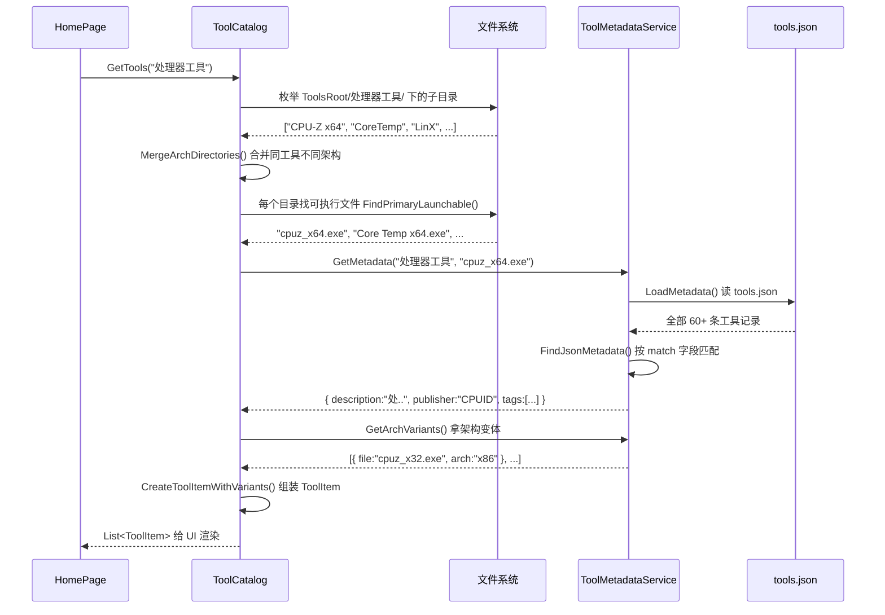

# 第 38 课：加外部工具与元数据

上一课讲了怎么给 TubaTools 加一个内置工具 -- 写在 C# 代码里的那种。这课换个方向：外部工具。内置工具靠编程实现功能，外部工具靠的是文件系统里实实在在的 .exe 文件。TubaTools 的大部分工具都是这种：CPU-Z、GPU-Z、AIDA64、CrystalDiskInfo 等等。

这课要把外部工具的加载机制搞清楚，然后亲手配一个工具出来。

## 外部工具和内置工具的区别

TubaTools 里两类工具并存：

| | 内置工具 | 外部工具 |
|---|---|---|
| 存在形式 | C# 类，实现 IBuiltinTool | 磁盘上的可执行文件（.exe/.bat 等） |
| 注册方式 | BuildinToolRegistry.Register() | 放在 ToolsRoot 下的分类文件夹里 |
| 功能实现 | 程序自己写的逻辑 | 第三方软件提供的功能 |
| 元数据来源 | 类的属性（Name, Description 等） | tools.json 文件 + .exe 版本信息 |
| 启动方式 | ExecuteAsync() 方法 | Process.Start() 启动外部进程 |
| 例子 | 端口查看器、DNS优选、键盘测试 | CPU-Z, GPU-Z, FurMark, HWiNFO |

你可以把 TubaTools 理解为一个管家：内置工具是管家亲自干的事，外部工具是管家帮你找出来的东西，替你打开。管家的本事在于他知道东西都在哪、每个东西是干什么的、有没有 64 位版本可以用。

## 工具箱的目录结构

TubaTools 启动时会找一个叫 "ToolsRoot" 的目录。这个目录的结构长这样：

```
ToolsRoot/
├── 处理器工具/         ← 一个"分类"，就是左侧导航看到的那些
│   ├── CPU-Z x64/       ← 一个工具目录（夹里放可执行文件）
│   │   ├── cpuz_x64.exe
│   │   ├── cpuz.ini
│   │   └── readme.txt
│   ├── CPU-Z x86/       ← 同名工具的不同架构版本
│   │   └── cpuz_x32.exe
│   ├── CoreTemp/
│   │   ├── Core Temp x86.exe
│   │   └── Core Temp x64.exe
│   └── ...
├── 显卡工具/
│   ├── GPU-Z/
│   │   └── GPU-Z.exe
│   ├── FurMark/
│   │   └── FurMark.exe
│   └── ...
├── 硬盘工具/
│   └── ...
├── 内存工具/
├── 综合检测/
└── ...
```

关键规则：

1. **一级目录是分类名**，TubaTools 会把它们读成左侧导航栏的选项
2. **二级目录是工具目录**，每个二级目录代表一个独立的工具
3. **工具目录里放可执行文件**，可以是 .exe、.bat、.cmd、.lnk、.msc 等

ToolCatalog 干的事情就是把这个目录结构扫出来，给每个工具建一个 ToolItem 对象，然后 UI 拿到这些对象去展示。

## 纯文件扫描能拿到什么信息

如果只用目录里的文件，ToolCatalog 能自动拿到这些信息：

- **工具名称**：取可执行文件的文件名（去掉扩展名、去掉架构后缀）
- **分类**：一级目录名
- **扩展名**：比如 EXE、BAT
- **架构版本**：如果能从文件名里认出 x86/x64/ARM64 后缀
- **图标**：从 .exe 文件里提取

但你看看 CPU-Z 在 TubaTools 里的实际展示 -- 它有描述文字、有标签（"CPU""硬件检测"）、有发行商名称。纯文件扫描拿不到这些。文件名 "cpuz_x64.exe" 里没有 "由 CPUID 开发" 这种信息。

这些**富文本元数据**的来源就是 Metadata/tools.json。

## tools.json：工具的身份证信息库

这个文件长什么样，直接看一段真货：

```json
{
  "tools": [
    {
      "match": "CPU-Z",
      "description": "处理器、主板、内存和显卡基础信息查看工具。",
      "publisher": "CPUID",
      "tags": [ "CPU", "主板", "硬件检测" ],
      "archVariants": [
        { "file": "cpuz_x32.exe", "arch": "x86" },
        { "file": "cpuz_x64.exe", "arch": "x64" },
        { "file": "cpuz_arm64.exe", "arch": "ARM64" }
      ]
    },
    {
      "match": "HWiNFO",
      "description": "专业硬件信息读取、传感器监控和日志记录工具。",
      "publisher": "REALiX",
      "tags": [ "综合检测", "传感器" ],
      "archVariants": [
        { "file": "HWiNFO32.exe", "arch": "x86" },
        { "file": "HWiNFO64.exe", "arch": "x64" },
        { "file": "HWiNFO_ARM64.exe", "arch": "ARM64" }
      ]
    }
  ]
}
```

每个工具条目（也就是 tools 数组里的一项）有几个重要字段：

### match -- 匹配名

这是整个 JSON 里最重要的字段。它不是工具的文件名，而是一个**匹配关键词**。ToolMetadataService 拿这个关键词去和文件系统里扫描到的工具做模糊匹配。

匹配规则（去看 ToolMetadataService.cs 的 `FindJsonMetadata` 方法）是这样的：

```csharp
// 第 120-132 行，简化后：
var metadata = LoadMetadata();
var fileName = Path.GetFileNameWithoutExtension(toolPath);  // 比如 "cpuz_x64"
var dirName = Path.GetFileName(Path.GetDirectoryName(toolPath));  // 比如 "CPU-Z x64"

return metadata
    .Where(item =>
        fileName.Contains(item.Match, ...) ||    // "cpuz_x64" 包含 "CPU-Z"? 不...
        relativePath.Contains(item.Match, ...) || // 全路径里可能包含
        MatchesFlexible(dirName, item.Match))     // 灵活匹配，去掉空格和连接符后再比
    .OrderByDescending(item => item.Match!.Length)  // match 越长的优先级越高
    .FirstOrDefault();
```

`MatchesFlexible` 是关键 -- 它把源字符串和 match 里的空格、横杠、下划线都去掉再比较：

```csharp
private static bool MatchesFlexible(string? source, string match)
{
    var normalizedSource = source.Replace(" ", "").Replace("-", "").Replace("_", "");
    var normalizedMatch = match.Replace(" ", "").Replace("-", "").Replace("_", "");
    return normalizedSource.Contains(normalizedMatch, ...);
}
```

所以 match 写 "CPU-Z" 时，"CPU-Z x64" -> "CPUZx64" 包含 "CPUZ" -- 匹配上了。"CrystalDiskInfo" 匹配 "CrystalDiskInfo x64" -- 也匹配上了。

### description -- 描述文字

给工具写一行说明，会显示在工具卡片上。TubaTools 还有后备方案：如果 tools.json 里没配描述，会去读 .exe 文件的版本信息里的 FileDescription 字段，再不行就读目录里 readme.txt 的第一行。

```csharp
// ToolMetadataService.cs 第 84-89 行：
var description = FirstUseful(
    jsonMetadata?.Description,           // JSON 优先
    versionInfo?.FileDescription,        // .exe 版本信息次之
    versionInfo?.ProductName,
    ReadFolderDescription(toolPath));    // 最后才读文本文件
```

有意思的设计：JSON > 文件信息 > 文本兜底。这样你就算不配 JSON，工具也能显示一些基本信息。

### publisher -- 发行商

谁出的这个工具。填 "CPUID"、"TechPowerUp"、"NirSoft" 这些。

### tags -- 标签

一个字符串数组，比如 `["CPU", "烤机", "稳定性测试"]`。这些标签有两个用途：
1. 在工具卡片上显示分类标签
2. 支持按标签搜索（ToolCatalog.Search 方法会匹配标签）

### archVariants -- 架构变体

同一个工具，可能有 32 位版、64 位版、ARM64 版。archVariants 数组告诉 TubaTools 有哪些变体、分别叫什么文件名、对应什么架构：

```json
"archVariants": [
    { "file": "cpuz_x32.exe", "arch": "x86" },
    { "file": "cpuz_x64.exe", "arch": "x64" },
    { "file": "cpuz_arm64.exe", "arch": "ARM64" }
]
```

TubaTools 启动时会自动选最合适的版本优先启动 -- ARM64 系统上用 ARM64 版，64 位系统上用 x64 版，32 位系统上用 x86 版。

也可以不用 file 而是用 dir，指向一个子目录：

```json
"archVariants": [
    { "dir": "Dism++x86", "arch": "x86" },
    { "dir": "Dism++x64", "arch": "x64" },
    { "dir": "Dism++ARM64", "arch": "ARM64" }
]
```

### downloadUrl / remoteUrl / wingetId -- 下载相关字段

TubaTools 支持"待下载"工具 -- 就是工具目录里还没有 .exe 文件，但 JSON 里配了下载地址。这种情况下工具卡片上显示的不是"打开"按钮，而是"下载"按钮。

```json
{
    "match": "y-cruncher",
    "description": "y-cruncher 圆周率计算烤机工具...",
    "launchTarget": "y-cruncher.exe",
    "remoteUrl": "https://cdn.numberworld.org/y-cruncher-downloads/y-cruncher%20v0.8.7.9547b.zip"
}
```

三个下载字段的区别：
- `downloadUrl`：GitHub release 地址（带 "gh:" 前缀的特殊格式）
- `remoteUrl`：普通 HTTP/HTTPS 下载链接
- `wingetId`：Windows Package Manager (winget) 的包 ID，可以用 winget 命令行安装

### launchTarget -- 指定启动文件

如果一个工具目录里有多个 .exe，TubaTools 默认会选"最像的"那个。但如果选错了，可以用 launchTarget 手动指定：

```json
{
    "match": "y-cruncher",
    "launchTarget": "y-cruncher.exe"
}
```

## 匹配流程全图

整个流程从 TubaTools 启动到用户看到工具列表，涉及三个核心类之间的协作：



中间有几个容易被忽略的设计细节：

1. **MergeArchDirectories**：如果文件系统里有 "CPU-Z x64" 和 "CPU-Z x86" 两个目录，它们代表同一个工具的不同架构版本，ToolCatalog 会把它们合并成一个逻辑工具，而不是当成两个独立的工具展示。合并逻辑是：去掉目录名里的架构后缀（x64、x86、ARM64 等），如果去后缀后名字相同，就合并。

2. **FindPrimaryLaunchable**：一个目录里可能有好几个可执行文件。主启动文件的选择逻辑相当复杂（ToolCatalog.cs 里这个函数有 60 行）：先看 JSON 里的 launchTarget，有的话直接用它；再看文件名和目录名是否匹配；再看架构首选；都不行就取第一个碰到的。

3. **架构自动检测**：即使 JSON 里没写 archVariants，ToolCatalog 也会自动扫描工具目录，从文件名里检测架构后缀。JSON 里的 archVariants 是**补充和修正**，不是唯一来源。

## 动手：加一个外部工具

假设你拿到了一个新工具 "VulkanMemTest"（显存测试工具，出版商是 Geeks3D），要把它加到 TubaTools 里。整个过程分两步：

### 第一步：把文件放对位置

在 ToolsRoot 下面创建目录：

```
ToolsRoot/
└── 显卡工具/
    └── VulkanMemTest/
        ├── VulkanMemTest.exe
        ├── VulkanMemTest_x64.exe       ← 如果有 64 位专用版
        └── readme.txt                   ← 说明文件（可选的）
```

工具目录名不一定和可执行文件名一致，但最好保持一致，这样 ToolCatalog 的自动匹配逻辑工作得最好。

### 第二步：在 tools.json 里加一条记录

打开 Metadata/tools.json，在 `"tools"` 数组里加一项：

```json
{
    "match": "VulkanMemTest",
    "description": "Vulkan 显存压力测试和稳定性验证工具，支持自定义测试大小和持续时间。",
    "publisher": "Geeks3D",
    "tags": [ "显卡", "显存测试", "稳定性测试" ],
    "archVariants": [
        { "file": "VulkanMemTest_x64.exe", "arch": "x64" }
    ]
}
```

注意几个要点：

- **match 值**要短而独特，保证能和目录名匹配上。写 "VulkanMemTest" 就能匹配目录名 "VulkanMemTest"（灵活匹配去掉空格横杠后在目录名里能找到）。
- **tags 数组**用已有分类体系里的词。TubaTools 的标签不是随便写的 -- 搜索功能依赖标签，标签体系要保持一致性。常见的标签有："CPU"、"显卡"、"内存"、"硬盘"、"烤机"、"稳定性测试"、"性能测试"、"硬件检测"、"温度监控"等等。
- **archVariants 的 file** 是相对于工具目录的路径，不用写全路径。"VulkanMemTest_x64.exe" 就够了。
- 如果只有一个可执行文件且不分架构，archVariants 可以不写 -- ToolCatalog 自己能从文件名里推断。

### JSON 陷阱：格式错误导致整个文件失效

tools.json 是用 `JsonSerializer.Deserialize` 直接解析的。如果 JSON 格式有错，哪怕是少了一个逗号、一个引号没闭合，整个文件就解析失败。ToolMetadataService 的做法是 -- 解析失败就返回空列表，不抛异常。这意味着所有工具的元数据都会静默丢失。

写完 JSON 之后最好用任意 JSON 校验工具过一遍。或者在项目里加个测试：读 tools.json，看返回的列表是不是空的。

特别容易出错的地方：
- **最后一个元素后面不能有逗号**（但在 JSON 数组里其实可以 -- 不过为了兼容性最好不加）
- **中文引号**：描述里不要混入中文弯引号（""），JSON 只认英文直引号（""）
- **Windows 路径里的反斜杠**：archVariants 的 file 如果带路径，要写 `"32-bit\\linpack_xeon32.exe"` 而不是 `"32-bit\linpack_xeon32.exe"`（后者会把 `\l` 解析成转义字符）

看一个真实例子 -- LinX 的配置：

```json
{
    "match": "LinX",
    "description": "基于 Intel LINPACK 的 CPU 稳定性测试工具，用于极限烤机和超频验证。",
    "publisher": "",
    "tags": [ "CPU", "烤机", "稳定性测试" ],
    "archVariants": [
        { "file": "32-bit\\\\linpack_xeon32.exe", "arch": "x86" },
        { "file": "64-bit\\\\linpack_xeon64.exe", "arch": "x64" }
    ]
}
```

注意 file 里的双反斜杠 -- JSON 里反斜杠需要转义，所以 Windows 路径分隔符在 JSON 里要写成 `\\`。

## 元数据的查找和匹配优先级

由于一条 JSON 记录要同时服务于一个工具的不同架构版本，match 的设计必须足够灵活。看 ToolMetadataService.FindJsonMetadata：

```csharp
return metadata
    .Where(item =>
        !string.IsNullOrWhiteSpace(item.Match) &&
        (fileName.Contains(item.Match, StringComparison.CurrentCultureIgnoreCase) ||
         relativePath.Contains(item.Match, StringComparison.CurrentCultureIgnoreCase) ||
         MatchesFlexible(dirName, item.Match)))
    .OrderByDescending(item => item.Match!.Length)
    .FirstOrDefault();
```

这里有三个匹配通道：

1. **fileName 包含**：可执行文件名（不含扩展名）是否包含 match。比如 cpuz_x64 不包含 "CPU-Z"（连字符不对），所以这个通道一般少命中。
2. **relativePath 包含**：全路径是否包含 match。
3. **MatchesFlexible**（最常用）：目录名去掉空格横杠后是否包含 match。

最后的 `OrderByDescending(item => item.Match!.Length)` 是防冲突的 -- 如果目录名能同时匹配两条 JSON 记录（不太常见但可能发生），选 match 更长的那个。match 越长说明越精确。

值得了解的场景：当目录名正好等于 match（或者包含 match 而没有多余字符），MatchesFlexible 直接命中。如果目录名是 "FurMark_win64"，match 是 "FurMark_win64" -- 首先试 fileName（可执行的 FurMark_GUI.exe 不包含），再试 relativePath（也许包含），最后 MatchesFlexible 去掉下划线比：目录变 "FurMarkwin64"，match 变 "FurMarkwin64" -- 命中。

## 工作流完整总结

加一个外部工具到 TubaTools 的完整步骤：

1. **准备工具文件**：把工具放在 ToolsRoot 的对应分类子目录下
2. **（可选）写说明文件**：在工具目录放一个 readme.txt，第一行会作为后备描述
3. **编辑 tools.json**：加一条 JSON 记录，至少写 match 和 description
4. **重启 TubaTools**（或触发缓存刷新）：新的工具出现在界面中
5. **验证**：检查工具卡片上的名称、描述、标签、架构选择是否正确

如果不写 tools.json，工具**仍然会出现**在界面上 -- ToolCatalog 只是拿不到描述和标签。所以你完全可以先把文件扔进去看看能不能被扫描到，然后再补 JSON。

## 这节课的练习

**练习 1（填空）**：

tools.json 里的 `match` 字段的作用是 _______。如果 match 写了 "HWiNFO"，目录名叫 "HWiNFO x64"，匹配机制中的 _______ 方法会去掉空格再比较，实现模糊匹配。

**练习 2（选择）**：

以下哪个不是 tools.json 里的字段？

A. match  
B. description  
C. publisher  
D. fileSize  

**练习 3（实操）**：

假设你要添加一个叫 "NVCleanstall" 的工具。它只有一个 64 位可执行文件 `NVCleanstall.exe`，放在 `ToolsRoot/显卡工具/NVCleanstall/` 下。出版商是 TechPowerUp。请写出对应的 tools.json 条目。

---

**练习答案**：

练习 1：进行模糊匹配把文件系统工具和 JSON 元数据关联起来；MatchesFlexible  
练习 2：D -- fileSize 不是 tools.json 的字段  
练习 3：

```json
{
    "match": "NVCleanstall",
    "description": "NVIDIA 驱动自定义安装工具，可选择安装组件并去除不必要的附加软件。",
    "publisher": "TechPowerUp",
    "tags": [ "显卡", "NVIDIA", "驱动安装" ]
}
```
