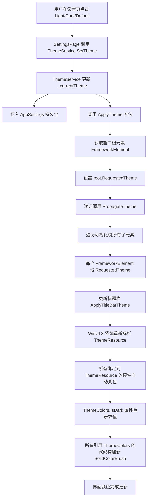

# 第 39 课：改界面样式

## 为什么学这个

TubaTools 有一个很实用的功能：点击设置里的"浅色 / 深色 / 跟随系统"三个选项，整个应用的外观会立刻改变。卡片底色从深灰变成浅白，文字从灰白变成深黑，边框线条一起跟着变。这不是简单的颜色反转，而是整套颜色体系的切换。

这背后有两层东西：**主题（Theme）**和**样式（Style）**。主题管"现在是白天模式还是黑夜模式"，样式管"卡片应该长什么样、搜索框应该多高、标签切换时背景怎么变"。两者搭配起来，构成了应用的外观系统。

学完这一课，你能改 TubaTools 的任何界面细节：换一个颜色、调一个间距、给按钮加个圆角、甚至从头写一套自己的颜色方案。

## 主题：Light 和 Dark 的切换

WinUI 3 内置了一套主题系统，每个控件（按钮、文本框、列表）都有一组"主题资源"（ThemeResource），比如 `CardBackgroundFillColorDefaultBrush` 是卡片的默认背景色，`TextFillColorPrimaryBrush` 是正文颜色。这些资源在浅色和深色模式下会自动取不同的值。

TubaTools 没有直接依赖系统主题，而是包了一层自己的 `ThemeService`。原因很简单：用户可能想要"强制深色"——即使 Windows 系统现在是浅色模式，用户也想让 TubaTools 保持深色。WinUI 3 的默认行为是跟随系统，所以需要自己接管。

```csharp
// ThemeService.cs — 三个主题模式
public enum AppTheme
{
    Default,  // 跟随系统
    Light,    // 强制浅色
    Dark      // 强制深色
}
```

切换主题的核心逻辑在 `ApplyTheme` 方法里。它拿到窗口的根元素（`root`），把 `RequestedTheme` 设成对应的值，然后递归遍历整个可视化树，把每一个子元素的 `RequestedTheme` 也设上。递归是必须的，因为 WinUI 3 的某些嵌套控件不会自动从父元素继承主题。

```csharp
// ThemeService.cs — 递归传播主题
private static void PropagateTheme(DependencyObject parent, ElementTheme theme)
{
    var count = VisualTreeHelper.GetChildrenCount(parent);
    for (int i = 0; i < count; i++)
    {
        var child = VisualTreeHelper.GetChild(parent, i);
        if (child is FrameworkElement fe)
            fe.RequestedTheme = theme;
        PropagateTheme(child, theme);
    }
}
```

主题切换需要持久化——用户关掉应用再打开，上次选的主题要还在。TubaTools 把主题设置存到 `AppSettings` 里，启动时读回来：

```csharp
// ThemeService.cs — 启动时恢复保存的主题
public static void ApplySavedTheme()
{
    var saved = AppSettings.Get("AppTheme");
    if (saved is not null && Enum.TryParse<AppTheme>(saved, out var theme))
        _currentTheme = theme;
    ApplyTheme(_currentTheme);
}
```

## 语义化颜色：ThemeColors 的设计

WinUI 3 自带的主题资源已经覆盖了大部分场景，但 TubaTools 还需要一些"自己的颜色"。比如电池分析页面里的图表卡片，需要一个比默认卡片更暗一点的背景，在深色模式下是 `(45,45,45)`，浅色模式下是 `(249,249,249)`。

如果每个页面都写 `if (dark) 深色 else 浅色`，代码会很快变成一大片条件判断。TubaTools 的做法是：把颜色提取成一个静态类 `ThemeColors`，每个颜色属性内部根据当前主题自动选值。页面代码只需要写 `ThemeColors.CardBg`，不用关心现在是深色还是浅色。

```csharp
// ThemeColors.cs — 语义化颜色，自动适配主题
public static Color CardBg => IsDark
    ? Color.FromArgb(255, 45, 45, 45)
    : Color.FromArgb(255, 249, 249, 249);

public static Color BorderColor => IsDark
    ? Color.FromArgb(255, 60, 60, 60)
    : Color.FromArgb(255, 229, 229, 229);

public static Color DimText => IsDark
    ? Color.FromArgb(255, 140, 140, 140)
    : Color.FromArgb(255, 110, 110, 110);

public static Color PrimaryText => IsDark
    ? Color.FromArgb(255, 210, 210, 210)
    : Color.FromArgb(255, 30, 30, 30);
```

注意这些属性是怎么命名的：`CardBg`（卡片背景）、`BorderColor`（边框颜色）、`DimText`（次要文字）、`PrimaryText`（主要文字）。每个名字描述的是**用途**而不是颜色本身。没有人叫它 "DarkGray45"，因为哪天浅色模式下的值改成别的了，名字就骗人了。这种叫作"语义化命名"，是写界面代码的好习惯。

除了主题自适应颜色，`ThemeColors` 还定义了一组"固定色"——不管深色浅色都不变的强调色：

```csharp
// ThemeColors.cs — 固定强调色
public static readonly Color AccentBlue   = Color.FromArgb(255, 96, 165, 250);
public static readonly Color AccentGreen  = Color.FromArgb(255, 74, 222, 128);
public static readonly Color AccentOrange = Color.FromArgb(255, 251, 191, 36);
public static readonly Color AccentRed    = Color.FromArgb(255, 248, 113, 113);
public static readonly Color AccentPurple = Color.FromArgb(255, 167, 139, 250);
```

这些颜色用在各种需要"高亮标记"的地方：CPU 跑分页面的图表柱状条、电池健康度指示器、工具卡片上的标签。

`IsDark` 的判断逻辑值得细看：优先检查用户手动设置的主题，如果是 `Default` 才回退到系统主题。

```csharp
// ThemeColors.cs — 当前是否深色模式的判断
private static bool IsDark
{
    get
    {
        var appTheme = ThemeService.CurrentTheme;
        if (appTheme == AppTheme.Dark) return true;
        if (appTheme == AppTheme.Light) return false;
        // Default：跟随系统
        return Application.Current.RequestedTheme == ApplicationTheme.Dark;
    }
}
```

## 在代码里使用 ThemeColors

TubaTools 里很多页面是用代码动态创建 UI 元素的（不是 XAML 声明式），比如电池分析页面（`BatteryAnalyzerPage.cs`）。创建一个卡片容器只需要几行：

```csharp
// BatteryAnalyzerPage.cs — 用 ThemeColors 创建卡片
var card = new Border
{
    Background = new SolidColorBrush(ThemeColors.CardBg),
    BorderBrush = new SolidColorBrush(ThemeColors.BorderColor),
    BorderThickness = new Thickness(1),
    CornerRadius = new CornerRadius(8),
    Padding = new Thickness(16)
};
```

对比一下，如果不使用 `ThemeColors`，同样的代码会变成：

```csharp
// 糟糕的写法：每个地方都要判断主题
var card = new Border();
if (当前是深色) {
    card.Background = new SolidColorBrush(Color.FromArgb(255,45,45,45));
    card.BorderBrush = new SolidColorBrush(Color.FromArgb(255,60,60,60));
} else {
    card.Background = new SolidColorBrush(Color.FromArgb(255,249,249,249));
    card.BorderBrush = new SolidColorBrush(Color.FromArgb(255,229,229,229));
}
```

后一种写法有三个问题：第一，颜色值散落在各处，想统一调整（比如把卡片背景从 45 改成 40）要改几十个文件。第二，每新增一个页面就多一套 `if/else`。第三，读代码的人每次都要脑子里翻译"45,45,45 是深色卡片背景"这个映射。`ThemeColors.CardBg` 让意图一目了然。

## XAML 中的 Style：控件的"衣服模板"

主题解决了"什么颜色"，样式解决了"控件长什么样"。在 XAML 里，`Style` 是一组属性值的集合，可以重复用在多个同类型控件上。TubaTools 的 `HomePage.xaml` 里定义了好几个自定义样式。

先看一个简单的：工具卡片的 GridViewItem 样式。

```xml
<!-- HomePage.xaml — ToolCardStyle -->
<Style x:Key="ToolCardStyle" TargetType="GridViewItem">
    <Setter Property="Margin" Value="0,0,12,12" />
    <Setter Property="HorizontalContentAlignment" Value="Stretch" />
    <Setter Property="VerticalContentAlignment" Value="Stretch" />
</Style>
```

`x:Key="ToolCardStyle"` 给样式起个名字，`TargetType="GridViewItem"` 声明这个样式只能用在 `GridViewItem` 上。三个 `Setter` 分别设了外边距和内容对齐方式。在页面里使用它：

```xml
<GridView ItemContainerStyle="{StaticResource ToolCardStyle}" ...>
```

比在每个 `GridViewItem` 上重复写 `Margin="0,0,12,12"` 干净得多。

再看一个更复杂的：标签切换按钮（`TagRadioButtonStyle`）。它不光设了几个简单属性，还替换了整个控件的模板（`ControlTemplate`）。

```xml
<!-- HomePage.xaml — TagRadioButtonStyle -->
<Style x:Key="TagRadioButtonStyle" TargetType="RadioButton">
    <Setter Property="Background" Value="{ThemeResource SubtleFillColorSecondaryBrush}" />
    <Setter Property="Foreground" Value="{ThemeResource TextFillColorPrimaryBrush}" />
    <Setter Property="BorderBrush" Value="{ThemeResource CardStrokeColorDefaultBrush}" />
    <Setter Property="BorderThickness" Value="1" />
    <Setter Property="Padding" Value="10,4" />
    <Setter Property="CornerRadius" Value="6" />
    <Setter Property="FontSize" Value="12" />
    <Setter Property="Template">
        <Setter.Value>
            <ControlTemplate TargetType="RadioButton">
                <Border x:Name="RootBorder"
                    Background="{TemplateBinding Background}"
                    BorderBrush="{TemplateBinding BorderBrush}"
                    ...>
                    <VisualStateManager.VisualStateGroups>
                        <VisualStateGroup x:Name="CheckStates">
                            <VisualState x:Name="Checked">
                                <VisualState.Setters>
                                    <Setter Target="RootBorder.Background"
                                        Value="{ThemeResource AccentFillColorDefaultBrush}" />
                                </VisualState.Setters>
                            </VisualState>
                        </VisualStateGroup>
                    </VisualStateManager.VisualStateGroups>
                    <ContentPresenter ... />
                </Border>
            </ControlTemplate>
        </Setter.Value>
    </Setter>
</Style>
```

这里有两个新东西：`TemplateBinding` 和 `VisualState`。

`TemplateBinding` 是控件模板里的"传声筒"——模板里的 `Background` 值不是写死的，而是从样式的 `Setter` 那里传进来的。用户在样式的 `Setter` 里写 `Background="..."`, 模板里通过 `{TemplateBinding Background}` 拿到它。

`VisualState` 管的是"状态变化时的外观"。RadioButton 有选中（Checked）和未选中（Unchecked）两种状态。TubaTools 的自定义模板在选中状态下把边框背景换成强调色（`AccentFillColorDefaultBrush`），这样用户一眼就能看出当前选中的是哪个标签。

## 自定义颜色方案的完整流程

假设你想给 TubaTools 换一套配色——把卡片背景从灰调改成蓝灰调。要做的事情分三步。

**第一步：在 ThemeColors.cs 里加新的颜色属性。**

```csharp
// 新加的偏蓝灰色调
public static Color CardBg => IsDark
    ? Color.FromArgb(255, 35, 40, 50)    // 深色：蓝灰
    : Color.FromArgb(255, 240, 245, 250); // 浅色：淡蓝白
```

只改这一个属性，所有用 `ThemeColors.CardBg` 的地方自动生效。不需要改任何页面代码。

**第二步（可选）：在 App.xaml 里加自定义主题资源。**

如果你想覆盖 WinUI 3 自带的主题资源（比如让所有按钮的强调色从蓝色变成紫色），可以在 `App.xaml` 的 `Application.Resources` 里加：

```xml
<Application.Resources>
    <ResourceDictionary>
        <ResourceDictionary.ThemeDictionaries>
            <ResourceDictionary x:Key="Dark">
                <SolidColorBrush x:Key="AccentFillColorDefaultBrush" Color="#A78BFA" />
            </ResourceDictionary>
            <ResourceDictionary x:Key="Light">
                <SolidColorBrush x:Key="AccentFillColorDefaultBrush" Color="#7C3AED" />
            </ResourceDictionary>
        </ResourceDictionary.ThemeDictionaries>
    </ResourceDictionary>
</Application.Resources>
```

`ThemeDictionaries` 让你为深色和浅色分别指定不同的值。整个应用里所有引用了 `{ThemeResource AccentFillColorDefaultBrush}` 的控件都会跟着变。

**第三步：在设置页面里加一个主题选项。**

如果 TubaTools 现在只有"深色/浅色/跟随系统"三个选项，你也可以加第四个，比如"深蓝主题"。这需要扩展 `AppTheme` 枚举，在 `ThemeService` 里加对应的处理逻辑，在设置页面加一个 RadioButton。我们在前面的课程里已经学过加设置选项的完整流程，这里不重复。

## Mermaid 流程图：主题切换的完整链路

下面这张图展示了从用户点击设置到界面颜色全部更新，中间经过的每一步：



注意第 L 步是 WinUI 3 自动做的——你不需要手动刷新每个控件。只要 `RequestedTheme` 从 `Light` 变成 `Dark`，所有 `{ThemeResource ...}` 绑定会自动重新取深色模式对应的值。

## 改样式时的常见坑

**坑一：改了 Style 的 Setter 但没效果。**

控件的属性存在一个"优先级链"：直接在控件上写的属性值 > Style Setter 的值 > 默认值。如果你在 XAML 里写了 `<Button Background="Red" Style="{StaticResource MyStyle}"/>`，那 `MyStyle` 里对 `Background` 的设置会被直接写在控件上的 `Red` 覆盖。解决方法：删掉控件上的内联属性，让 Style 全权控制。

**坑二：ThemeResource 在代码里拿不到。**

`ThemeResource` 是 XAML 层面的机制。在 C# 代码里，你不能直接写 `{ThemeResource ...}`。需要用 `Application.Current.Resources["KeyName"]` 来取，或者用 `ThemeColors` 这种封装好的静态类——这也是 TubaTools 创建 `ThemeColors` 的原因之一。

**坑三：自定义颜色在主题切换时不自动更新。**

`ThemeColors.CardBg` 是一个计算属性（`=>`），每次读取时重新判断 `IsDark` 并返回对应的 `Color`。但如果你的页面在初始化时创建了一个 `SolidColorBrush`，然后把它缓存起来了——那个 Brush 的颜色就永远不会变了。比如：

```csharp
// 错误：缓存的 Brush 不会随主题变化
private static readonly SolidColorBrush CardBrush = new(ThemeColors.CardBg);
```

这种情况需要手动监听主题切换事件，在回调里更新所有的 Brush。TubaTools 目前的页面大多选择"每次用到时重新创建 Brush"，避免缓存带来的过期问题。

## TubaTools 源码中的实际应用

打开 `BatteryAnalyzerPage.cs`，你能看到 `ThemeColors` 被用了几十次。下面摘取一段构建图表面板的代码：

```csharp
// BatteryAnalyzerPage.cs — 用 ThemeColors 构建整个图表面板
var chartContainer = new Border
{
    Background = new SolidColorBrush(ThemeColors.CardBg),
    BorderBrush = new SolidColorBrush(ThemeColors.BorderColor),
    BorderThickness = new Thickness(1),
    CornerRadius = new CornerRadius(8),
    Padding = new Thickness(16)
};

var titleBlock = new TextBlock
{
    Text = "电池使用趋势",
    FontSize = 16,
    FontWeight = FontWeights.SemiBold,
    Foreground = new SolidColorBrush(ThemeColors.PrimaryText)
};

var subtitleBlock = new TextBlock
{
    Text = "最近 24 小时",
    FontSize = 12,
    Foreground = new SolidColorBrush(ThemeColors.DimText),
    Margin = new Thickness(0, 4, 0, 12)
};
```

这段代码里的 `CardBg`、`BorderColor`、`PrimaryText`、`DimText` 全都来自 `ThemeColors`。如果用户从浅色切成深色，`IsDark` 返回 `true`，这些颜色属性全部自动切换——卡片变深灰、文字变亮灰，不需要在 `BatteryAnalyzerPage` 里写一行 `if`。

`CpuRankingPage.cs` 里也用到了强调色来给性能柱状图着色：

```csharp
// CpuRankingPage.cs — 强调色用于图表
var accentColor = ThemeColors.AccentBlue;
// ... 后面把 accentColor 用在新创建的 Rectangle 上
```

`HomePage.xaml` 里则展示了如何在 XAML 一侧使用 WinUI 3 自带的主题资源：

```xml
<!-- HomePage.xaml — 工具卡片的数据模板 -->
<Border
    Padding="16"
    MinHeight="220"
    Background="{ThemeResource CardBackgroundFillColorDefaultBrush}"
    BorderBrush="{ThemeResource CardStrokeColorDefaultBrush}"
    BorderThickness="1"
    CornerRadius="8">
    <!-- 卡片内容 -->
</Border>
```

`CardBackgroundFillColorDefaultBrush` 和 `CardStrokeColorDefaultBrush` 是 WinUI 3 内置的主题资源，深色和浅色模式下自动取不同的颜色。和 `ThemeColors.CardBg` 的区别在于：前者是微软定义的、所有 WinUI 3 应用共享的颜色规范；后者是 TubaTools 自己定义的、只在项目内部使用的颜色。两种各有用处——内置的保证和系统风格一致，自定义的提供更精细的控制。

## 小练习

**练习 1（填空）**：在 `ThemeColors.cs` 中，`IsDark` 属性的判断逻辑是：先检查 `ThemeService.CurrentTheme`，如果用户手动选了 ____ 则返回 `true`，选了 ____ 则返回 `false`，如果是 ____ 则回退到系统主题判断。

**练习 2（选择）**：以下哪个不是 TubaTools 用 `ThemeColors` 而不是直接在代码里写 `if (dark)` 的原因？

A. 颜色值集中管理，改一处全应用生效  
B. 代码可读性更好，`CardBg` 比 `Color.FromArgb(...)` 意思更清楚  
C. C# 不支持 `if` 语句  
D. 避免每个页面重复写相同的颜色判断逻辑

**练习 3（实操）**：打开 `E:\Git\AClaudeDC\tubatools-master\Services\ThemeColors.cs`，找到 `CardBg` 属性，把深色模式下的值从 `(255, 45, 45, 45)` 改成 `(255, 30, 30, 40)`，然后编译运行 TubaTools，观察卡片背景的变化。再把值改回来。

**练习 4（简答）**：在 XAML 的 `Style` 里，`{TemplateBinding Background}` 的作用是什么？如果去掉这个 TemplateBinding，把 `Background` 的值直接写死在 ControlTemplate 里，会有什么后果？

**练习 5（设计）**：假设你要给 TubaTools 加一个"护眼绿"主题——所有卡片的背景在深色模式下变成深绿（`30, 50, 40`），浅色模式下变成淡绿（`235, 250, 240`）。你需要改哪些文件？列出步骤。

---

## 练习答案

**练习 1 答案**：`Dark`、`Light`、`Default`

**练习 2 答案**：C。C# 完全支持 `if` 语句，不用 `ThemeColors` 纯属代码组织问题，不是语言限制。

**练习 3 答案**：编译运行后，深色模式下的卡片背景会从 `#2D2D2D` 变成 `#1E1E28`（偏蓝灰），所有使用了 `ThemeColors.CardBg` 的页面都会变化。

**练习 4 答案**：`{TemplateBinding Background}` 让控件模板里的 `Background` 值和样式 `Setter` 里定义的值保持同步。如果写死，那么不管 Style Setter 里怎么设 `Background`，模板里的背景色都不变，样式就失效了——用户只能得到一个固定颜色，没法通过改样式来换色。

**练习 5 答案**：
1. 在 `AppTheme` 枚举里加一个新值（或者直接在现有 `Dark`/`Light` 里改颜色值，如果不需要独立主题选项的话）
2. 修改 `ThemeColors.cs` 中的 `CardBg`、`HeaderBg`、`SubtleBg` 等背景色属性，深色模式和浅色模式分别用绿色系的值
3. 如果想加独立选项，在 `SettingsPage.xaml` 里加一个 "护眼绿" 的 RadioButton，在 `SettingsPage.xaml.cs` 里处理点击事件，调用 `ThemeService.SetTheme`
4. 如果需要持久化，在 `AppSettings` 里存 "Green" 之类的键值
5. 编译运行，测试深色 + 护眼绿、浅色 + 护眼绿两种组合下的显示效果
