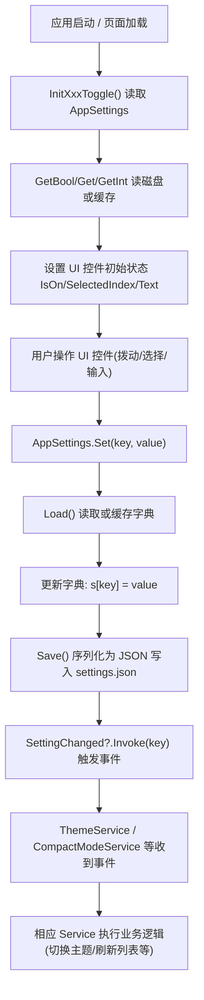

# 第 40 课：改设置选项

## 为什么学这个

前面三课你给 TubaTools 加了内置工具、外部工具、改了界面样式。这些加进去的功能基本是"一次性"的——代码写进去，行为就定死了。但一个正经的应用需要让用户自己做选择：开不开品牌 Logo、用浅色还是深色、要不要水印。这些选择不能写在代码里，得存起来，关掉应用下次打开还能记住。

TubaTools 设置页面里那些开关，背后牵涉三样东西：**存储**（数据写到哪里）、**读取**（启动时怎么读到上次的值）、**UI 联动**（用户拨动开关后界面怎么变）。这三样各自是一块独立的代码，互相配合但互不耦合。学完这一课，你可以在 TubaTools 里加任意一种新的设置项——ToggleSwitch 也好、ComboBox 也好、TextBox 也好——从写磁盘到显示到 UI，整条链路自己打通。

## 数据存储：AppSettings 是干什么的

TubaTools 所有设置都通过一个叫做 `AppSettings` 的静态类来读写。翻开源码你会发现它只有 101 行，结构直白：内部维护一个 `Dictionary<string, string>`，所有设置项都是 "键 -> 值" 的字符串对。保存时整个字典序列化成 JSON 写到一个叫 `settings.json` 的文件里，读回来时反序列化还原。

为什么要包一层字典？因为不同设置项类型不一样：有 bool（开关）、有 int（滑条数值）、有 string（水印文字）。如果每种类型各建一个文件，管理起来麻烦。用字典一行 `Set("key", "value")` 全搞定，类型通过便利方法区分：

```csharp
// AppSettings.cs — 核心接口
public static void Set(string key, string value)   // 原始写入
public static void Set(string key, bool value)   // bool 转 "true"/"false"
public static void Set(string key, int value)    // int 转 "42"
public static void Set(string key, double value) // double 转 "3.14"

public static string? Get(string key)            // 原始读取
public static bool GetBool(string key, bool defaultValue = false)
public static int GetInt(string key, int defaultValue = 0)
public static double GetDouble(string key, double defaultValue = 0)
```

注意 `Set` 方法里有一行 `Save()`。TubaTools 的做法是"即时持久化"——`Set` 一调用，立刻写磁盘。好处是哪怕应用崩溃，设置不会丢；缺点是如果连续调 10 次 Set，会写 10 次磁盘。`Save()` 内部通过一个 `_dirty` 标记来避免无变化的重复写入，但不会合并短时间内的多次写入。

```csharp
// AppSettings.cs — 即时持久化
public static void Set(string key, string value)
{
    var s = Load();
    s[key] = value;
    _dirty = true;
    Save();
    SettingChanged?.Invoke(key);  // 通知监听者：这个 key 变了
}
```

最后一行 `SettingChanged?.Invoke(key)` 很关键。它是 C# 的事件机制：一个地方改了设置，其他地方的代码可以收到通知。比如 `ThemeService` 监听了 SettingChanged 事件，一旦察觉到 `"AppTheme"` 这个 key 被修改了，立刻切换整个应用的主题。没有这个事件机制，设置改了界面不动，用户就会觉得"点了没用"。

## 数据存在哪里：ConfigManager

`AppSettings.Load()` 里第一行调了 `ConfigManager.GetSettingsPath()`。这个 `ConfigManager` 管的是"数据目录放在哪"的问题。TubaTools 支持两种位置：

- **AppData**：`C:\Users\你的用户名\AppData\Local\TubaWinUi3\settings.json`（默认，每个用户一份）
- **AppRoot**：应用 exe 旁边的 `Data\settings.json`（便携模式，可以带着走）

```csharp
// ConfigManager.cs — 两种数据存储位置
private static readonly string AppDataDir = Path.Combine(
    Environment.GetFolderPath(Environment.SpecialFolder.LocalApplicationData),
    "TubaWinUi3");

private static readonly string AppRootDir = Path.Combine(
    ToolCatalog.AppDirectory, "Data");

public static string GetSettingsPath() => Path.Combine(GetDataDir(), "settings.json");
```

用户可以通过 ConfigManagerDialog 在这两种模式之间切换，还能导出/导入整个设置包（一个包含 settings.json、favorites.json 等文件的 zip 压缩包）。切换模式时，`MigrateData` 方法会把旧位置的 json 文件逐一拷贝到新位置，然后删除旧目录，做到"无感搬迁"。

## UI 层：SettingsPage 是怎么把开关和存储连起来的

打开设置页面，你会看到一列卡片：应用主题、简洁列表模式、品牌 Logo、快速模式、截图水印……每个卡片都是一个 `Border`，里面包着 `Grid`，左边是图标和描述文字，右边是 `ToggleSwitch` 或 `ComboBox`。

拿"简洁列表模式"这个开关举例。XAML 里定义了 `ToggleSwitch`，`x:Name="CompactModeToggle"`，`Toggled` 事件连到 `CompactModeToggle_Toggled`：

```xml
<!-- SettingsPage.xaml 片段 — 简洁列表模式开关 -->
<ToggleSwitch
    x:Name="CompactModeToggle"
    Grid.Column="2"
    VerticalAlignment="Center"
    Toggled="CompactModeToggle_Toggled" />
```

C# 后端的逻辑分两步：初始化（读存储，设开关初始位置），和事件响应（用户拨了开关，写存储）：

```csharp
// SettingsPage.xaml.cs — 初始化开关位置
private void InitCompactModeToggle()
{
    _compactModeInitializing = true;
    CompactModeToggle.IsOn = CompactModeService.IsCompactModeEnabled();
    _compactModeInitializing = false;
}

// SettingsPage.xaml.cs — 用户拨动开关时
private void CompactModeToggle_Toggled(object sender, RoutedEventArgs e)
{
    if (_compactModeInitializing) return;
    CompactModeService.SetCompactModeEnabled(CompactModeToggle.IsOn);
}
```

注意 `_compactModeInitializing` 这个标记。初始化时会设置 ToggleSwitch 的 `IsOn` 属性，这实际上会触发 `Toggled` 事件——相当于"假装用户拨了一下"。如果不加标记，`Toggled` 处理函数就会在初始化阶段错误地把设置改成默认值，覆盖掉用户之前的选择。这个标记就是防止"初始化时的 Toggled 事件被当真"。

## 完整链路：一个新设置从磁盘到 UI 的来回

上面的 CompactMode 只是一个例子。TubaTools 里每个设置项走的都是一样的六步链路。下面用 Mermaid 画出来：



六步拆开看：

1. 页面构造函数里调 `InitXxxToggle()`，从磁盘把设置值读出来，填到控件上
2. 用户拨动开关 / 选择下拉项 / 输入文字
3. 事件处理函数拿到新的值，调 `AppSettings.Set(key, value)`
4. `Set` 内部调用 `Save()`，立刻把变更写入 `settings.json`
5. `Save` 之后触发 `SettingChanged` 事件
6. 所有关心这个 key 的 Service 收到事件，执行对应的业务逻辑

## 两种实现模式：有 Service 和没有 Service

观察 TubaTools 的源码，设置项其实分为两类：

**一类有专门的 Service 包装。** 比如简洁列表模式有 `CompactModeService`，主题有 `ThemeService`，快速模式有 `FastModeService`。这些 Service 在 `AppSettings` 之上又包了一层，提供更语义化的方法名和事件。

```csharp
// CompactModeService.cs — 薄薄一层包装
public static class CompactModeService
{
    private const string CompactModeKey = "CompactModeEnabled";

    public static event Action<bool>? CompactModeChanged;

    public static bool IsCompactModeEnabled() => AppSettings.GetBool(CompactModeKey);

    public static void SetCompactModeEnabled(bool enabled)
    {
        AppSettings.Set(CompactModeKey, enabled);
        CompactModeChanged?.Invoke(enabled);
    }
}
```

为什么多此一举？因为 `AppSettings.SettingChanged` 事件只告诉你"哪个 key 变了"，不告诉你值是什么。消费者必须自己再调一次 `AppSettings.Get(key)` 才能拿到新值。而 `CompactModeService.CompactModeChanged` 事件直接传 `bool enabled`，消费者不用再查一次。对于被很多页面引用的设置（比如主题），这种封装省了不少重复代码。

**另一类直接调 AppSettings。** 比如品牌 Logo、硬件信息一屏显示这些。它们的使用场景单一——只在设置页面改，只在对应页面读。所以不走 Service，直接在 `SettingsPage.xaml.cs` 里读写 `AppSettings`：

```csharp
// SettingsPage.xaml.cs — 直接调 AppSettings 的例子
private void BrandLogoToggle_Toggled(object sender, RoutedEventArgs e)
{
    if (_brandLogoInitializing) return;
    AppSettings.Set("ShowBrandLogo", BrandLogoToggle.IsOn);
}

private void InitBrandLogoToggle()
{
    _brandLogoInitializing = true;
    BrandLogoToggle.IsOn = AppSettings.GetBool("ShowBrandLogo", true);
    _brandLogoInitializing = false;
}
```

这两类自己怎么选？规则简单：如果一个设置项改了之后会影响**多个页面**或**多个模块**——比如主题或列表模式——就创建 Service，把变更通知广播出去。如果只在一个页面生效——比如水印文字，只有截图页面用到——直接读写 AppSettings 足够，不需要额外的事件层。

## 实战：给你的项目加一个"启动时自动检查更新"开关

现在你理解了链路，我们来走一遍完整流程。假设你要给 TubaTools 加一个设置："启动时自动检查更新"。这是一个 bool 开关，默认开启。涉及三个文件的修改。

### 第一步：在 SettingsPage.xaml 里加 UI

在设置页面的 XAML 里找一个合适的位置（"常规"小节下面），复制一张卡片的模板，改控件名和文字：

```xml
<Border x:Name="SettingsAutoUpdateCard" Style="{StaticResource SettingsCardStyle}">
    <Grid ColumnSpacing="16">
        <Grid.ColumnDefinitions>
            <ColumnDefinition Width="Auto" />
            <ColumnDefinition Width="*" />
            <ColumnDefinition Width="Auto" />
        </Grid.ColumnDefinitions>

        <Border Style="{StaticResource IconBorderStyle}">
            <FontIcon FontSize="18" Glyph="&#xE777;" />
        </Border>

        <StackPanel Grid.Column="1" VerticalAlignment="Center" Spacing="2">
            <TextBlock FontWeight="SemiBold" Text="启动时检查更新" />
            <TextBlock
                Opacity="0.68"
                FontSize="13"
                TextWrapping="Wrap"
                Text="每次启动应用时自动检查是否有新版本" />
        </StackPanel>

        <ToggleSwitch
            x:Name="AutoUpdateToggle"
            Grid.Column="2"
            VerticalAlignment="Center"
            Toggled="AutoUpdateToggle_Toggled" />
    </Grid>
</Border>
```

注意几点：`x:Name` 必须和 C# 代码里的名字一致；`Toggled` 事件名要对应 C# 里的处理方法名；图标 Glyph `&#xE777;` 是 WinUI 3 内置的"同步"图标，跟更新相关，与检查更新卡片的图标保持一致。

### 第二步：在 SettingsPage.xaml.cs 里加逻辑

找到其他 `InitXxx` 方法所在的区域，加上初始化方法和事件处理方法：

```csharp
// 在类的字段区域加上初始化标记
private bool _autoUpdateInitializing;

// 初始化方法（在构造函数里调用 InitAutoUpdateToggle();）
private void InitAutoUpdateToggle()
{
    _autoUpdateInitializing = true;
    AutoUpdateToggle.IsOn = AppSettings.GetBool("AutoUpdateOnStartup", true);
    _autoUpdateInitializing = false;
}

// 事件处理方法
private void AutoUpdateToggle_Toggled(object sender, RoutedEventArgs e)
{
    if (_autoUpdateInitializing) return;
    AppSettings.Set("AutoUpdateOnStartup", AutoUpdateToggle.IsOn);
}
```

### 第三步：在启动流程里消费这个设置

`App.xaml.cs` 里有应用启动时的逻辑。在初始化方法里加上：

```csharp
if (AppSettings.GetBool("AutoUpdateOnStartup", true))
{
    var update = await UpdateService.CheckForUpdateAsync();
    if (update is not null)
    {
        // 弹出更新对话框
    }
}
```

三步加起来大约 40 行代码。写完编译运行，设置页面里会出现新的卡片，用户拨动开关，下次启动时行为就会变。这就是一个完整设置项的生命周期——存得进磁盘、读得出来、UI 有反馈。

## 设置项类型不止 bool

TubaTools 里设置项不全是 `ToggleSwitch`。你用到的可能是：

| 控件 | 存储类型 | 示例设置项 | 读方法 | 写方法 |
|------|---------|-----------|--------|--------|
| ToggleSwitch | bool | 品牌 Logo | `GetBool(key, default)` | `Set(key, bool)` |
| ComboBox | string | 默认启动页面 | `Get(key)` | `Set(key, string)` |
| TextBox | string | 水印文字 | `Get(key)` | `Set(key, string)` |
| Slider | int / double | 背景透明度 | `GetInt(key, default)` | `Set(key, int)` |

以"默认启动页面"这个 ComboBox 设置为例，代码模式几乎一样，只是控件的值获取方式不同：

```csharp
// SettingsPage.xaml.cs — ComboBox 类型设置项
private void InitDefaultPageComboBox()
{
    _defaultPageInitializing = true;
    DefaultPageComboBox.Items.Clear();
    var saved = AppSettings.Get("DefaultPage") ?? "all";

    for (var i = 0; i < DefaultPageOptions.Length; i++)
    {
        DefaultPageComboBox.Items.Add(DefaultPageOptions[i].DisplayName);
        if (DefaultPageOptions[i].Tag == saved)
            DefaultPageComboBox.SelectedIndex = i;
    }

    if (DefaultPageComboBox.SelectedIndex < 0)
        DefaultPageComboBox.SelectedIndex = 0;

    _defaultPageInitializing = false;
}

private void DefaultPageComboBox_SelectionChanged(object sender, SelectionChangedEventArgs e)
{
    if (_defaultPageInitializing) return;
    if (DefaultPageComboBox.SelectedIndex >= 0 && DefaultPageComboBox.SelectedIndex < DefaultPageOptions.Length)
        AppSettings.Set("DefaultPage", DefaultPageOptions[DefaultPageComboBox.SelectedIndex].Tag);
}
```

ComboBox 的初始化比 ToggleSwitch 复杂一点：不仅要读存储值来确定选中哪一项，还要在此之前把可选项填充进去。但核心模式没变——读取、设控件状态、事件里写入、初始化标记防误触。

## 一个容易踩的坑：设置文件损坏了怎么办

`AppSettings.Load()` 里有一个 try/catch：

```csharp
public static Dictionary<string, string> Load()
{
    if (_cache is not null) return _cache;
    try
    {
        if (File.Exists(SettingsPath))
        {
            var json = File.ReadAllText(SettingsPath);
            _cache = JsonSerializer.Deserialize<Dictionary<string, string>>(json) ?? [];
        }
        else
        {
            _cache = [];
        }
    }
    catch
    {
        _cache = [];  // 文件损坏？当空字典处理，不崩溃
    }
    return _cache;
}
```

这意味着哪怕 `settings.json` 被人手改坏了，或者磁盘满了没写完整，应用也不会崩——它会当所有设置不存在，全部用默认值。代价是用户会丢设置，但至少应用能起来。这是一个务实的取舍。

如果你在自己的项目里做设置系统，建议也加这一层保护。另外 `GetBool("key", defaultValue)` 里的 `defaultValue` 参数不是摆设——所有设置项在第一次使用时必须有一个合理的默认值。TubaTools 里品牌 Logo 默认 true（显示），硬件信息多设备换行默认 false（不换行），这些默认值都是在 `GetBool` 的第二个参数里定死的。

## 小练习

1. **代码补全**：TubaTools 里"快速模式"开关的存储 key 是 `"FastMode"`，默认关闭。请补全下面的初始化方法：
   ```csharp
   private void InitFastModeToggle()
   {
       _fastModeInitializing = true;
       FastModeToggle.IsOn = AppSettings.GetBool(______, ______);
       _fastModeInitializing = false;
   }
   ```

2. **填表**：分析"截图水印"设置的三个子项（开关、文字、字体），对应的 AppSettings key 分别是什么？从源码中找到答案。（提示：查看 `SettingsPage.xaml.cs` 的 `InitWatermarkSettings` 方法）

3. **设计题**：假设你要给 TubaTools 新增一个设置："工具搜索结果每页显示数量"，用户可以选 10 / 20 / 50。这个设置应该用哪种控件？存储类型是什么？写出初始化方法和事件处理方法的大致代码。

4. **排查题**：假如用户反馈"设置页面的简洁列表模式开关，每次打开应用都自动回到关闭状态"。根据你学到的知识，分析可能的原因，并说明如何定位这个 bug。

（答案见本课末尾折叠区域。）

---

<details>
<summary>练习答案</summary>

**第一题**：
```csharp
FastModeToggle.IsOn = AppSettings.GetBool("FastMode", false);
```

**第二题**：
- 开关：`"ScreenshotWatermark"`（bool）
- 文字：`"ScreenshotWatermarkText"`（string）
- 字体：`"ScreenshotWatermarkFont"`（string）

取自 `InitWatermarkSettings` 方法中的三处 `AppSettings.GetBool` / `AppSettings.Get` 调用。

**第三题**：
用 ComboBox 控件，存储类型为 string（或 int，但 TubaTools 习惯用 string）。大致代码：

```csharp
private bool _pageSizeInitializing;

private void InitPageSizeComboBox()
{
    _pageSizeInitializing = true;
    PageSizeComboBox.Items.Clear();
    var sizes = new[] { "10", "20", "50" };
    var saved = AppSettings.Get("SearchPageSize") ?? "20";
    for (int i = 0; i < sizes.Length; i++)
    {
        PageSizeComboBox.Items.Add(sizes[i]);
        if (sizes[i] == saved)
            PageSizeComboBox.SelectedIndex = i;
    }
    if (PageSizeComboBox.SelectedIndex < 0)
        PageSizeComboBox.SelectedIndex = 1; // 默认 20
    _pageSizeInitializing = false;
}

private void PageSizeComboBox_SelectionChanged(object sender, SelectionChangedEventArgs e)
{
    if (_pageSizeInitializing) return;
    if (PageSizeComboBox.SelectedItem is string value)
        AppSettings.Set("SearchPageSize", value);
}
```

**第四题**：
可能原因有三个方向：

- `InitCompactModeToggle` 没有被调用（构造函数里漏了 `InitCompactModeToggle()` 这一行）
- `AppSettings.Load()` 每次都返回空字典——可能是 `settings.json` 路径错误，或者文件被删除但缓存没刷新
- `_compactModeInitializing` 的逻辑反了：初始化时设为 true，但忘了在结尾设回 false，导致后续所有 Toggled 事件都被忽略

定位方法：在 `InitCompactModeToggle` 和 `CompactModeToggle_Toggled` 里加日志或断点，看初始化时读出来的值是什么，看用户拨动开关后 `Set` 有没有被调用，看 `settings.json` 文件内容有没有被修改。如果文件改了但下次启动读到的是默认值，问题在读取链路；如果文件没改，问题在写入链路。

</details>
