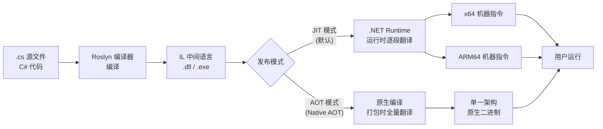
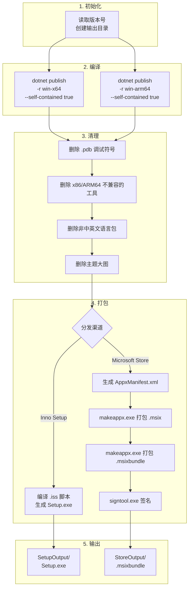

# 第 41 课：编译与多平台

## 为什么学这个

写代码的时候你敲的是 C# 文本文件，人看得懂，CPU 看不懂。CPU 只认一串串的 0 和 1——机器指令。把 C# 变成机器指令的过程就是"编译"。不同 CPU 的机器指令不一样：Intel/AMD 的 x64 是一套，高通的 ARM64 是另一套，老电脑上的 x86 又是一套。如果只编译一个版本，别的架构上就跑不起来。

TubaTools 的用户里有拿 Surface Pro X（ARM64）的，有拿十年前的酷睿笔记本（x64）的，还有虚拟机里跑老 Windows 的。一个安装包能覆盖所有这些，背后是一整套编译策略。

这一课不讲抽象原理，直接从 TubaTools 的真实 csproj 和构建脚本出发，把编译和多平台这件事说明白。学完之后，你知道怎么让一个 .NET 程序同时输出 x64 和 ARM64 版本，知道 Debug 和 Release 到底差了哪些东西，知道"自包含发布"意味着什么。

## 从源代码到可执行文件：编译三步走

C# 的编译不是一步到位的。写完代码按下"生成"，实际发生了三件事。

第一步是 **Roslyn 编译器** 把 .cs 文件翻译成 IL（Intermediate Language，中间语言）。IL 是一套比 C# 低级但比机器码高级的指令集。它不依赖具体 CPU——同一个 IL 到了 Intel 和 ARM 上都能跑，由运行时的 JIT 编译器接手翻译。这一步很快，通常几秒。

第二步是 **JIT 编译**（Just-In-Time Compilation）。程序运行起来之后，.NET 运行时把 IL 逐段翻译成当前机器上的原生指令。翻译发生在方法第一次被调用的时候——这也解释了为什么程序刚打开时有一瞬间的卡顿：JIT 正在背地里干活。

第三步是可选的——**AOT 编译**（Ahead-Of-Time Compilation）。如果觉得 JIT 的启动延迟不能忍，可以在发布时提前把 IL 全量翻译成原生码，打包进 exe。.NET 8/10 的 Native AOT 能生成纯原生二进制，体积更小、启动更快，代价是放弃了一部分反射和动态加载的能力。

这是整个流程的概览：



TubaTools 目前用的是 JIT 模式。csproj 里 `PublishReadyToRun` 在 Debug 和 Release 下都设成了 `false`，`PublishTrimmed` 也是 `false`。这意味着发布时保留完整 IL，不做裁剪也不做预编译。这么选的原因是 TubaTools 依赖 LibreHardwareMonitorLib 做硬件检测，这个库里有大量反射调用，AOT 和裁剪会把它搞坏。

## Debug 与 Release：两个配置到底差了啥

在 Visual Studio 顶部工具栏有个下拉框，默认写着 "Debug"。点开还有 "Release" 和 "Any CPU"。很多人知道发布时要选 Release，但不知道两个配置的具体差异。其实差在三个地方。

**第一，优化开关。** Debug 模式下编译器几乎不优化任何东西。变量在内存里放着，方法边界清晰，每个断点都能精确命中。Release 模式下编译器会：删除没用的变量、把短方法内联（把方法体直接塞到调用处，省去一次跳转）、重新排列指令顺序以提高 CPU 缓存命中率。代价是调试时你看到的值可能和源码对不上，断点可能"跳帧"。

**第二，条件编译。** 代码里可以用 `#if DEBUG` 和 `#endif` 包住只应该在开发时执行的逻辑。TubaTools 虽然没有大段的 `#if DEBUG`，但 .NET 框架本身依赖这个机制——`Debug.Assert` 在 Release 下直接被砍掉，零开销。

**第三，输出产物。** Debug 编译产出 .pdb 文件（程序数据库，存调试符号），Release 默认也产出但符号更精简。TubaTools 的构建脚本里有一行很显眼：

```powershell
# build-store.ps1 / build-setup.ps1 — 删除调试符号
Remove-Item -LiteralPath (Join-Path $outDir 'TubaWinUi3.pdb') -Force -ErrorAction SilentlyContinue
Get-ChildItem -LiteralPath $Root -Filter '*.pdb' -Recurse -Force -ErrorAction SilentlyContinue |
    Remove-Item -Force -ErrorAction SilentlyContinue
```

发包之前，所有 .pdb 全部删掉。一是缩小包体积（一个大型项目的 .pdb 动辄几百 MB），二是避免给用户多余的调试信息。

```csharp
// TubaWinUi3.csproj 里的发布配置
<PublishReadyToRun Condition="'$(Configuration)' == 'Debug'">False</PublishReadyToRun>
<PublishReadyToRun Condition="'$(Configuration)' != 'Debug'">False</PublishReadyToRun>
<PublishTrimmed>false</PublishTrimmed>
```

`PublishReadyToRun` 和 `PublishTrimmed` 一律关掉。ReadyToRun（R2R）是一种"半 AOT"——IL 保留，但把一部分方法提前编译成原生码，减少 JIT 时的 CPU 消耗。TubaTools 放弃了这个选项，因为它实测没带来感知上的启动加速，却让包体积膨胀了一截。

## x86、x64、ARM64：三个平台到底什么意思

这三个词天天见，但真正搞清楚的人不多。

**x86** 是 Intel 在 1978 年搞出的 8086 处理器留下的指令集命名传统。后来 80386（"386"）、80486、奔腾一路演进，名字一直保留。现在的 x86 处理器仍然可以运行 1978 年的指令——这是 Intel 最引以为傲的向后兼容。但缺点是历史包袱太重，指令集臃肿，功耗降不下来。Windows 上的 x86 程序跑在 32 位模式下，最多只能访问 4GB 内存。

**x64**（也叫 x86-64、AMD64）是 AMD 在 2003 年对 x86 的 64 位扩展。它把寄存器从 8 个扩到 16 个，地址空间从 4GB 推到 16EB（虽然硬件实际只用了 48 位地址线，256TB）。市面上 99% 的台式机和笔记本 CPU 都是 x64。TubaTools 的主版本就是 x64。

**ARM64** 是 ARM 公司的 64 位架构，指令集设计哲学和 x86 完全不同：ARM 用的是 RISC（精简指令集），每条指令长度固定（4 字节），执行时间可预测；x86 用的是 CISC（复杂指令集），指令长短不一，解码复杂但单条指令能做更多事。ARM64 在功耗上碾压 x86——所以手机芯片全是 ARM——现在苹果 M 系列和高通骁龙 X 系列把 ARM64 带进了 PC。

TubaTools 的 csproj 里这一行把三个平台都列了进去：

```xml
<!-- TubaWinUi3.csproj 第 9 行 -->
<Platforms>x86;x64;ARM64</Platforms>
```

但实际构建脚本里 x86 没有被单独编译。build-store.ps1 和 build-setup.ps1 只构建 x64 和 ARM64。原因是 Windows App SDK（WinUI 3 底层依赖）的 x86 支持有限，加上现在找一台运行 32 位 Windows 10 的电脑几乎不可能。x86 声明保留在 csproj 里更多是作为占位——如果未来需要，Visual Studio 配置管理界面能看到这个选项。

## 自包含发布：把运行时也一起打包

.NET 程序跑起来需要 .NET Runtime。传统做法是让用户自己装 .NET——你下载一个叫 "Windows Desktop Runtime" 的安装包，装完才能打开程序。但如果用户不懂什么是 Runtime，他只会看到"程序打不开"然后卸载。

TubaTools 选择了自包含发布（Self-Contained），把 Runtime 和程序包在一起：

```xml
<!-- TubaWinUi3.csproj -->
<WindowsAppSDKSelfContained>true</WindowsAppSDKSelfContained>
```

这一行的效果是：发布后的文件夹里除了 `TubaWinUi3.exe`，还带了一百多个 .dll——`coreclr.dll`、`clrjit.dll`、`System.Private.CoreLib.dll` 等等。这些就是 .NET 运行时本身。用户不用装任何东西，双击 exe 直接跑。

代价也很直接：包体积大了大约 40MB。TubaTools 完整包（含 Tools 文件夹的所有外部工具）在 x64 上超过 400MB，ARM64 差不多 500MB，所以 40MB 的 Runtime 开销在总比例上不算什么。但如果你写的是一个 2MB 的小工具，自包含会让它变成 40MB，这时候就得权衡。

构建脚本里对应的 `dotnet publish` 命令：

```powershell
# build-setup.ps1 — 发布 x64 自包含版本
dotnet publish $ProjectDir -c Release -r "win-x64" `
    --self-contained true `
    -p:Platform=x64 `
    -p:PublishTrimmed=false `
    -p:PublishReadyToRun=false `
    -p:WindowsAppSDKSelfContained=true `
    -p:WindowsPackageType=None `
    -o $outDir
```

逐行解释：

- `-c Release`：用 Release 配置（开优化）
- `-r "win-x64"`：目标运行时是 Windows x64。如果改成 `win-arm64` 就是 ARM64 版
- `--self-contained true`：自包含，带上 Runtime
- `-p:Platform=x64`：MSBuild 平台属性
- `-p:PublishTrimmed=false`：不裁剪未使用的 IL（前面说过，硬件检测库依赖反射）
- `-p:PublishReadyToRun=false`：不做预编译
- `-p:WindowsAppSDKSelfContained=true`：WinUI 3 的 Windows App SDK 也自包含
- `-p:WindowsPackageType=None`：不打 MSIX 包，直接用文件夹发布
- `-o $outDir`：输出到 `publish_x64` 目录

## TubaTools.Compatible：一套代码跑在 .NET Framework 4.5 上

TubaTools 还有一个子项目 `TubaWinUi3.Compatible`，专门给跑不了 WinUI 3 的旧 Windows 准备的：

```xml
<!-- TubaWinUi3.Compatible.csproj -->
<Project Sdk="Microsoft.NET.Sdk">
  <PropertyGroup>
    <OutputType>WinExe</OutputType>
    <TargetFramework>net45</TargetFramework>
    <UseWindowsForms>true</UseWindowsForms>
    <ImplicitUsings>disable</ImplicitUsings>
    <Nullable>disable</Nullable>
    <LangVersion>latest</LangVersion>
  </PropertyGroup>
</Project>
```

`TargetFramework` 写的是 `net45`——.NET Framework 4.5，发布于 2012 年，能跑在 Windows 7 SP1 上。但 `LangVersion` 写的是 `latest`，也就是说你可以用最新的 C# 12 语法（record、switch 表达式、主构造函数等），只要编译器能把这些语法降级成 CLR 4.0 能运行的 IL 就行。

这个兼容版用 Windows Forms 重新实现了 UI 层（`MainForm.cs`、`ToolListPage.cs`、`HardwarePage.cs`），但底层的 `HardwareInfoService`、`ToolCatalog`、`AppSettings` 等业务逻辑和主项目是完全一样的源码。能做到这点是因为 TubaTools 的服务层写得很干净——没有直接依赖 WinUI 的类型，所有数据模型都是普通的 C# 类。

构建脚本里 `Compatible` 项目在 x64 主版本编译完后自动编译，产物直接拷贝到主版本输出目录。用户在主版本里点"兼容模式"，本质上就是启动 `TubaWinUi3.Compatible.exe`。

```xml
<!-- TubaWinUi3.Compatible.csproj — 编译后自动拷贝到主目录 -->
<Target Name="CopyToOriginalBin" AfterTargets="Build">
  <PropertyGroup>
    <OriginalBinDir>..\bin\Debug\net10.0-windows10.0.26100.0\win-x64\</OriginalBinDir>
  </PropertyGroup>
  <Copy SourceFiles="$(TargetPath)"
        DestinationFolder="$(OriginalBinDir)"
        SkipUnchangedFiles="true" />
</Target>
```

这个 `CopyToOriginalBin` 目标在每次 `Build` 完成后自动触发，把兼容版的 exe 和 pdb 拷过去。主程序检测系统版本，低于 Windows 10 1809 就自动切到兼容模式。

## 现实里的构建流水线：两个脚本怎么干活

TubaTools 有两套构建脚本，分别对应两种分发渠道：

**build-setup.ps1**：产出 Inno Setup 安装包（.exe），用户双击安装，生成桌面快捷方式和开始菜单条目。安装到 `C:\Program Files\TubaWinUi3\`。适合官网下载分发。

**build-store.ps1**：产出 MSIX 包（.msix）和 MSIX Bundle（.msixbundle），上传到 Microsoft Store。Store 审核后自动分发，支持增量更新和自动卸载。

两条流水线的核心步骤一样，但 MSIX 的额外步骤更多——需要生成 `AppxManifest.xml`、用 `makeappx.exe` 把文件夹打成 .msix、用 `signtool.exe` 签名。下面是完整的流水线：



清理步骤值得多说两句。TubaTools 带了大量第三方工具（CPU-Z、HWiNFO、Dism++ 等），这些工具各自有 x86、x64、ARM64 版本。发布 x64 包时，脚本会执行 `Remove-UnnecessaryFiles` 函数：

```powershell
# build-store.ps1 — 清理步骤摘录

# Dism++ x86/ARM64 配置文件目录
Get-ChildItem -LiteralPath $tools -Recurse -Directory -Filter 'x86' |
    Where-Object { $_.Parent.Name -eq 'Config' -and $_.Parent.Parent.Name -like '*Dism*' } |
    Remove-Item -Recurse -Force

# Dism++ x86/ARM64 可执行文件
Get-ChildItem -LiteralPath $tools -Recurse -File |
    Where-Object { $_.Name -eq 'Dism++x86.exe' -or $_.Name -eq 'Dism++ARM64.exe' } |
    Remove-Item -Force

# 其他工具的 32 位版本
$removeNames = @('Speccy.exe','HWMonitor_x32.exe','cpuz_x32.exe',
    'HWiNFO32.exe','Core Temp x86.exe','DiskInfo32S.exe',
    'procexp.exe','Ventoy2Disk_ARM.exe','Ventoy2Disk_ARM64.exe')
Get-ChildItem -LiteralPath $tools -Recurse -File |
    Where-Object { $_.Name -in $removeNames } |
    Remove-Item -Force
```

这些清理不是可有可无——x64 包里塞着 x86 的工具，用户如果误点了一个，可能会弹 "此应用无法在你的电脑上运行" 的错误对话框。与其让用户困惑，不如在打包时就删干净。

## app.manifest：告诉 Windows 你能干什么

每个 Windows 桌面程序可以带一个 `.manifest` 文件，声明自己对操作系统的要求。TubaTools 的 `app.manifest` 做了三件事：

```xml
<!-- app.manifest -->
<requestedExecutionLevel level="asInvoker" uiAccess="false" />
```

`asInvoker` 意思是"不要求管理员权限"。程序以普通用户身份启动，做常规操作没问题，但如果想写 Program Files 目录或者改系统设置就会失败。TubaTools 选这个级别是为了不给用户弹 UAC 提权窗——对一款工具箱类应用来说，弹 UAC 是很破坏体验的。

```xml
<supportedOS Id="{8e0f7a12-bfb3-4fe8-b9a5-48fd50a15a9a}" />
```

这个 GUID 告诉 Windows："我知道怎么跑在 Windows 10 上"。如果不声明，Windows 会假定程序是给旧版本写的，可能禁用一些新特性（比如自定义标题栏）。

```xml
<dpiAwareness xmlns="...">PerMonitorV2</dpiAwareness>
```

声明 DPI 感知模式。`PerMonitorV2` 是最先进的模式——当用户把窗口从一个显示器拖到另一个（比如 100% 缩放的笔记本内屏拖到 200% 缩放的 4K 外接显示器），Windows 会通知程序重绘，而不是简单地把窗口位图拉伸变糊。

## 打包后的产物长什么样

`dotnet publish` 跑完后，输出目录大概长这样：

```
publish_x64/
├── TubaWinUi3.exe              ← 主程序入口
├── TubaWinUi3.dll              ← 你自己的代码编译出来的程序集
├── TubaWinUi3.pri              ← WinUI 资源索引（编译时可能丢失，脚本会从 bin 目录拷回）
├── TubaWinUi3.Compatible.exe   ← .NET Framework 4.5 兼容版（由 Compatible 项目编译后拷入）
├── Assets/                     ← 图标、启动画面
├── Tools/                      ← 外部工具（CPU-Z, HWiNFO 等）
├── CertBlock/                  ← 证书屏蔽功能
├── Metadata/                   ← 工具的 JSON 元数据描述
├── coreclr.dll                 ← .NET 运行时核心
├── clrjit.dll                  ← JIT 编译器
├── System.Private.CoreLib.dll  ← 基础类库（string, int, List 等）
├── Microsoft.WindowsAppRuntime.dll  ← WinUI 3 框架运行时
└── ... (约 100+ 个 .NET 框架 .dll)
```

x64 目录大约 420MB，ARM64 大约 510MB（ARM64 的 .NET 运行时和原生库体积更大）。MSIX 打包后压缩效果明显，x64 的 .msix 约 260MB，.msixbundle（含 x64 + ARM64 两个包）约 390MB——Windows Store 会在用户下载时自动选对应架构的包，所以实际下载流量只算一个架构。

## 关于 "Any CPU" 的误解

Visual Studio 配置管理器里有一个选项叫 "Any CPU"。不少教程说选这个就能"一处编译，到处运行"。这句话只说对了一半。

选 Any CPU 编译出来的 IL 确实和架构无关。但运行时，.NET 默认会用"和操作系统相同的位数"——64 位系统上跑 64 位进程，32 位系统上跑 32 位进程。如果你的代码里 P/Invoke 调用了某个只存在于 64 位的原生 DLL，在 32 位系统上就会炸。

TubaTools 不用 Any CPU 是有理由的。LibreHardwareMonitorLib 内部调用了大量 Win32 API，有些 API 在 32 位和 64 位模式下行为不同。而且硬件检测需要读取 CPU MSR 寄存器，这部分操作必须和 CPU 位数匹配。所以 TubaTools 明确指定了 `Platforms:x86;x64;ARM64`，不依赖 Any CPU 的自动选择。

说白了：Any CPU 适合纯 .NET 代码的 Web 服务；带原生交互的桌面程序，还是老老实实指定平台。

## 小练习

**第 1 题（填空）**  
C# 代码先被编译成 ______（三个字母），运行时再通过 ______（三个字母）技术翻译成当前机器的原生指令。如果想在编译阶段就完成原生翻译，可以使用 ______（三个字母）模式。

**第 2 题（选择）**  
TubaTools 发布时把 `PublishTrimmed` 设为 `false`，最直接的原因是什么？

A. 裁剪会让包体积变大  
B. LibreHardwareMonitorLib 依赖反射，裁剪会删掉反射需要的代码  
C. 裁剪目前只支持 .NET 6，TubaTools 用的是 .NET 10  
D. 微软不建议在 WinUI 3 项目中使用裁剪

**第 3 题（简答）**  
TubaTools 的 `app.manifest` 文件里写了 `requestedExecutionLevel level="asInvoker"`。如果改成 `requireAdministrator`，用户体验上会有什么变化？为什么 TubaTools 选择了 `asInvoker`？

**第 4 题（实操）**  
在你自己写的任何一个 .NET 控制台项目里，打开 .csproj，把 `<Platforms>` 从默认的 `AnyCPU` 改成 `x64;ARM64`。然后运行：
```
dotnet publish -c Release -r win-x64 --self-contained true
```
观察输出目录里多了哪些文件。挑出三个不认识的 .dll，在搜索引擎里查它们属于哪个 NuGet 包或 .NET 组件。

---

**参考答案（折叠）**

<details>
<summary>点击展开答案</summary>

**第 1 题**：IL（中间语言）、JIT（即时编译）、AOT（提前编译 / Native AOT）

**第 2 题**：B。`PublishTrimmed` 会删除未被静态分析引用的代码，但反射是在运行时动态调用的，静态分析看不到反射路径，会错删。LibreHardwareMonitorLib 内部大量使用反射来枚举硬件传感器，裁剪会导致运行时 `MissingMethodException`。

**第 3 题**：`requireAdministrator` 会让程序启动时弹出 UAC（用户账户控制）对话框，用户必须点"是"才能继续。对于一款经常打开的工具箱应用，每次都弹 UAC 很烦人。TubaTools 选 `asInvoker` 是因为它的核心功能（查看硬件信息、启动外部工具）不需要管理员权限。需要提权的操作（如写 Program Files）可以单独通过外部工具或者配置来绕开。

**第 4 题**：常见的不认识 .dll 包括：
- `coreclr.dll`：.NET 运行时核心，管理内存、GC、异常
- `clrjit.dll`：JIT 编译器，把 IL 翻译成机器码
- `System.Private.CoreLib.dll`：基础类库，包含基本类型（int, string, List 等）的实现
- `hostfxr.dll`：Host FXR，负责找到并加载正确的 .NET 运行时
- `hostpolicy.dll`：Host Policy，加载程序集解析策略

</details>
