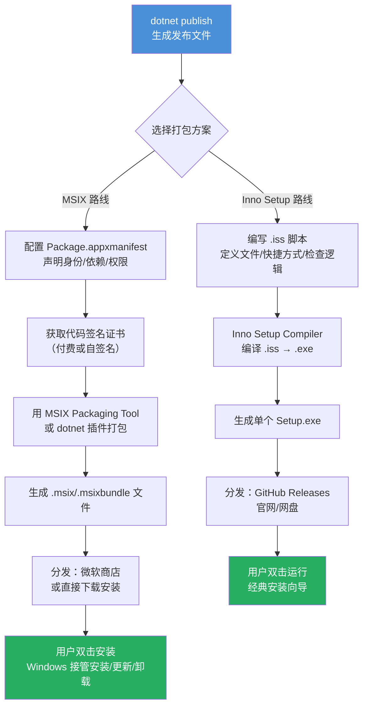

# 第 42 课：打包与安装

## 引入

写到第 42 课，你已经有了一个能跑的 WinUI 3 程序。可是它现在还躺在你的开发机里，别人没法用。你不可能给每个人装 Visual Studio，然后教他们点 "运行"。

把一个程序从 "只有开发者能用" 变成 "随便一个 Windows 用户双击就能装" 的过程，叫打包与安装。这一课就讲这个。

打包不是简单地把 .exe 文件复制出来。WinUI 3 程序依赖 Windows App SDK 运行时、一堆 .dll 文件、字体资源、图片资源，少一个都启动不了。打包工具负责做三件事：把所有这些文件组织好、检查用户的系统能不能跑、把文件放到该放的位置。

TubaTools 项目同时用了两套打包方案：Inno Setup 和 MSIX。两种方案解决同一个问题，但思路完全不一样，适用场景也不同。

---

## 第一步：dotnet publish — 生成可发布的文件

不管用 Inno Setup 还是 MSIX，第一步都是 `dotnet publish`。这个命令做的事情：编译你的代码，把程序和依赖项复制到一个输出目录。

TubaTools 的 .csproj 文件里有一段 Publish Properties，直接影响 publish 的结果：

```xml
<!-- TubaWinUi3.csproj 中跟发布相关的配置 -->
<PropertyGroup>
  <PublishReadyToRun Condition="'$(Configuration)' == 'Debug'">False</PublishReadyToRun>
  <PublishReadyToRun Condition="'$(Configuration)' != 'Debug'">False</PublishReadyToRun>
  <PublishTrimmed>false</PublishTrimmed>
  <IncludeNativeLibrariesForSelfExtract>true</IncludeNativeLibrariesForSelfExtract>
  <IncludeAllContentForSelfExtract>true</IncludeAllContentForSelfExtract>
</PropertyGroup>
```

这几个配置干嘛用：

- **PublishReadyToRun**：如果设为 true，编译时会提前把 IL（中间语言）编译成本地机器码。启动更快，但编译时间更长。TubaTools 关掉了这个选项，因为兼容性优先。
- **PublishTrimmed**：剪裁——分析代码，把没用的库删掉，减小体积。TubaTools 设为 false，因为它的工具外挂机制让编译器无法准确分析哪些代码会被用到，剪裁可能误删。
- **SelfExtract** 两个选项：对于单文件发布（single file），是否在运行时自动解压 native 库和其他内容。TubaTools 设为 true，这样单个 .exe 也能正常工作。

```xml
<!-- 这些文件在 publish 时必须复制到输出目录 -->
<ItemGroup>
  <Content Include="Assets\**">
    <CopyToOutputDirectory>PreserveNewest</CopyToOutputDirectory>
  </Content>
  <Content Include="Tools\**\*">
    <CopyToOutputDirectory>PreserveNewest</CopyToOutputDirectory>
    <ExcludeFromSingleFile>true</ExcludeFromSingleFile>
  </Content>
  <Content Include="Metadata\**\*">
    <CopyToOutputDirectory>PreserveNewest</CopyToOutputDirectory>
    <ExcludeFromSingleFile>true</ExcludeFromSingleFile>
  </Content>
</ItemGroup>
```

注意 `ExcludeFromSingleFile`。Tools 目录是外部工具，Metadata 是 JSON 配置文件，这些在运行时需要以独立文件的形式存在——不能打包进单个 exe。所以标记为 `ExcludeFromSingleFile`，让它们在输出目录保持独立文件。

实际发布命令大概是：

```
dotnet publish -c Release -r win-x64 -o publish_x64
```

`-r win-x64` 指定目标平台（运行时标识符，Runtime Identifier）。TubaTools 支持三种：win-x86、win-x64、win-arm64。

---

## 第二种打包：MSIX — Windows 原生应用包

MSIX 是微软从 Windows 10 开始推的现代打包格式。你从微软商店下的应用，背后就是 MSIX 包。它像一个带数字签名的 zip 文件，Windows 会验证它没被篡改过，放在隔离的目录里，卸载的时候保证删干净，不会在注册表里留垃圾。

MSIX 包需要一个清单文件——`Package.appxmanifest`。TubaTools 的清单长这样：

```xml
<Package xmlns="http://schemas.microsoft.com/appx/manifest/foundation/windows10"
         xmlns:uap="http://schemas.microsoft.com/appx/manifest/uap/windows10"
         xmlns:rescap="http://schemas.microsoft.com/appx/manifest/foundation/windows10/restrictedcapabilities"
         IgnorableNamespaces="uap rescap">

  <!-- 身份：名称、签名者、版本 -->
  <Identity
    Name="DA3D64F4.winui3"
    Publisher="CN=CC2339A5-C760-46C3-91D8-130408AF3528"
    Version="1.0.1.0" />

  <!-- 显示信息 -->
  <Properties>
    <DisplayName>图吧工具箱winui3</DisplayName>
    <PublisherDisplayName>罗澜嘎嘎</PublisherDisplayName>
    <Logo>Assets\StoreLogo.png</Logo>
  </Properties>

  <!-- 系统依赖 -->
  <Dependencies>
    <TargetDeviceFamily Name="Windows.Universal" MinVersion="10.0.17763.0"
                        MaxVersionTested="10.0.26226.0" />
    <TargetDeviceFamily Name="Windows.Desktop" MinVersion="10.0.17763.0"
                        MaxVersionTested="10.0.26100.0" />
  </Dependencies>

  <!-- 应用入口 -->
  <Applications>
    <Application Id="App" Executable="$.exe" EntryPoint="$">
      <uap:VisualElements DisplayName="图吧工具箱winui3"
            Description="图吧工具箱winui3 - PC硬件检测与系统维护工具集"
            BackgroundColor="transparent"
            Square150x150Logo="Assets\Square150x150Logo.png"
            Square44x44Logo="Assets\Square44x44Logo.png">
        <uap:DefaultTile Wide310x150Logo="Assets\Wide310x150Logo.png" />
        <uap:SplashScreen Image="Assets\SplashScreen.png" />
      </uap:VisualElements>
    </Application>
  </Applications>

  <!-- 权限：runFullTrust 表示桌面应用权限 -->
  <Capabilities>
    <rescap:Capability Name="runFullTrust" />
  </Capabilities>
</Package>
```

这个文件的几个要点：

**Identity**：包的身份标识。`Name` 是一个唯一 ID，`Publisher` 是签名证书的 Subject。MSIX 必须签名才能安装——要么用微软商店分发的签名，要么用你自己的代码签名证书。

**Dependencies**：告诉 Windows 这个包依赖的最低系统版本。`MinVersion="10.0.17763.0"` 对应 Windows 10 1809 版本。如果用户的系统版本低于这个，安装器会直接拒绝。

**Capabilities**：声明权限。普通 UWP 应用权限很受限，但 TubaTools 是桌面应用（WinUI 3 Desktop），需要 `runFullTrust` 这个受限能力，才能访问硬件信息、调用外部工具、读写任意文件。

MSIX 的优点是干净——安装、更新、卸载都由 Windows 管。缺点是签名证书要钱（一年几百到几千不等），而且用户基数还不够大——很多人还不知道怎么装 .msix 文件。

---

## 第三种打包：Inno Setup — 传统安装包

Inno Setup 是从 Windows 95 时代活到现在的免费安装包制作工具。它生成的是一个 .exe 安装文件，用户双击打开，一路 "下一步" 就装好了。这个方案最 "接地气"——不管什么版本的 Windows，用户都知道怎么点。

TubaTools 为每种架构写了单独的 .iss 脚本：`installer-x86.iss`、`installer-x64.iss`、`installer-arm64.iss`，还有一个合并版 `installer.iss`。

完整的 installer.iss 大约 140 行。拆开来看：

### 应用信息

```iss
#define MyAppName "图吧工具箱winui3"
#define MyAppVersion "1.0.2"
#define MyAppPublisher "罗澜嘎嘎"
#define MyAppExeName "TubaWinUi3.exe"
#define MyAppCopyright "Copyright (C) 2025 罗澜嘎嘎"
```

`#define` 是 C 预处理器的语法，Inno Setup 的脚本引擎支持它。定义宏的好处是版本号改一个地方，整个脚本的所有引用都跟着变。

### 安装器行为配置

```iss
[Setup]
AppId={{DA3D64F4-winui3-Tuba-2025}
DefaultDirName={sd}\TubaWinUi3
Compression=lzma2/ultra64
SolidCompression=yes
WizardStyle=modern
PrivilegesRequired=admin
ArchitecturesAllowed=x64compatible arm64
ArchitecturesInstallIn64BitMode=x64compatible arm64
```

这里几个关键选项：

- **AppId**：全局唯一标识。如果用户重新运行安装包，Inno Setup 用这个 ID 判断是 "全新安装" 还是 "升级"。
- **DefaultDirName**：默认安装路径。`{sd}` 是一个常量，表示系统盘（通常是 C:）。
- **Compression=lzma2/ultra64**：用 LZMA2 算法做最高压缩率。TubaTools 包含很多外部工具和 .dll，体积不小，压缩很重要。
- **PrivilegesRequired=admin**：要求管理员权限。因为 TubaTools 要读硬件传感器、操作注册表，没有管理员权限很多东西跑不了。
- **ArchitecturesAllowed / ArchitecturesInstallIn64BitMode**：声明支持 x64 和 ARM64，强制 64 位安装模式。

### 文件部署

```iss
[Files]
Source: "publish_x64\*"; DestDir: "{app}";
    Flags: ignoreversion recursesubdirs createallsubdirs; Check: IsX64
Source: "publish_arm64\*"; DestDir: "{app}";
    Flags: ignoreversion recursesubdirs createallsubdirs; Check: IsARM64
```

这就是把 `dotnet publish` 输出的目录一股脑复制到用户的安装目录。`Check: IsX64` 表示只有当用户在 x64 机器上安装时才复制 x64 的文件。`recursesubdirs` 递归复制子目录，`ignoreversion` 表示即使目标文件版本更高也覆盖（升级场景）。

### 安装前检查

installer.iss 的 `[Code]` 段有一大段 Pascal 脚本，在安装前做环境检查：

```pascal
function PrepareToInstall(var NeedsRestart: Boolean): String;
var
  ErrorCode: Integer;
  Msg: String;
begin
  // 检查一：Windows 版本
  if not IsWindowsVersionOk then
  begin
    Msg := '本程序需要 Windows 10 1809 (Build 17763) 或更高版本。' + #13#10 +
           '您当前的系统版本过低，无法运行本程序。';
    MsgBox(Msg, mbCriticalError, MB_OK);
    Result := '系统版本不满足要求，安装已取消。';
    Exit;
  end;

  // 检查二：VC++ 运行库
  if not IsVCRedistInstalled then
  begin
    Msg := '检测到你的系统缺少以下运行库：' + #13#10#13#10 +
           '• Microsoft Visual C++ 2015-2022 运行库' + #13#10#13#10 +
           '是否立即下载并安装？';
    if MsgBox(Msg, mbConfirmation, MB_YESNO) = IDYES then
    begin
      ShellExec('open', 'https://aka.ms/vs/17/release/vc_redist.x64.exe',
                '', '', SW_SHOW, ewNoWait, ErrorCode);
    end;
    Result := '请先安装缺少的运行库后再继续安装。';
    Exit;
  end;
end;
```

这个函数在正式开始安装前被调用。如果返回了非空字符串，Inno Setup 会显示它并中止安装。这里检查了两样东西：

1. **Windows 版本**：WinUI 3 最低要求 Windows 10 1809（Build 17763）。通过 `GetWindowsVersionEx` 取得当前系统版本号，比对 Major 和 Build 字段。
2. **VC++ 运行库**：WinUI 3 桌面应用的 native 部分依赖 VC++ Redistributable。脚本去注册表 `HKLM\SOFTWARE\Microsoft\VisualStudio\14.0\VC\Runtimes\x64` 找 `Installed` 键值。如果没装，弹框问用户要不要跳转到微软官网下载。

这是一个容易忽略但极其重要的环节。开发者自己的机器什么库都装了，一切正常。普通用户的机器很可能缺东西，不检查的话安装成功但程序打不开，用户第一反应是 "这软件有 bug"。

### 快捷方式和卸载

```iss
[Icons]
Name: "{group}\{#MyAppName}"; Filename: "{app}\{#MyAppExeName}"
Name: "{group}\{cm:UninstallProgram,{#MyAppName}}"; Filename: "{uninstallexe}"
Name: "{commondesktop}\{#MyAppName}"; Filename: "{app}\{#MyAppExeName}"; Tasks: desktopicon
```

创建三个快捷方式：开始菜单的程序组里放一个启动快捷方式和一个卸载快捷方式，如果用户勾选了 "创建桌面快捷方式"（在 `[Tasks]` 段定义），桌面上也会放一个。

---

## 架构版本：为什么要打三个包

TubaTools 有三种架构的安装包：x86（32 位）、x64（64 位）、ARM64（ARM 架构，比如 Surface Pro X 或苹果 M 芯片跑 Windows 虚拟机）。

这是 WinUI 3 桌面应用的特点——它不是托管在 .NET 虚拟机里的纯 IL 代码。WinUI 3 用了大量 native 组件（Windows App SDK 的 C++ 部分），这些组件的 .dll 是跟 CPU 架构绑定的。arm64 的 .dll 不能在 x64 机器上跑，反之亦然。

也就是为什么 `installer.iss` 里用 `Check: IsX64` 和 `Check: IsARM64` 区分复制哪些文件——同一个安装包包含了两种架构的 publish 输出，安装时根据当前机器的架构自动选。

这种做法在商业软件中也常见：一个安装包文件可能很大（因为内含多套二进制），但用户体验好——不用让用户自己去判断"我该下载哪个版本"。用户经常连自己是 32 位还是 64 位都不知道。

---

## 两种方案对比流程图



---

## 版本号与升级策略

TubaTools 的 .csproj 里有一行：

```xml
<Version>1.0.2</Version>
```

这个版本号会嵌入编译出来的 .exe 文件属性里。Inno Setup 脚本里的 `AppVersion` 和 MSIX 清单里的 `Version` 也应该跟它保持一致。

升级策略上，两种方案的做法不同：

- **MSIX**：Windows 自动检查包的版本号。新的 Version 大于旧的，就执行升级。用户基本上不用管。
- **Inno Setup**：通过 `AppId` 识别。如果用户的注册表里已经记录了这个 AppId 的安装路径，再运行安装包时 Inno Setup 自动进入 "升级模式"——覆盖旧文件，保留用户设置。`UsePreviousAppDir=yes` 就是这个作用：记住用户上次选的安装目录。

---

## 数字签名：信任的代价

如果你用 Inno Setup 生成一个 Setup.exe 发给别人，Windows Defender SmartScreen 大概率会弹窗："Windows 已保护你的电脑"。这不是病毒，是微软不知道你是谁。

解决方法是买代码签名证书（Code Signing Certificate），给 .exe 打上数字签名。有了签名，SmartScreen 的警告会从红色（阻止运行）降级为蓝色（"未知发布者，确定要运行吗"），积累足够的 "信誉" 后彻底不弹。

普通 OV（组织验证）证书大约 200-400 美元一年。EV（扩展验证）证书贵很多，但签名后 SmartScreen 立即信任。

MSIX 也一样需要签名。如果你走微软商店分发，微软会帮你签。如果是自己分发 .msix 文件，同样需要买证书。

对于开源项目来说这确实是个痛点。TubaTools 目前没有商业签名证书，所以用户下载后需要点一下 "更多信息" 然后 "仍要运行"。这是现状，也是生态的现实。

---

## 实际打包流程（以 TubaTools x64 为例）

如果你要从头打一个 TubaTools 的 x64 安装包，完整流程是：

1. 在项目根目录打开命令行
2. 运行 publish：
   ```
   dotnet publish -c Release -r win-x64 -o publish_x64
   ```
3. 装好 Inno Setup（https://jrsoftware.org/isdl.php）
4. 打开 `installer-x64.iss`，确认 `Source` 路径指向刚才的 `publish_x64`
5. 在 Inno Setup Compiler 里点 "Compile"（或命令行运行 `ISCC.exe installer-x64.iss`）
6. `SetupOutput` 目录下出现 `TubaWinUi3_Setup_1.0.2_x64.exe`

如果还要打 MSIX 包：

1. 在 Visual Studio 里右键项目 → "Publish" → "Create App Packages"
2. 选择 "Sideloading"（非商店分发的本地安装）
3. 导入或创建自签名证书
4. VS 自动生成 .msixbundle 文件和对应的安装脚本

两种包都打出来后，一个放 GitHub Releases，另一个放微软商店（如果需要），用户各取所需。

---

## 常见坑

**坑一：Publish 出来文件能跑，安装后不能跑。** 通常是少了运行时依赖。检查 `WindowsAppSDKSelfContained` 是否设为 true。如果设为 false，用户必须单独装 Windows App SDK Runtime，99% 的用户没有。TubaTools 设为 true，把 SDK 捆进包里。

**坑二：Setup.exe 被误报病毒。** 上面说过的签名问题。没有签名 = SmartScreen 警告。Inno Setup 生成的安装包尤其容易被误报，因为很多恶意软件也用它打包。除了买证书没别的好办法。

**坑三：ARM64 包无法测试。** 多数开发者的机器是 x64，打出来的 ARM64 包只能靠用户反馈。可以在 GitHub Actions 里加 ARM64 构建任务，至少保证编译能过。

**坑四：升级安装后用户数据丢失。** Inno Setup 默认覆盖所有文件。如果用户有自定义配置文件，升级后可能被覆盖。解决办法是在 .iss 里用 `Flags: onlyifdoesntexist` 保护用户文件，或者把用户数据放在 `%APPDATA%` 下（不放在安装目录）。

---

## 小练习

**练习一：填空题**

TubaTools 的 installer.iss 中，`PrivilegesRequired` 设为 `______`，因为程序需要读硬件传感器和操作注册表。`ArchitecturesAllowed` 包括 `x64compatible` 和 `______`。

**练习二：选择题**

`dotnet publish` 命令中，`-r win-x64` 参数的作用是：

A. 指定发布后的输出目录  
B. 指定目标平台（运行时标识符）  
C. 指定使用 Release 配置  
D. 指定发布的版本号  

**练习三：简答题**

TubaTools 的 .csproj 中，为什么 External Tools 目录的 `CopyToOutputDirectory` 是 `PreserveNewest`，但同时标记了 `ExcludeFromSingleFile`？这两个设置各自在什么场景下生效？

**练习四：实操题**

假设你已经用 `dotnet publish -c Release -r win-x64 -o publish_x64` 生成了发布文件。现在有一个新需求：用户安装后，除了桌面快捷方式，还要在任务栏固定一个图标。查找 Inno Setup 文档，写出需要的 .iss 配置片段。（提示：任务栏固定不同于桌面快捷方式，可能涉及 `[Icons]` 或 `[Run]` 段。）

---

## 练习答案

<details>
<summary>点击展开答案</summary>

**练习一答案：**
`PrivilegesRequired=admin`；`ArchitecturesAllowed` 包括 `x64compatible` 和 `arm64`。

**练习二答案：**
B。`-r` 是 `--runtime` 的缩写，指定运行时标识符（RID），决定编译出的二进制是 x86、x64 还是 ARM64 架构。

`-o` 指定输出目录，`-c` 指定配置，版本号在 .csproj 中设置。

**练习三答案：**
`CopyToOutputDirectory=PreserveNewest`：每次编译时如果源文件比目标文件新，就复制过去。这确保 `dotnet build` 和 `dotnet publish` 时工具文件和配置文件都在输出目录。

`ExcludeFromSingleFile=true`：当使用单文件发布（Single File Publish，所有内容打包进一个 .exe）时，这个标记让 Tools 和 Metadata 目录保持为独立文件，不嵌入到 exe 内部。因为 Tools 是外挂的 .exe 工具，TubaTools 运行时需要以独立进程方式调用它们，打包进单个 exe 就没法直接调用了。同理 Metadata 目录的 JSON 文件需要在运行时被读取和修改，嵌入 exe 里就只读了。

**练习四答案：**
任务栏固定（Pin to Taskbar）在 Windows 上没有官方的 API，Inno Setup 原生也不直接支持。常见的折中方案：

1. 在安装完成后的 `[Run]` 段提示用户手动固定：
```iss
[Run]
Filename: "explorer.exe"; Parameters: "/select,{app}\{#MyAppExeName}";
  Description: "右键点击程序图标，选择"固定到任务栏""; Flags: postinstall skipifsilent nowait
```

2. 更现代的做法是用 PowerShell 脚本调用 Shell.Application COM 接口（但这不稳定，不同 Windows 版本行为不一致）。大多数商业软件选择在首次运行时由程序自己的代码调用 taskbar pin API（Windows 10 1809+ 的 `TaskbarManager` 类），而不是在安装包层面处理。

</details>
