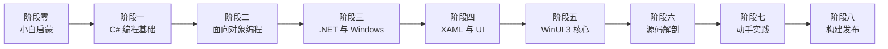

# TubaTools 深度学习课程

> 从零基础到读懂实际项目 — 以图吧工具箱为教材的 C# / .NET / WinUI 3 课程

## 课程简介

本课程面向**完全零编程基础**的学习者，以真实开源项目 **TubaTools（图吧工具箱）**为教科书，分 8 个阶段 42 个课时，系统地从"计算机是什么"学到能看懂、能修改实际项目代码。

### 学完你能做到

- 理解 C# 程序的基本结构和写法
- 看懂 TubaTools 项目里 70% 以上的代码
- 知道 WinUI 3 桌面应用是怎么组织起来的
- 能在 TubaTools 基础上加一个小功能（比如加个新工具按钮）
- 拥有独立继续深入学习的能力

### 课程路线图

| 阶段 | 课时 | 内容 |
|------|------|------|
| [阶段零：小白启蒙](Phase-0-小白启蒙/01-计算机是怎么工作的) | 01-04 | 计算机原理、编程语言概念、C#/.NET 介绍、装环境跑 TubaTools |
| [阶段一：C# 编程基础](Phase-1-CSharp编程基础/05-第一个CSharp程序) | 05-12 | 变量、条件、循环、方法、集合、异常 |
| [阶段二：面向对象编程](Phase-2-面向对象编程/13-面向对象是什么) | 13-17 | 类、接口、继承、静态类 |
| [阶段三：.NET/Windows 基础](Phase-3-NET与Windows基础/18-命名空间与using) | 18-21 | 命名空间、async/await、文件 IO、NuGet |
| [阶段四：XAML/UI 入门](Phase-4-XAML与UI入门/22-XAML是什么) | 22-26 | XAML 语法、布局、控件、Binding、Converter |
| [阶段五：WinUI 3 核心](Phase-5-WinUI3核心框架/27-WinUI3概述) | 27-31 | 导航、样式、窗口、弹窗 |
| [阶段六：源码解剖](Phase-6-源码解剖/32-App.xaml.cs启动流程) | 32-36 | 逐模块精读 App.xaml.cs、MainWindow、ToolCatalog 等 |
| [阶段七：动手实践](Phase-7-动手实践/37-加一个内置工具) | 37-40 | 加工具、改界面、改设置 |
| [阶段八：构建发布](Phase-8-构建发布/41-编译与多平台) | 41-42 | 编译多平台、打包 |

### 快速导航

- [完整课程计划书](/COURSE_PLAN)
- 从[第 01 课：计算机是怎么工作的](Phase-0-小白启蒙/01-计算机是怎么工作的)开始学起
